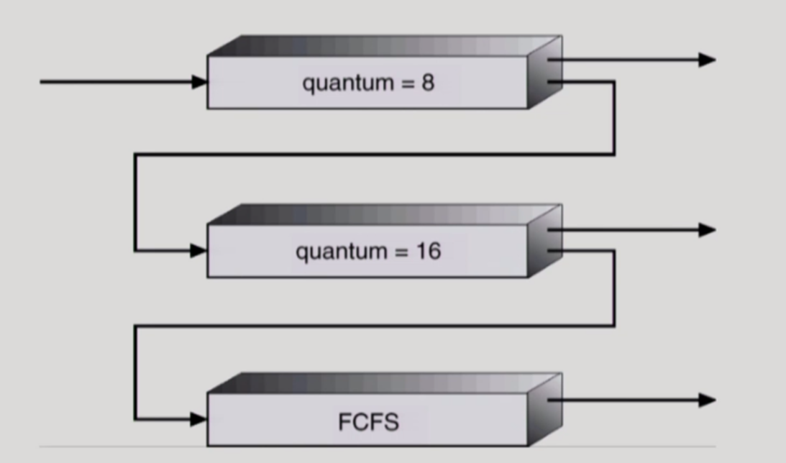

# [KOCW]\[운영체제] 11. CPU Scheduling 2 / Process Synchronization 1

[강의출처 : kocw 반효경](https://core.ewha.ac.kr/assets/publish/C0101020140401134252676046)

- round robin이 좋은 점은 전에 작업하고 있던 부분을 세이브해줌

### Multilevel Queue

- Ready queue를 여러 개로 분할
  - foregorund(interactive)
  - background(batch - no human interaction)
- 각 큐는 독립적인 스케줄링 알고리즘을 가짐
  - foreground - RR
    - 사람과 응답하는 것이니
  - background - FCFS
    - batch잡이니 fcfs가 더 효울적임
- 큐에 대한 스케줄링이 필요
  - Fixed priority scheduling
    - serve all from foreground then from background
    - Possibility of starvation
  - Time slice
    - 각 큐에 CPU time을 적절한 비율로 할당
    - Eg., 80% ro foreground in RR, 20% to background in FCFS

### Multilevel Queue

- 줄마다 우선순위 존재
- 밑으로 갈수록 우선순위가 낮음
- 태어난 프로세스가 어떤 형식인지에 따라 우선순위가 정해짐
  - 변하지 않음
- 프로세스를 어느줄에 넣을 것이냐

### Multilevel Feedback Queue

- 약간 우선 순위가 낮은 프로세스라도 올라갈 수 있음

12:45