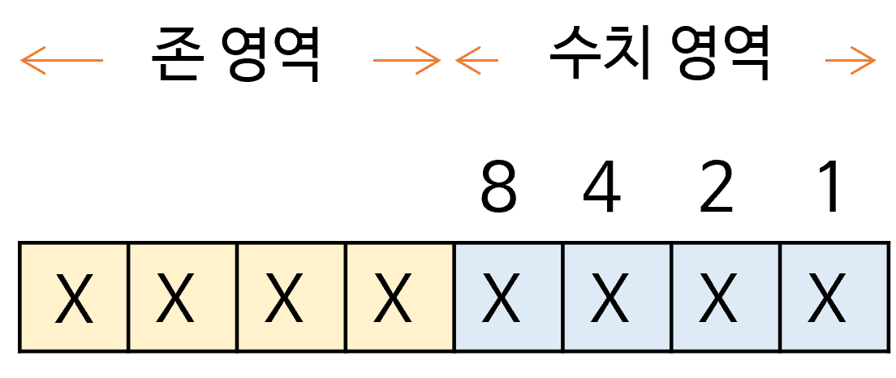

# [kocw] 01. 자료구조소개1

- 가톨릭대학교 황병연 교수님의 수업입니다.
- http://www.kocw.net/home/cview.do?cid=a73e20b9fdfb010a


### 자료구조의 이해 : 개념

- 자료구조의 개념
  - 지료를 효율적으로 표현하고 저장하고 처리할 수 있도록 정리하는 것
  - 자료구조를 정리하기 전에는 뒤죽박죽이지만 정리한 후에는 정렬된 모습
- 컴퓨터 분야에서 자료구조를 왜 배워야 할까?
  - 컴퓨터가 효율적으로 문제를 처리하기 위해서는 문제를 정의하고 분석하여 그에 대한 최적의 프로그램을 작성해야 하기 때문이다.

- 자료의 형태에 따른 분류
  - 단순 구조
    - 정수, 실수, 문자, 문자열 등의 기본 자료형
  - 선형 구조
    - 자료들 사이의 관계가 1:1 관계
    - 순자 리스트, 연결 리스트, 스택, 큐, 데크 등
  - 비선형 구조
    - 자료들 사이의 관계가 1:다 또는 다:다 관계
    - 트리, 그래프 등
  - 파일 구조
    - 서로 관련있는 필드로 구성된 레코드의 집합인 파일에 대한 구조
    - 순차 파일, 색인 파일, 직접 파일 등
    - 예시 
    - 
    - 과목, 교수 등등이 있는데 이것을 모아둔 것이 데이터 베이스

## 자료의 표현

- 컴퓨터에서의 자료 표현
  - 숫자, 문자, 그림, 소리 기호 등 모든 형식의 자료를 2진수 코드로 표현하여 저장 및 처리
  - 2진수 코드는 1과 0, On과 Off, 참(True)과 거짓(False)의 조합
  - 2진수 코드의 단위
    - 가장 작은 단위를 1비트
    - 4개의 비트를 모아서 니블
    - 8비트를 모은 것이 1바이트
- 디지털 시스템에서의 자료 표현
  - n개의 비트로 2<sup>n</sup>개의 상태 표현 가능

## 자료의 표현 : 수치 자료의 표현

### 10진수의 표현

- 존(Zone) 형식의 표현
  - 10진수 한 자리를 표현하기 위해서 1바이트(8비트)를 사용하는 형식 

- 존 영역
  - 상위 4비트
  - 1111로 표현
- 수치 영역
  - 하위 4비트
  - 표현하고자 하는 10진수 한 자리 값에 대한 2진수 값을 표시
- 존 형식의 구조
- 

- 여러 자리의 10진수를 표현하는 방법

  - 10진수의 자릿수만큼 존 형식을 연결하여 사용

  - 마지막 자리의 존 영역에 부호를 표시

    - 양수(+) 1100
    - 음수(-) 1101

  - 존 형식의 10진수 표현 형식

  - | 1111 | d                 | 1111 | d    | sign                       | d    |
    | ---- | ----------------- | ---- | ---- | -------------------------- | ---- |
    |      | d : 10진수의 숫자 |      |      | 양수 = 1100<br>음수 = 1101 |      |

    

- 팩(park) 형식의 표현

  - 10진수 한 자리를 표현하기 위해서 존 영역 없이 4비트를 사용하는 형식

  - 최하위 4비트에 부호를 표시

    - 양수 (+) = 1100
    - 음수(-)  = 1101

  - | d               | d    | d    | d    | s                           |
    | --------------- | ---- | ---- | ---- | --------------------------- |
    | d : 10진수 숫자 |      |      |      | 양수 = 1100<br/>음수 = 1101 |

-  2진수의 정수 표현

  - n비트의 부호와 절대값 형식
    - 최상위 1비트 부포 효시
      - 양수(+) = 0
      - 음수(-)  = 1
    - 나머지 n-1 비트 : 이진수 표시
    - 1바이트를 사용하는 부호와 절대값 표현 예시

- 21

| 0    | 0                   | 0    | 1    | 0    | 1    | 0    | 1    |
| ---- | ------------------- | ---- | ---- | ---- | ---- | ---- | ---- |
| 부호 | 여기서부터 2진수 값 |      |      |      |      |      |      |

- -21

| 1    | 0                   | 0    | 1    | 0    | 1    | 0    | 1    |
| ---- | ------------------- | ---- | ---- | ---- | ---- | ---- | ---- |
| 부호 | 여기서부터 2진수 값 |      |      |      |      |      |      |

- 1의 보수 형식

  - 음수 표현에서 부호 비트를 사용하는 대신 1의 보수를 사용하는 방법

  - n비트의 2진수를 1의 보수로 만드는 방법

    - n비트를 모두 1로 민든 이진수에서 변환하고자 하는 이진수를 뺌

    - 예) 10진수 21을 1의 보수로 만듦(1바이트 사용)

    - 2의 8승에서 1을 빼면 모두 1이 된다.

    - | 1    | 0    | 0    | 0    | 0    | 0    | 0    | 0    | 0    |
      | ---- | ---- | ---- | ---- | ---- | ---- | ---- | ---- | ---- |
      | 0    | 0    | 0    | 0    | 0    | 0    | 0    | 0    | 1    |
      | 1    | 1    | 1    | 1    | 1    | 1    | 1    | 1    | 1    |

    - 21의 2비트

    - 쉽게 하는 방법은 1과 0을 반대로 하면 된다. 
    
  - 1바이트를 사용하는 1의 보수 표현 예
  
  - | 0    | 0    | 0    | 1    | 0    | 1    | 0    | 1    |
    | ---- | ---- | ---- | ---- | ---- | ---- | ---- | ---- |
    | 1    | 1    | 1    | 0    | 1    | 0    | 1    | 0    |
  
  - 0을 1로 
  
  - 양수는 부호와 절댓값 형식의 표현과 같음
  
- 2의 보수 형식

  - 음수의 표현에서 부호 비트를 사용하는 대신 2의 보수를 사용하는 방법

  - n비트의 2진수를 2의 보수로 만드는 방법

    - 1의 보수에 1을 더함
    - 예 ) 10진수 21을 2의 보수로 만들기(1바이트 사용)

  - 2<sup>8</sup> - |-21| = 2<sup>8</sup> - 21

  - = 1 0000 0000 - 0001 0101

  - = 1110 1011

  - |      | 1    | 1    | 1    | 1    | 1    | 1    | 1    | 1    |               |
    | ---- | ---- | ---- | ---- | ---- | ---- | ---- | ---- | ---- | ------------- |
    | -    | 0    | 0    | 0    | 1    | 0    | 1    | 0    | 1    | 21의 절댓값   |
    | =    | 1    | 1    | 1    | 0    | 1    | 0    | 1    | 0    | 21의 1의 보수 |

  - 여기서 21의 절댓값에서 0을 1로 1을 0으로 바꿔주면 1의 보수가 된다.

  - |      | 1    | 1    | 1    | 1    | 1    | 1    | 1    | 1    |                                            |
    | ---- | ---- | ---- | ---- | ---- | ---- | ---- | ---- | ---- | ------------------------------------------ |
    | -    | 0    | 0    | 0    | 1    | 0    | 1    | 0    | 1    | 21의 절댓값                                |
    | =    | 1    | 1    | 1    | 0    | 1    | 0    | 1    | 0    | 21의 1의 보수                              |
    | +    |      |      |      |      |      |      |      | 1    | 2의 보수를 만드려면 1의 보수에 1을 더한다. |
    | =    | 1    | 1    | 1    | 0    | 1    | 0    | 1    | 1    | 21의 2의 보수 = -21                        |
    
  - 1바이트를 사용하는 2의 보수 형식의 예

  - +21

  - | 0    | 0    | 0    | 1    | 0    | 1    | 0    | 1    |
    | ---- | ---- | ---- | ---- | ---- | ---- | ---- | ---- |

  - -21

  - | 1    | 1    | 1    | 0    | 1    | 0    | 1    | 1    |
    | ---- | ---- | ---- | ---- | ---- | ---- | ---- | ---- |

  - 앙수는 부호와 절댓값 형식의 표현과 같음!

  - 2진수 정수의 세 가지 표현 방법에서 양수의 표현은 같고 음수의 표현만 다르다.

### 연습문제

- +52와 -52를 1바이트를 사용하여 다음 3가지 형식으로 표현하시오.
- 부호와 절댓값 형식
  - \+ : 00110100
  - \- : 10110100
- 1의 보수 형식
  - \+ : 00110100
  - \- : 11001011(양수에서 0을 만 바꾼것)
- 2의 보수 형식
  - \+ : 00110100
  - \- : 11001100(1의 보수 -에서 마자막자리에 1만 더한 것)

- 반대로 -52의 2의 보수에서 10진수로 바꾼다면?
  - 음수의 보수로 만들기 위해 0을 1로 바꿔준 것이었으므로 1을 0으로 변경한다.
  - 00110011
  - 이것은 1의 보수에서 마지막 자리에 1을 더했던 것이므로 1을 더한다.
  - 00110100

#### 2진수의 정수 뺄셈

- 1바이트를 사용하여 16 - 8 을 위 3가지 형식으로 계산하면?
- n비트의 부호와 절대값 형식
  - 16에서 8을 빼는 감산기 회로 사용
    - 감산기란 뺄셈을 해주는 소프트웨어를 하드웨어로 만들어서 컴퓨터에 집어넣는 것
  - 8 - 16은 절대값이 큰 16에서 작은 8을 빼고 - 부호를 표시
- 1의 보수<sup>1</sup> 형식
  - 16에서 (-8)의 1의 보수를 더하는 가산기 회로 사용
  - Carry bit 생기면 1을 더해줌
- 2의 보수<sup>2</sup> 형식
  - 16에서 (-8)의 2의 보수를 더하는 가신기 회로 사용
  - Carry bit 생기면 무시함
- 1의 보수와 2의 보수 형식은 감산기 회로가 없어도 됨
- 가산기로만 함

##### 예시

- 1바이트의 부호와 절대값 형식

```
   16     00010000
- (8)     00001000
------------------
          00001000
```

- 감산기 회로가 필요함

```
   16     00010000
+ (8)     10001000
------------------
```

30:10
