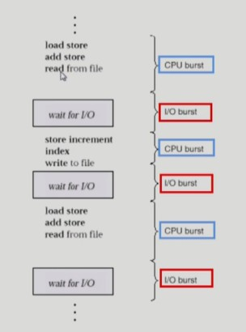

# [KOCW\][운영체제] 10. CPU Scheduling 1

### CPU and I/O bursts in Program Execution

- 프로그램의 path는 cpu를 실행하는 것과 i/o를 실행하는 단계가 있음
- cpu와 i/o 버스트를 반복
- 주로 사람이 사용하는게 이러한 일을 반복
  - 키볻를 입력하고 하니깐
- 과학계산용 프로그램같은 경우는 곱셈연산을 수행하니 cpu를 오래 사용함
  - 중간에 사람의 인터렉션이 들어오지 않음

### CPU-burst Time의 분포

- 여러 종류의 job(=process)이 섞여 있기 때문에 CPU 스케줄링이 필요
  - Interactive job에게 적절한 response 제공 요망
  - CPU와 I/O 장치 등 시스템 자원을 골고루 효율적으로 사용
  - job들이 섞여있어서 스케줄링이 필요함
  - 대부분의 cpu는 cpu job이 더 많이 사용
  - i/o job은 사람과 인터렉티브하기 때문에 cpu job이 cpu를 잡고 있기에 사람이 답답하니 i/o에 먼저 cpu를 줘서, 스케줄링해서 효율성 증가시킴

### 프로세스 특정 분류

- 프로세스는 그 특성에 따라 다음 두 가지로 나눔
  - I/O-bound process
    - CPU를 잡고 계산하는 시간보다 I/O에 많은 시간이 필요한 job
    - many short CPU bursts
  - CPU-bound process
    - 계산 위주의 job
    - few very long CPU bursts
    - 과학 계산 하는 것등

### CPU Scheduler & Dispatcher

- CPU Scheduler

  - Ready 상태의 프로세스 중에서 이번에 CPU를 줄 프로세스를 고름

- Dispatcher

  - CPU의 제어권을 CPU scheduler에 의해 선택된 프로세스에게 넘김
  - 이 과정을 context switch(문맥 교환)라고 함

- CPU 스케줄링이 필요한 경우는 프로세스에게 다음과 같은 상태 변화가 있는 경우

  1.  Running -> Blocked (예 : I/O 요청하는 시스템 콜)

  2. Running -> Ready (예 : 할당시간만료로 timer interrupt)

  3. Blocked -> Ready(예 : I/O 완료 후 인터럽트)

  4. Terminate

- 1, 4에서의 스케줄링은 nonpreemptive(=강제로 빼앗지 않고 자진 반납)

- All other scheduling is preemptive(=강제로 빼앗음)

58:46