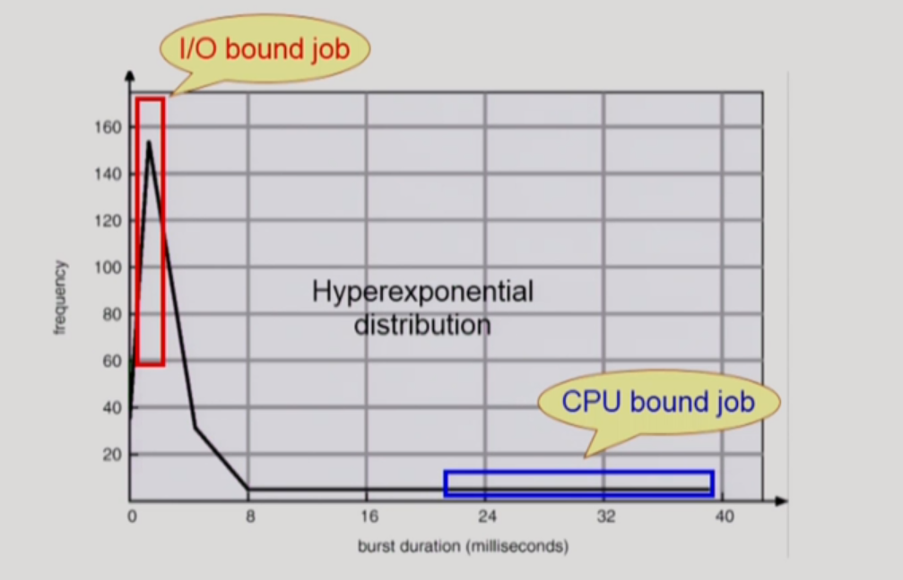
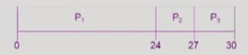

# [KOCW\][운영체제] 10. CPU Scheduling 1

### CPU and I/O bursts in Program Execution

- 프로그램의 path는 cpu를 실행하는 것과 i/o를 실행하는 단계가 있음
- cpu와 i/o 버스트를 반복
  - 누구한테 cpu를 줄 것인가
  - cpu가 나갈까지 cpu를 다 줄것이냐 아니면 중간에 끊어서 다른 cpu에게 줄것이냐
  - 사람이 오래 기다리지 않는 방향으로 가는 것도 중요
- 주로 사람이 사용하는게 이러한 일을 반복
  - 키볻를 입력하고 하니깐
- 과학계산용 프로그램같은 경우는 곱셈연산을 수행하니 cpu를 오래 사용함
  - 중간에 사람의 인터렉션이 들어오지 않음

### CPU-burst Time의 분포

- 여러 종류의 job(=process)이 섞여 있기 때문에 CPU 스케줄링이 필요
  - Interactive job에게 적절한 response 제공 요망
  - CPU와 I/O 장치 등 시스템 자원을 골고루 효율적으로 사용
  - job들이 섞여있어서 스케줄링이 필요함
  - 대부분의 cpu는 cpu job이 더 많이 사용
  - i/o job은 사람과 인터렉티브하기 때문에 cpu job이 cpu를 잡고 있기에 사람이 답답하니 i/o에 먼저 cpu를 줘서, 스케줄링해서 효율성 증가시킴

### 프로세스 특정 분류

- 프로세스는 그 특성에 따라 다음 두 가지로 나눔
  - I/O-bound process
    - CPU를 잡고 계산하는 시간보다 I/O에 많은 시간이 필요한 job
    - many short CPU bursts
  - CPU-bound process
    - 계산 위주의 job
    - few very long CPU bursts
    - 과학 계산 하는 것등

### CPU Scheduler & Dispatcher

- CPU Scheduler

  - Ready 상태의 프로세스 중에서 이번에 CPU를 줄 프로세스를 고름
  - 이건 독립적인 하드웨어? 소프트웨어?
    - 하나의 소스코드가 있는데 그걸 cpu 스케줄러라고 부르는거임
    - 따로 독립적인 하드웨어나 소프트웨어가 아님

- Dispatcher

  - CPU의 제어권을 CPU scheduler에 의해 선택된 프로세스에게 넘김
  - 이 과정을 context switch(문맥 교환)라고 함
  - 실제로 주는 것
  - 방금 돌아가던 cpu 내용을 저장하고 이제 넘겨줄 cpu 내용을 펼쳐야함

- CPU 스케줄링이 필요한 경우는 프로세스에게 다음과 같은 상태 변화가 있는 경우

  1.  Running -> Blocked (예 : I/O 요청하는 시스템 콜)
      1.  자진해서 cpu를 내어놓는 경우
  2.  Running -> Ready (예 : 할당시간만료로 timer interrupt)
      1.  무한정으로 cpu를 줄 수 없으니 빼앗아서 다른 cpu에게 넘겨줌
  3.  Blocked -> Ready(예 : I/O 완료 후 인터럽트)
      1.  작업이 끝나서 인터럽트를 걸로 ready 상태로 변환
      2.  i/o을 하러 갔던 애가 cpu에서 가장 중요한 것이라면 절대적인 우선순위로 기반해서 스케줄링이 필요할 수 있음
  4.  Terminate
      1.  종료되어서 새로운 cpu에 넘겨줌

- 1, 4에서의 스케줄링은 비선점형 : nonpreemptive(=강제로 빼앗지 않고 자진 반납)

- All other scheduling is 선점형 : preemptive(=강제로 빼앗음)

### Scheduling Algorithms

- FCFS(First-Come First-Served)

- SJF(Shortest-Job-First)
- SRTF(Shortest-Remaining-Time-First)
- Priority Scheduling
- RR(Round Robin)
- Multilevel Queue
- Multilevel Feedback Queue

### Scheduling Criteria Performance Index(=Performance Measure, 성능 척도)

- 위의 cpu 스케줄링의 성능을 평가

- CPU utillzation(이용률)
  - 시스템 입장
    - 최대한 일을 많이 시키는 것
  - keep the CPU as busy as possible
- Throughput(처리량)
  - 시스템 입장
    - 최대한 일을 많이 시키는 것
  - of processes that complete their execution per time unit
  - 주어진 시간동안 얼마나 처리했는지
- Turnaround time(소요시간, 반환시간)
  - 프로세스 입장
    - cpu를 빨리 얻어서 빨리 끝내는게 좋은 것 
    - 가능하면 빨리 cpu를 잡아서 i/o를 하러 나가고 싶음
  - amount of time to execute a particular process
  - cpu를 쓰러 들어와서 cpu를 줄서고 cpu를 다 끝나고 나가기까지의 시간
- Waiting time (대기 시간)
  - 프로세스 입장
    - cpu를 빨리 얻어서 빨리 끝내는게 좋은 것 
    - 가능하면 빨리 cpu를 잡아서 i/o를 하러 나가고 싶음
  - amount of time a process has been waiting in the ready queue
  - cpu를 기다리는 시간
- Response time (응답 시간)
  - 프로세스 입장
    - cpu를 빨리 얻어서 빨리 끝내는게 좋은 것 
    - 가능하면 빨리 cpu를 잡아서 i/o를 하러 나가고 싶음
  - amount of time it takes from when a request was submitted until the first response if producedm not output (for time-sharing environment)
  - ready queue에 들어와서 처음 cpu를 얻기까지의 시간
  - 선점형이면 끝까지 쓰는게 아니라 뺐겼다가 쓰다가 뺐겼다가 쓰다가 그럼
    - 줄서서 기다리는게 여러번 이걸 기다리걸 다 합친게 = 대기 시간
    - 응답은 처음 cpu를 만나는 시간
  - 처음으로 얻는 시간이 사용자 응답과 연관이 크기 때문에

### FCFS(First-Come First-Served)

- 비선점형 스케줄링

|                     Process                      |  Burst Time  |
| :----------------------------------------------: | :----------: |
| P1 P2 P3 | 24 3 3 |

- 프로세스의 도착 순서P1, P2,  P3 스케줄 순서를 간트 차트로 나타내면 다음과 같음

- Waiting time for P1 = 0, P2 = 24, P3 = 27
- Average waiting time : (0 + 24 + 27) / 3 = 17

22:23