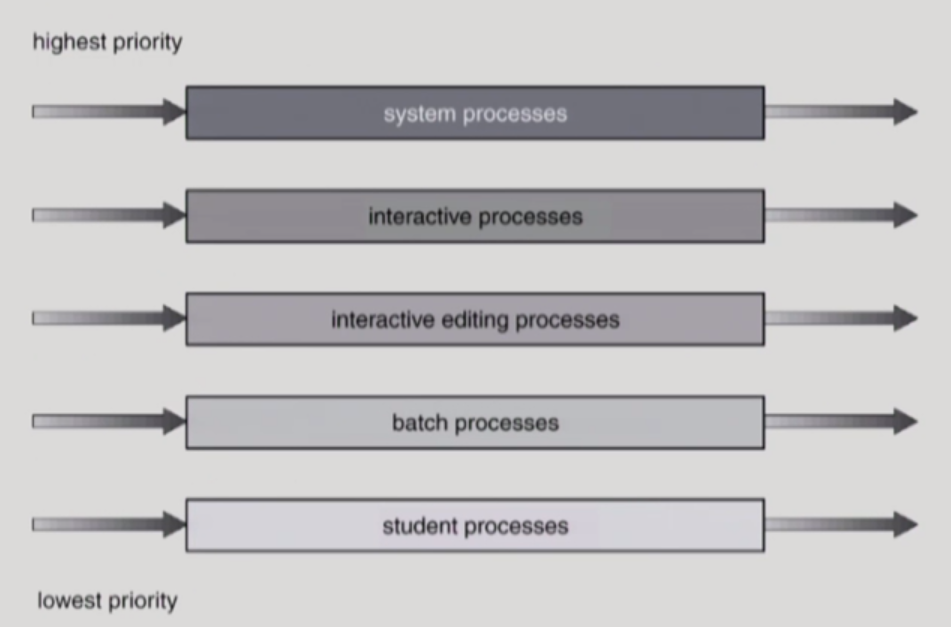

# [운영체제] 11. CPU Scheduling 2 / Process Synchronization 1

[강의출처 : kocw 반효경](https://core.ewha.ac.kr/assets/publish/C0101020140401134252676046)

- round robin이 좋은 점은 전에 작업하고 있던 부분을 세이브해줌

### Multilevel Queue

- Ready queue를 여러 개로 분할
  - foregorund(interactive)
  - background(batch - no human interaction)
- 각 큐는 독립적인 스케줄링 알고리즘을 가짐
  - foreground - RR
    - 사람과 응답하는 것이니
  - background - FCFS
    - batch잡이니 fcfs가 더 효울적임
- 큐에 대한 스케줄링이 필요
  - Fixed priority scheduling
    - serve all from foreground then from background
    - Possibility of starvation
  - Time slice
    - 각 큐에 CPU time을 적절한 비율로 할당
    - Eg., 80% ro foreground in RR, 20% to background in FCFS

### Multilevel Queue

- 줄마다 우선순위 존재
- 밑으로 갈수록 우선순위가 낮음
- 태어난 프로세스가 어떤 형식인지에 따라 우선순위가 정해짐
  - 변하지 않음
- 프로세스를 어느줄에 넣을 것이냐

### Multilevel Feedback Queue

- 약간 우선 순위가 낮은 프로세스라도 올라갈 수 있음

- 여러 줄로 줄서기해서 때에 따라 계급 이동 가능
- 프로세스가 다른 큐로 이동 가능
- 에이징(aging)을 이와 같은 방식으로 구현할 수 있음
- Multilevel-feedback-queue-scheduler를 정의하는 파라미터들
  - Queue의 수
  - 각 큐의 scheduling algorithm
  - Process를 상위 큐로 보내는 기준
  - Process를 하위 큐로 내쫒는 기준
  - 프로세스가 CPU 서비스를 받으려 할 때 들어갈 큐를 결정하는 기준

- cpu 버스트가 짧으면 바로 빠져나갈 수 있지만 길면 아래 큐로 이동해서 할당시간을 더 받을 수 있음
- cpu 버스트 시간이 짧은 프로세스에게 우선 순위를 더 많이 주고 긴 프로세스는 밑으로 내려가게 함
- 짧은 시간에 먼저 배정하기 때문에 예측 할 필요 없음

### Example of Multilevel Feedback Queue

- Three queues:
  - Q0 - time quantum 8 milliseconds
  - Q1 - time quantum 16 milliseconds
  - Q2 - FCFS
- Scheduling
  - new job이 queue Q0로 들어감
  - CPU를 잡아서 할당 시간 8 milliseconds 동안 수행됨
  - 8 milliseconds 동안 다 끝내지 못했으면 queue Q1으로 내려감
  - Q1에 줄서서 기다렸다가 CPU를 잡아서 16ms 동안 수행됨
  - 16ms에 끝내지 못한 경우 queue Q2로 쫓겨남

18:02