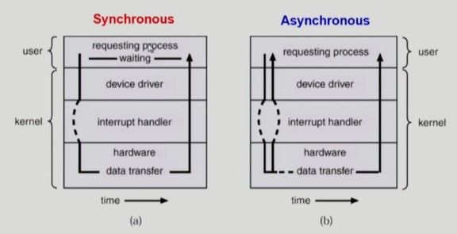
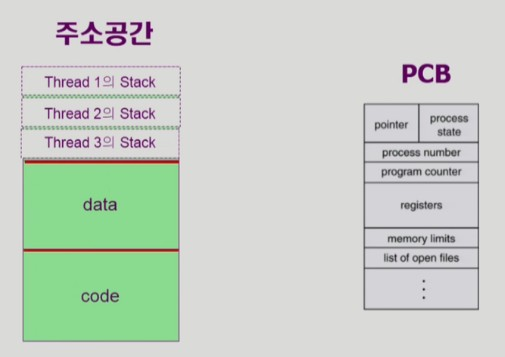
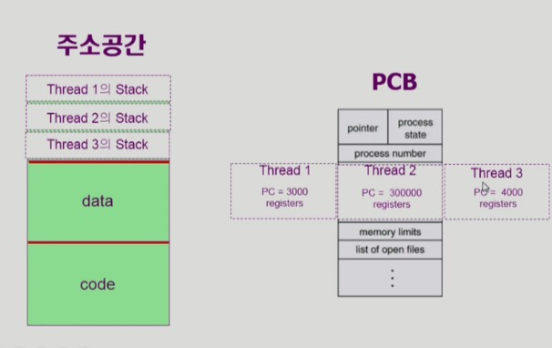
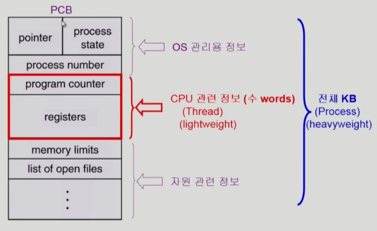
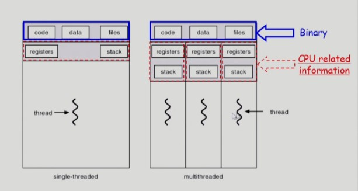

# [KOCW] [운영체제] 6. Process2

출처 : http://www.kocw.net/home/cview.do?lid=29d9a718cff884c3

### 동기식 입출력과 비동기식 입출력

- 동기식 입출력
  - 프로세스가 입출력을 요청
  - 좀 오래 걸리면서 수행됨
  - 입출력 프로세스가 기다려야 하면 동기식
  - i/o가 완료될 때 까지 cpu를 가지면서 기다림
- 비동기식 입출력
  - 입출력 프로세스가 진행되는 인스트럭션을 실행하면 비동기식 입출력
  - 어차피 일을 못할 거 일을 할 수 있는 거에 cpu를 주는 것

### Thread

- "A thread (or lightweight process) is a basic unit CPU utilization"
- Thread의 구성
  - progran counter
  - register set
  - stack space
- Thread가 동료 thread와 공유하는 부분(=task)
  - code section
  - data section
  - OS resources
- 전동적인 개념의 heavyweight process는 하나의 thread를 가지고 있는 task로 볼 수  있음

- 동일한 일을 하는 프로세스를 만들면 메모리가 낭비됨
- 같은 일을 하는 프로세스를 많이 띄우고 싶으면 주소 공간은 하나를 만들고 프로그램 카운터(cpu 단위)만 여러개 두는 것
- 각 CPU 수행마다 코드 어느 부분을 실행하는지 기억
- CPU 수행 단위가 여러개면 STACK도 여러개 둬야함
- 그래서 최대한 공유
  - 프로그램 카운터나 레지스터 , stack은 따로 가짐
- 다중 스레드로 구성된 태스크 구조에서는 하나의 서버 스레드가 blocked(Waiting) 상태인 동안에도 동일한 태스크 내의 다른 스레드가 실행(running)되어 빠른 처리 가능
  - 웹에서 네이버를 볼 때 네트워크를 통해 웹을 읽어 옴 -> 이것도 일종의 i/o 작업
  - 이미 읽어온 텍스트라도 화면에 띄우면 사용자 입장에서는 덜 답답함
- 동일한 일을 수행하는 다중 스레드가 협력하여 높은 처리율(throughput)과 성능 향상을 얻을 수 있음
- 스레드를 사용하면 병렬성을 높일 수 있음
  - cpu가 여러개 달린 pc에서 가능

- 바이너리는 공유하고 cpu에 관련된 것들은 각각 가지고 있는다.

### Threads의 장점

- Responsiveness(응답성)
  - 사용자 입장에서는 빠름
  - 하나의 쓰레드가 멀리 있는 서버에서 그림이나 html파일을 가져오는 동안 이미지 파일을 다시 요청하는 동안 이 쓰레드만 블럭되고 텍스트는 그대로 디스플레이 됨
  - i/o작업을 던져놓고 먼저 되는 것들을 보여줌
- Resource Sharing(자원공유)
  - 코드, 데이터, 프로세스의 자원을 공유
- Economy
  - 좀 더 빠름
  - 프로세스에 하나의 쓰레드를 얹는 것은 오베헤드가 크지 않음
- Utilization of MP Architectures

11:09
