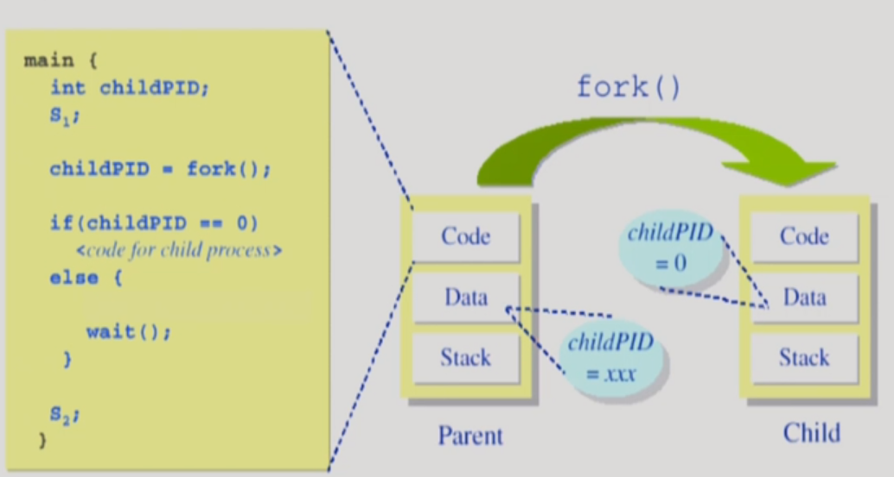

# [KOCW] [운영체제] 9. Process Management 2

출처 : http://www.kocw.net/home/cview.do?lid=3a5437eaa6c9e5b0

### 프로세스 생성

- cpu의 인스트럭션을 어디까지 사용했는지 등도 복제
- 리눅스 등은 자식이 부모의 주소를 공유함
  - 결국은 각자의 길을 가게 됨
  - 그때야 부모의 일부를 자식이 복사함(copy-on-write (cow))
    - 내용이 같으면 공유해도 되지만 다르면 일부만 복제

- 일단 복제생성하고 필요하면 덮어씌움

### fork() 시스템 콜

- A porcess is created by the fork() system call
  - creates a new address space that is duplicate of the caller

```c++
int main()
{
	int pid;
	pid = fork();
	if(pid == 0) /* this is child */
		printf("\n Hello, I am child!\n");
	else if(pid>0) /* this is parent */
		printf("\n Hello, I am parent!\n");
}
```

- pid = fork();
  - 운영체제에서 fork를 실행해 달라고 호출
  - 이 때 복제 생성
  - 복제 된 자식은 main함수 위부터 실행되는게 아니라 fork() 이후부터 실행됨
    - 프로그램카운터가 if문을 가리키기 때문에 if문부터 실행됨
  - 복제를 해놓으니 자기가 원본이라고 하고 부모를 복제본 취급을 해버리는 상황발생
  - 모두 똑같은 프로세스를 따라야 하는 상황 발생
- Parent Process
  - pid > 0
- Child process
  - pid = 0

- 이렇게 나누어야 다른 일을 할 수 있음
  - fork() 결과값으로 구분 가능

### exec() 시스템 콜

- 각기 다른 프로그램들을 실행시켜야 함
- 어떤 프로그램을 완전히 새로운 프로세스로 태어나게 함
- A porcess can excute a different progeam by the exec() system call.
  - replaces the memory image of the caller with a new program.

```c++
int main()
{
	int pid;
	pid = fork()
	if(pid == 0) /* this is child */
	{
		printf("\n Hello, I am child! New I'll run date\n");
		execlp("/bin/date", "/bin/date", (char*)0)
	}
	else if(pid>0) /* this is parent */
		printf("\n Hello, I am parent!\n");
}
```

- execlp 
  - 이걸 만나면 완전히 새로운 걸로 덮어씌워줌
  - main()부터 실행 됨
- 꼭 자식이 할 필요는 없음
- fork를 빼고 해도 됨
- execalp 형식
  - (프로그램이름, 프로그램이름, 전달한 아규먼트나열(콤마로 구분), (char*)0)

### wait() 시스템 콜

- 프로세스 A가 wait() 시스템 콜을 호출하면
  - 커널은 child가 종료될 때까지 프로세스 A를 sleep 시킴(block 상태)
    - 보통 자식이 만들어지고 wait콜을 함
  - child process가 종료되면 커널은 프로세스 A를 깨움(ready 상태)



- 부모 프로세스안에 wait콜이 있어서 잠들게 됨
- 자식프로세스가 종료되면 부모프로세스는 wait를 빠져나가서 수행할 수 있음

### exit() 시스템 콜

- 프로세스의 종료
  - 자발적 종료
    - 마지막 statement 수행 후 exit() 시스템 콜을 통해 
      - 제일 마지막이거나 exit() 끝 이거나
    - 프로그램에 명시적으로 적어주지 않아도 main 함수가 리턴되는 위치에 컴파일러가 넣어줌
  - 비자발적 종료
    - 부모 프로세스가 자식 프로세스를 강제 종료시킴
      - 자식 프로세스가 한계치를 넘어서는 자원 ㅈ요청
      - 자식에게 할당된 태스크가 더 이상 필요하지 않음
    - 키보드로 kill, break 등을 친 경우
    - 부모가 종료하는 경우
      - 부모 프로세스가 종료하기 전에 자식들이 먼저 종료됨
      - 자식이 먼저 죽어야 함

### 프로세스와 관련한 시스템 콜

- fork()
- exec()
- wait()
- exit()

### 프로세스 간 협력

- 독립적 프로세스(Independent process)
  - 프로세스는 각자의 주소 공간을 가지고 수행되므로 원칙적으로 하나의 프로세스는 다른 프로세스의 수행에 영향을 미치지 못함
- 협력 프로세스(Cooperating process)
  - 프로세스 협력 메커니즘을 통해 하나의 프로세스가 다른 프로세스의 수행에 영향을 미칠 수 있음
- 프로세스 간 협력 메커니즘(IPC : Interprocess Communication)
  - 메시지를 전달하는 방법
    - message passing : 커널을 통해 메시지 전달
  - 주소 공간을 공유하는 방법
    - shared memory 
      - 서로 다른 프로세스 간에도 일부 주소 공간을 공유하게 하는 shared memroy 메커니즘이 존재
    - thread
      - thread느 사실상 하나의 프로세스이므로 프로세스 간 협력으로 보디는 어렵지만 동일한 process를 구성하는 thread들간에는 주소 공간을 공유하므로 협력이 가능

37:56