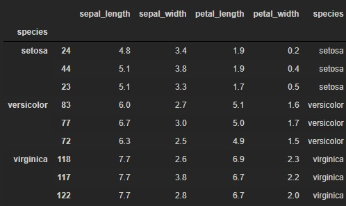
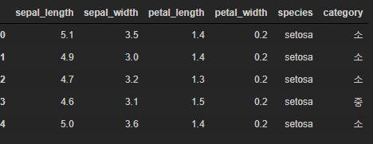

# tPandas_06

### 그룹분석 및 피봇

```python
import pandas as pd
import numpy as np
import matplotlib.pyplot as plt
```

#### Series Grouping

```python
df = pd.DataFrame({ "학과" : ["컴퓨터","체육교육과","컴퓨터","체육교육과","컴퓨터"],
                    "학년" : [1, 2, 3, 2, 3],
                    "이름" : ["홍길동","펭펭","최길동","펭하","신사임당"],
                    "학점" : [1.5, 4.4, 3.7, 4.5, 3.8]})
df
>
	학과	학년	이름	학점
0	컴퓨터	1	홍길동	1.5
1	체육교육과	2	펭펭	4.4
2	컴퓨터	3	최길동	3.7
3	체육교육과	2	펭하	4.5
4	컴퓨터	3	신사임당	3.8
```

**학과를 기준으로 grouping**

#### groupby()

```python
dept_series = df['학과'].groupby( df['학과'])
dept_series
>
<pandas.core.groupby.groupby.SeriesGroupBy object at 0x00000289C9DD1A58>
```

- 그룹하려는 기준을 넣어준다.

**get_group()**

```python
dept_series.get_group('컴퓨터')
>
0    컴퓨터
2    컴퓨터
4    컴퓨터
Name: 학과, dtype: object
```

- 원하는 그룹을 확인 하기위해 그룹 키워드를 입력하면 시리즈로 리턴한다.

**size()**

```python
dept_series.size()
>
학과
체육교육과    2
컴퓨터      3
Name: 학과, dtype: int64
```

- 그룹이 몇개있는지 알려준다.

```python
dept = df.groupby(df['학과'])
dept.mean()
>
				학년	학점
학과		
체육교육과	2.000000	4.45
컴퓨터	2.333333	3.00
```

- 시리즈가 인덱스로 들어갔다. 즉 value가 인덱스로 들어갔다.
- 이름은 빠져있다. 

**groups**

```python
dept.groups
>
{'체육교육과': Int64Index([1, 3], dtype='int64'),
 '컴퓨터': Int64Index([0, 2, 4], dtype='int64')}
```

- 각 그룹의 인덱스를 볼 수 있다.

```python
dept.sum()
>
			학년	학점
학과		
체육교육과	  4	   8.9
컴퓨터		   7	9.0
```

```python
df.groupby(df['학과']).sum()
>
			학년	학점
학과		
체육교육과		4	8.9
컴퓨터			7	9.0
```

- 이렇게 바로 집계함수 쓸 수 있다.

```python
df.groupby(['학과','학년']).mean()
>
				학점
학과		학년	
체육교육과	2	4.45
컴퓨터	 	 1	 1.50
		   3	3.75
```

- 여러개 컬럼을 구할 수 있다.

```python
import seaborn as sns
iris = sns.load_dataset('iris')
iris
>sepal_length	sepal_width	petal_length	petal_width	species
0	5.1	3.5	1.4	0.2	setosa
1	4.9	3.0	1.4	0.2	setos
```

```python
iris.describe()
>
sepal_length	sepal_width	petal_length	petal_width
count	150.000000	150.000000	150.000000	150.000000
mean	5.843333	3.057333	3.758000	1.199333
std	0.828066	0.435866	1.765298	0.762238
min	4.300000	2.000000	1.000000	0.100000
25%	5.100000	2.800000	1.600000	0.300000
50%	5.800000	3.000000	4.350000	1.300000
75%	6.400000	3.300000	5.100000	1.800000
max	7.900000	4.400000	6.900000	2.500000
```

#### 각 종별로 가장 큰 값과 가장 작은 값의 비율을 구한다면?

```python
def get_ratio(x):
    return x.max() / x.min()
```

- 함수를 만들어 놓는다.

```python
iris.groupby(iris.species).sum()
>
	sepal_length	sepal_width	petal_length	petal_width
species				
setosa	250.3	171.4	73.1	12.3
versicolor	296.8	138.5	213.0	66.3
virginica	329.4	148.7	277.6	101.3
```

```python
iris.groupby(iris.species).mean()
>
sepal_length	sepal_width	petal_length	petal_width
species				
setosa	5.006	3.428	1.462	0.246
versicolor	5.936	2.770	4.260	1.326
virginica	6.588	2.974	5.552	2.026
```

```python
iris.groupby(iris.species).max()
>
sepal_length	sepal_width	petal_length	petal_width
species				
setosa	5.8	4.4	1.9	0.6
versicolor	7.0	3.4	5.1	1.8
virginica	7.9	3.8	6.9	2.5
```

#### agg(집계함수)

```python
iris.groupby(iris.species).agg(get_ratio)
>
sepal_length	sepal_width	petal_length	petal_width
species				
setosa	1.348837	1.913043	1.900000	6.000000
versicolor	1.428571	1.700000	1.700000	1.800000
virginica	1.612245	1.727273	1.533333	1.785714
```

- 위에서 만든 함수를 넣으면 비율을 보여준다.
- 시리즈별로 적용된다.
- 함수 호출할 때 () 넣지 않는다.

```python
iris.groupby(iris.species).describe().T
>
	species	setosa	versicolor	virginica
petal_length	count	50.000000	50.000000	50.000000
mean	1.462000	4.260000	5.552000
petal_width	count	50.000000	50.000000	50.000000
mean	0.246000	1.326000	2.026000
sepal_length	count	50.000000	50.000000	50.000000
mean	5.006000	5.936000	6.588000
sepal_width	count	50.000000	50.000000	50.000000
mean	3.428000	2.770000	2.974000
```

- 전치행렬을 주면 종별로 정보 파악 가능하다.

#### 붓꽃 종별로 가장 큰 꽃잎 길이가 큰 3개의 데이터를 뽑아내는 함수 정의

```python
def select_3(df):
    return df.sort_values(by='petal_length', ascending=False)[:3]
```

```python
iris.sort_values(by='petal_length', ascending=False)[:3]
>

	sepal_length	sepal_width	petal_length	petal_width		species
118			7.7				2.6			6.9			2.3			virginica
122			7.7				2.8			6.7			2.0			virginica
117			7.7				3.8			6.7			2.2			virginica
```

- 함수에 적용했던 걸 일반적으로 적용해보았다.

```python
iris.groupby(iris.species).apply(select_3)
```



- 다음과 같이 종별로 길이가 큰 것들 순으로 3개씩 뽑아준다.
- apply는 데이터프레임으로 돌려준다.

####  transform : 데이터 프레임 자체를 변화시키는 함수

-  원본 프레임과 크기가 같다.

##### 각 붓꽃 꽆잎길이가 해당 좋 내에서 대/중/소 어느것에 해당되는지에 대한 프레임을 만들고 싶다면?

```python
iris.groupby(iris.species)
> <pandas.core.groupby.groupby.DataFrameGroupBy object at 0x00000289CBF30E10>
```

- 데이터 프레임의 그룹

```python
iris.groupby(iris.species).groups
>
{'setosa': Int64Index([ 0,  1,  2,  3,  4,  5,  6,  7,  8,  9, 10, 11, 12, 13, 14, 15, 16,
             17, 18, 19, 20, 21, 22, 23, 24, 25, 26, 27, 28, 29, 30, 31, 32, 33,
             34, 35, 36, 37, 38, 39, 40, 41, 42, 43, 44, 45, 46, 47, 48, 49],
            dtype='int64'),
 'versicolor': Int64Index([50, 51, 52, 53, 54, 55, 56, 57, 58, 59, 60, 61, 62, 63, 64, 65, 66,
             67, 68, 69, 70, 71, 72, 73, 74, 75, 76, 77, 78, 79, 80, 81, 82, 83,
             84, 85, 86, 87, 88, 89, 90, 91, 92, 93, 94, 95, 96, 97, 98, 99],
            dtype='int64'),
 'virginica': Int64Index([100, 101, 102, 103, 104, 105, 106, 107, 108, 109, 110, 111, 112,
             113, 114, 115, 116, 117, 118, 119, 120, 121, 122, 123, 124, 125,
             126, 127, 128, 129, 130, 131, 132, 133, 134, 135, 136, 137, 138,
             139, 140, 141, 142, 143, 144, 145, 146, 147, 148, 149],
            dtype='int64')}
```

```python
iris.groupby(iris.species).petal_length
>
<pandas.core.groupby.groupby.SeriesGroupBy object at 0x00000289CBF30CC0>
```

- 시리즈 형식의 그룹

```python
iris.groupby(iris.species).petal_length.size()
>
species
setosa        50
versicolor    50
virginica     50
Name: petal_length, dtype: int64
```

#### cut()  : 동일 길이(length)로 나누어서 범주를 만들어서 그룹에 대한 통계량

#### qcut() : 동일 갯수(범주안에 갯수)로 나누어서 범주를 만들어서 그룹에 대한 통계량

```python
def cat3_petal_length(s):
    return pd.qcut(s,3, labels=['소','중',"대"]).astype(str)
```

- `qcut` 를 이용하여 s를 3개로 나누고 거기서 소,중,대를 준다음 혹시 모르니 문자열로 타입변환한다.

```python
iris['category'] = iris.groupby(iris.species).petal_length.transform(cat3_petal_length)
iris.head()
```



- 다음과 같이 추가된다.

agg()와 apply()의 차이

- agg() : 여러개의 집계함수 사용가능
- apply() : 인자로 하나의 함수만 실행 할 수 있음

#### 붓꽃 데이터에서 붓꽃 종별로 꽃잎길이(sepal_length), 꽃잎폭(sepal_width)등의 평균을 구하라

```python
iris.groupby('species').mean()
>
		sepal_length	sepal_width	petal_length	petal_width
species				
setosa		5.006			3.428			1.462		0.246
versicolor	5.936			2.770			4.260		1.326
virginica	6.588			2.974			5.552		2.026
```

```python
iris.groupby('species').agg(np.mean).iloc[:,0:2]
>
			sepal_length	sepal_width
species		
setosa				5.006		3.428
versicolor			5.936		2.770
virginica			6.588		2.974
```

- loc[: ,['sepal_length','sepal_width']]

```python
iris.groupby('species').agg([np.mean,np.max]).loc[: ,['sepal_length','sepal_width']]
>
			sepal_length	sepal_width
			mean	amax	mean	amax
species				
setosa		5.006	5.8		3.428	4.4
versicolor	5.936	7.0		2.770	3.4
virginica	6.588	7.9		2.974	3.8
```

- agg는 원하는 집계함수 한번에 사용 가능

### pivot

- 데이터프레임에서 두 개의 열을 이용하여 행/열 인덱스 reshape 된 테이블

- 새로운 테이블에서 새로운 기준으로 집계
- pivot(index, columns,value) 하나의 value만 가능
- pivot_table(data, values, index, columns, aggfunc='집계함수') 다수의 value 가능

```python
titanic= sns.load_dataset('titanic')
titanic.head()
>
survived	pclass	sex	age	sibsp	parch	fare	embarked	class	who	adult_male	deck	embark_town	alive	alone
0	0	3	male	22.0	1	0	7.2500	S	Third	man	True	NaN	Southampton	no	False
1	1	1	female	38.0	1	0	71.2833	C	First	woman	False	C	Cherbourg	yes	False
2	1	3	female	26.0	0	0	7.9250	S	Third	woman	False	NaN	Southampton	yes	True
3	1	1	female	35.0	1	0	53.1000	S	First	woman	False	C	Southampton	yes	False
4	0	3	male	35.0	0	0	8.0500	S	Third	man	True	NaN	Southampton	no	True
```

```python
titanic_df01 = pd.DataFrame(titanic, columns=['sex', 'pclass'])
titanic_df01.head()
>
sex	pclass
0	male	3
1	female	1
2	female	3
3	female	1
4	male	3
```

```python
titanic_df01 = titanic.groupby(['sex', 'pclass'])
titanic_df01
>
<pandas.core.groupby.groupby.DataFrameGroupBy object at 0x00000289CC1A5550>
```

- 데이터 프레임이다.

```python
titanic_df01 = titanic.groupby(['sex', 'pclass']).size()
titanic_df01
>
sex     pclass
female  1          94
        2          76
        3         144
male    1         122
        2         108
        3         347
dtype: int64
```

- 이렇게 분류해준다.

```python
titanic_df01 = titanic.groupby(['sex', 'pclass']).size().reset_index(name='cnt')
titanic_df01
>
	sex	pclass	cnt
0	female	1	94
1	female	2	76
2	female	3	144
3	male	1	122
4	male	2	108
5	male	3	347
```

```python
titanic_df01.pivot('sex', 'pclass','cnt')
>
pclass	1	2	3
sex			
female	94	76	144
male	122	108	347
```

- 피벗을 쓰려면 그룹을 먼저 만들어서 해야한다.

#### 성별과 생존여부에 따른 승객 수 집계한다면?

```python
titanic_df02 = titanic.groupby(['sex','survived']).size().reset_index(name='cnt')
titanic_df02
>
	sex		survived	cnt
0	female		0		81
1	female		1		233
2	male		0		468
3	male		1		109
```

- 우선 그룹한다.

```python
titanic_df02.pivot('sex','survived','cnt')
>

survived	0		1
sex		
female		81		233
male		468		109
```

- 이렇게 피벗하면 보기편하다.

#### pivot_table(data, values, index, columns, aggfunc='집계함수')로 만들어보자

```python
titanic['cnt'] = 1
titanic.head()
>
survived	pclass	sex	age	sibsp	parch	fare	embarked	class	who	adult_male	deck	embark_town	alive	alone	cnt
0	0	3	male	22.0	1	0	7.2500	S	Third	man	True	NaN	Southampton	no	False	1
1	1	1	female	38.0	1	0	71.2833	C	First	woman	False	C	Cherbourg	yes	False	1
```

```python
titanic.pivot_table('cnt','sex','pclass',aggfunc=np.sum)
>

pclass	1	2	3
sex			
female	94	76	144
male	122	108	347
```

- groupby 하지 않고 바로 할 수 있다.

```python
titanic.pivot_table('cnt','sex','survived',aggfunc=np.sum)
>
survived	0	1
sex		
female	81	233
male	468	109
```

