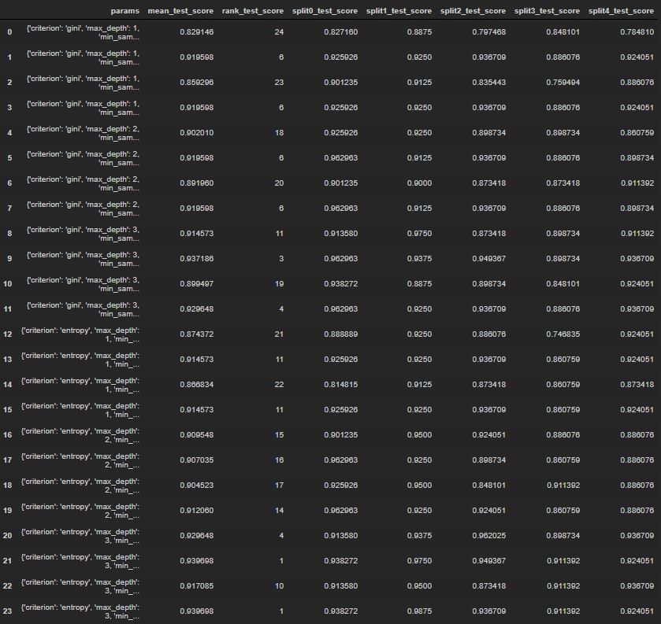

# 머신러닝_02

- 오차행렬을 이용해서 재현율과 정밀도, F1스코어를 사용해서 평가한다.

### feature : 학습을 위한 데이터, label  : 정답

### cross_val_score() : 교차 검증을 간단하게 도와주는 함수

- 폴더 세트 설정, 반복을 통한 학습 및 테스트 인덱스 추출, 학습과 예측수행 반환
- cross_val_score(**estimater**) : `estimater` 어떤 학습방식을 선택할래?

- cross_val_score(**estimater**, **X**(feature), **y**(label), scoring)  : `scoring`  평가 지표

- cross_val_score(**estimater**, **X**(feature), **y**(label), **scoring**, **cv**)  : `cv`  폴더 개수

```python
from sklearn.datasets import load_iris
from sklearn.tree     import DecisionTreeClassifier
from sklearn.model_selection import cross_val_score, cross_validate
import pandas as pd
import numpy as np
```

- `import cross_val_score, cross_validate` 추가

```python
cvs_iris = load_iris()
cvs_iris_feature = cvs_iris.data
cvs_iris_label = cvs_iris.target
cvs_iris_dtc = DecisionTreeClassifier(random_state = 200)
```

- cvs_iris_feature = cvs_iris.data : 학습을 위한 데이터

- cvs_iris_label = cvs_iris.target : 정답 데이터

```python
scoring = cross_val_score(cvs_iris_dtc, cvs_iris_feature,cvs_iris_label,scoring='accuracy',cv=3 )
print('교차 검증별 정확도 :',scoring)
print('평균 검증 정확도 :',np.mean(scoring))
>
교차 검증별 정확도 : [0.98039216 0.92156863 0.97916667]
평균 검증 정확도 : 0.960375816993464
```

- cvs_iris_dtc : 자동으로 StratifiedKFold를 수행한다.

- 3개의 폴더 교차 검증 정확도를 넘겨준다.

```python
scoring2 = cross_validate(cvs_iris_dtc, cvs_iris_feature,cvs_iris_label,scoring='accuracy',cv=3 )
print('교차 검증 정보 :',scoring2)
print('교차 검증별 정확도 :',scoring2['test_score'])
print('교차 검증 시간 :',scoring2['fit_time'])
print('평균 검증 정확도 :',np.mean(scoring2['test_score']))
>
교차 검증 정보 : {'fit_time': array([0.00100064, 0.00099778, 0.00099397]), 'score_time': array([0., 0., 0.]), 'test_score': array([0.98039216, 0.92156863, 0.97916667]), 'train_score': array([1., 1., 1.])}
교차 검증별 정확도 : [0.98039216 0.92156863 0.97916667]
교차 검증 시간 : [0.00100064 0.00099778 0.00099397]
평균 검증 정확도 : 0.960375816993464
```

- fit_time와  score_time도 같이 넘어온다.

##### cv=10

```python
scoring2 = cross_validate(cvs_iris_dtc, cvs_iris_feature,cvs_iris_label,scoring='accuracy',cv=10)
print('교차 검증 정보 :',scoring2)
print('교차 검증 시간 :',scoring2['fit_time'])
print('*'*100)
print('교차 검증별 정확도 :',scoring2['test_score'])
print('평균 검증 정확도 :',np.round(np.mean(scoring2['test_score']),2))
>
교차 검증 정보 : {'fit_time': array([0.00099897, 0.00099897, 0.        , 0.00200081, 0.        ,
       0.00099683, 0.        , 0.        , 0.0009923 , 0.        ]), 'score_time': array([0.        , 0.00099587, 0.        , 0.        , 0.        ,
       0.        , 0.        , 0.00098324, 0.        , 0.00099611]), 'test_score': array([1.        , 0.93333333, 1.        , 0.93333333, 0.93333333,
       0.86666667, 0.93333333, 0.93333333, 1.        , 1.        ]), 'train_score': array([1., 1., 1., 1., 1., 1., 1., 1., 1., 1.])}
교차 검증 시간 : [0.00099897 0.00099897 0.         0.00200081 0.         0.00099683
 0.         0.         0.0009923  0.        ]
****************************************************************************************************
교차 검증별 정확도 : [1.         0.93333333 1.         0.93333333 0.93333333 0.86666667
 0.93333333 0.93333333 1.         1.        ]
평균 검증 정확도 : 0.95
```

### Hyper Parameter Tuning (하이퍼 파마리터 튜닝)

- 학습 시키는 모델들의 파라미터를 우리가 튜닝할 수 있다.
- 과적합 발생시 과적합 방지하거나 scoring를 올릴 수 있다.

```python
DecisionTreeClassifier(class_weight=None, criterion='gini', max_depth=None,
            max_features=None, max_leaf_nodes=None,
            min_impurity_decrease=0.0, min_impurity_split=None,
            min_samples_leaf=1, min_samples_split=2,
            min_weight_fraction_leaf=0.0, presort=False, random_state=None,
            splitter='best')
```

- 디폴트로 설정되어 있는 걸 우리가 조정할 수 있다.

### GridSearchCV :교차 검증과 튜닝을 한번에 할 수 있다.

- Decisiton Tree parameter
- parameter criterion : 노드 분리하는 기준 (gini, entropy)

- parameter splitter : 노드 분리하는 방법(random, best)

- parameter max_depth : 트리 모형의 깊이를 의미
  - 이걸 크게 만들면 과적합 현상 발생
  - 적절한 depth를 가져야 한다.

- parameter min_samples_split : 브랜치 노드에서 분리가 일어나기 위한 샘플 수
  - feature를 몇개로 나누어서 비교할 것인가?

- parameter min_samples_leaf  : 노드에 필요한 최소한의 샘플 수 
  - 마지막에 노드에 들어가는 샘플 수, 하나에 들어가는 샘플이 많으면 과적합 발생

- parameter max_features : 노드를 분리할 대 고려하는 속성의 수 (auto, aqrt, log, int, float)
- random_state : 공통/Decisiton Tree parameter가 아니더라도 다 쓰이는 속성

```python
from sklearn.datasets import load_iris
from sklearn.tree     import DecisionTreeClassifier
from sklearn.model_selection import  GridSearchCV,train_test_split
from sklearn.metrics import accuracy_score
import pandas as pd
import numpy as np
```

- `from sklearn.model_selection import  GridSearchCV` 를 추가

```python
gscv_iris = load_iris()
x_train, X_test , y_train, y_test = train_test_split(gscv_iris.data, 
                                                     gscv_iris.target,
                                                     test_size=0.2,
                                                    random_state=120)
# 학습기 만들기
gscv_tree = DecisionTreeClassifier()
params = {'criterion' : ['gini', 'entropy'], 
          'splitter' : ['random','best'], 
          'max_depth' : [1,2,3], 
          'min_samples_split' : [2,3]}
```

- 데이터를 미리 나눠줘야 한다.
- GridSearchCV에서 지정해줄 params을 미리 만든다.

```python
grid_gscv_tree = GridSearchCV(gscv_tree, param_grid = params,cv=3,refit=True )
```

- param_grid = params 
  - 위에서 파라미터 설정들을 써놓은걸 지정한다.

- refit = True 최적의 파라미터를 찾아서 재학습을 하겠다는 의미

```python
grid_gscv_tree.fit(X_train, y_train)
grid_gscv_tree.cv_results_
score_df = pd.DataFrame(grid_gscv_tree.cv_results_)
score_df[['params', 'mean_test_score', 'rank_test_score','split0_test_score','split1_test_score','split2_test_score']]
```


- 랭킹을 보면 1위부터 나열되어 있다.

```python
print('최적의 파라미터 : ', grid_gscv_tree.best_params_)
print('높은 정확도 : ', grid_gscv_tree.best_score_)
>
최적의 파라미터 :  {'criterion': 'entropy', 'max_depth': 3, 'min_samples_split': 2, 'splitter': 'random'}
높은 정확도 :  0.95
```

- 이렇게 가장 좋은 것들을 출력할 수 있다.

- 24번 * 3 = 72번의 학습과 검증이 이루어졌다.

```python
estimator = grid_gscv_tree.best_estimator_
prediction = estimator.predict(X_test)
print('answer : ', y_test)
print('guess : ', prediction)
print('테스트 세트의 정확도 : ', accuracy_score(y_test,prediction))
>
answer :  [1 2 1 1 2 0 2 1 1 2 0 1 0 1 1 0 0 0 0 0 2 0 2 0 1 2 1 0 0 0]
guess :  [1 2 1 1 2 0 2 1 1 2 0 1 0 1 1 0 0 0 0 0 2 0 2 0 1 2 1 0 0 0]
테스트 세트의 정확도 :  1.0
```

### [실습]

```python
from sklearn.datasets import load_iris, load_breast_cancer
from sklearn.tree     import DecisionTreeClassifier
from sklearn.model_selection import  GridSearchCV,train_test_split
from sklearn.metrics import accuracy_score
import pandas as pd
import numpy as np
```

```python
cancer = load_breast_cancer()
cancer.keys()
>
dict_keys(['data', 'target', 'target_names', 'DESCR', 'feature_names'])
```

```python
cancer_df = pd.DataFrame(data = cancer.data,columns= cancer.feature_names)
cancer_df.head()
cancer_df.info()
>
<class 'pandas.core.frame.DataFrame'>
RangeIndex: 569 entries, 0 to 568
Data columns (total 30 columns):
```

#### train 과 test로 나누어라. 7:3으로

```python
cancer_df['target'] = cancer.target
cancer_feature = cancer_df.iloc[:,:-1]
cancer_label = cancer_df.iloc[:,-1]
```

- df에 target열을 추가한다.
- feature와 label을 각각 변수에 저장한다.

#### 학습 ,예측

```python
cancer_dtc = DecisionTreeClassifier(random_state=20, criterion='entropy')
cancer_dtc.fit(X_train, y_train)
# 예측(Predict) 수행
predition = cancer_dtc.predict(X_test)
```

- 학습기를 만들어서 학습하고 예측해보았다.

#### 학습 결과에 대한 평가

```python
print('예측 정확도 : %.2f' % accuracy_score(y_test, predition))
>
예측 정확도 : 0.93
```

- 0.93 정확도가 나왔다. 높은 편이라 말할 수 있을까?

#### 교차 검증

##### cross_validate사용

```python
cancer_dtc = DecisionTreeClassifier(random_state=200)
```

```python
cancer_scoring = cross_validate(cancer_dtc, cancer_feature,cancer_label,scoring='accuracy',cv=5 )
```

- 알아서 교차검증을 해주는 `cross_validate` 을 사용하여 5개로 나누어 보았다.

```python
print('교차 검증별 정확도 :',cancer_scoring['test_score'])
print('평균 검증 정확도 :',np.round(np.mean(cancer_scoring['test_score']),2))
>
교차 검증별 정확도 : [0.90434783 0.91304348 0.91150442 0.92920354 0.91150442]
평균 검증 정확도 : 0.91
```

- 평균 정확도가 그냥 학습할때보다는 떨어졌다.

#### 튜닝

```python
cancer_tree = DecisionTreeClassifier()
params = {'criterion' : ['gini', 'entropy'], 
          'splitter' : ['random','best'], 
          'max_depth' : [1,2,3], 
          'min_samples_split' : [2,3]}
```

- 아무 조건을 주지 않은 학습기를 만든다.
- 파라미터에 적용할 튜닝들을 따로 만든다.

```python
grid_cancer_tree = GridSearchCV(cancer_tree, param_grid = params,cv=5,refit=True )
```

- GridSearchCV에 위에서 만든 파라미터 튜닝을 적용한다. 5개의 폴더로 나눈다.

```python
grid_cancer_tree.fit(X_train, y_train)
grid_cancer_tree.cv_results_
score_cancer_df = pd.DataFrame(grid_cancer_tree.cv_results_)
score_cancer_df[['params', 'mean_test_score', 'rank_test_score','split0_test_score','split1_test_score','split2_test_score']]
```

- grid_cancer_tree을 학습한다. 
- result를 따로 df로 만들어서 사용할 컬럼만 추려내서 살펴본다.



```python
estimator = grid_cancer_tree.best_estimator_
prediction = estimator.predict(X_test)
print('answer : ', y_test)
print('guess : ', prediction)
print('테스트 세트의 정확도 : ', accuracy_score(y_test,prediction))
>
guess :  [1 1 1 1 1 0 0 0 0 1 1 1 1 1 0 1 1 1 1 1 1 1 0 0 0 0 1 1 0 1 1 1 0 1 1 0 1
 1 1 0 1 0 0 1 1 1 0 1 0 1 1 1 0 1 1 1 0 0 0 1 0 1 0 1 1 0 1 0 0 1 1 1 0 1
 1 1 1 1 0 1 1 1 1 1 0 0 1 1 1 1 0 1 1 1 0 1 0 0 1 1 0 1 1 1 1 1 1 0 1 1 0
 1 1 1 1 1 1 1 1 1 1 0 1 1 1 0 0 1 0 1 1 0 1 0 0 0 1 1 1 1 1 0 1 1 0 1 0 0
 1 1 1 1 0 1 1 1 0 1 0 1 0 1 1 1 1 0 1 1 1 0 1]
테스트 세트의 정확도 :  0.9415204678362573
```


