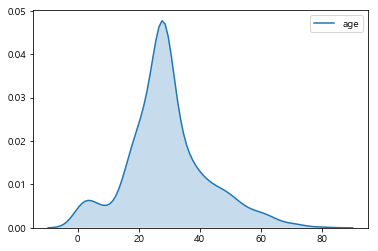

# ml_03

### 데이터 전처리

- 데이터 클린징
- 결손값 처리
- 데이터 인코딩(레이블, 원-핫 인코딩)
- 데이터 스케일링
- 이상치 제거
- 피처 선택, 추출 및 가공

#### 데이터 전처리가 필요한 이유?

- 학습을 할 때 학습 알고리즘들은 Null값 허용하지 않는다.
- 분류 알고리즘들 : target 값들이 숫자로 이루어져 있다. 
  - 숫자가 아닌 문자열로 되어 있다면 예측, 분류를 할 수 있을까?
  - 기본적으로 label값들을 수치형으로 변경해주는 작업이 필요하다.

##### 데이터 인코딩

> 머신러닝 알고리즘은 문자열 데이터 속성을 입력 받지 않으며 모든 데이터는 숫자형으로 표현되어야 한다. 문자형 카테고리형 속성은 모두 숫자값으로 변환/인코딩 되어야 한다.

- 레이블(Label)  인코딩
  - 원본 : 상품분류(TV, 냉장고, 전자레인지...) 
  - 인코딩 : 상품 분류 (0,1,2...)
- 원-핫(One-Hot) 인코딩

> 피처 값의  유형에 따라 새로운 피처를 추가해 고유 값에 해당하는 컬럼에만 1을 표시하고 나머지 컬럼에는 0을 표시하는 방식

- 원본 : 상품분류(TV, 냉장고, 전자레인지...) 
- 인코딩 : 상품 분류 (0,1,2...) 후 해당 되는 분류에 1/ 나머지 0

##### pd.get_dummies(DataFrame) : 원-핫 인코딩

```python
from sklearn.datasets import load_iris, load_breast_cancer
from sklearn.tree     import DecisionTreeClassifier
from sklearn.model_selection import  GridSearchCV,train_test_split
from sklearn.metrics import accuracy_score

from sklearn.preprocessing import LabelEncoder
import pandas as pd
import numpy as np
```

`from sklearn.preprocessing import LabelEncoder` 추가

- import 대문자는 class -> 객체임

```python
item_label = ['TV', '냉장고', '전자렌지', '컴퓨터', '선풍기' ,'믹서', '믹서']
```

- 영문은 할글보다 우선하고 한글은 가나다라 순으로 매겨진다.

```python
encoder = LabelEncoder()
encoder.fit(item_label)
digit_label = encoder.transform(item_label)
print('encoder 결과', digit_label)
>
encoder 결과 [0 1 4 5 3 2 2]
```

- 문자 순서대로 레이블이 생겼다.

- 이걸 `pd.get_dummies(DataFrame) ` 쓰면 한 번에 된다.

```python
print('decoder 결과', encoder.inverse_transform(digit_label))
>
decoder 결과 ['TV' '냉장고' '전자렌지' '컴퓨터' '선풍기' '믹서' '믹서']
```

- 디코더도 가능하다.

##### OneHotEncoder

```python
from sklearn.preprocessing import OneHotEncoder
item_label = ['TV', '냉장고', '전자렌지', '컴퓨터', '선풍기' ,'믹서', '믹서']
encoder = LabelEncoder()
encoder.fit(item_label)
digit_label = encoder.transform(item_label)
type(digit_label)
>
numpy.ndarray
```

- 학습을 하려면 2차원이여야 한다.

##### 2차원 데이터로 변환

```python
digit_label = digit_label.reshape(-1,1)
print(digit_label)
>
[[0]
 [1]
 [4]
 [5]
 [3]
 [2]
 [2]]
```

- reshape(-1,1) : 행을 데이터 개수에 맞추겠다. 1열로

```python
print(digit_label.shape)
>
(7, 1)
```

- 2차원이다.

##### One-Hot encoding

```python
ont_hot_encoder = OneHotEncoder()
ont_hot_encoder.fit(digit_label)
ont_hot_label = ont_hot_encoder.transform(digit_label)
print(ont_hot_label.toarray())
print(ont_hot_label.shape)
>
[[1. 0. 0. 0. 0. 0.]
 [0. 1. 0. 0. 0. 0.]
 [0. 0. 0. 0. 1. 0.]
 [0. 0. 0. 0. 0. 1.]
 [0. 0. 0. 1. 0. 0.]
 [0. 0. 1. 0. 0. 0.]
 [0. 0. 1. 0. 0. 0.]]
(7, 6)
```

- 값이 들어 있는 곳에는 1이 들어가있고 아닌 곳은 0으로 .

- 7행 6열의 2차원의 배열이다.

1. 레이블 인코딩
2. 2차원 데이터로 변환
3. 원-핫 인코딩

##### pandas get_dummies(df)

```python
ont_hot_df = pd.DataFrame({'item' :  ['TV', '냉장고', '전자렌지', '컴퓨터', '선풍기' ,'믹서', '믹서']})
pd.get_dummies(ont_hot_df)
>
	item_TV		item_냉장고	item_믹서		item_선풍기	item_전자렌지	item_컴퓨터
0		1				0			0				0				0			0
1		0				1			0				0				0			0
2		0				0			0				0				1			0
3		0				0			0				0				0			1
4		0				0			0				1				0			0
5		0				0			1				0				0			0
6		0				0			1				0				0			0
```

- 이렇게 한 번에 해준다.

### 결측값 처리

```python
from io import StringIO
import pandas as pd
import numpy as np 

csv_data = StringIO("""
x1,x2,x3,x4,x5
1,0.1,"1",2019-01-01,A
2,,,2019-01-02,B
3,,"3",2019-01-03,C
,0.4,"4",2019-01-04,A
5,0.5,"5",2019-01-05,B
,,,2019-01-06,C
7,0.7,"7",,A
8,0.8,"8",2019-01-08,B
9,0.9,,2019-01-09,C
""")

df = pd.read_csv(csv_data)
df

```

- `StringIO` : 코드상의 문자열을 데이터로 만들어서 csv로 불러올 수 있다.

```python
df.isnull()
>
		x1		x2		x3		x4		x5
0	False	False	False	False	False
1	False	True	True	False	False
2	False	True	False	False	False
3	True	False	False	False	False
4	False	False	False	False	False
5	True	True	True	False	False
6	False	False	False	True	False
7	False	False	False	False	False
8	False	False	True	False	False
```

```python
df.isna().sum()
>
x1    2
x2    3
x3    3
x4    1
x5    0
dtype: int64
```

- 이렇게 결측치를 한 번에 확인할 수 있다.

```python
import missingno as msno

msno.matrix(df)
plt.show()
```

- 결측치의 데이터를 검색해주는 패키지

- 데이터가 많으면 하나씩 True, False보기 힘들다.


- 결측치가 있으면 흰색, 없으면 검은색
- 오른쪽 스파크 라인 : 해당 row에 결측 값이 없는 개수를 센다. -> 행의 완성도 -> 라인이 그려진다.

#### 만약 각 열에 결측 데이터가 얼마나 존재하는지 시각화하고 싶다면?

```python
msno.bar(df)
plt.show()
```


#### 타이타닉 생존자 데이터를 이용한 missingno 쓰임새를 알아보자

```python
titanic = sns.load_dataset('titanic')
```

##### missingno를 이용하여 타이타닉 데이터에서 age, dexk, embarked, embark_town 열에 대한 결측 데이터 확인

```python
msno.matrix(titanic)
plt.show()
```


```python
msno.bar(titanic)
plt.show()
```


### 결측된 데이터를 처리하는 방법

- 결측된 데이터가 넘 많은 경우 해당 데이터의 열 전체를 삭제
- 결측된 데이터가 일부인 경우 가장 그럴듯한 값으로 대체 (평균,중위수 등...)

##### dropna() : axis로 이용해서 na지울 수 있다.

```python
df.dropna()
>
	x1	x2	x3			x4	x5
0	1.0	0.1	1.0	2019-01-01	A
4	5.0	0.5	5.0	2019-01-05	B
7	8.0	0.8	8.0	2019-01-08	B
```

```python
df.dropna(axis=1)
>
	x5
0	A
1	B
2	C
3	A
4	B
5	C
6	A
7	B
8	C
```

#### thresh() : 특정 갯수 이상의 비결측 데이터가 있는 행 또는 열만 남긴다.

```python
df.dropna(thresh=7, axis=1)
>
	x1			x4	x5
0	1.0	2019-01-01	A
1	2.0	2019-01-02	B
2	3.0	2019-01-03	C
3	NaN	2019-01-04	A
4	5.0	2019-01-05	B
5	NaN	2019-01-06	C
6	7.0	NaN	A
7	8.0	2019-01-08	B
8	9.0	2019-01-09	C
```

- thresh=7이면 비결측데이터가 7개 이하인 것들을 날린다.

#### deck 열을 삭제하고 싶다면?

```python
titanic.dropna(thresh=int(len(titanic) * 0.5), axis=1, inplace=True)
msno.matrix(titanic)
plt.show()
```

- 보통 열의 50%가 넘어가면 삭제해도 괜찮다.


#### 결측값 데이터를 대체하는 방법

##### sklearn SimpleImputer(평균, 중앙, 최빈)

##### fit transform 대체값이 채워진 데이터 프레임을 생성할 수 있다.

```python
from sklearn.impute import SimpleImputer
```

####  mean. median. most_frequent

```python
imputer = SimpleImputer(strategy = 'most_frequent')
df = pd.DataFrame(imputer.fit_transform(df), columns=df.columns)
df
>
	x1	x2		x3			x4	x5
0	1	0.1		1	2019-01-01	A
1	2	0.1		1	2019-01-02	B
2	3	0.1		3	2019-01-03	C
3	1	0.4		4	2019-01-04	A
4	5	0.5		5	2019-01-05	B
5	1	0.1		1	2019-01-06	C
6	7	0.7		7	2019-01-01	A
7	8	0.8		8	2019-01-08	B
8	9	0.9		1	2019-01-09	C
```

- fit_transform으로 대체값이 채워진 df로 변환
- 결측값을 최빈값으로 변경하였다.

#### 범주형은 최빈값으로 바꿔줘야 한다.

```python
sns.countplot(titanic.embark_town)
plt.title('데이터분포')
plt.show()
```


```python
titanic_embark_town_imputer = SimpleImputer(strategy = 'most_frequent')
titanic['embark_town'] = titanic_embark_town_imputer.fit_transform(titanic[['embark_town']])
titanic['embarked'] = titanic_embark_town_imputer.fit_transform(titanic[['embarked']])
msno.matrix(titanic)
plt.show()
```

- 1차원의 df형식이 들어가야 하기 때문에 대괄호 [[]] 2개


- 결측값이 대체된 것을 보았다.

#### 확인결과 age 열만 결측값을 가지고 있고 수치형일 경우 데이터 분포를 확인하고 어떻게 대체할 것인지 고민

```python
sns.kdeplot(titanic.age, shade=True)
plt.show()
```



- 나이 분포가 어떠한지 살펴본다.

#### age 중앙값으로 대체한다면?

```python
titanic_age_imputer = SimpleImputer(strategy = 'median')
titanic['age'] = titanic_age_imputer.fit_transform(titanic[['age']])
msno.matrix(titanic)
plt.show()
```


### Feature Scaling

- 표준화는 데이터의 피처 각각이 평균이 0이고 분산이 1인 가우시안 정규 분포를 가진 값으로 변환하는 것을 의미
  - 데이터의 최소값과 최대값을 모르는 경우 사용 
- 정규화는 서로 다른 피터의 크기를 통일하기 위해 크기를 변환해주는 개념
  - 데이터의 최소값과 최대값을 아는 경우
  - 0과 1사이의 값을 리턴한다.
  - 데이터 달라진다.
- 표준화와 정규화를 통해 데이터의 범위를 일률적으로 낮출 수 있다.
- StandardScaler : 평균이 0이고, 분산이 1인 정규 분포 형태로 변환
  - 최대,최소를 몰라도 된다.
- MinMaxScaler : 데이터값을 0과 1사이의 범위값으로 변환 (음수값이 있으면 -1에서 1값으로 변환한다.)
  - 최대, 최소값을 알아햐 한다.

####  Normalization(정규화) : 모든 피처가 0과 1사이의 값으로 변환 (음수가 있으면 1)

- MinMaxScaler 
- 데이터의 최소값과 최대값을 알고 있어야 한다.
- 공식 : (X- X의 최소값) / (X의 최대값 - X의 최소값)

```python
df = pd.DataFrame({'A':[14.00,90.20,90.95,96.27,91.21],'B':[103.02,107.26,110.35,114.23,114.68], 'C':['big','small','big','small','small']})
df
>
		A		B		C
0	14.00	103.02	big
1	90.20	107.26	small
2	90.95	110.35	big
3	96.27	114.23	small
4	91.21	114.68	small
```

```python
(df['A'] - df['A'].min()) / (df['A'].max() - df['A'].min())
>
0    0.000000
1    0.926219
2    0.935335
3    1.000000
4    0.938495
Name: A, dtype: float64
```

- 0과 1사이의 값으로 나온다.

