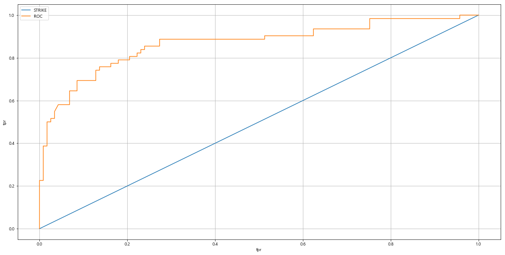

# 머신러닝_05

```python
y_test = [1, 0, 0, 1, 1, 1, 0, 1, 1, 1]
y_pred = [0, 1, 1, 1, 1, 0, 1, 0, 1, 0]


tp = tn = fp = fn = 0

for i in range(len(y_test)):
    # TP
    if y_test[i] == 1 and y_pred[i] == 1:
        tp += 1
    #TN
    if y_test[i] == 0 and y_pred[i] == 0:
        tn += 1
    #FP
    if y_test[i] == 0 and y_pred[i] == 1:
        fp += 1
    #FN
    if y_test[i] == 1 and y_pred[i] == 0:
        fn += 1
```

```python
# Accuracy
       TP + TN
    ------------
    TP + TN + FP + FN
    
# Recall
    TP
    ---
    TP + FN
# Precision
    TP
    --
    TP + FP
# F1-score
    Precision + Recall
2 * ----------------
    Precision + Recall
```

### fallout (위 양성율)

- 실제 양성클래스에 속하지 않는 표본중에 양성 클래스에 속한다고 예측한 표본의 비율
- 낮아야 좋은 모형으로 본다.
- 거래 - 실제 정상거래인데 사기 거래 예측한 거래의 비율 (FPR) false positive rate

```python
	 FP
    --
    FP + TN
```

### precision / recall tradeOff

- 분류하려는 업무 특성상 정밀도 도는 재현율이 특별히 강조돼야 할 경우 분류의 결정 **임곗값**을 조정해 정밀도 또는 재현율의 수치를 높일 수 있다.
  - 임곗값을 봐서 trade off를 조정해야 한다.
- 하지만 정밀도 와 재현율은 상호 보완적인 평가 지표이기 때문에 어느 한쪽을 강제로 높이면 다른 하나의 수치는 떨어지기 쉽다.
- 임곗값 디폴트 : 0.5
- 분류 결정 임곗값이 낮아질 수록 positive로 예측할 확률이 높아진다.
  - 재현율 증가
- sklearn Estimator 객체의 predict_proba()메소드는 분류 결정 예측 확률을 반환
- 이를 이용하면 임의의 분류 결정 임곗값을 조정하면서 예측 확률을 변경할 수 있음

#### predict_proba()

- 예측레이블의 확률을 반환

```python
pred_pro_reault = lr_model.predict_proba(X_test)
pred_pro_reault
>
array([[0.9063371 , 0.0936629 ],
       [0.85361343, 0.14638657],
       [0.8770825 , 0.1229175 ],
       [0.07335314, 0.92664686],
       [0.10649675, 0.89350325],
```

- 디폴트 0.5를 기준으로 비율을 반환
  - [0.9063371 , 0.0936629 ] : negitive -> 0,0.5,1을 기준으로 0쪽에 0.9를 가진다는 뜻이니 0에 더 가깝다.
    - 비율이 큰쪽으로 예측한다.
  - [0.85361343, 0.14638657] : negitive
  - [0.8770825 , 0.1229175 ] : negitive
  - [0.07335314, 0.92664686] : positive ->  0,0.5,1을 기준으로 1쪽에 0.9를 가진다는 뜻이니 1에 더 가깝다.
  - [0.10649675, 0.89350325] : positive ->  0,0.5,1을 기준으로 1쪽에 0.9를 가진다는 뜻이니 1에 더 가깝다.

```python
print('shape' , pred_pro_reault.shape)
print('result' , pred_pro_reault)
>
shape (179, 2)
result [[0.9063371  0.0936629 ]
```

```python
y_pred = lr_model.predict(X_test)
print(y_pred)
>
[0 0 0 1 1 0 0 0 0 0 0 1 1 1 0 0 0 0 1 0 0 0 1 0 0 0 0 1 0 1 1 0 1 0 1 0 1
 0 0 0 0 0 0 0 0 0 0 0 1 0 0 0 0 0 0 1 0 1 1 0 0 1 1 1 0 0 0 0 0 1 0 0 0 0
 1 0 0 0 1 0 0 0 0 1 1 0 1 1 0 1 0 0 1 0 1 1 1 0 1 0 0 0 0 0 1 1 0 1 1 1 1
 0 1 0 0 0 0 1 1 0 1 0 1 1 0 1 1 0 0 0 1 0 0 1 1 1 0 1 1 0 1 0 1 0 0 0 0 0
 0 0 0 0 1 0 0 1 0 0 0 0 0 1 0 0 0 0 0 0 1 0 1 1 0 1 0 0 0 0 1]
```

- 저 비율 기준은 이걸로 결정된 것이다.

```
[0.9063371  0.0936629 ] 0
[0.85361343 0.14638657] 0
[0.8770825  0.1229175 ] 0
[0.07335314 0.92664686] 1
```

- 예측한 걸 보면 똑같다.

```python
result = np.concatenate([pred_pro_reault, y_pred.reshape(-1,1)], axis=1)
print('확률에 따른 예측 결과 \n',result[:5])
>
확률에 따른 예측 결과 
 [[0.9063371  0.0936629  0.        ]
 [0.85361343 0.14638657 0.        ]
 [0.8770825  0.1229175  0.        ]
 [0.07335314 0.92664686 1.        ]
 [0.10649675 0.89350325 1.        ]]
```

- 어느쪽으로 예측 되었는지 알 수 있다.

#### Binarizer 클래스 fit_transform()

- 임계값을 조절해주는 객체

```python
pred_pro_reault[:,1].reshape(-1,1)
>
array([[0.0936629 ],
       [0.14638657],
       [0.1229175 ],
       [0.92664686],
       [0.89350325],
```

- positive의 확률을 조절하기 위해서 positive 값들만 가져온다.
  - positive의 확률이다.

```python
from sklearn.preprocessing import Binarizer
user_threshold = 0.4
positive_pred_proba = pred_pro_reault[:,1].reshape(-1,1)
user_predict = Binarizer(threshold= user_threshold).fit(positive_pred_proba).transform(positive_pred_proba)
```

- threshold = user_threshold을 조절해가며 확인해보자.
- 임계값을 줘서 positive를 예측해보았다.

```python
display_eval(y_test,user_predict)
>
[[101  16]
 [ 15  47]]
**************************************************

정확도 : 0.8268156424581006, 정밀도 : 0.746031746031746, 재현율 : 0.7580645161290323
```

**user_threshold = 0.4**

```python
display_eval(y_test,user_predict)
>
[95 22]
 [13 49]]
**************************************************

정확도 : 0.8044692737430168, 정밀도 : 0.6901408450704225, 재현율 : 0.7903225806451613
```

- threshold 를 낮추면 재현율은 올라가고, 정밀도는 떨어진다.

#### precision_recall_curve(정답, 예측확률)

- 정밀도와 재현율의 값을 리턴

```python
from sklearn.metrics import precision_recall_curve

#레이블 값이 1일 때의 예측확률을 추출
pred_positive_label = lr_model.predict_proba(X_test)[:,1]
precisions, recalls ,threshold= precision_recall_curve(y_test, pred_positive_label)
print('precisions : ', precisions)
print('recalls : ', recalls)
>
precisions :  [0.35632184 0.35260116 0.35465116 0.35672515 0.35882353 0.36094675
recalls :  [1.         0.98387097 0.98387097 0.98387097 0.98387097 0.98387097
```

- threshold을 바꿔가며 작업했었는데 내부적으로 알아서 임곗값을 변화시켜주고 그거에 따른 정밀도와 재현율을 반환한다.

```python
print(threshold.shape)
>
(162,)
```

- 162번 나누어서 그 때마다의 확률을 반환해준다.

#### 시각화 (정밀도, 재현율이 임계값 변화에 따른 시각화)

```python
plt.figure(figsize = (20,10))

plt.plot(threshold,precisions[0:threshold.shape[0]],linestyle='--', label='precision')
plt.plot(threshold,recalls[0:threshold.shape[0]],label='recall')

plt.xlabel('threshold ratio')
plt.ylabel('precision and recall value')
plt.legend(loc='best')
plt.grid()
plt.show()
```


- 그래서 그래프를 그려보면 임계치마다 확률들이 있는데 여기서 최적의 임곗값을 찾을 수 있다.

####  ROC곡선과 AUC

- ROC곡선과 이에 기반한 AUC 스코어는 이진 분류의 예측 성능 측정에서 중요하게 사용되는 지표입니다. 일반적으로 의학 분야에서 많이 사용되지만, 머신러닝의 이진 분류 모델의 예측 성능을 판단하는 중요한 평가지표
- 곡선이 위로 올라갈수록 positive에 가까워진다.

- ROC 곡선은 FPR이 변할 때 TPR이 어떻게 변하는 지 나타내는 곡선
- FPR을 X축으로, TPR을 Y축으로 잡으면 FPR의 변화에 따른 TPR의 변화가 곡선 형태로 나타난다.
- 분류의 성능 지표로 사용되는 것은 ROC 곡선 면적에 기반한 AUC값으로 결정한다.
- AUC값은 ROC 곡선 밑의 면적을 구한 값으로 일반적으로 1에 가까울수록 좋다.

- 재현율과 위양성율은 양의 상관관계
  - 재현율이 높아지면 위 양성율도 높아짐
  - 임계값을 낮추면 positive로 보는 확률을 높이는 것
    - negitive인데 positive로 판단 할 수 있음

- FPR 
  - 0에서 부터 변화가 이루어지는데 TPR에 대한 변화
  - 임계값 낮출수록 FPR은 증가함
    - positive로 보는 확률이 높아지니깐.
- ROC
  - roc_curve()
- AOC
  - roc_auc_score()

#### 타이타닉을 이용한 생존자 예측 FPR, TPR, 임계값

- roc_curve(실제값,예측확률 값) : FPR, TPR, 임계값

```python
from sklearn.metrics import roc_curve
pred_positive_label = lr_model.predict_proba(X_test)[:,1]
fprs, tprs, thresholds = roc_curve(y_test, pred_positive_label)
print(fprs.shape[0])
print(tprs.shape[0])
print(thresholds.shape[0])
>
56
56
56
```

```python
print('샘플추출')
print()
thr_idx = np.arange(1,thresholds.shape[0],6)
print(thr_idx)
>
샘플추출

[ 1  7 13 19 25 31 37 43 49 55]
```

- 인덱스에 해당하는 곳에 임계치 비율이 들어있을 거임

```python
print('샘플추출')
print()
thr_idx = np.arange(1,thresholds.shape[0],6)
print('thr_idx',thr_idx)
print('thr threshold value : ',thresholds[thr_idx])
>
샘플추출

thr_idx [ 1  7 13 19 25 31 37 43 49 55]
thr threshold value :  [0.97700543 0.72698861 0.65646883 0.51186991 0.33029724 0.29699824
 0.18758847 0.1250837  0.1100613  0.02695786]
```

```python
print('샘플추출')
print()
thr_idx = np.arange(1,thresholds.shape[0],6)
print('thr_idx',thr_idx)
print('thr threshold value : ',thresholds[thr_idx])
print()
print('thr fprs value : ',fprs[thr_idx])
print()
print('thr tprs value : ',tprs[thr_idx])
>
샘플추출

thr_idx [ 1  7 13 19 25 31 37 43 49 55]
thr threshold value :  [0.97700543 0.72698861 0.65646883 0.51186991 0.33029724 0.29699824
 0.18758847 0.1250837  0.1100613  0.02695786]

thr fprs value :  [0.         0.02564103 0.06837607 0.13675214 0.20512821 0.23931624
 0.37606838 0.62393162 0.72649573 1.        ]

thr tprs value :  [0.01612903 0.5        0.64516129 0.75806452 0.80645161 0.85483871
 0.88709677 0.93548387 0.93548387 1.        ]
```

- 임곗값이 작아지고 있다. 0에 가까워진다.
- fprs 증가
- tprs 증가
  - 곡선을 그리며 증가함

```python
pred_positive_label = lr_model.predict_proba(X_test)[:,1]
fprs, tprs, thresholds = roc_curve(y_test, pred_positive_label)

plt.figure(figsize = (20,10))
# 대각선
plt.plot([0,1], [0,1],label='STRIKE')
# ROC
plt.plot(fprs, tprs, label='ROC')

plt.xlabel('fpr')
plt.ylabel('tpr')
plt.legend(loc='best')
plt.grid()
plt.show()
```



- ROC곡선과 FPR을 알 수 있다.

```python
from sklearn.metrics import roc_auc_score
lr_model = LogisticRegression()
lr_model.fit(x_train, y_train)
prediction = lr_model.predict(X_test)
print('roc auc value {}'.format(roc_auc_score(y_test,prediction )))
>
roc auc value 0.8106561896884479
```

- 타이타닉의 값을 구해보았다.
- 위의 그림 밑에 면적이 높을수록 좋다. 지금은 81정도이다.