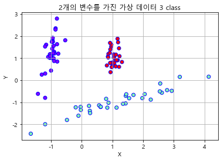

### 분류

- 대표적인 분류 알고리즘
  - 나이브 베이즈
    - 베이즈 통계와 생성 모델에기반
  - 로지스틱 회귀
    - 독리변수와 종속변수의 선형 관계에 기반
  - 결정트리
    - 데이터 균일도에 따른 규칙 기반
  - 서포트 벡터 머신
    - 개별 클래스 간의 최대 분류 마진을 효과적으로 찾아줌
  - 최소 근접 알고리즘
    - 근접 거리를 기준
  - 심층 연결 기반의 신경망
  - 앙상블
    - 서로 다른(또는 같은) 머신러닝 알고리즘을 결합

#### 결정 트리

- 매우 쉽고 유연하게 적용될 수 있는 알고리즘
- 데이터의 스케일링이나 정규화 등의 사전 가공의 영향이 매우 적음
- 데이터에 있는 규칙을 학습해 자동으로  트리 기반의 규측을 만듦( IF- Else기반 규칙)
  - 어떤 규칙을 만드는지에 따라 알고리즘 성능을 가름
- 예측 성능을 향상시키기 위해 복잡한 규칙 구조를 가져야 하며, 이로 인한 과적합이 발생해 반대로 예측 성능 저하 가능성이 있다는 단점
  - 검증 단계에서 예측성 저하

##### 결정트리의 구조

- 루프노드 : 시작점
- 리프노드 : 결정된 클래스 값
- 규칙 노드(내부노드) : 데이터 세트의 피처가 결합해 만들어진 분류를 위한 규칙 조건

##### 정보 균일도 측정 방법

- 정보 이득
  - 엔트로피 개념 기반
    - 엔트로피가 높음
      - 서로 다른 값이 섞여있음
      - 규칙을 많이 만들어야 한다.
    -  엔트로피 낮음
      - 같은 값이 섞여 있음
    - 1 - 엔프로피 지수
- 지니 계수
  - 지니계수가 0이 가장 평등
    - if 0 이면 더 이상 규칙 생성 안해도 됨 : 규칙 노드가 됨
  - 1에 가까우면 불평등
    - 혼잡도가 높은 것
    - 규칙을 만들어야 한다.
- 조건을 찾아 계속 루핑

##### 결정 트리 주요 하이퍼 파라미터

- max_depth
  - 트리의 최대 깊이 규정
  - 디폴트 None
- max_features
  - 최적의 분할을 위해 고려할 최대 피처 개수
  - 디폴트는 None으로 데이터 세으틔 모든 피처를 사용해 분할 수행

- min_sample_split
  - 노드를 분할하기 위한 최소한의 샘플 데이터 수로 과적합을 제어
  - 디폴트 2
-  min_sample_leaf
  - 말단 노드가 되기 위한 최소한의 샘플 데이터 수
- max_leaf_nodes
  - 말단 노드의 최대 개수

##### 결정 트리의  feature 선택 중요도

- sklearn의 DecisionClassifier 객체는 feature_importances_ 을 통해 학습/예측을 위해서 중요한 feature 들을 선택 할 수 있게 정보 제공

#### 앙상블

- 위의 단점이 앙상블레서는 장점
- 집단 지성의 결론을 도출
- 매우 많은 여러 개의 약한 학습기(예측 성능이 상대적으로 떨어지는 학습 알고리즘)를 결합해 확률적으로 보완과 오류가 발생한 부분에 대한 가중치를 계속 업데이트하여 예측 성능 향상
- 결정 트리가 좋은 약한 학습기가 됨
  -  GDM, XGBoost, LightGBM

### iris data를 이용한 의사결졍 트리 피터 중요도

#### 분류기 생성

```python
dtc_iris = DecisionTreeClassifier(random_state=100)
```

####  데이터 로드 및 전처리

```python
iris_data = load_iris()

X_train, X_test,y_train, y_test = train_test_split(iris_data.data, iris_data.target, test_size=0.2, random_state=100)
```

#### 학습

```python
dtc_iris.fit(X_train, y_train)
```

#### 트리  이미지

```python
from sklearn.tree import export_graphviz

export_graphviz(dtc_iris, out_file="./data/tree.dot", class_names = iris_data.target_names, 
                           feature_names = iris_data.feature_names, impurity=True, filled=True)
```

```python
import os
os.environ['PATH']+=os.pathsep+'C:/Program Files (x86)/Graphviz2.38/bin'
```

```python
import graphviz

with open('./data/tree.dot') as f:
    dot_graph = f.read()
    
graphviz.Source(dot_graph)
```


1. 의사결정 기준을 petal lenght 로 잡음. 이것이 가장 중요하다는 의미
2. 지니계수보면 불평등
   1. 그래서 다시 나눈다.

##### 피처 중요도 확인

```python
print(' feature importance : ', dtc_iris.feature_importances_)
>
feature importance :  [0.         0.01880092 0.58591345 0.39528563]
```

- 이렇게 되면 어떤 컬럼인지 알 수가 없다.

```python
sns.barplot(x=dtc_iris.feature_importances_,y=iris_data.feature_names)
plt.show()
```


- 이렇게 시각화를 통해 어떠한 피처가 중요한 지 알았다.

```python
for name,value in zip(dtc_iris.feature_importances_, iris_data.feature_names):
    print(name, value)
>
0.0 sepal length (cm)
0.01880091915604763 sepal width (cm)
0.5859134473686348 petal length (cm)
0.39528563347531753 petal width (cm)
```

- 이렇게 루프 돌려서 확인 가능

#### 의사 결정 트리의 단점

- 과적합 
  - 학습 데이터에서 완벽한 성능을 보이지만 테스트 데이터에서 성능이 좋지 않은 경우
  -  모의고사에 빗어대 말하면  문제의 유형을 모의고사에 최적화 되게 만들어 버린다. 그러나 수능에서 문제 유형이 달라지면? 
    - 실력발휘 못함
- 과적합을 위해서 분류용 가상의 데이터를 생성 make_classification()

```python
X,y = make_classification(n_features=1,
                         n_informative=(독립변수간의 관계),
                          n_redundant=0,
                         n_clusters_per_class=1(결정값당 클래스 개수를 1개씩 가져간다.),
                         random_state=100)
plt.scatter(X,y, marker='o',c=y,edgecolor='k',linewidth=2)
plt.xlabel('X')
plt.ylabel('Y')
plt.grid()
plt.show()
```


- 0과 1을 가진 데이터를 분리

```python
from sklearn.datasets import make_classification
plt.title('2개의 변수를 가진 가상 데이터 3 class')

X_features,y_labels = make_classification(n_features=2,
                         n_informative=2,
                         n_redundant=0,
                         n_clusters_per_class=1,
                         n_classes=3,
                         random_state=100)
print(len(X_features))
print(len(y_labels))
plt.scatter(X_features[ : , 0], X_features[ : , 1 ], marker='o',c=y_labels,edgecolor='b',cmap='rainbow')
plt.xlabel('X')
plt.ylabel('Y')
plt.grid()
plt.show()
```



- 2 개의 feature로 된 3개의 결정 클래스를 가지도록 make_classification()함수를 지용하여 임의 데이터를 생성한 후 트리 생성 제약이 없는 경우와 min_sample_leaf=n으로 제약을 주었을때 변화는?
  - 트리 생성 제약 없는 경우
    - 중간에 다른 값이 있으면 그거 분류하기 위해 다시 분류기준 생성됨
  - min_sample_leaf=n 주면?
    - 다른 값 있어도 분류를 분류기준 다시 생성 안하고 분류  n개까지 하고 끝내버린다.
    - 그래서 과적합을 줄일 수 있다

##### 튜닝을 통한 과적합 해결

```python
sample_dtc_model = DecisionTreeClassifier().fit(X_features, y_labels)
visualize_boundary(sample_dtc_model, X_features, y_labels)
```

- 새로운 구분 기준이 중간에 생긴다


```python
sample_dtc_model = DecisionTreeClassifier(min_samples_leaf=6).fit(X_features, y_labels)
visualize_boundary(sample_dtc_model, X_features, y_labels)
```

- max_depth 줄여서 트리의 깊이를 제한
- min_samples_split 높여서 데이터가 분할하는데 필요한 샘플 데이터의 수를 높이기
- min_samples_leat  높여서 말단 노드가 되는데 필요한 샘플 데이터의 수를 높이기
- max_features 높여서 분할은 하는데 고려하는 피처의 수 제한

- 우선 leaf의 개수에 제한을 주었다.


- 새롭게 중간에 추가된 규칙 조건이 사라졌다.

### UCI HAR 결정트리 [실습]

```python
# 데이터셋을 구성하는 함수 설정
def har_dataset():
    
    # 각 데이터 파일들은 공백으로 분리되어 있으므로 read_csv에서 공백문자를 sep으로 할당
    feature_name_df = pd.read_csv('./data/features.txt', sep='\s+',
                                                     header=None, names=['column_index', 'column_name'])
    # 데이터프레임에 피처명을 컬럼으로 뷰여하기 위해 리스트 객체로 다시 반환
    feature_name = feature_name_df.iloc[:, 1].values.tolist()
    
    # 학습 피처 데이터세트와 테스트 피처 데이터를 데이터프레임으로 로딩
    # 컬럼명은 feature_name 적용
    X_train = pd.read_csv('./data/Train/X_train.txt', sep='\s+', names=feature_name)
    X_test = pd.read_csv('./data/Test/X_test.txt', sep='\s+', names=feature_name)
    
    # 학습 레이블과 테스트 레이블 데이터를 데이터 프레임으로 로딩, 컬럼명은 action으로 부여
    y_train = pd.read_csv('./data/Train/y_train.txt', sep='\s+', names=['action'])
    y_test = pd.read_csv('./data/Test/y_test.txt', sep='\s+', names=['action'])
    
    # 로드된 학습/테스트용 데이터프레임을 모두 반환
    return X_train, X_test, y_train, y_test
```

```python
X_train, X_test, y_train, y_test = har_dataset()
```

##### 그럼 우리는 여기서 무엇을 알아야 할까?

```python
y_train['action'].value_counts()
>
5     1423
6     1413
4     1293
1     1226
2     1073
3      987
11      90
9       75
10      60
12      57
7       47
8       23
```

