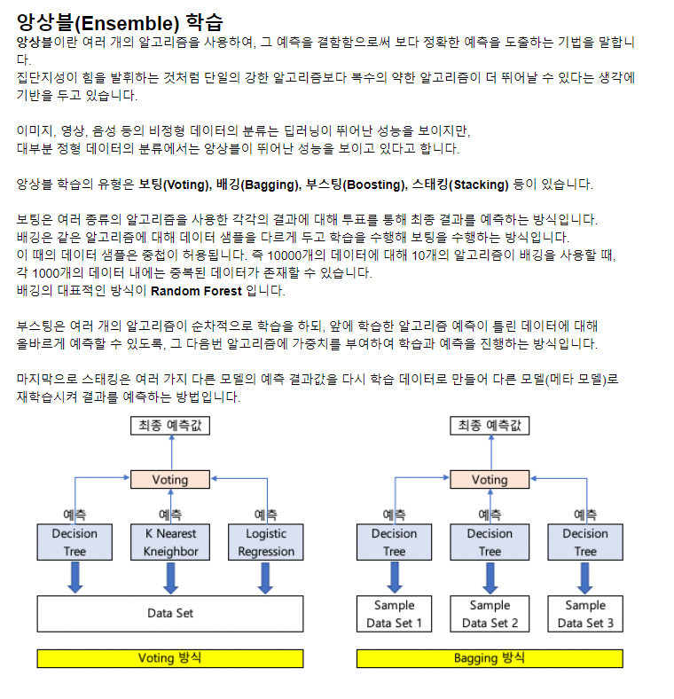
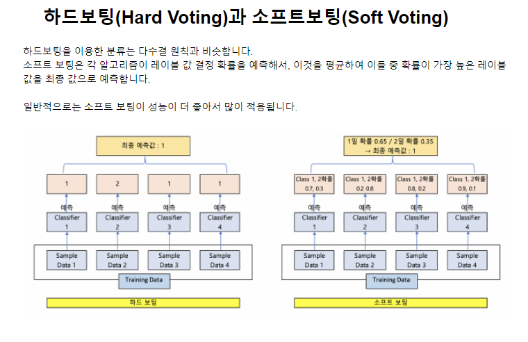
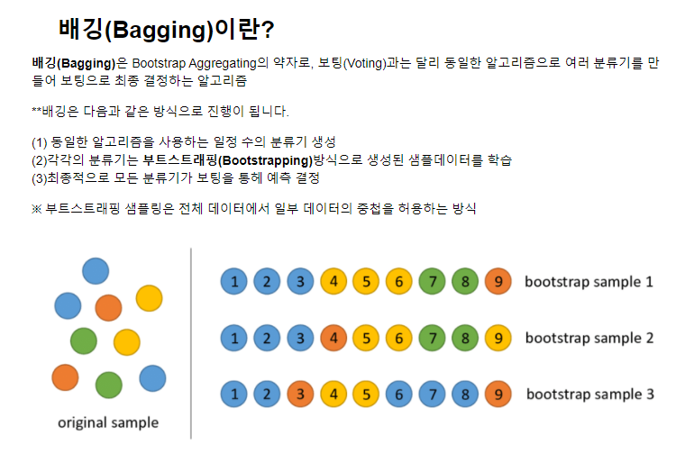
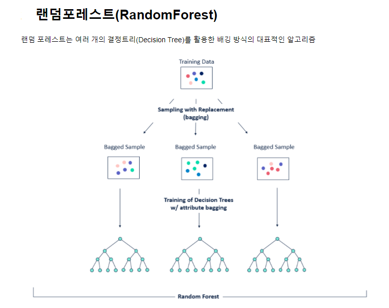
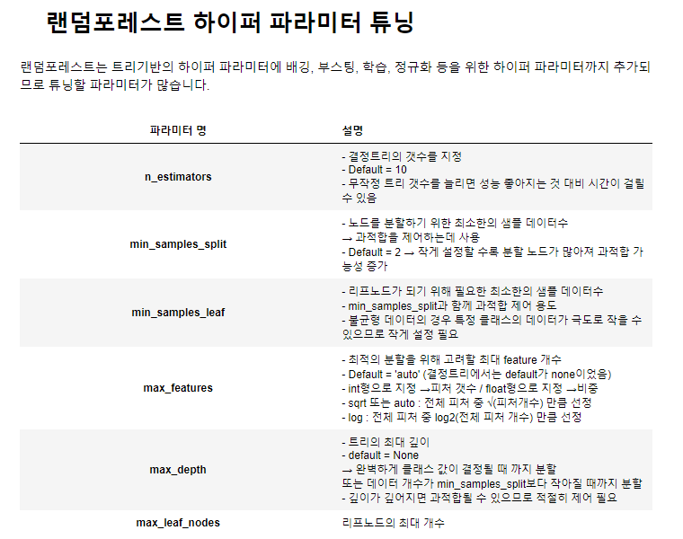
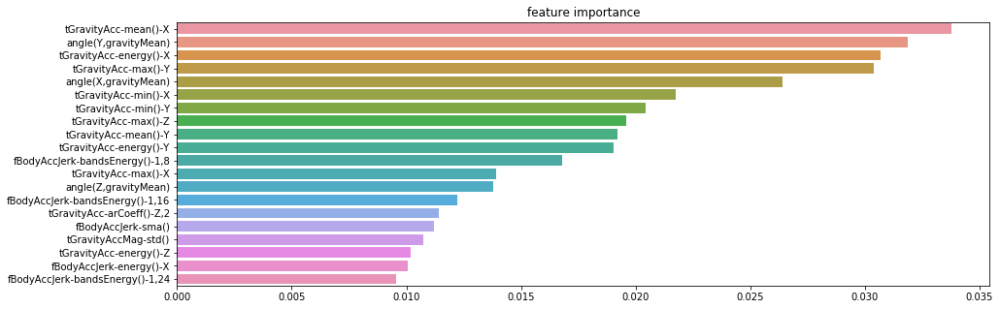
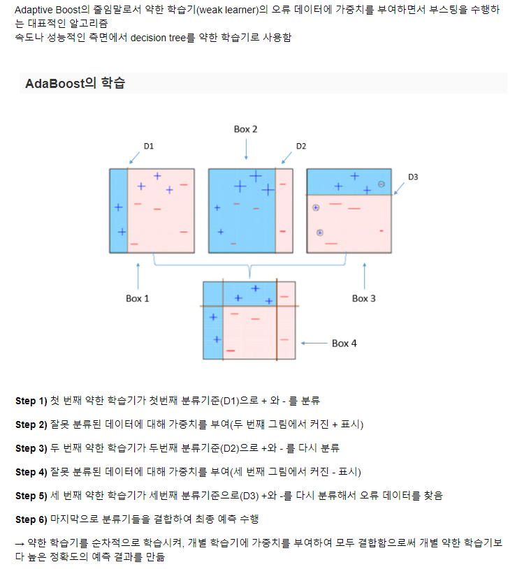
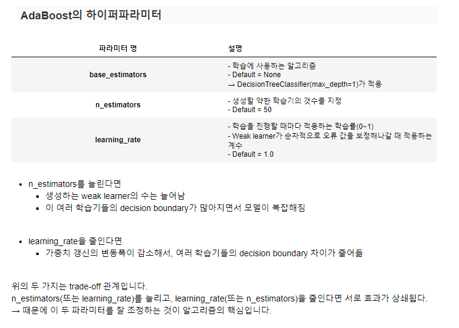
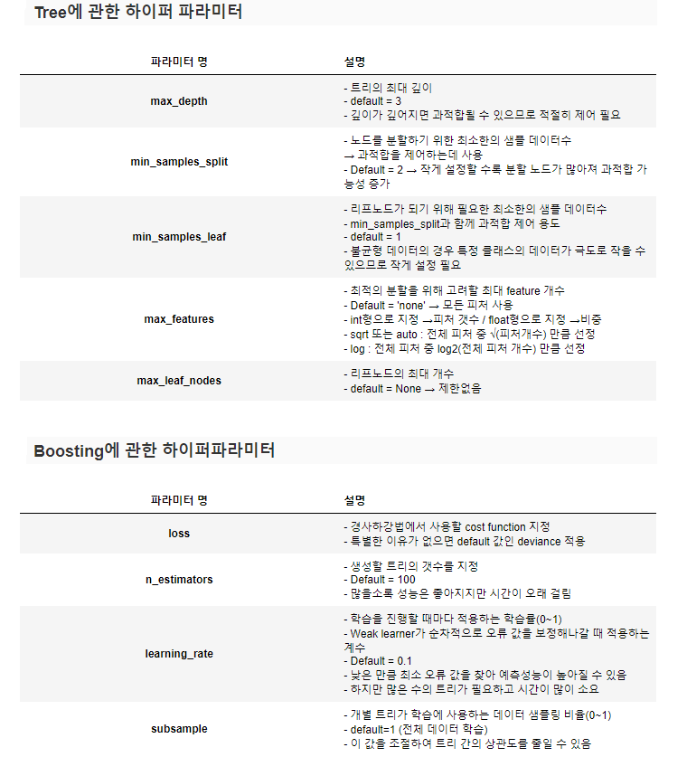

# 머신러닝_07

### 앙상블





- 하나의 분류기보다 집단지성처럼 여러개의 분류기를 활용

#### 부스팅

- GPU  병렬 처리 가능
  - 하이퍼 파라미터 튜닝 가능
- early stoping 가능
  - 어느 정도 학습하다가 성능이 안 좋아지면 학습 멈춤

- 가지 치기 가능
  - 의사 결정을 가지 쳐서 성능을 높일 수 있음

#### 특징

- 단일 모델의 약점을 다수의 모델들을 결합하여 보완
- 랜덤 포레스트 및 뛰어난 부스팅 알고리즘들은 모두 결정 트리 알고리즘을 기반 알고리즘으로 적용함
- 결정트리의 단점인 과적합(오버 피팅)을 수십~ 수천개의 많은 분류기를 결합해 보완하고 장점인 직관적인 분류 기준은 강화됨

### 랜덤포레스트







- 배깅의 대표적인 알고리즘
- 여러개의 결정트리 활용

##### 배깅이란?

- bootstrap Aggregating의 약자
- 동일한 알고리즘으로 여러 분류기를 만들어 보팅으로 최종 결정하는 알고리즘

**진행 방식**

1. 동일한 알고리즘을 사용하는 일정 수의 분류기 생성
2. 각각의 분류기는 **부트스트래핑**방식으로 생성된 샘플데이터를 학습
   1. **부트스트래핑** : 전제 데이테에서 일부 데이터의 중첩을 허용하는 방식 : 복원추출
3. 최종적으로 모든 분류기가 보팅을 통해 예측 결정

##### 장점

- 앙상블방식의 알고리즘 중 수행속도가 빠르다.
- 다양한 데이터 세트에서 좋은 성능

##### 단점

- 튜닝을 위한 시간이 많이 든다.

### HAR 데이터를 이용해서 RandomForest 배깅을 이용한 분류예측

```python
X_train, X_test, y_train, y_test  
```

- 학습 데이터와 test 데이터는 불러왔음

```python
rf_model = RandomForestClassifier(random_state=0)
rf_model.fit(X_train, y_train)
y_pred = rf_model.predict(X_test)
```

- 학습, 예측을 하였음

```python
print('answer',y_test)
print('guess', y_pred)
accuracy = accuracy_score(y_test, y_pred)
print('랜덤포레스트 정확도 : ', accuracy)
>
answer       action
0          5
1          5
[2947 rows x 1 columns]
guess [5 5 5 ... 2 2 2]
랜덤포레스트 정확도 :  0.9253478113335596
```

- 하이퍼 파라미터 튜닝이 필요하다.
- n-estimator : 결정 트리의 개수
- min_samples_split 
- min_samples_leaf
- max_feature
- max_depth
- max_leaf_nodes

#### GridSearchCV 교차검증 및 하이퍼 파라미터 튜닝

- 튜닝을 파라미터 필요

```python
params = {
    'n_estimators' : [100],
    'max_depth'    : [6,8,10,12],
    'min_samples_leaf' : [8,12,18],
    'min_samples_split' : [8,16,20],    
}
cv_rf_model = RandomForestClassifier(random_state=0, n_jobs=-1)
grid_cv = GridSearchCV(cv_rf_model, param_grid=params, cv=5, n_jobs=-1)
grid_cv.fit(X_train, y_train)
```

-  n_jobs= : GPU사용하지 않고 있으면 전체를 CPU로 쓰겠다.

- 하이퍼 파라미터를 통해서 besr_score와 params등을 찾아서 다시 예측 할 수 있다.

```python
print('최적의 파라미터 : ',grid_cv.best_params_)
print('예측 정확도 : ',grid_cv.best_score_)
```

- 위에서 나온 하이퍼 파라미터를 이용하여 랜텀 포레스트를 다시 학습시켜보자

```python
hyper_cv_rf_model =     RandomForestClassifier(n_estimators= 100, max_depth =12, min_samples_leaf=12, min_samples_split=8)
hyper_cv_rf_model.fit(X_train, y_train)
hyper_grid_cv_pred = hyper_cv_rf_model.predict(X_test)
```

```python
print('튜닝을 통한 예측 정확도 : ', accuracy_score(y_test, hyper_grid_cv_pred))
>
튜닝을 통한 예측 정확도 :  0.9304377332880895
```

- 정확도가 높아졌다.

##### 각 피처의 중요도를 시각화

```python
feature_importance = pd.Series(hyper_cv_rf_model.feature_importances_,index=X_train.columns)
feature_top20 = feature_importance.sort_values(ascending=False)[:20]
plt.figure(figsize=(15,5))
plt.title('feature importance')
sns.barplot(x=feature_top20, y=feature_top20.index)
plt.show()
```



#### 부스팅 알고리즘

- 여러개의 약한 학습기를 순자적으로 학습, 예측 하면서 잘못 예측한 데이터에 가중치를 부여해 오류를 개선해 나가면서 학습하는 방식
- 대표적은 구현
- 에이다부스트
- 그래디언트 부스트
  - 업데이트를 경사 하강법을 이용하는 것이 에이다부스트와 큰 차이
  - 오류 값은 `실제 값 - 예측값`

#### AdsBoost





- 약한 학습기를 순차적으로 학습시켜, 개별 학습기에 가중치를 부여하여 결합한 모델을 생성

```python
X_train, X_test, y_train, y_test = human_activ()
```

- 학습, test 데이터를 가져온다.

```python
from sklearn.ensemble import AdaBoostClassifier
```

- 학습기를 import한다.

```python
ada_model = AdaBoostClassifier(random_state=0,
                              n_estimators=70,
                              learning_rate=0.5)
ada_model.fit(X_train, y_train)
ada_model_pred = ada_model.predict(X_test)
print('예측 정확도 : ', accuracy_score(y_test,ada_model_pred))
>
예측 정확도 :  0.7638276213098066
```

- 학습해서 정확도를 출력해본다.

- 76%밖에 안나온다.

```python
ada_model = AdaBoostClassifier(random_state=0,
                              n_estimators=60,
                              learning_rate=0.40)
ada_model.fit(X_train, y_train)
ada_model_pred = ada_model.predict(X_test)
print('예측 정확도 : ', accuracy_score(y_test,ada_model_pred))
>
예측 정확도 :  0.8187987784187309
```

- 정확도가 높아졌다.

- ada는 객체자체라 gridSearcgCV처럼 리스트에 여러 값을 줘서 튜닝하지 못한다.

```python
ada_model.get_params()
>
{'algorithm': 'SAMME.R',
 'base_estimator': None,
 'learning_rate': 1.0,
 'n_estimators': 50,
 'random_state': None}
```

- 그래서 하나씩 넣어봐야 한다.

#### GBM

- 주요 하이퍼 파라미터
  - loss : 경사 하강법에서 사용할 비용 함수를 지정
- learning_rate 

```python
from sklearn.ensemble import GradientBoostingClassifier
```

- GBM을 import한다.

```python
import time
start_time = time.time()
gbm_model = GradientBoostingClassifier(random_state=0)
gbm_model.fit(X_train, y_train)
gbm_model_pred = gbm_model.predict(X_test)
print('수행시간 : ',time.time()- start_time)
>
수행시간 :  1052.8894832134247
```

```python
print('정확도 : ', accuracy_score(y_test,gbm_model_pred))
>
정확도 :  0.9389209365456397
```

- 수행시간이 오래 걸리지만  정확도는 ada보다 높았다.

#### 하이퍼 파라미터 튜닝



```python
from sklearn.model_selection import GridSearchCV
start_time = time.time()
gbm_model = GradientBoostingClassifier(random_state=0)
params={
    'n_estimators'    : [100],
    'learning_rate' : [0.1],
}

gdv_gscv_model = GridSearchCV(gbm_model, param_grid=params, cv=2)

gdv_gscv_model.fit(X_train, y_train)
print('최적의 파라미터 : ',gdv_gscv_model.best_params_)
print('예측 정확도 : ',gdv_gscv_model.best_score_)
print('수행시간 : ',time.time()- start_time)
```

##### 혼동행렬, 정확도, 정밀도, 재현율, F1, AUC

```python
def classifier_eval(y_test,y_pred):
    print('오차행렬 : ',confusion_matrix(y_test, y_pred))
    print('정확도 : ' , accuracy_score(y_test, y_pred))
    print('정밀도 : ', precision_score(y_test, y_pred))
    print('재현율 : ', recall_score(y_test, y_pred))
    print('F1 : ', f1_score(y_test, y_pred))
    print('AUC : ', roc_auc_score(y_test, y_pred))
```

```python
gscv_pred = gdv_gscv_model.best_estimator_.predict(X_test)
classifier_eval(y_test, gscv_pred)
```

- 하이퍼 파라미터를 하고 각각의 평가지표를 확인한다.
  - 그리드서치는 `best_estimator_ ` 이걸로 예측해야 한다.

##### feature importanes 시각화

```python
feature_important = pd.Series(data=gdv_gscv_model.feature_importances_, index=X_train.columns)
feature_important_20 = feature_important.sore_vlaues(ascending=False)[:20]
plt.figure(figsize=(15,20))
plt.title('Feature Importances Top 20')
sns.barplot(x=feature_important_20, y=feature_important_20.index)
plt.show()
```

