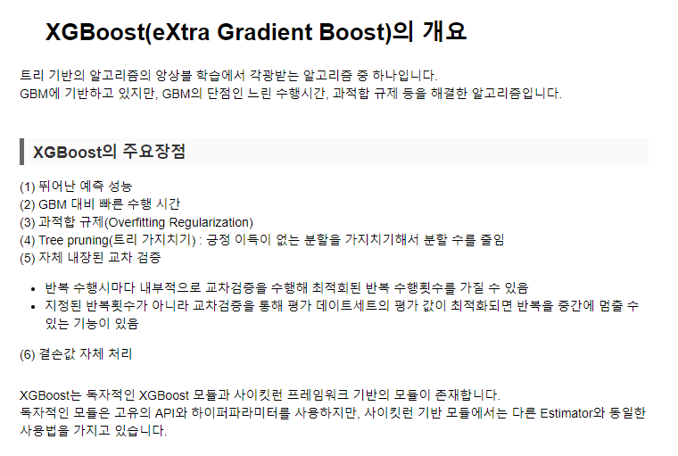
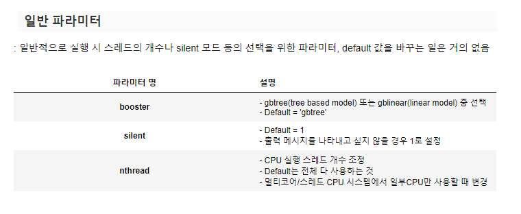
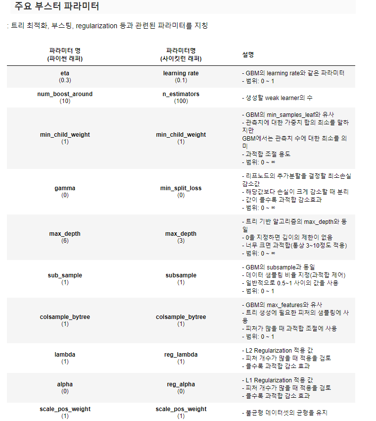
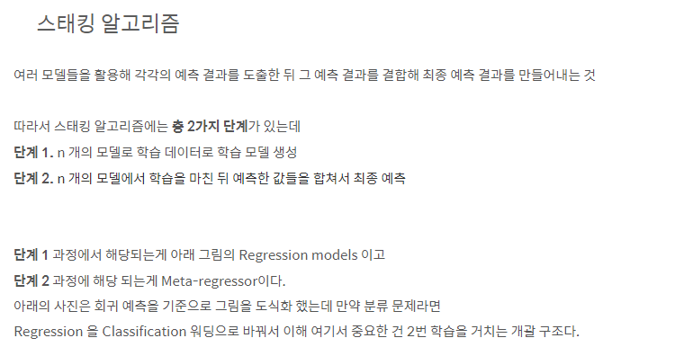
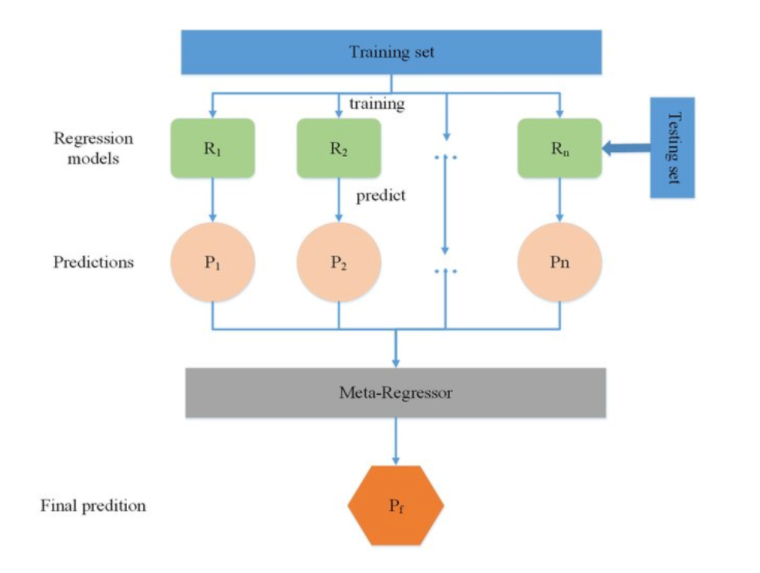
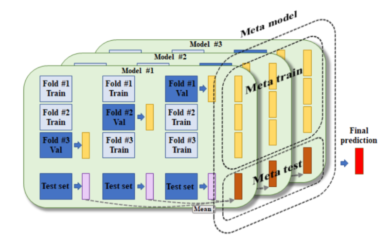

# 머신러닝_08

### XGBoost (eXtra Gradient Boost)








- 뛰어난 예측 성능
- GBM 대비 빠른 수행 시간
  - CPU 병렬 처리, GPU 지원
- 다양한 성능 향상 기능
  - 규제 기능 탑재
  - Tree Pruning
- 다양한 편의 기능
  - 조기 중단
  - 자체 내장된 교차 검증
  - 결손값 자체 처리

#### 파이썬 구현

- 파이썬 Wrapper와  사이킷런 Wrapper가 있다.
- 사이킷런 Wrapper
  - 학습과 예측을 다른 사이킷런 언어와 동일하게 fit()과 predict로 수행

| 항목                          | 파이썬 Wrapper                                               | 사이킷런 Wrapper                             |
| ----------------------------- | ------------------------------------------------------------ | -------------------------------------------- |
| 사용 모듈                     | from xgboost as xgb                                          | from xgboost import XGBoostClassifier        |
| 학습용과 테스트용 데이터 세트 | DMatrix 객체를 별도 생성<br/>train = xgb.DMatrix(data=X_train, label=y_train) | 넘파이와 판다스를 이용                       |
| 학습 API                      | Xgb_model = xgb.train()<br/>Xgb_model은 학습된 객체를 반환 받음 | XGBClassifier.fit()                          |
| 예측 API                      | xgb.train()으로 학습된 객체에서 predict() 호출, 즉 Xgb_model.predict()<br/>이때 반환 결과는 예측 결과가 아니라 예측 결과를 추정하는 확률값 반환 | XGBClassifier.predict()<br/>예측 결과값 반환 |
| 피처 중요도 시각화            | plot_importance() 함수이용                                   | plot_importance() 함수이용                   |

- XGBoost 파이썬 래퍼와 사이킷런 래퍼 하이퍼 파라미터 비교

#### XGBoost 조기 중단 가능(Early Stooping)

- 특정 반복 횟수 만큼 더 이상 비용함수가 감소하지 않으면 지정된 반복횟수를 다 완료하지 않고 수행을 종료할 수 있음
- 학습을 위한 시간을 단축 시킬 수 있음. 특히 최적화 튜닝 단계에서 적절하게 사용 가능
- 너무 반복 횟수를 단축할 경우 예측 성능 최적화가 안된 상태에서 학습이 종료 될 수 있으므로 유의  필요
- 조기 중단 설정을 위한 주요 파라미터
  - early_stopping_rounds : 더 이상 비용 평가 지표가 감소하지 않는 최대 반복횟수
  - eval_metric : 반복 수행 시 사용하는 비용 평가 지표
  - eval_set : 평가를 수행하는 별도의 검증 데이터 세트. 일반적으로 검증 데이터 세트에서 반복적으로 비용 감소 성능 평가

- conda install은 의존 관계에 있는 것 까지 설치해준다.

```python
dataset = load_breast_cancer()
features = dataset.data
label = dataset.target
cancer_df = pd.DataFrame(data=features, columns=dataset.feature_names)
cancer_df['target'] = label
cancer_df['target'].value_counts()
>
1    357
0    212
Name: target, dtype: int64
```

```python
X_train, X_test, y_train, y_test= train_test_split(features, label,test_size=0.2, random_state=100)
```

#### sklearn XGBoost 적용

```python
from xgboost import XGBClassifier
sklearn_xgboost_model =  XGBClassifier()
```

```python
sklearn_xgboost_model =  XGBClassifier(n_estimators=400,
                                      learning_rate=0.1,
                                      max_depth=3)
sklearn_xgboost_model.fit(X_train, y_train)
y_pred =sklearn_xgboost_model.predict(X_test)
```

```python
def classifier_eval(y_test , y_pred) :
    print('오차행렬 : ' , confusion_matrix(y_test, y_pred))
    print('정확도   : ' , accuracy_score(y_test, y_pred))
    print('정밀도   : ' , precision_score(y_test, y_pred))
    print('재현율   : ' , recall_score(y_test, y_pred))
    print('F1       : ' , f1_score(y_test, y_pred))
    print('AUC      : ' , roc_auc_score(y_test, y_pred))
```

```python
classifier_eval(y_test,y_pred )
>
오차행렬 :  [[46  3]
 [ 1 64]]
정확도   :  0.9649122807017544
정밀도   :  0.9552238805970149
재현율   :  0.9846153846153847
F1       :  0.9696969696969696
AUC      :  0.9616954474097332
```

- 수행속도도 빠르고 정확도도 높다.

#### 튜닝해보기

- fit()할 때 튜닝가능

```python
sklearn_xgboost_model =  XGBClassifier(n_estimators=400,
                                      learning_rate=0.1,
                                      max_depth=3)
sklearn_xgboost_model.fit(X_train, y_train,
                         early_stopping_rounds=100,
                         eval_metric='logloss',
                         eval_set = [(X_test, y_test)],
                         verbose= True)
>
[0]	validation_0-logloss:0.614598
Will train until validation_0-logloss hasn't improved in 100 rounds.
[100]	validation_0-logloss:0.094262
[101]	validation_0-logloss:0.093695
    .
[244]	validation_0-logloss:0.092919
[245]	validation_0-logloss:0.092919
Stopping. Best iteration:
[145]	validation_0-logloss:0.092488
```

- early_stoppint_rounds=100 : 최소 100번은 반복하고 그 이후에 감소하면 멈춰라.
- 오류에 대한 평가지표 필요
  - logloss : 오류에 대한 평가성능지표 리턴 함수
- eval_set = [(X_test, y_test)] : 대상이 되는 set
  - 오류를 감소시킬 때  비교대상이 필요하니깐.
  - 원래의 미지의 데이터를 써야함
    - 안 그러면 과적합이 발생

-  verbose= True 하니씩 출력해준다.
- 지속적으로 logloss 감소한다.

- 400번 중에서 145번 가장 best이고 그 이후에는 필요없다.
  - 혹시 모르니 100번 더해보고 필요없으니깐 245번에서 멈췄다.
  - 더 이상 성능평가지표가 향상되지 않으니 멈춰라

```python
y_pred145 = sklearn_xgboost_model.predict(X_test)
classifier_eval(y_test, y_pred145)
>
오차행렬 :  [[47  2]
 [ 1 64]]
정확도   :  0.9736842105263158
정밀도   :  0.9696969696969697
재현율   :  0.9846153846153847
F1       :  0.9770992366412214
AUC      :  0.9718995290423862
```

- 위에서 145번이 최적이니 그걸로 예측해서 정확도를 다시 살펴본다.

#### 피처 중요도 시각화 : F1스코어를 가지고 찾음
```python
from xgboost import plot_importance
plot_importance(sklearn_xgboost_model)
```


- 어떤 feature가 중요한지 알 수 있다.

#### Basic Stacking Model - Diagram







- 앙상블 기반

- 기반 모델들이 예측한 값들을 stacking 형태로 만들어서 메타 모델이 이를 학습하고 예측하는 모델

#### 교차 검증 세트 기반 스태킹 모델 만들기 - KFold 첫 번째

- 원본데이터 - 학습폴드 1,2,3         - 예측 결과값

  ​					- 테스트 세트1,2,3     - 데스트 결과값

예측 결과값 1,2,3끼리 최종 학습데이터 생성

테스트  결과값 1,2,3끼리  최종 테스트 데이터 생성

이 2개로 최종 메타 모델이 학습진행

```python
from sklearn.ensemble import AdaBoostClassifier
```

```python
# 개별 분류기 생성
knn_clf = KNeighborsClassifier(n_neighbors=4)
rf_clf = RandomForestClassifier(n_estimators=100, random_state=100)
dt_clf = DecisionTreeClassifier()
ada_clf = AdaBoostClassifier(n_estimators=100)
```

```python
# 개별 모델에 대한 학습
knn_clf.fit(X_train, y_train)
rf_clf.fit(X_train, y_train)
dt_clf.fit(X_train, y_train)
ada_clf.fit(X_train, y_train)
```

```python
# 개별 모델에 대한 예측을 수행
knn_clf_pred = knn_clf.predict(X_test)
rf_clf_pred = rf_clf.predict(X_test)
dt_clf_pred = dt_clf.predict(X_test)
ada_clf_pred = ada_clf.predict(X_test)
```

```python
classifier_eval(y_test,knn_clf_pred)
classifier_eval(y_test,rf_clf_pred)
classifier_eval(y_test,dt_clf_pred)
classifier_eval(y_test,ada_clf_pred)
>
오차행렬 :  [[48  1]
 [ 5 60]]
정확도   :  0.9473684210526315
정밀도   :  0.9836065573770492
재현율   :  0.9230769230769231
F1       :  0.9523809523809524
AUC      :  0.9513343799058084
오차행렬 :  [[45  4]
 [ 1 64]]
정확도   :  0.956140350877193
정밀도   :  0.9411764705882353
재현율   :  0.9846153846153847
F1       :  0.962406015037594
AUC      :  0.95149136577708
오차행렬 :  [[45  4]
 [ 1 64]]
정확도   :  0.956140350877193
정밀도   :  0.9411764705882353
재현율   :  0.9846153846153847
F1       :  0.962406015037594
AUC      :  0.95149136577708
오차행렬 :  [[46  3]
 [ 1 64]]
정확도   :  0.9649122807017544
정밀도   :  0.9552238805970149
재현율   :  0.9846153846153847
F1       :  0.9696969696969696
AUC      :  0.9616954474097332
```

- 각각의 학습기로 예측 데이터와 학습 데이터들을 만들었다.

```python
# 학습을 마친 모델의 예측 결과를 합쳐서 최종 예측
merge_pred = np.array([knn_clf_pred, rf_clf_pred,dt_clf_pred,ada_clf_pred])
```

- np.array를 이용해서 2차원의 배열을 만들었다.
- 4개의 행과 길이에 해당되는 컬럼값으로 이루어져있다.

```python
merge_pred = np.transpose(merge_pred)
```

- 이렇게 해야 각각의 학습기를 컬럼으로 가지는 배열로 만들어야 학습을 할 수 있다.

```python
# 최종 분류기 선택 MetaModel
lr_clf = LogisticRegression()
lr_clf.fit(merge_pred, y_test)
final_pred = lr_clf.predict(merge_pred)
classifier_eval(y_test, final_pred)
>
오차행렬 :  [[48  1]
 [ 0 65]]
정확도   :  0.9912280701754386
정밀도   :  0.9848484848484849
재현율   :  1.0
F1       :  0.9923664122137404
AUC      :  0.9897959183673469
```

- 과적합 위험성 발생
  - 왜? 학습한 데이터로 예측을 했기 때문에

#### 과적합을 보완하기위해서 교차검증을 추가해야 한다

- CV를 기반으로 코드 변경
- 회귀모델의 평가 지표로 활용되는 -> MAE(Mean of Absolute Errors)
- 실제값과 예측 값의 차이를 절대값으로 변환된 평균

```python
from sklearn.model_selection import KFold
from sklearn.metrics import mean_absolute_error
```

```python
def get_stacking_base_datasets(model, X_train_n, y_train_n, X_test_n, n_folds ):
    # 지정된 n_folds값으로 KFold 생성.
    kf = KFold(n_splits=n_folds, shuffle=False, random_state=0)
    #추후에 메타 모델이 사용할 학습 데이터 반환을 위한 넘파이 배열 초기화 
    train_fold_pred = np.zeros((X_train_n.shape[0] ,1 ))
    test_pred = np.zeros((X_test_n.shape[0],n_folds))
    print(model.__class__.__name__ , ' model 시작 ')
    for folder_counter , (train_index, valid_index) in enumerate(kf.split(X_train_n)):
            #입력된 학습 데이터에서 기반 모델이 학습/예측할 폴드 데이터 셋 추출 
            print('\t 폴드 세트: ',folder_counter,' 시작 ')
            X_tr = X_train_n[train_index] 
            y_tr = y_train_n[train_index] 
            X_te = X_train_n[valid_index]  

            #폴드 세트 내부에서 다시 만들어진 학습 데이터로 기반 모델의 학습 수행.
            model.fit(X_tr , y_tr)       
            #폴드 세트 내부에서 다시 만들어진 검증 데이터로 기반 모델 예측 후 데이터 저장.
            train_fold_pred[valid_index, :] = model.predict(X_te).reshape(-1,1)
            #입력된 원본 테스트 데이터를 폴드 세트내 학습된 기반 모델에서 예측 후 데이터 저장. 
            test_pred[:, folder_counter] = model.predict(X_test_n)

    # 폴드 세트 내에서 원본 테스트 데이터를 예측한 데이터를 평균하여 테스트 데이터로 생성 
    test_pred_mean = np.mean(test_pred, axis=1).reshape(-1,1)    

    #train_fold_pred는 최종 메타 모델이 사용하는 학습 데이터, test_pred_mean은 테스트 데이터
    return train_fold_pred , test_pred_mean
```

```python
knn_train, knn_test = get_stacking_base_datasets(knn_clf,X_train,y_train, X_test, 5)
rf_train, rf_test = get_stacking_base_datasets(rf_clf,X_train,y_train, X_test, 5)
dt_train, dt_test = get_stacking_base_datasets(dt_clf,X_train,y_train, X_test, 5)
ada_train,ada_test = get_stacking_base_datasets(ada_clf,X_train,y_train, X_test, 5)
```

- 과적합을 방지하기 위해 for구문을 돌려서 예측 데이터를 다르게 가져갔다.

- 이렇게 해서 train 과, test를 가져와야 한다.

```python
stacking_train = np.concatenate((knn_train, rf_train, dt_train, ada_train), axis=1)
stacking_test = np.concatenate((knn_test, rf_test, dt_test, ada_test), axis=1)
```

```python
# 메타모델 학습
lr_clf.fit(stacking_train, y_train)
stacking_pred = lr_clf.predict(stacking_test)
classifier_eval(y_test,stacking_pred)
>
오차행렬 :  [[48  1]
 [ 1 64]]
정확도   :  0.9824561403508771
정밀도   :  0.9846153846153847
재현율   :  0.9846153846153847
F1       :  0.9846153846153847
AUC      :  0.9821036106750393
```

