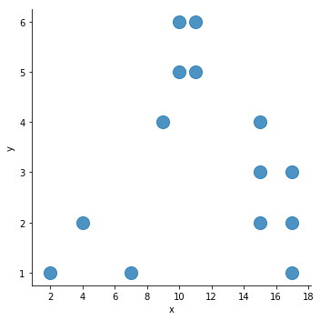
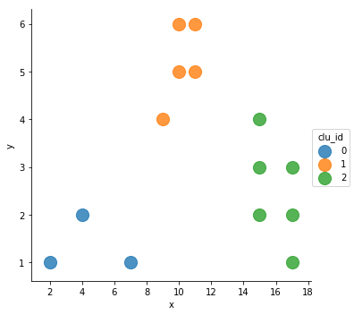
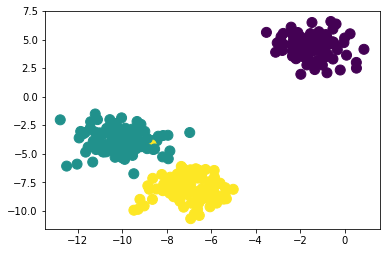
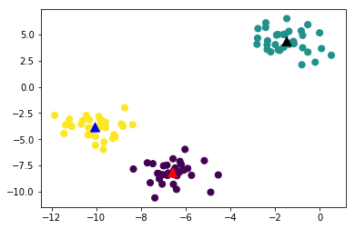

# ml_09

### Clustering( 군집화 )

- 비지도학습 : 정답데이터가 없고 feature만 가지고 학습해서 예측, 분류해준다.

- 데이터 포인트들을 별개로 군집으로 그룹화 하는것을 의미
- 유사성이 놓은 데이터들을 동일한 그룹으로 분류하고 서로 다른 군집들이 상이성을 가지도록 그룹화
  - 보통 k-means 를 의미

#### 군집화 사용예시

- 고객, 마켓, 브랜드, 사회 경제 활동 세분화
- Image 검출, 세분화, 트랙킹
- 이상검출 ( 군집에 없는 것들)

알고리즘이 특정 영역에 센터포인트를 잡는다.

그 점끼리 거리를 계산한다 : 뉴클리드거리계산

거리계산 후에 최종적으로 군집화

​	나누어진 군집들 센터로 포인트가 계속 이동함

```python
from sklearn.cluster import KMeans
import pandas as pd
import numpy as np

import matplotlib.pyplot as plt
import seaborn as sns

%matplotlib inline
```

```python
df = pd.DataFrame(columns=('x','y'))
df.loc[0] = [7,1]
df.loc[1] = [2,1]
df.loc[2] = [4,2]
df.loc[3] = [9,4]
df.loc[4] = [10,5]
df.loc[5] = [10,6]
df.loc[6] = [11,5]
df.loc[7] = [11,6]
df.loc[8] = [15,3]
df.loc[9] = [15,2]
df.loc[10] = [15,4]
df.loc[11] = [17,3]
df.loc[12] = [17,2]
df.loc[13] = [17,1]
df
>
	x	y
0	7	1
1	2	1
2	4	2
3	9	4
4	10	5
5	10	6
6	11	5
7	11	6
8	15	3
9	15	2
10	15	4
11	17	3
12	17	2
13	17	1
```

```python
sns.lmplot('x','y',data=df,fit_reg=False, scatter_kws={'s':200})
```



- 점들은 데이터 포인트 -> 이걸로 군집을 해야 한다.
- fit_reg=False : 회귀학습 하지 않는다.

```python
data_points = df.values
```

```python
kmeans = KMeans(n_clusters=3).fit(data_points)
kmeans
>
KMeans(n_clusters=3)
```

- KMeans학습이 진행되었다.

```python
kmeans.labels_
>
array([0, 0, 0, 1, 1, 1, 1, 1, 2, 2, 2, 2, 2, 2])
```

- 그룹으로 나누어진 그룹의 라벨을 확인할 수 있다.

```python
df['clu_id'] = kmeans.labels_
df
>
	x	y	clu_id
0	7	1		0
1	2	1		0
2	4	2		0
3	9	4		1
4	10	5		1
5	10	6		1
6	11	5		1
7	11	6		1
8	15	3		2
9	15	2		2
10	15	4		2
11	17	3		2
12	17	2		2
13	17	1		2
```

- 시각화 할 때 기준으로 묶어줘야 하기 때문에 `clu_id`  컬럼 생성

```python
sns.lmplot('x','y',data=df,fit_reg=False, scatter_kws={'s':200},
          hue='clu_id')
```



- 군집으로 나눠졌다.

### 분류용 가상 데이터 생성

- make_blobs(): 등방성 가우시안 정규분포
- n_samples : 표본수
- n_features : 독립변수의 수
- center : 클러스터의 수

```python
from sklearn.datasets import make_blobs
```

```python
X, y = make_blobs(n_samples = 300,n_features=2, centers=3, random_state=1)
```

```python
X
>
array([[-1.10195984e+01, -3.15882031e+00],
       [-6.38088086e+00, -8.50663809e+00],
       [-7.24251438e+00, -9.66368448e+00]])
```

```python
y
>
array([1, 2, 1, 0, 0, 0, 1, 0, 0, 2, 2, 2, 1, 1, 2, 0, 1, 1, 0, 1, 1, 1,
2, 1, 2, 2, 1, 1, 0, 1, 1, 0, 1, 2, 2, 2])
```

```python
plt.scatter(X[:,0], X[:,1],marker='o',c=y,s=100)
plt.show()
```

- 같은 성질을 가지는 데이터포인트가 생긴다.
- 하나의군집이 되었다.
  - 같은 방향의 같은 성질
  - 센터포인트랑 데이터 포이트랑 거리를 뉴클리드거리계산해서 가까운 쪽으로 군집한다.
  - 센터포인트도 그룹의 가운데로 이동시켜야함



```python
feature , label = make_blobs(random_state=1)
```

```python
feature
>
array([[-7.94152277e-01,  2.10495117e+00],
       [-9.15155186e+00, -4.81286449e+00],
       [ 8.52518583e-02,  3.64528297e+00]])
```

```python
array([0, 1, 1, 1, 2, 2, 2, 1, 0, 0, 1, 1, 2, 0, 2, 2, 2, 0, 1, 1, 2, 1,
       2, 0, 1, 2, 2, 0, 0, 2, 0, 0, 2, 0, 1, 2, 1, 1, 1, 2, 2, 1, 0, 1,
       1, 2, 0, 0, 0, 0, 1, 2, 2, 2, 0, 2, 1, 1, 0, 0, 1, 2, 2, 1, 1, 2,
       0, 2, 0, 1, 1, 1, 2, 0, 0, 1, 2, 2, 0, 1, 0, 1, 1, 2, 0, 0, 0, 0,
       1, 0, 2, 0, 0, 1, 1, 2, 2, 0, 2, 0])
```

```python
clu_mean = KMeans(n_clusters=3)
clu_mean.fit(feature)
>
KMeans(n_clusters=3)
```

- KMeans라는 학습기를 받아서 학습한다.

```python
clu_mean.labels_
>
array([1, 2, 2, 2, 0, 0, 0, 2, 1, 1, 2, 2, 0, 1, 0, 0, 0, 1, 2, 2, 0, 2,
       0, 1, 2, 0, 0, 1, 1, 0, 1, 1, 0, 1, 2, 0, 2, 2, 2, 0, 0, 2, 1, 2,
       2, 0, 1, 1, 1, 1, 2, 0, 0, 0, 1, 0, 2, 2, 1, 1, 2, 0, 0, 2, 2, 0,
       1, 0, 1, 2, 2, 2, 0, 1, 1, 2, 0, 0, 1, 2, 1, 2, 2, 0, 1, 1, 1, 1,
       2, 1, 0, 1, 1, 2, 2, 0, 0, 1, 0, 1])
```

- 학습된 라벨은 기존 라벨이랑 달라진다.

```python
clu_mean.predict(feature)
>
array([1, 2, 2, 2, 0, 0, 0, 2, 1, 1, 2, 2, 0, 1, 0, 0, 0, 1, 2, 2, 0, 2,
       0, 1, 2, 0, 0, 1, 1, 0, 1, 1, 0, 1, 2, 0, 2, 2, 2, 0, 0, 2, 1, 2,
       2, 0, 1, 1, 1, 1, 2, 0, 0, 0, 1, 0, 2, 2, 1, 1, 2, 0, 0, 2, 2, 0,
       1, 0, 1, 2, 2, 2, 0, 1, 1, 2, 0, 0, 1, 2, 1, 2, 2, 0, 1, 1, 1, 1,
       2, 1, 0, 1, 1, 2, 2, 0, 0, 1, 0, 1])
```

- 예측을 수행하고 비교해본다.

```python
plt.scatter(feature[:,0], feature[:,1],c=clu_mean.labels_,marker='o',s=50)
plt.scatter(clu_mean.cluster_centers_[:,0], clu_mean.cluster_centers_[:,1],c=['r','k','b'],marker='^',s=100)
plt.show()
```



- 학습을 하게되면 센터 포인터들이 만들어진 군집들의 센터로 다시 이동한다.

```python
clu_mean.cluster_centers_
>
array([[ -6.58196786,  -8.17239339],
       [ -1.4710815 ,   4.33721882],
       [-10.04935243,  -3.85954095]])
```

- 그룹을 짓기위한 중앙점들의 좌표값을 보여준다.

#### K-Means Clustering

```python
iris = load_iris()
# dataframe변환
iris_df = pd.DataFrame(data=iris.data, columns=iris.feature_names)
iris_df.head()
>
	sepal length (cm)	sepal width (cm)	petal length (cm)	petal width (cm)	
0				5.1					3.5					1.4					0.2			
1				4.9					3.0					1.4					0.2			
2				4.7					3.2					1.3					0.2			
3				4.6					3.1					1.5					0.2			
4				5.0					3.6					1.4					0.2			
```

```python
iris_kmeans = KMeans(n_clusters = 3,random_state=0,init ='k-means++', max_iter = 300)
iris_kmeans.fit(iris_df)
>
KMeans(n_clusters=3, random_state=0)
```

```python
print(iris_kmeans.labels_)
>
[1 1 1 1 1 1 1 1 1 1 1 1 1 1 1 1 1 1 1 1 1 1 1 1 1 1 1 1 1 1 1 1 1 1 1 1 1
 1 1 1 1 1 1 1 1 1 1 1 1 1 2 2 0 2 2 2 2 2 2 2 2 2 2 2 2 2 2 2 2 2 2 2 2 2
 2 2 2 0 2 2 2 2 2 2 2 2 2 2 2 2 2 2 2 2 2 2 2 2 2 2 0 2 0 0 0 0 2 0 0 0 0
 0 0 2 2 0 0 0 0 2 0 2 0 2 0 0 2 2 0 0 0 0 0 2 0 0 0 0 2 0 0 0 2 0 0 0 2 0
 0 2]
```

```python
print(iris_kmeans.predict(iris_df))
>
[1 1 1 1 1 1 1 1 1 1 1 1 1 1 1 1 1 1 1 1 1 1 1 1 1 1 1 1 1 1 1 1 1 1 1 1 1
 1 1 1 1 1 1 1 1 1 1 1 1 1 2 2 0 2 2 2 2 2 2 2 2 2 2 2 2 2 2 2 2 2 2 2 2 2
 2 2 2 0 2 2 2 2 2 2 2 2 2 2 2 2 2 2 2 2 2 2 2 2 2 2 0 2 0 0 0 0 2 0 0 0 0
 0 0 2 2 0 0 0 0 2 0 2 0 2 0 0 2 2 0 0 0 0 0 2 0 0 0 0 2 0 0 0 2 0 0 0 2 0
 0 2]
```

#### 포인트 별 할당된 그룹을  열로 추가해보자

```python
iris_df['clu_id'] = iris_kmeans.labels_
iris_df['target'] = iris.target
iris_df
>
		sepal length (cm)	sepal width (cm)	petal length (cm)	petal width (cm)	clu_id	target
0						5.1				3.5						1.4				0.2			1		0
```

#### (target, clu_id)를 통한 sepal_length의 빈도를 확인해보자

```python
iris_df.groupby(['target','clu_id'])[['sepal length (cm)']].count()
>
					 sepal length (cm)
	target	clu_id	
		0		1					50
		1		0					2
				2					48
		2		0					36
				2					14
```

비지도학습은 클러스터링과 차원축소를 알 면 된다.

- 차원축소  : 유사도가 높은 것을 하나의 피처로 만든다.
- iris_df는 차원축소를 해야 시각화 가능

#### PCA(차원축소)

