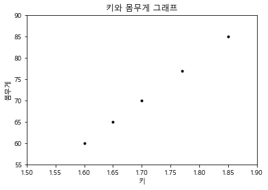
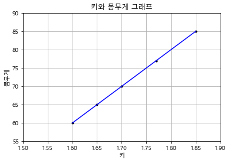

# ml_10

### 회귀분석

- 데이터 값이 평균과 같은 일정한 값으로 돌아가려는 경향을 이용한 통계학
- 회귀는 여러개의 독립변수와 한 개의 종속변수 간의 상관관계를 모델링하는 기법
  - 머신러닝 회귀 예측의 핵심은 주어진 피처와 결정 값 데이터 기반에서 학습을 통해 최적의 회귀 계수를 찾아내는 것

- 오차가 적어야 학습이 잘 된것이다.

| 독립변수 개수     | 회귀 계수의 결합 |
| :---------------- | ---------------- |
| 1개 : 단일 회귀   |                  |
| 여러개 : 다중회귀 |                  |

- Classification : 카테고리 값 (이산값)
- Regression : 숫자값 (연속값)
- 일반 성형 회귀 예측값과 실제값 RSS(Residual Sum of Squares) 를 최소화 할 수 있도록 회귀 계수를 최적화하며, 규제를 적용하지 않은 모델

- 규제를 하면 성능은 좋아진다. 

#### 선형회귀

- 종속변수와 하나 이상의 설명변수(독립변수)간의 관례를 모델링하는 선형접근법

```python
import seaborn as sns
import matplotlib.pyplot as plt
%matplotlib inline
```

```python
import platform

from matplotlib import font_manager, rc
# plt.rcParams['axes.unicode_minus'] = False

if platform.system() == 'Darwin':
    rc('font', family='AppleGothic')
elif platform.system() == 'Windows':
    path = "c:/Windows/Fonts/malgun.ttf"
    font_name = font_manager.FontProperties(fname=path).get_name()
    rc('font', family=font_name)
else:
    print('Unknown system... sorry~~~~') 
```

```python
import matplotlib
matplotlib.rcParams['axes.unicode_minus'] = False
```

```python
# 키(meter)와 몸무게(kg)
heights = [[1.6],[1.65],[1.7],[1.77],[1.85]]
weights = [[60],[65],[70],[77],[85]]
```

```python
plt.title('키와 몸무게 그래프')
plt.xlabel('키')
plt.ylabel('몸무게')

plt.plot(heights, weights, 'k.')
plt.axis([1.5, 1.90, 55, 90])
plt.show()
```



- 사람의 키에 따라 몸무게를 예측하자

```python
from sklearn.linear_model import LinearRegression
```

```python
lr_model = LinearRegression()
# fit함수는 리스트 또는 배열 형태의 인수를 필요로 한다.
lr_model.fit(heights, weights)lr_model = LinearRegression()
```

- 학습을 진행한다.

```python
weight_pred = lr_model.predict([[1.7],[1.75]])
>
array([[70.],
       [75.]])
```

- 예측을 진행한다.

```python
plt.title('키와 몸무게 그래프')
plt.xlabel('키')
plt.ylabel('몸무게')
plt.grid(True)
plt.axis([1.5, 1.90, 55, 90])

plt.plot(heights, weights, 'k.')
# 선형 회귀선 그리기
plt.plot(heights, lr_model.predict(heights),color='blue')

plt.show()
```

