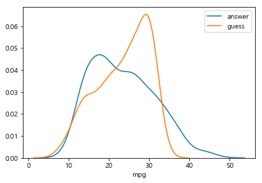
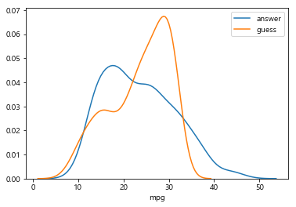

# ml_10

### 회귀분석

- 데이터 값이 평균과 같은 일정한 값으로 돌아가려는 경향을 이용한 통계학
- 회귀는 여러개의 독립변수와 한 개의 종속변수 간의 상관관계를 모델링하는 기법
  - 머신러닝 회귀 예측의 핵심은 주어진 피처와 결정 값 데이터 기반에서 학습을 통해 최적의 회귀 계수를 찾아내는 것

- 오차가 적어야 학습이 잘 된것이다.

| 독립변수 개수     | 회귀 계수의 결합 |
| :---------------- | ---------------- |
| 1개 : 단일 회귀   |                  |
| 여러개 : 다중회귀 |                  |

- Classification : 카테고리 값 (이산값)
- Regression : 숫자값 (연속값)
- 일반 성형 회귀 예측값과 실제값 RSS(Residual Sum of Squares) 를 최소화 할 수 있도록 회귀 계수를 최적화하며, 규제를 적용하지 않은 모델

- 규제를 하면 성능은 좋아진다. 

#### 선형회귀

- 종속변수와 하나 이상의 설명변수(독립변수)간의 관례를 모델링하는 선형접근법

```python
import seaborn as sns
import matplotlib.pyplot as plt
%matplotlib inline
```

```python
import platform

from matplotlib import font_manager, rc
# plt.rcParams['axes.unicode_minus'] = False

if platform.system() == 'Darwin':
    rc('font', family='AppleGothic')
elif platform.system() == 'Windows':
    path = "c:/Windows/Fonts/malgun.ttf"
    font_name = font_manager.FontProperties(fname=path).get_name()
    rc('font', family=font_name)
else:
    print('Unknown system... sorry~~~~') 
```

```python
import matplotlib
matplotlib.rcParams['axes.unicode_minus'] = False
```

```python
# 키(meter)와 몸무게(kg)
heights = [[1.6],[1.65],[1.7],[1.77],[1.85]]
weights = [[60],[65],[70],[77],[85]]
```

```python
plt.title('키와 몸무게 그래프')
plt.xlabel('키')
plt.ylabel('몸무게')

plt.plot(heights, weights, 'k.')
plt.axis([1.5, 1.90, 55, 90])
plt.show()
```


- 사람의 키에 따라 몸무게를 예측하자

```python
from sklearn.linear_model import LinearRegression
```

```python
lr_model = LinearRegression()
# fit함수는 리스트 또는 배열 형태의 인수를 필요로 한다.
lr_model.fit(heights, weights)lr_model = LinearRegression()
```

- 학습을 진행한다.

```python
weight_pred = lr_model.predict([[1.7],[1.75]])
>
array([[70.],
       [75.]])
```

- 예측을 진행한다.

```python
plt.title('키와 몸무게 그래프')
plt.xlabel('키')
plt.ylabel('몸무게')
plt.grid(True)
plt.axis([1.5, 1.90, 55, 90])

plt.plot(heights, weights, 'k.')
# 선형 회귀선 그리기
plt.plot(heights, lr_model.predict(heights),color='blue')

plt.show()
```


#### auto-mpg.csv 을 이용한 선형회귀

```python
row_data = pd.read_csv('./data/auto-mpg.csv',header=None)
row_data.columns = ['mpg','cylinders','displacement','horsepower','weight','acceleration','model year','origin','name']
row_data.head()
>
	mpg	cylinders	displacement	horsepower	weight	acceleration	model year	origin	name
0	18.0	8	307.0	130.0	3504.0	12.0	70	1	chevrolet chevelle malibu
```

```python
# 데이터 자료형 확인
row_data.info()
>
<class 'pandas.core.frame.DataFrame'>
RangeIndex: 398 entries, 0 to 397
Data columns (total 9 columns):
mpg             398 non-null float64
cylinders       398 non-null int64
displacement    398 non-null float64
horsepower      398 non-null object
weight          398 non-null float64
acceleration    398 non-null float64
model year      398 non-null int64
origin          398 non-null int64
name            398 non-null object
dtypes: float64(4), int64(3), object(2)
memory usage: 28.1+ KB
```

```python
row_data['horsepower'].unique()
>
array(['130.0', '165.0', '150.0', '140.0', '198.0', '220.0', '215.0',
       '225.0', '190.0', '170.0', '160.0', '95.00', '97.00', '85.00',
       '88.00', '46.00', '87.00', '90.00', '113.0', '200.0', '210.0',
       '193.0', '?', '100.0', '105.0', '175.0', '153.0', '180.0', '110.0',
       '72.00', '86.00', '70.00', '76.00', '65.00', '69.00', '60.00',
       '80.00', '54.00', '208.0', '155.0', '112.0', '92.00', '145.0',
       '137.0', '158.0', '167.0', '94.00', '107.0', '230.0', '49.00',
       '75.00', '91.00', '122.0', '67.00', '83.00', '78.00', '52.00',
       '61.00', '93.00', '148.0', '129.0', '96.00', '71.00', '98.00',
       '115.0', '53.00', '81.00', '79.00', '120.0', '152.0', '102.0',
       '108.0', '68.00', '58.00', '149.0', '89.00', '63.00', '48.00',
       '66.00', '139.0', '103.0', '125.0', '133.0', '138.0', '135.0',
       '142.0', '77.00', '62.00', '132.0', '84.00', '64.00', '74.00',
       '116.0', '82.00'], dtype=object)
```

- 저 ?때문에 객체가 되었음.처리하자

- '?' -> np.nan 변경
- 행을 삭제
- 문자열을 실수형으로 반환

```python
row_data['horsepower'] = row_data['horsepower'].replace('?',np.nan)
```

- replace함수로 바꿔준다.

```python
row_data = row_data.dropna(axis=0)
```

- dropna로 결측치 삭제

```python
row_data['horsepower'] = row_data['horsepower'].astype(float)
row_data.info()
>
<class 'pandas.core.frame.DataFrame'>
Int64Index: 392 entries, 0 to 397
Data columns (total 9 columns):
mpg             392 non-null float64
cylinders       392 non-null int64
displacement    392 non-null float64
horsepower      392 non-null float64
weight          392 non-null float64
acceleration    392 non-null float64
model year      392 non-null int64
origin          392 non-null int64
name            392 non-null object
dtypes: float64(5), int64(3), object(1)
memory usage: 30.6+ KB
```

- 타입을 변환하여 최종으로 다시 확인

- horsepower의 na만 지우자

```python
row_data = row_data.dropna(subset=['horsepower'],axis=0)
```

- 이렇게 하면 다른 컬럼에 na가 있어도 삭제가 안 되고 horsepower만 적용된다.

#### 분석에 활용할 변수를 선택

```python
cor_df = row_data[['mpg', 'cylinders','horsepower','weight']]
```

#### 선형관계 파악을 위한 산점도 그래프

```python
cor_df.plot(kind='scatter',x='weight',y='mpg',c='red',s=10,figsize=(10,5))
plt.show()
```


#### seaborn 산점도

```python
fig = plt.figure(figsize=(10,5))

area01 = fig.add_subplot(1,2,1)
area02 = fig.add_subplot(1,2,2)
sns.regplot(x='weight',y='mpg',data=cor_df,ax=area01)
sns.regplot(x='weight',y='mpg',data=cor_df,ax=area02,fit_reg=False)
plt.show()
```

- regplot : 회귀선을 그려준다. 
  - fit_reg=False 옵션을 넣으면 선은 안 그린다.


```python
sns.pairplot(cor_df)
plt.show()
```


- 이렇게 펼쳐서 어떤게 선형관계를 띄는지 살펴보고 독립변수를 선택한다.

```python
X = cor_df[['weight']]
y = cor_df['mpg']
```

- X는 독립변수, y는 종속변수

#### 데이터 세트를 구분

```python
from sklearn.model_selection import train_test_split
X_train, X_test, y_train, y_test = train_test_split(X,y,test_size=0.2, random_state=10)
```

```python
print(len(X_train))
print(len(X_test))
>
313
79
```

```python
from sklearn.linear_model import LinearRegression
auto_lr_model = LinearRegression()
```

```python
auto_lr_model.fit(X_train, y_train)
```

- 학습한다.

```python
r_square = auto_lr_model.score(X_test, y_test)
print('결정계수 : ',r_square)
>결정계수 :  0.6959884788265607
```

- 얼마나 설명해주는지 결정계수를 구한다.
- 1에 가까울수록 설명력이 높아서 좋은거다.

#### 회귀의 기울기, 회귀의 절편

```python
print('기울기 : ', auto_lr_model.coef_)
print('졀편 : ', auto_lr_model.intercept_)
>
기울기 :  [-0.00758599]
졀편 :  46.10489189618811
```

####  모델의 전체 X 데이터를 입력하여 예측값, 실제 y

```python
y_pred = auto_lr_model.predict(X)
```

- 위에서 만들었던 X를 넣고 예측해보자.

#### df 로 비교해보기

```python
data_pre = pd.DataFrame({
        '예측값' : y_pred,
        '실제값' : y
})
data_pre.head()
>
		예측값	  실제값
0	19.523567	18.0
1	18.089814	15.0
2	20.039415	18.0
3	20.062173	16.0
4	19.940797	17.0
```

- c차이가 난다.

```python
sns.distplot(y, hist=False, label='answer')
sns.distplot(y_pred, hist=False, label='guess')
plt.show()
```



- 회귀분석은 정답데이터가 정규분포를 따른다고 가정하고 분석함.
  - 그래서 정규분포를 따르지 않으면 정규화 진행 후 분석한다.

- 오차를 줄여야 할 필요성이 있다.

```python
X = cor_df[['cylinders','horsepower','weight']]
y = cor_df['mpg']
```

- 독립변수 추가 후 그래프변화



- 크게 달라진 점은 없다.

#### 가상환경 추가

- 아나콘다 관리자 모드에서 설치
- 가상환경추가

```
conda create -n 가상환경이름 python=3.6
```

- 가상환경 목록

```
conda info --envs
```

- 가상환경 활성화

```
conda activate 가상환경이름
```

- 가상환경 비활성화

```
conda deactivate
```

- 가상환경 제거

```
conda env remove -n 가상환경이름
```

- 주피터 커널과 연결

> 시작에 가면 가상환경주피터 생김

```
conda install jupyter notebook
```

- tensorflow 설치

```
conda install tensorflow
```

- 의존성관계 패키지 설치

```
conda install pandas
conda install numpy
conda install seaborn
```

