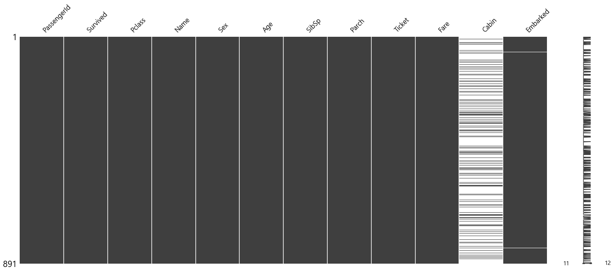
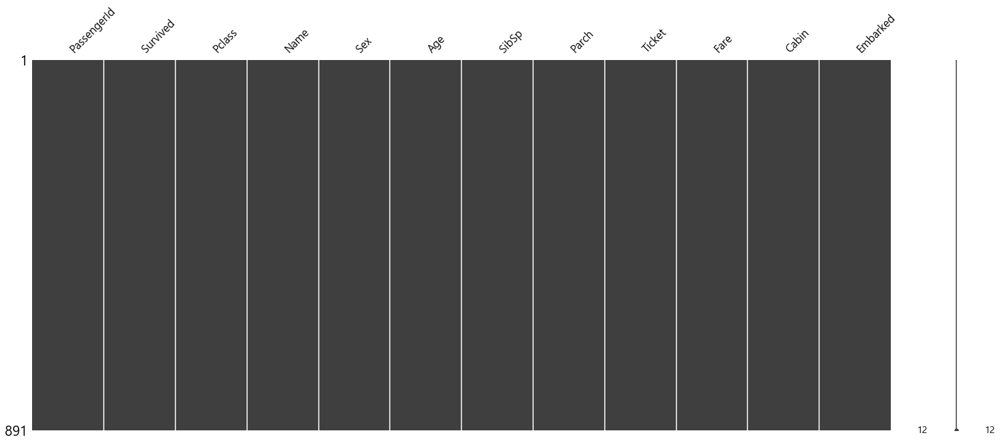
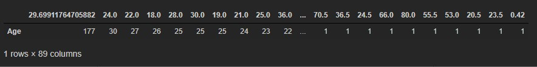
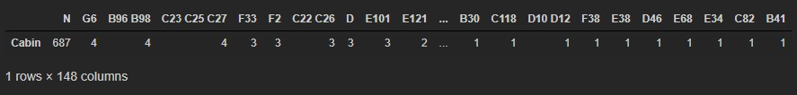
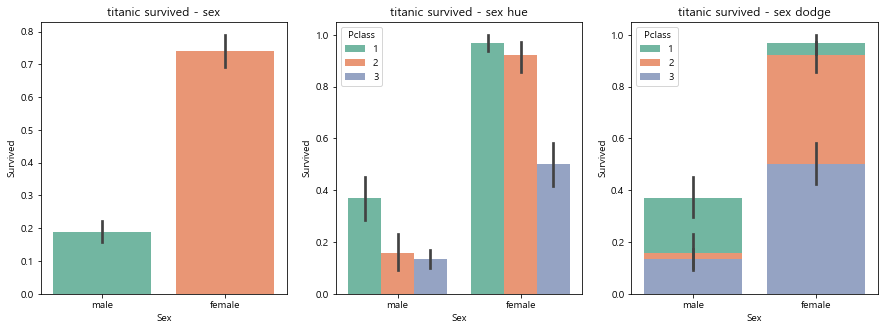

# 머신러닝  타이타닉 실습

### [탐색적 데이터 분석]

#### 1. 데이터 로드 및 확인

```python
import numpy as np
import pandas as pd
import matplotlib.pyplot as plt
import seaborn as sns
%matplotlib inline

titanic_df = pd.read_csv('./data/titanic_train.csv')
titanic_df.head(3)
>
	PassengerId	Survived	Pclass	Name	Sex	Age	SibSp	Parch	Ticket	Fare	Cabin	Embarked
0	1	0	3	Braund, Mr. Owen Harris	male	22.0	1	0	A/5 21171	7.2500	NaN	S
1	2	1	1	Cumings, Mrs. John Bradley (Florence Briggs Th...	female	38.0	1	0	PC 17599	71.2833	C85	C
2	3	1	3	Heikkinen, Miss. Laina	female	26.0	0	0	STON/O2. 3101282	7.9250	NaN	S
```

#### 2. 데이터 정보 확인

```python
titanic_df.info()
>
<class 'pandas.core.frame.DataFrame'>
RangeIndex: 891 entries, 0 to 890
Data columns (total 12 columns):
PassengerId    891 non-null int64
Survived       891 non-null int64
Pclass         891 non-null int64
Name           891 non-null object
Sex            891 non-null object
Age            714 non-null float64
SibSp          891 non-null int64
Parch          891 non-null int64
Ticket         891 non-null object
Fare           891 non-null float64
Cabin          204 non-null object
Embarked       889 non-null object
dtypes: float64(2), int64(5), object(5)
memory usage: 83.6+ KB
```

####  3. missingno 패키지를 이용한 결측값을 가지는 컬럼 확인 및 처리

- age는 평균으로, cabin 'N', embarked 'N' 으로 대체

```python
titanic_df['Age'].mean()
> 29.69911764705882

titanic_age_imputer = SimpleImputer(strategy = 'mean')
titanic_df['Age'] = titanic_age_imputer.fit_transform(titanic_df[['Age']])
msno.matrix(titanic_df)
plt.show()
```

- 우선 Age는 `SimpleImputer` 객체를 만들어 fit 과 transform을 실행하여 결측값을 처리하였다.



- 정상적으로 Age컬럼의 결측값이 평균으로 처리되었다.

```python
titanic_df['Cabin'] = titanic_df['Cabin'].fillna('N')
msno.matrix(titanic_df)
plt.show()
```

- fillna로 간단하게 'N'으로 바꾸었다.


```python
titanic_df['Embarked'] = titanic_df['Embarked'].fillna('N')
msno.matrix(titanic_df)
plt.show()
```



- 모든 결측값이 대체되었다.

#### 4. age , cabin , embarked 빈도확인

```python
pd.DataFrame(titanic_df['Age'].value_counts()).T
```



- value_counts()로 빈도를 확인해보았다.

```python
pd.DataFrame(titanic_df['Cabin'].value_counts()).T
```



```python
pd.DataFrame(titanic_df['Embarked'].value_counts()).T
>
			S	C	Q	N
Embarked	644	168	77	2
```

#### 성별에 따른 생존여부 확인 및 barplot를 이용한 시각화

```python
fig = plt.figure(figsize=(15,5))

area01 = fig.add_subplot(1,3,1)
area01.set_title('titanic survived - sex')
area02 = fig.add_subplot(1,3,2)
area02.set_title('titanic survived - sex hue')
area03 = fig.add_subplot(1,3,3)
area03.set_title('titanic survived - sex dodge')

# 성별에 따른 생존률 시각화
sns.barplot(x='Sex',y='Survived',data=titanic_df,ax=area01,palette='Set2')
# hue 
sns.barplot(x='Sex',y='Survived',hue='Pclass',data=titanic_df,ax=area02,palette='Set2')
# dodge
sns.barplot(x='Sex',y='Survived',hue='Pclass',dodge=False,data=titanic_df,ax=area03,palette='Set2')

plt.show()
```

- 우선 그래프를 그리기 위해 fig를 생성하고 3개의 그림을 그리기 위해 (1,3,x) 를 지정한다.
- x에는 성별을 y에는 생존률을 주고 hue와 dodge에는 pclass를 줘서 정보를 확인해보았다.



#### 6. Sex , Cabin , Embarked 에 대한 라벨인코딩

**Sex 라벨 인코딩**

```python
Sex_label = titanic_df['Sex']
encoder = LabelEncoder()
encoder.fit(Sex_label)
Sex_digit_label = encoder.transform(Sex_label)
print('encoder 결과', Sex_digit_label)
>
encoder 결과 [1 0 0 0 1 1 1 1 0 0 0 0 1 1 0 0 1 1 0 0 1 1 0 1 0 0 1 1 0 1 1 0 0 1 1 1 1...]
```

- 성별에 따라 1과 0이 부여되었다. male : 1, female:0이다.

**Cabin 라벨 인코딩**

```python
cabin_label = titanic_df['Cabin']
encoder = LabelEncoder()
encoder.fit(cabin_label)
cabin_digit_label = encoder.transform(cabin_label)
print('encoder 결과', cabin_digit_label)
>
encoder 결과 [146  81 146  55 146 146 129 146 146 146 145  49 146 146 146 146 146 146 ...]
```

**Embarked  라벨 인코딩**

```python
Embarked_label = titanic_df['Embarked']
encoder = LabelEncoder()
encoder.fit(Embarked_label)
Embarked_digit_label = encoder.transform(Embarked_label)
print('encoder 결과', Embarked_digit_label)
>
encoder 결과 [3 0 3 3 3 2 3 3 3 0 3 3 3 3 3 3 2 3 3 0 3 3 2 3 3 3 0 3 2 3 0 0 2 3 0 3 0...]
```

### [ML학습]

#### 1. feature데이터 셋과 Label 데이터 셋 추출

```python
titanic_df['Sex'] = Sex_digit_label
titanic_df['Cabin'] = cabin_digit_label
titanic_df['Embarked'] = Embarked_digit_label
```

- 위에서 나누었던 라벨을 덮어씌운다.

**feature, label 나누기**

```python
titanic_feature = titanic_df.loc[:, ~titanic_df.columns.isin(['Survived', 'Name','Ticket','PassengerId'])]
```

```python
titanic_label =  titanic_df.loc[:,['Survived']]
```

#### 2. 80:20 으로 데이터 분리(train_test_split)

```python
X_train, X_test, y_train, y_test = train_test_split(titanic_feature,titanic_label, test_size=0.2 ,random_state=100)
```

#### 3. 의사결정트리를 이용한 학습, 예측 및 정확도 확인

```python
titanic_df_dtc = DecisionTreeClassifier(random_state=200)
titanic_df_dtc.fit(X_train, y_train)
predition = titanic_df_dtc.predict(X_test)
print('예측 정확도 : %.2f' % accuracy_score(y_test, predition))
>
예측 정확도 : 0.78
```

- 정확도가 낮다.

#### 4. KFold=5 를 이용한 교차검증 및 평균정확도 확인

```python
from sklearn.model_selection import KFold
```

```python
fold_df_clf = DecisionTreeClassifier(random_state=200)
```

```python
kfold = KFold(n_splits=5)
cv_accuracy = []
```

- 학습기를 만들고 폴드 개수를 나눈다.

```python
n_iter = 0
for train_idx, test_idx in kfold.split(titanic_feature):
    label_train = titanic_label.iloc[train_idx]
    label_test = titanic_label.iloc[test_idx]
    features_train =  titanic_feature.iloc[train_idx,:-1]
    features_test =  titanic_feature.iloc[test_idx,:-1]
    fold_df_clf.fit(features_train, label_train)
    fold_pred = fold_df_clf.predict(features_test)
    
    # 정확도 측정
    n_iter += 1
    accuracy = np.round(accuracy_score(label_test, fold_pred),4)
    cv_accuracy.append(accuracy)

print('\n\n')
print('\n 평균 검증 정확도 : ', np.mean(cv_accuracy))
>
평균 검증 정확도 :  0.78908
```

- 거의 비슷하다.

#### 5. cross_val_score 를 이용한 교차검증 및 평균정확도 확인

```python
from sklearn.model_selection import cross_val_score, cross_validate
```

```python
cvs_iris_dtc = DecisionTreeClassifier(random_state = 300)
scoring = cross_val_score(cvs_iris_dtc, titanic_feature,titanic_label,scoring='accuracy',cv=5 )
print('교차 검증별 정확도 :',scoring)
print('평균 검증 정확도 :',np.mean(scoring))
>
교차 검증별 정확도 : [0.75418994 0.76404494 0.81460674 0.76966292 0.81460674]
평균 검증 정확도 : 0.783422258489737
```

- random_state를 올리니 정확도가 높아졌다.

#### 6.GridSearchCV 를 이용한 교차검증 및 평균정확도 확인

```python
from sklearn.model_selection import  GridSearchCV,train_test_split
```

```python
X_train, X_test , y_train, y_test = train_test_split(titanic_feature, 
                                                     titanic_label,
                                                     test_size=0.2,
                                                    random_state=400)
titanic_tree = DecisionTreeClassifier()
params = {'criterion' : ['gini', 'entropy'], 
          'splitter' : ['random','best'], 
          'max_depth' : [1,2,3,4,5], 
          'min_samples_split' : [2,3]}
```

- 우선 테스트, 트레인 데이터를 나누고 학습기를 만든다.
- 파라미터에 줄 옵션들을 저장한다.

```python
grid_titanic_tree = GridSearchCV(titanic_tree, param_grid = params,cv=5,refit=True )
```

```python
grid_titanic_tree.fit(X_train, y_train)
score_titanic_df = pd.DataFrame(grid_titanic_tree.cv_results_)
score_titanic_df[['params', 'mean_test_score', 'rank_test_score','split0_test_score','split1_test_score','split2_test_score','split3_test_score','split4_test_score']]
```

- 학습을 진행하고 GridSearchCV의 결과를 데이터 프레임으로 만들어본다.

```python
estimator = grid_titanic_tree.best_estimator_
prediction = estimator.predict(X_test)
print('테스트 세트의 정확도 : ', accuracy_score(y_test,prediction))
>
테스트 세트의 정확도 :  0.8547486033519553
```

- max_depth을 1,2,3만 주었을 때는 78~9%였는데 1,2,3,4,5를 주니 81%가 되었다.

- random_state를 400으로 주니 85% 올라갔다.
  - 300일때는 81%였다.