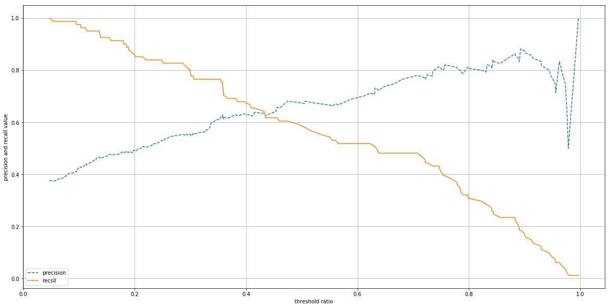
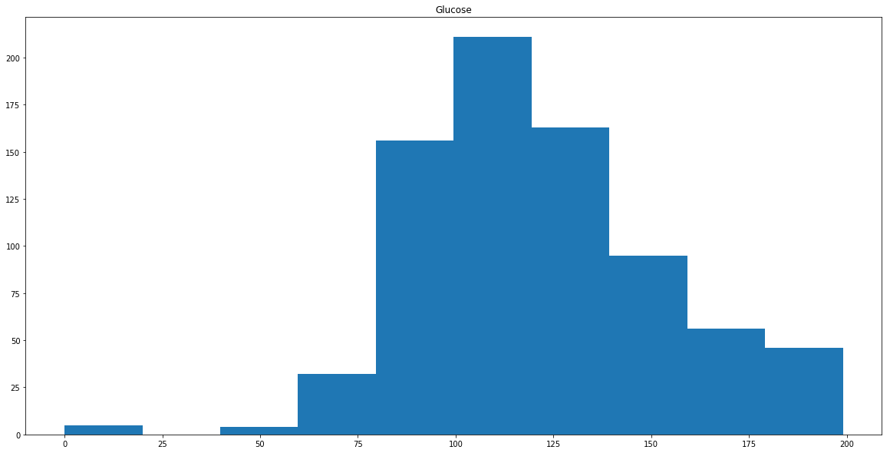
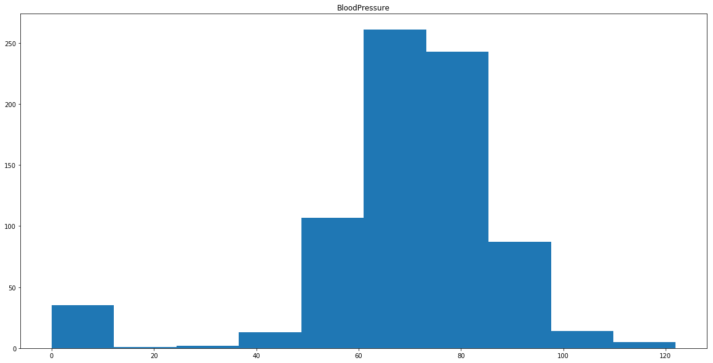
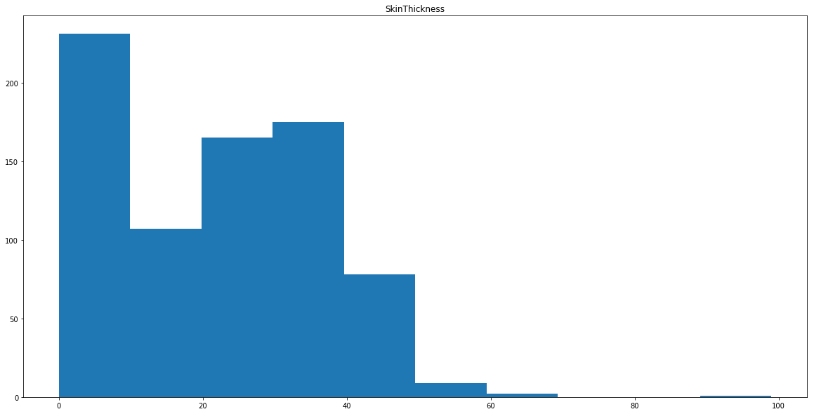
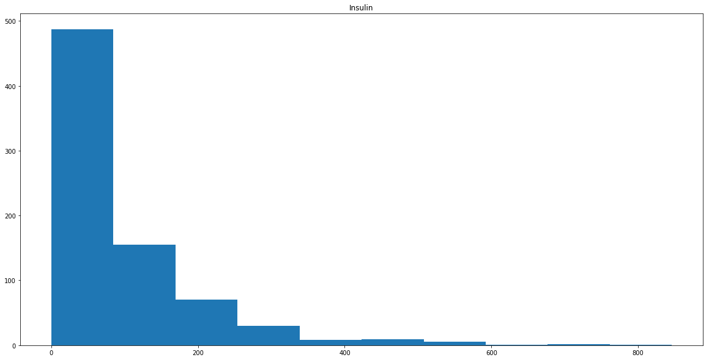
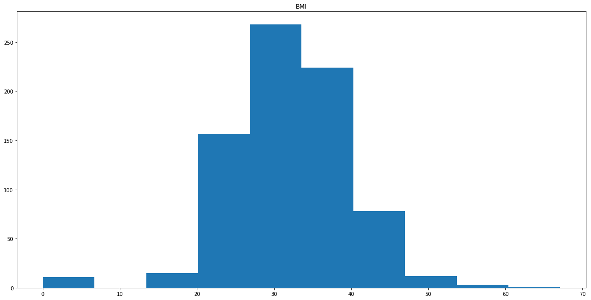
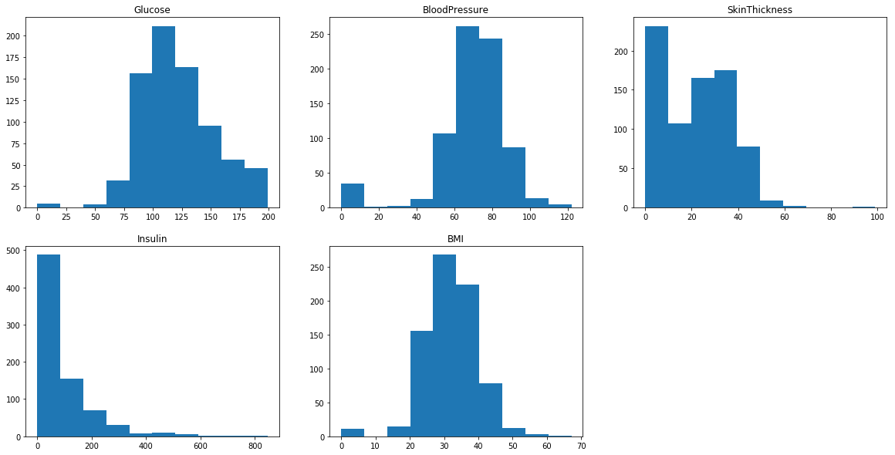

# 머신러닝_실습02

#### 학습의 목표

- 머신러닝의 분류모델을 이용하여, 여러가지 평가지표를 적용하여 확인
- 의학(당뇨병 여부 판단) : 재현율지표를 확인

```python
import pandas as pd
import numpy as np

from sklearn.tree import DecisionTreeClassifier
from sklearn.linear_model import LogisticRegression
from sklearn.ensemble import RandomForestClassifier

from sklearn.preprocessing import LabelEncoder, OneHotEncoder, StandardScaler, MinMaxScaler, Binarizer
from sklearn.model_selection import train_test_split , GridSearchCV, cross_validate, KFold

from sklearn.metrics import accuracy_score, precision_score, recall_score, f1_score, roc_auc_score
from sklearn.metrics import confusion_matrix, precision_recall_curve, roc_curve,  make_scorer

import matplotlib.pyplot as plt
%matplotlib inline

import warnings
warnings.filterwarnings('ignore')

import seaborn as sns

import missingno as ms
```

```python
diabetes_df.info()
>
<class 'pandas.core.frame.DataFrame'>
RangeIndex: 768 entries, 0 to 767
Data columns (total 9 columns):
Pregnancies                 768 non-null int64
Glucose                     768 non-null int64
BloodPressure               768 non-null int64
SkinThickness               768 non-null int64
Insulin                     768 non-null int64
BMI                         768 non-null float64
DiabetesPedigreeFunction    768 non-null float64
Age                         768 non-null int64
Outcome                     768 non-null int64
dtypes: float64(2), int64(7)
memory usage: 54.1 KB
```

- 결측치 없다.

##### target 분포 확인

```python
diabetes_df['Outcome'].value_counts()
>
0    500
1    268
Name: Outcome, dtype: int64
```

##### 분류를 위한 예측모델 생성

```python
dis_dt = DecisionTreeClassifier(random_state=100 )
diabetes_feature = diabetes_df.drop('Outcome', axis=1)
diabetes_label = diabetes_df['Outcome']
```

##### 모델 셀렉션, 교차 검증

##### 학습, 예측 및 평가

```python
X_train, X_test, y_train, y_test = train_test_split(diabetes_feature,diabetes_label, test_size=0.3,random_state=100)
params = {'criterion' : ['gini', 'entropy'],
         'splitter' : ['random', 'best'],
         'max_depth' : [1,2,3],
         'min_samples_split' : [2,3,4,5,6]}

gscv_tree = GridSearchCV(dis_dt,param_grid=params, cv=5, refit=True)
gscv_tree.fit(X_train, y_train)
print('최적의 기법  : ', gscv_tree.best_params_)
print('높은 정확도 : ', gscv_tree.best_score_)

gscv_estimator = gscv_tree.best_estimator_
gscv_pred = gscv_estimator.predict(X_test)
print('테스트 세트 정확도 : ', accuracy_score(y_test,gscv_pred))
>
최적의 기법  :  {'criterion': 'entropy', 'max_depth': 3, 'min_samples_split': 2, 'splitter': 'best'}
높은 정확도 :  0.7467462789892696
테스트 세트 정확도 :  0.7272727272727273
```

- GridSearchCV로 하면  0.7272727272727273의 정확도가 나온다.

```python
cross_vai_scoring = cross_validate(dis_dt,diabetes_feature, diabetes_label, scoring='accuracy', cv = 10)
print('cross_vai_scoring 정확도 : ', np.mean(cross_vai_scoring['test_score']))
>
cross_vai_scoring 정확도 :  0.7108851674641149
```

```python
cross_validate_scoring = cross_validate(dis_dt,diabetes_feature, diabetes_label, scoring='accuracy', cv = 20)
print('cross_validate_scoring 정확도 : ', np.mean(cross_validate_scoring['test_score']))
>
cross_validate_scoring 정확도 :  0.7163630229419703
```

- 폴더를 나누는 갯수를 증가시키니 정확도가 사알짝 높아졌다.

##### 임계값별 정밀도 - 재현율 확인 및 시각화

```python
def evaluation(y_test, y_pred):
    accuracy = accuracy_score(y_test, y_pred)
    precision = precision_score(y_test, y_pred)
    recall = recall_score(y_test, y_pred)
    
    print('정확도 : ', accuracy)
    print('정밀도 : ', precision)
    print('재현율 : ', recall)
```

- 평가지표 확인을 위한 함수 만들기

```python
lr_reg = LogisticRegression(random_state=100)
lr_reg.fit(X_train, y_train)
lr_pred = lr_reg.predict(X_test)
evaluation(y_test,lr_pred )
>
정확도 :  0.7532467532467533
정밀도 :  0.6714285714285714
재현율 :  0.5802469135802469
```

- 로지스틱 회귀로 돌려보았다.
  - 정확도는 위의 학습보다는 높아졌지만 재현율이 너무 낮다. 

```python
rf_cv = RandomForestClassifier(random_state=100)
rf_cv.fit(X_train, y_train)
rf_pred = rf_cv.predict(X_test)
evaluation(y_test,rf_pred)
>
정확도 :  0.7359307359307359
정밀도 :  0.6428571428571429
재현율 :  0.5555555555555556
```

- RandomForestClassifier로 돌렸는데 재현율이 더 떨어졌다. 실망이다.

```python
fold = KFold(n_splits = 10,
            random_state=100,
            shuffle=True)
scoring = {
    'accuracy' : make_scorer(accuracy_score),
    'precision' : make_scorer(precision_score),
    'recall'   : make_scorer(recall_score),
    'f1_score' : make_scorer(f1_score)
}
corss_validate_re_pr = cross_validate(rf_cv, diabetes_feature, diabetes_label, cv=fold,scoring=scoring)
print('accuracy : ',corss_validate_re_pr['test_accuracy'].mean())
print('precision : ',corss_validate_re_pr['test_precision'].mean())
print('recall : ',corss_validate_re_pr['test_recall'].mean())
print('fi_sf1_scorecore : ',corss_validate_re_pr['test_f1_score'].mean())
>
accuracy :  0.7564422419685577
precision :  0.6806676433731387
recall :  0.5711373236832684
fi_sf1_scorecore :  0.6150215072518813
```

- cross_validate로 scoring를 지정해서 계산하였다. 
  - 나아진 점이 없어보인다.

#### 임계값을 주어서 정밀도 - 재현율 확인 및 시각화

```python
pred_pro_result = lr_reg.predict_proba(X_test)
pred_pro_y_pred = lr_reg.predict(X_test)
user_thred = 0.5
positive_pred_proba = pred_pro_result[:,1].reshape(-1,1)
uesr_predict = Binarizer(threshold = user_thred).fit(positive_pred_proba).transform(positive_pred_proba)
evaluation(y_test,uesr_predict)
>
정확도 :  0.7532467532467533
정밀도 :  0.6714285714285714
재현율 :  0.5802469135802469
```

- 우선 임계값을 0.5로 줬을때는 위 lr_reg로 돌린 값과 똑같다.

**임계값 0.4**

```python
정확도 :  0.7445887445887446
정밀도 :  0.627906976744186
재현율 :  0.6666666666666666
```

- 재현율이 올라갔다.

```python
pred_positive_label = lr_reg.predict_proba(X_test)[:,1]
precisions, recalls, thresholds = precision_recall_curve(y_test, pred_positive_label)
print('정밀도 : ',precisions)
print('재현율 : ', recalls)
>
정밀도 :  [0.37674419 0.37383178 0.37558685 0.37735849 0.37914692 0.38095238
 0.38277512 0.38461538 0.38647343 0.38834951 0.3902439  0.39215686 ... ]
재현율 :  [1.         0.98765432 0.98765432 0.98765432 0.98765432 0.98765432
 0.98765432 0.98765432 0.98765432 0.98765432 0.98765432 0.98765432...]
```

- precision_recall_curve로 값을 구해서 값이 어떻게 변하는지 관찰하자.

- 임계값을 알아서 변화시키고 값을 구해주니 편하다.

```python
print(thresholds.shape)
print(precisions.shape)
print(recalls.shape)
>
(215,)
(216,)
(216,)
```

- thresholds의 개수가 1개 적다

```python
plt.figure(figsize=(20,10))

plt.plot(thresholds, precisions[0:thresholds.shape[0]], label='precision', linestyle='--')
plt.plot(thresholds, recalls[0:thresholds.shape[0]], label='recsll')

plt.xlabel('threshold ratio')
plt.ylabel('precision and recall value')
plt.grid()
plt.legend(loc='best')
plt.show()
```



- 0.4x쯤에 바뀐다.

##### 당수치(Glucose), 혈압(BloodPressure), 피하지방(SkinThickness), 인슐린(Insulin), 체질량지수(BMI)의 분포를 히스토그램으로 확인

```python
diabetes_df_col = diabetes_df.columns[1:6]
for i in diabetes_df_col:
    plt.figure()
    plt.hist(x=diabetes_df[i])
    plt.show()
```











```python
fig = plt.figure()

area01 = fig.add_subplot(2,3,1)
area02 = fig.add_subplot(2,3,2)
area03 = fig.add_subplot(2,3,3)
area04 = fig.add_subplot(2,3,4)
area05 = fig.add_subplot(2,3,5)

area01.hist(diabetes_df['Glucose'])
area01.title.set_text('Glucose')
area02.hist(diabetes_df['BloodPressure'])
area02.title.set_text('BloodPressure')
area03.hist(diabetes_df['SkinThickness'])
area03.title.set_text('SkinThickness')
area04.hist(diabetes_df['Insulin'])
area04.title.set_text('Insulin')
area05.hist(diabetes_df['BMI'])
area05.title.set_text('BMI')


plt.show()
```



- 이렇게 하면 한 화면에서 볼 수 있다.

##### 정규화

```python
std_scaler = StandardScaler()
diabetes_std = std_scaler.fit(diabetes_df.iloc[:,:-1]).transform(diabetes_df.iloc[:,:-1])
```

- StandardScaler() 객체를 만들어서 fit과 trasnfrom을 적용한다.

```python
diabetes_std_df = pd.DataFrame(data=diabetes_std, columns=(diabetes_df.iloc[:,:-1]).columns)
diabetes_std_df.head()
>
	Pregnancies	Glucose	BloodPressure	SkinThickness	Insulin	BMI	DiabetesPedigreeFunction	Age
0	0.639947	0.848324	0.149641	0.907270	-0.692891	0.204013	0.468492	1.425995
1	-0.844885	-1.123396	-0.160546	0.530902	-0.692891	-0.684422	-0.365061	-0.190672
2	1.233880	1.943724	-0.263941	-1.288212	-0.692891	-1.103255	0.604397	-0.105584
3	-0.844885	-0.998208	-0.160546	0.154533	0.123302	-0.494043	-0.920763	-1.041549
4	-1.141852	0.504055	-1.504687	0.907270	0.765836	1.409746	5.484909	-0.020496
```

```python
X_train, X_test, y_train, y_test = train_test_split(diabetes_std_df, diabetes_label,test_size = 0.3, random_state=100)
```

```python
lr_reg = LogisticRegression(random_state=100)
lr_reg.fit(X_train, y_train)
lr_pred = lr_reg.predict(X_test)
evaluation(y_test,lr_pred)
>
정확도 :  0.7532467532467533
정밀도 :  0.6714285714285714
재현율 :  0.5802469135802469
```

```python
rf_cv = RandomForestClassifier(random_state=100)
rf_cv.fit(X_train, y_train)
rf_pred = rf_cv.predict(X_test)
evaluation(y_test,rf_pred)
>
정확도 :  0.7316017316017316
정밀도 :  0.6338028169014085
재현율 :  0.5555555555555556
```

```python
fold = KFold(n_splits = 10,
            random_state=100,
            shuffle=True)
scoring = {
    'accuracy' : make_scorer(accuracy_score),
    'precision' : make_scorer(precision_score),
    'recall'   : make_scorer(recall_score),
    'f1_score' : make_scorer(f1_score)
}
corss_validate_re_pr = cross_validate(rf_cv, diabetes_std_df, diabetes_label, cv=fold,scoring=scoring)
print('accuracy : ',corss_validate_re_pr['test_accuracy'].mean())
print('precision : ',corss_validate_re_pr['test_precision'].mean())
print('recall : ',corss_validate_re_pr['test_recall'].mean())
print('fi_sf1_scorecore : ',corss_validate_re_pr['test_f1_score'].mean())
>
accuracy :  0.7577751196172249
precision :  0.6837523081011293
recall :  0.5713754189213637
fi_sf1_scorecore :  0.6168307431118047
```

- 거의 값이 안 바뀌었다.

##### 표준화

```python
minmax_scaler  = MinMaxScaler()
diabetes_minmax = minmax_scaler.fit(diabetes_df.iloc[:,:-1]).transform(diabetes_df.iloc[:,:-1])
```

- MinMaxScaler() 객체를 만들어서 fit과 trasnfrom을 적용한다.

