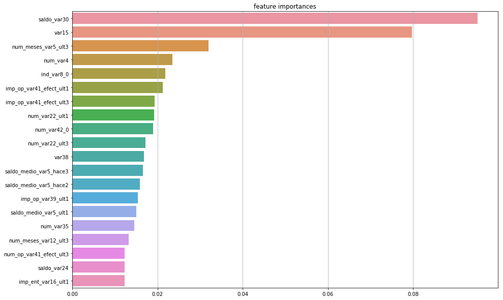

# 머신러닝 실습_03

### 고객만족 데이터 세트를 이용한 앙상블

```python
# 학습데이터
customer_train = pd.read_csv('./data/train.csv')
customer_train.head()
```

```python
#학습데이터
customer_test = pd.read_csv('./data/test.csv')
customer_test.head()
```

```python
# 클래스에 대한  비율 확인/ 0은 만족, 1은 불만족
customer_train['TARGET'].value_counts
# 불만족 비율
unsati_cnt = customer_train[customer_train['TARGET'] == 1]['TARGET'].count() / customer_train['TARGET'].count()
print('불만족 비율 : ', unsati_cnt)
>
불만족 비율 :  0.0395685345961589
```

#### 데이터 전처리 없이 XGBM을 이용한 예측

- 성능평가를 조기 중단 파라미터를 설정하고 학습/ 예측/ 평가

```python
from xgboost import XGBClassifier
xgb_clf = XGBClassifier(n_estimators=400,
                        learning_rate=0.1,
                        max_depth=3)
features = customer_train.drop('TARGET',axis=1)
label = customer_train['TARGET']
X_train, X_test, y_train, y_test = train_test_split(features,label,test_size=0.2,random_state=100 )
xgb_clf.fit(X_train, y_train,
           early_stopping_rounds=100,
           eval_metric='logloss',
           eval_set = [(X_test, y_test)],
           verbose= True)
```

- customer_train을 features와 label로 나누어서 데이터를 X와 y로 받는다.
- 그 다음에 학습을 한다.

```python
xgb_pred = xgb_clf.predict(X_test)
```

```python
def classifier_eval(y_test , y_pred) :
    print('오차행렬 : ' , confusion_matrix(y_test, y_pred))
    print('정확도   : ' , accuracy_score(y_test, y_pred))
    print('정밀도   : ' , precision_score(y_test, y_pred))
    print('재현율   : ' , recall_score(y_test, y_pred))
    print('F1       : ' , f1_score(y_test, y_pred))
    print('AUC      : ' , roc_auc_score(y_test, y_pred))
```

```python
classifier_eval(y_test, xgb_pred)
>
오차행렬 :  [[14584     1]
 [  616     3]]
정확도   :  0.9594185740594581
정밀도   :  0.75
재현율   :  0.004846526655896607
F1       :  0.009630818619582664
AUC      :  0.5023889815315822
```

#### 하이퍼 파라미터 튜닝을 해보자 - GridSearchCV - 교차검증

```python
xgb_clf_model =  XGBClassifier(random_state=100)
params = {
    'learning rate' : [0.1,0.5,0.75],
    'n_estimators'  : [100,200],
    'min_child_weight' : [3,5],
    'min_split_loss' : [100,200],
    'max_depth'     : [3,5,10],
    'subsample'     : [0.5,0.75,1],
    'colsample_bytree' : [0.3,0.5,1],
    'reg_lambda'    : [100,150],
    'reg_alpha'     :  [100,150]
}
xgb_clf_gscv = GridSearchCV(xgb_clf_model, param_grid= params, cv=5)
xgb_clf_gscv.fit(X_train,y_train)
```

```python
print('최고의 파라미터 : ', xgb_clf_gscv.best_params_)
print('최고 정확도 : ', xgb_clf_gscv.best_score_)
```

- 너무 오래 걸려서 우선 처음에 했던 걸로 시각화를 진행하였다.

#### 피처 중요도 시각화

```python
feature_important = pd.Series(xgb_clf.feature_importances_, index=X_train.columns)
feature20 =feature_important.sort_values(ascending=False)[:20]
plt.figure(figsize=(15,10))
plt.title('feature importances')
sns.barplot(x=feature20,y=feature20.index)
plt.show()
```



#### stacking model로 변화하여 성능평가

```python
from sklearn.ensemble import AdaBoostClassifier

knn_clf = KNeighborsClassifier()
rf_clf  = RandomForestClassifier(random_state=150)
dt_clf  = DecisionTreeClassifier()
ada_clf = AdaBoostClassifier()
```

- 학습기를 만든다.

```python
from sklearn.metrics import mean_absolute_error
```

```python
X_train, X_test, y_train, y_test = train_test_split(features,label,test_size=0.2,random_state=100 )
```

```python
def get_stacking_base_datasets(model, X_train_n, y_train_n, X_test_n, n_folds ):
    kf = KFold(n_splits=n_folds, shuffle=False, random_state=0)
    
    train_fold_pred = np.zeros((X_train_n.shape[0] ,1 ))
    test_pred = np.zeros((X_test_n.shape[0],n_folds))
    print(model.__class__.__name__ , ' model 시작 ')
    for folder_counter , (train_index, valid_index) in enumerate(kf.split(X_train_n)):
             
            print('\t 폴드 세트: ',folder_counter,' 시작 ')
            X_tr = X_train_n.iloc[train_index] 
            y_tr = y_train_n.iloc[train_index] 
            X_te = X_train_n.iloc[valid_index]  

            model.fit(X_tr , y_tr)       
            
            train_fold_pred[valid_index, :] = model.predict(X_te).reshape(-1,1)
            
            test_pred[:, folder_counter] = model.predict(X_test_n)

   
    test_pred_mean = np.mean(test_pred, axis=1).reshape(-1,1)    

   
    return train_fold_pred , test_pred_mean
```

- KFold로 나누어서 분석하기 위해 루프 내에서 학습을 해야 과적합을 방지할 수 있다.

```python
knn_train, knn_test = get_stacking_base_datasets(knn_clf,X_train, y_train, X_test, 3)
rf_train,rf_test = get_stacking_base_datasets(rf_clf,X_train, y_train, X_test, 3)
dt_train, dt_test = get_stacking_base_datasets(dt_clf,X_train, y_train, X_test, 3)
ada_train, ada_test = get_stacking_base_datasets(ada_clf,X_train, y_train, X_test, 3)
```

- 위의 함수에서 train과 test를 받는다.

```python
stacking_train = np.concatenate((knn_train,rf_train, dt_train,ada_train), axis=1)
stacking_test  = np.concatenate((knn_test, rf_test,dt_test, ada_test),axis=1)
```

- 그 다음에 그걸 하나의 train과 test 데이터로 만들어서 준비한다.

```python
lr_clf = LogisticRegression()
lr_clf.fit(stacking_train, y_train)
stacking_pred = lr_clf.predict(stacking_test
classifier_eval(y_test,stacking_pred)
>
오차행렬 :  [[14585     0]
 [  619     0]]
정확도   :  0.9592870297290187
정밀도   :  0.0
재현율   :  0.0
F1       :  0.0
AUC      :  0.5
```

- 최종으로 하나의 학습기로 다시 테스트한다.