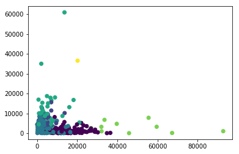
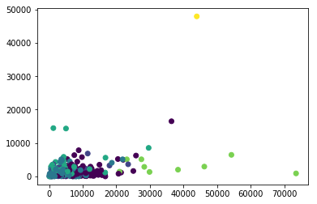
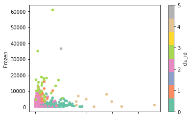
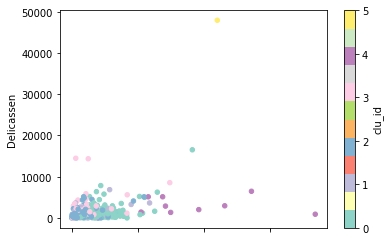
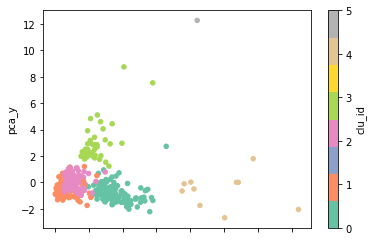

# 머신러닝 실습_04

### KMeans [실습]

```python
from sklearn.cluster import KMeans
import pandas as pd
import numpy as np

import matplotlib.pyplot as plt
import seaborn as sns

%matplotlib inline
```

```python
uci_path = 'https://archive.ics.uci.edu/ml/machine-learning-databases/00292/Wholesale%20customers%20data.csv'
sample_df = pd.read_csv(uci_path)
sample_df.head()
```

- 사용할 데이터를 받아온다.

```python
# 데이터 자료형
sample_df.info()
```

```python
sample_df.describe()
```

```python
#분석에 사용할 피처를 카피
copy_df = sample_df.iloc[:,:]
copy_df.head()
```

- 자료를 카피해 원본 손실을 방지한다.

```python
from sklearn.preprocessing import StandardScaler
# 표준화 진행
std_df = StandardScaler().fit_transform(copy_df)
```

- StandardScaler로 표준화를 진행한다.

```python
# 군집모형 학습 및 예측 , 예측 된 결과를 DF에 추가
std_kmeans = KMeans(n_clusters=6, init='k-means++',max_iter=300,n_init=10)
std_kmeans.fit(std_df)
```

- 군집화를 하여 학습한다.

```python
copy_df['clu_id'] = std_kmeans.labels_
>
Channel	Region	Fresh	Milk	Grocery	Frozen	Detergents_Paper	Delicassen	clu_id
0	2		3	12669	9656		7561	214				2674			1338	0
1	2		3	7057	9810		9568	1762			3293			1776	0
2	2		3	6353	8808		7684	2405			3516			7844	0
3	1		3	13265	1196		4221	6404			507				1788	2
4	2		3	22615	5410		7198	3915			1777			5185	0
```

- 군집화에서 얻은 라벨을 원본에 추가해서 군집화를 위한 분류를 추가한다.

```python
plt.scatter(x=copy_df['Grocery'],y=copy_df['Frozen'],marker='o',c=copy_df['clu_id'])
plt.show()
```



```python
plt.scatter(x=copy_df['Milk'],y=copy_df['Delicassen'],marker='o',c=copy_df['clu_id'])
plt.show()
```



```python
copy_df.plot(kind='scatter', x='Grocery',y='Frozen',c='clu_id',colorbar=True,cmap='Set2')
plt.show()
```



- 저기 떨어진 값들은 노이즈, 즉 이상치들이다. 그래서 제거해서 분석하는것도 좋다.

```python
copy_df.plot(kind='scatter', x='Milk',y='Delicassen',c='clu_id',colorbar=True,cmap='Set3')
plt.show()
```



#### PCA차원축소 2개, 군집화하고 시각화해보자.

```python
from sklearn.decomposition import PCA
sample_df_pca = PCA(n_components=2)
sample_df_pca_trans = sample_df_pca.fit_transform(std_df)
copy_df['pca_x'] = sample_df_pca_trans[:,0]
copy_df['pca_y'] = sample_df_pca_trans[:,1]
```

```python
std_kmeans.fit(copy_df.iloc[:,-2:])
copy_df.plot(kind='scatter', x='pca_x', y='pca_y',c='clu_id',colorbar=True,cmap='Set2')
plt.show()
```



---

### 학습 목표

- 서울시내 중학교 진학률 데이터 세트 (지역에 따른 군집)
- LabelEncoder, OnHotEncoder 필요
- 지도 시각화(위도, 경도) -> folium

```python
from sklearn.cluster import KMeans
import pandas as pd
import numpy as np
import folium

import matplotlib.pyplot as plt
import seaborn as sns

%matplotlib inline
```

```python
school_df = pd.read_excel('./data/middle_shcool_graduates_report.xlsx')
school_df.head()
>
지역	학교명	코드	유형	주야	남학생수	여학생수	일반고	특성화고	과학고	외고_국제고	예고_체고	마이스터고	자사고	자공고	기타진학	취업	미상	위도	경도
0	성북구	서울대학교사범대학부설중학교	3	국립	주간	277	0	0.585	0.148	0.018	0.007	0.000	0.011	0.227	0.000	0.004	0	0.000	37.594942	127.03890
```

- 데이터를 불러오고 확인한다.

```python
print(school_df.columns.values)
>
['지역' '학교명' '코드' '유형' '주야' '남학생수' '여학생수' '일반고' '특성화고' '과학고' '외고_국제고'
 '예고_체고' '마이스터고' '자사고' '자공고' '기타진학' '취업' '미상' '위도' '경도']
```

```python
# 지도에 위치 표시
school_map = folium.Map(location=[37.55, 126.98], titles='Stamen Terrain',zoom_start=12)
for name, lat, lng in zip(school_df.학교명, school_df.위도, school_df.경도):
    folium.CircleMarker(
        [lat,lng],
        radius=5,
        color='green',
        fill=True,
        fill_color='black',
        fill_opacity=0.5,
        popup = name
    ).add_to(school_map)
school_map
```

```python
df_copy = school_df.copy()
```

### 진행절차

1.  데이터 전처리 - 원핫인코딩
2. 군집모형 생성 - 분석에 사용할 피처는 과학고, 외고국제고, 자사고 진학률
3. 정규화
4. 모형 객체 생성
5. 모형 학습
6. 예측
7. 예측 결과를 데이터 프레임에 추가
8. 클러스터 값으로 그룹화, 그룹별 내용 출력
9. 그래프로 시각화(지도그래프로 시각화)

```python
df_copy.isna().sum()
>
지역        0
학교명       0
코드        0
유형        0
주야        0
남학생수      0
여학생수      0
일반고       0
특성화고      0
과학고       0
외고_국제고    0
예고_체고     0
마이스터고     0
자사고       0
자공고       0
기타진학      0
취업        0
미상        0
위도        0
경도        0
dtype: int64
```

- 우선 결측치를 확인한다. 없다. 다음 단계로 넘어가자.

#### 데이터 전처리 - 원핫인코딩

```python
from sklearn.preprocessing import LabelEncoder
encoder = LabelEncoder()
digit_label = encoder.fit_transform(df_copy['지역'])
```

```python
from sklearn.preprocessing import OneHotEncoder
digit_label = digit_label.reshape(-1,1)
```

- 원-핫 인코더는 2차원이여야 가능하다. 그래서 변형시킨다.

```python
one_hot_encoder = OneHotEncoder()
one_hot_label = one_hot_encoder.fit_transform(digit_label)
```

