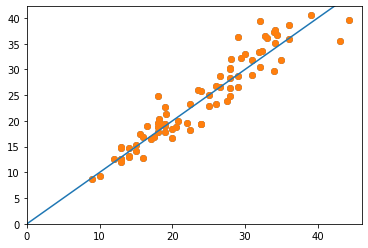

# Tensor_regerssion

```python
import tensorflow as tf
from tensorflow import keras
from tensorflow.keras import layers

import pandas as pd
import numpy as np
import seaborn as sns
```

```python
print(tf.__version__)
>
2.1.0
```

```python
dataset_path = keras.utils.get_file("auto-mpg.data", "http://archive.ics.uci.edu/ml/machine-learning-databases/auto-mpg/auto-mpg.data")
dataset_path
```

```python
columns = ['mpg','cylinders','displacement','horsepower','weight','acceleration','model year','origin']
row_dataset = pd.read_csv(dataset_path,names=columns,sep=' ',comment='\t',skipinitialspace=True)
row_dataset.head()
>
mpg	cylinders	displacement	horsepower	weight	acceleration	model year	origin
18.0		8			307.0			130.0	3504.0		12.0		70	1
15.0		8			350.0			165.0	3693.0		11.5	70	1
18.0		8			318.0			150.0	3436.0		11.0	70	1
16.0		8			304.0			150.0	3433.0		12.0	70	1
17.0		8			302.0			140.0	3449.0		10.5	70	1
```

- skipinitialspace=True : 앞에 NULL값을 지운다.

```python
dataset = row_dataset.copy()
dataset.info()
>
<class 'pandas.core.frame.DataFrame'>
RangeIndex: 398 entries, 0 to 397
Data columns (total 8 columns):
 #   Column        Non-Null Count  Dtype  
---  ------        --------------  -----  
 0   mpg           398 non-null    float64
 1   cylinders     398 non-null    int64  
 2   displacement  398 non-null    float64
 3   horsepower    398 non-null    object 
 4   weight        398 non-null    float64
 5   acceleration  398 non-null    float64
 6   model year    398 non-null    int64  
 7   origin        398 non-null    int64  
dtypes: float64(4), int64(3), object(1)
memory usage: 25.0+ KB
```

```python
dataset['origin'].unique()
>
array([1, 3, 2], dtype=int64)
```

- 연속형 데이터보다는 범주형 데이터로 보임

#### 데이터 정제

- 결측치 확인

```python
dataset.isna().sum()
>
mpg             0
cylinders       0
displacement    0
horsepower      0
weight          0
acceleration    0
model year      0
origin          0
dtype: int64
```

```python
dataset['horsepower'].replace('?',np.nan,inplace=True)
```

```python
dataset.isna().sum()
>
mpg             0
cylinders       0
displacement    0
horsepower      6
weight          0
acceleration    0
model year      0
origin          0
dtype: int64
```

```python
dataset['horsepower'].replace('?',np.nan,inplace=True)
dataset = dataset.dropna(subset=['horsepower'],axis=0)
dataset['horsepower'] = dataset['horsepower'].astype(float)
```

#### origin은 수치형이 아니고 범주형이므로 원-핫-인코딩을 통한 변환이 필요하다.

```python
origin = dataset.pop('origin')
```

```python
# 1 == USA 2 == Europe 3 == Korea
origin = dataset.pop('origin')
dataset['usa'] = (origin ==1) * 1.0
dataset['europe'] = (origin == 2)*2.0
dataset['korea'] = (origin == 3) * 3.0
dataset
```

#### 세트 분할

```python
train_set = dataset.sample(frac=.8,random_state=0)
test_set  = dataset.drop(train_set.index)
```

- train에 있는 인덱스만 제외하면 test가 되는 놀라운 마법

```python
sns.pairplot(train_set[['mpg','cylinders','displacement','weight']],diag_kind='kde')
```


- diag_kind='kde' : 각 변수별 커널밀도추정곡선

```python
train_state = train_set.describe().T
>
count	mean	std	min	25%	50%	75%	max
mpg	314.0	23.310510	7.728652	10.0	17.0	22.0	28.95	46.6
cylinders	314.0	5.477707	1.699788	3.0	4.0	4.0	8.00	8.0
displacement	314.0	195.318471	104.331589	68.0	105.5	151.0	265.75	455.0
weight	314.0	2990.251592	843.898596	1649.0	2256.5	2822.5	3608.00	5140.0
acceleration	314.0	15.559236	2.789230	8.0	13.8	15.5	17.20	24.8
model year	314.0	75.898089	3.675642	70.0	73.0	76.0	79.00	82.0
usa	314.0	0.624204	0.485101	0.0	0.0	1.0	1.00	1.0
europe	314.0	0.356688	0.766826	0.0	0.0	0.0	0.00	2.0
korea	314.0	0.592357	1.196135	0.0	0.0	0.0	0.00	3.0
```

- 이 정보를 보고 정규화가 필요한 지 살펴봐야 한다.

#### 테스트,트레인 데이터 나누기

```python
y_train = train_set.pop('mpg')
y_test  = test_set.pop('mpg')
```

#### 데이터 정규화

```python
def norm(x):
    return (x -train_state['mean'] )/train_state['std']
norm_train_set = norm(train_set)
norm_test_set = norm(test_set)
```

#### 모델만들기

```python
model = keras.Sequential([
    layers.Dense(50, activation='relu', input_shape=[len(train_set.keys())]),
    layers.Dense(50, activation='relu'),
    layers.Dense(1)   
])
```

```python
optimizer = tf.keras.optimizers.RMSprop()
model.compile(loss='mse',optimizer = optimizer,metrics=['mae','mse'])
```

- optimizer : 학습을 통해 최적화된 결정계수를 찾아준다

```python
model.summary()
>
Model: "sequential_1"
_________________________________________________________________
Layer (type)                 Output Shape              Param #   
=================================================================
dense (Dense)                (None, 50)                500       
_________________________________________________________________
dense_1 (Dense)              (None, 50)                2550      
_________________________________________________________________
dense_2 (Dense)              (None, 1)                 51        
=================================================================
Total params: 3,101
Trainable params: 3,101
Non-trainable params: 0
_________________________________________________________________
```

```python
sample_result
>
array([[-0.02574456],
       [-0.04394148],
       [ 0.3024744 ],
       [-0.12835589],
       [-0.19559836],
       [ 0.03364658],
       [-0.2264496 ],
       [ 0.0435816 ],
       [ 0.05071799],
       [-0.12676515]], dtype=float32)
```

- 정상적으로 모델이 만들어지고 출력된다.

```python
# 모델 학습
class PrintDot(keras.callbacks.Callback):
      def on_epoch_end(self, epoch, logs):
        if epoch % 100 == 0: print('')
        print('.', end='')

# 훈련정확도와 검증 정확도 : history
history = model.fit(norm_train_set , y_train, epochs=1000, validation_split=.2,verbose=0,callbacks=[PrintDot()])
```

```python
# 예측
loss, mae, mse = model.evaluate(norm_test_set, y_test,verbose=1)
print('평균 절대 오차 : ',mae)
>
78/78 [==============================] - 0s 127us/sample - loss: 7.4386 - mae: 2.1129 - mse: 7.4385
평균 절대 오차 :  2.1129177
```

- verbose=1 : 디버깅 출력하기 <-> 0은 출력  X

#### 시각화 하기

```python
import matplotlib.pyplot as plt
# 시각화
y_pred = model.predict(norm_test_set).flatten()
plt.scatter(y_test, y_pred)
plt.xlim([0,plt.xlim()[1]])
plt.ylim([0,plt.ylim()[1]])
plt.scatter(y_test, y_pred)
_ = plt.plot([-100,100],[-100,100])
plt.show()
```

- flatten() : 1차원으로 바뀐다.
- 점들을 살펴보며 점들이 평균에 얼마나 잘 붙어있는지 확인한다.
- 지금은 잘 붙어있다.잘예측했다고 볼 수 있다.



```python
hist = pd.DataFrame(history.history)
hist
>
		loss		mae			mse			val_loss	val_mae	val_mse
0	569.319620	22.512943	569.319580	561.981839	22.297806	561.981812
1	523.055447	21.480591	523.055481	515.491197	21.243435	515.491211
2	479.201116	20.462254	479.201111	466.473647	20.097586	466.473663
3	431.579682	19.329754	431.579651	411.844434	18.778084	411.844421
4	379.350310	18.035198	379.350281	353.461252	17.271782	353.461243
...	...	...	...	...	...	...
995	3.282805	1.128578	3.282805	10.645117	2.501283	10.645117
996	3.196739	1.121250	3.196739	10.828256	2.489370	10.828257
997	3.063228	1.112146	3.063229	10.797193	2.496689	10.797193
998	2.935681	1.071100	2.935681	11.136614	2.568803	11.136614
999	3.443610	1.176183	3.443610	10.656014	2.494929	10.656013
```

- mae가 점점 낟아지는 걸보니 잘 예측했다.