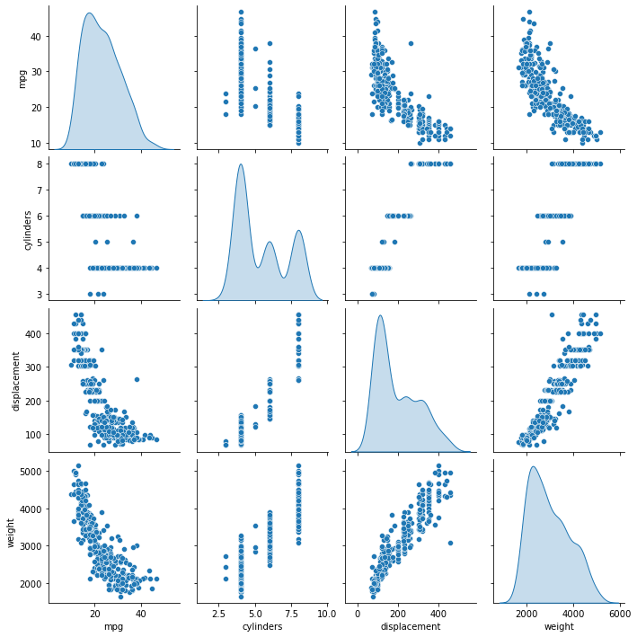

# Tensor_regerssion

```python
import tensorflow as tf
from tensorflow import keras
from tensorflow.keras import layers

import pandas as pd
import numpy as np
import seaborn as sns
```

```python
print(tf.__version__)
>
2.1.0
```

```python
dataset_path = keras.utils.get_file("auto-mpg.data", "http://archive.ics.uci.edu/ml/machine-learning-databases/auto-mpg/auto-mpg.data")
dataset_path
```

```python
columns = ['mpg','cylinders','displacement','horsepower','weight','acceleration','model year','origin']
row_dataset = pd.read_csv(dataset_path,names=columns,sep=' ',comment='\t',skipinitialspace=True)
row_dataset.head()
>
mpg	cylinders	displacement	horsepower	weight	acceleration	model year	origin
18.0		8			307.0			130.0	3504.0		12.0		70	1
15.0		8			350.0			165.0	3693.0		11.5	70	1
18.0		8			318.0			150.0	3436.0		11.0	70	1
16.0		8			304.0			150.0	3433.0		12.0	70	1
17.0		8			302.0			140.0	3449.0		10.5	70	1
```

- skipinitialspace=True : 앞에 NULL값을 지운다.

```python
dataset = row_dataset.copy()
dataset.info()
>
<class 'pandas.core.frame.DataFrame'>
RangeIndex: 398 entries, 0 to 397
Data columns (total 8 columns):
 #   Column        Non-Null Count  Dtype  
---  ------        --------------  -----  
 0   mpg           398 non-null    float64
 1   cylinders     398 non-null    int64  
 2   displacement  398 non-null    float64
 3   horsepower    398 non-null    object 
 4   weight        398 non-null    float64
 5   acceleration  398 non-null    float64
 6   model year    398 non-null    int64  
 7   origin        398 non-null    int64  
dtypes: float64(4), int64(3), object(1)
memory usage: 25.0+ KB
```

```python
dataset['origin'].unique()
>
array([1, 3, 2], dtype=int64)
```

- 연속형 데이터보다는 범주형 데이터로 보임

#### 데이터 정제

- 결측치 확인

```python
dataset.isna().sum()
>
mpg             0
cylinders       0
displacement    0
horsepower      0
weight          0
acceleration    0
model year      0
origin          0
dtype: int64
```

```python
dataset['horsepower'].replace('?',np.nan,inplace=True)
```

```python
dataset.isna().sum()
>
mpg             0
cylinders       0
displacement    0
horsepower      6
weight          0
acceleration    0
model year      0
origin          0
dtype: int64
```

```python
dataset = dataset.dropna()
```

#### origin은 수치형이 아니고 범주형이므로 원-핫-인코딩을 통한 변환이 필요하다.

```python
origin = dataset.pop('origin')
```

```python
# 1 == USA 2 == Europe 3 == Korea
origin = dataset.pop('origin')
dataset['usa'] = (origin ==1) * 1.0
dataset['europe'] = (origin == 2)*2.0
dataset['korea'] = (origin == 3) * 3.0
dataset
```

#### 세트 분할

```python
train_set = dataset.sample(frac=.8,random_state=0)
test_set  = dataset.drop(train_set.index)
```

- train에 있는 인덱스만 제외하면 test가 되는 놀라운 마법

```python
sns.pairplot(train_set[['mpg','cylinders','displacement','weight']],diag_kind='kde')
```



- diag_kind='kde' : 각 변수별 커널밀도추정곡선

```python
train_state = train_set.describe().T
>
count	mean	std	min	25%	50%	75%	max
mpg	314.0	23.310510	7.728652	10.0	17.0	22.0	28.95	46.6
cylinders	314.0	5.477707	1.699788	3.0	4.0	4.0	8.00	8.0
displacement	314.0	195.318471	104.331589	68.0	105.5	151.0	265.75	455.0
weight	314.0	2990.251592	843.898596	1649.0	2256.5	2822.5	3608.00	5140.0
acceleration	314.0	15.559236	2.789230	8.0	13.8	15.5	17.20	24.8
model year	314.0	75.898089	3.675642	70.0	73.0	76.0	79.00	82.0
usa	314.0	0.624204	0.485101	0.0	0.0	1.0	1.00	1.0
europe	314.0	0.356688	0.766826	0.0	0.0	0.0	0.00	2.0
korea	314.0	0.592357	1.196135	0.0	0.0	0.0	0.00	3.0
```

- 이 정보를 보고 정규화가 필요한 지 살펴봐야 한다.