# 시각화_01

### 학습목표
- 시각화 패키지 matplotlib
- 서브 패키지 pyplot
- seaborn
- 분석된 내용을 시각화 
- Pandas 시각화 기능

```python
import pandas as pd
import numpy as np
import matplotlib as mpl
import matplotlib.pyplot as plt
%matplotlib inline
```

- %matplotlib inline : 주피터에서 라인 그릴 때 사용

```python
import matplotlib.pyplot as plt
%matplotlib inline

import platform

from matplotlib import font_manager, rc
# plt.rcParams['axes.unicode_minus'] = False

if platform.system() == 'Darwin':
    rc('font', family='AppleGothic')
elif platform.system() == 'Windows':
    path = "c:/Windows/Fonts/malgun.ttf"
    font_name = font_manager.FontProperties(fname=path).get_name()
    rc('font', family=font_name)
else:
    print('Unknown system... sorry~~~~') 
```

- 한글 깨짐 방지

#### line plot : 데이터가 시간, 순서 등에 따라 어떻게 변화하는지를 보여주는

```python
plt.title('line plot')
plt.plot([10,20,30,40],[1,4,9,16]) #ndarray나 list이여도 상관 없음
plt.xlabel('x 라벨')
plt.ylabel('y 라벨')
plt.show()
```

- [1,4,9,16] :  ndarray나 list이여도 상관 없음
- title : 제목 주는 것

- plt.plot([x축],[y축])

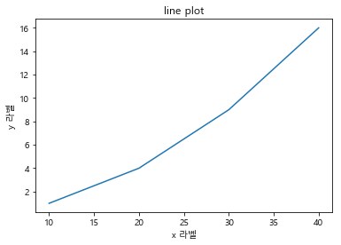

#### option(color, marker, style)

- 약어 -> b(blue), r(red), . o (마커), - or -- or : or -. 등등

```python
plt.title('line plot')
plt.plot([10,20,30,40],[1,4,9,16],'rs--')
plt.xlabel('x 라벨')
plt.ylabel('y 라벨')
plt.show()
```

- 'rs--'
  - 빨간색과 square 마커와 --스타일

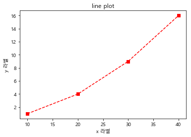

#### 라인 플롯에서 자주 사용되는 기타 스타일


```python
plt.title('스타일 적용')
plt.plot([10,20,30,40],[1,4,9,16],c='b',lw=5,ls='--',marker='o',ms=15,mec='g',mew=5,mfc='r')
plt.xlabel('x 라벨')
plt.ylabel('y 라벨')
plt.show()
```

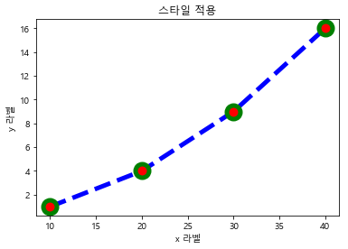

**x,y 구간 지정**

```python
plt.title('스타일 적용')
plt.plot([10,20,30,40],[1,4,9,16],c='b',lw=5,ls='-.',marker='o',ms=15,mec='g',mew=5,mfc='r') 
plt.xlabel('x 라벨')
plt.ylabel('y 라벨')
plt.xlim(0,50)
plt.ylim(-10,30)
plt.show()
```


#### tick : x,y축에 지정되는 한 지점

- xticks, yticks

```python
X = np.linspace(-np.pi, np.pi,256)
Y = np.cos(X)
plt.plot(X,Y)
plt.show()
```


```python
X = np.linspace(-np.pi, np.pi,256)
Y = np.cos(X)
plt.plot(X,Y)
plt.xticks([-np.pi,-np.pi/2,0,np.pi/2,np.pi])
plt.yticks([-1,0,1])
plt.grid(True)
plt.show()
```

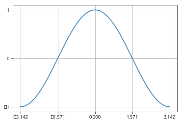

- xticks과 yticks을 넣어서 범위를 지정하였다.
- grid를 추가하여 격자를 주었다.

#### 여러개의 라인 플롯 그리기

```python
data = np.arange(0. , 5.0, 0.2)
data
plt.title('여러개의 라인 플롯')
plt.plot(data,data,'r--',data, data**2, 'g-',data,data**3,'b-.')
plt.show()
```

- plot안에 여러개의 데이터를 넣으면 된다.

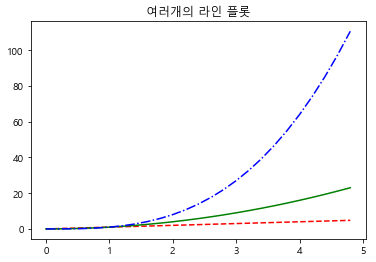

#### 라인 겹쳐 그리기

```python
plt.title('라인을 겹쳐 그리기')
plt.plot([1,4,9,16],c='b',lw=5,ls='--',marker='o',ms=15,mec='g',mew=5,mfc='g') 
plt.plot([5,9,3,2],c='k',lw=5,ls='-.',marker='s',ms=15,mec='m',mew=7,mfc='c') 
plt.show() 
```

-  y축을 기준으로 겹쳐 그린다.

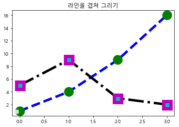

#### 범례주기

```python
X = np.linspace(-np.pi, np.pi,256)
Y_C , Y_S = np.cos(X), np.sin(X)
plt.plot(X,Y_C,ls='--',label='cosine')
plt.plot(X,Y_S,ls='--',label='sine')
plt.legend(loc=0)
plt.show()
```

- 범례는  0 ~ 10까지
  - 0은 가장 최적의 위치에 알아서 들어간다.
  - 1 : 오른쪽 탑, 2 : 왼쪽 탑, 3 : 왼쪽 아래, 4 : 오른쪽 아래, 5 : 오른쪽 중앙, 6 : 왼쪽 중앙, 7 : 오른쪽 중앙, 8 : 아래 중간, 9 : 위 중간 , 10 : 정 가운데

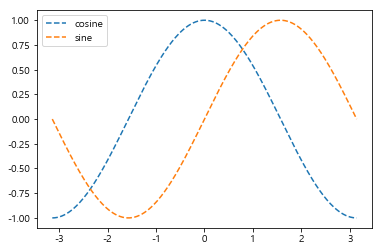

#### 여러개 그리기

- matplotlib 그림을 그리는 객체, Figure, Axes, Axis 객체를 포함하고 있다.
- Figure -> 그림이 그려지는 종이 뜻
- Axes -> 플롯
- Axis -> 축
- subplot(2,1,1) 2행 1열 첫번째
- subplot(2,1,2) 2행 1열 두번째

```python
X1 = np.linspace(0.0, 5.0)
Y1 = np.cos(2 * np.pi) * np.exp(-X1)
X2 = np.linspace(0.0, 2.0)
Y2 = np.cos(2 * np.pi * X2)
```

```python
axes01 = plt.subplot(2,1,1)
plt.plot(X1,Y1)
plt.title('subplot 01')
axes02 = plt.subplot(2,1,2)
plt.plot(X2,Y2)
plt.title('subplot 02')
plt.tight_layout() # 자동으로 간격을 맞춰주는 역할
plt.show()
```

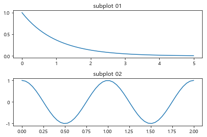

```python
axes01 = plt.subplot(1,2,1)
plt.plot(X1,Y1)
plt.title('subplot 01')
axes02 = plt.subplot(1,2,2)
plt.plot(X2,Y2)
plt.title('subplot 02')

plt.tight_layout() # 자동으로 간격을 맞춰주는 역할
plt.show()
```

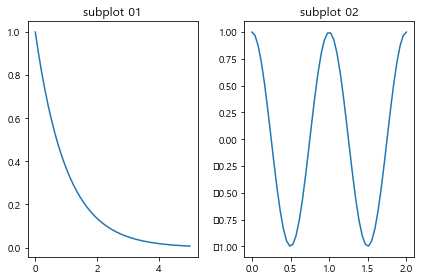

### 플롯의 유형

- line plot
- scatter plot
- contour plot
- surface plot
- bar plot
- box plot
- histogram plot

#### bar plot

-  x 데이터는 카테코리 값인 경우가 대부분

```python
import matplotlib.pylab as plt
```

- import 한다.

```python
Y = [2,3,1]
X = np.arange(len(Y))

xlabel = ['1등실','2등실','3등실']
plt.title('bar plot')
plt.bar(X,Y)
plt.xticks(X, xlabel)
plt.yticks(sorted(Y))
plt.xlabel('선실 등급')
plt.ylabel('생존자 수')
plt.show()
```

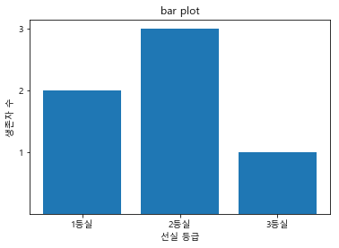

- xticks에 x를 주고 그거의 이름을 xlabel로 준다.

```python
Y = [2,3,1]
X = np.arange(len(Y))

xlabel = ['1등실','2등실','3등실']
plt.title('bar plot')
plt.barh(X,Y)
plt.xticks(sorted(Y))
plt.yticks(X, xlabel)
plt.xlabel('생존자 수')
plt.ylabel('선실 등급')
plt.show()
```

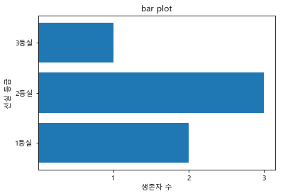

```python
import seaborn as sns
iris = sns.load_dataset('iris')
iris.head()
>
	sepal_length	sepal_width	petal_length	petal_width	species
0			5.1				3.5			1.4			0.2		setosa
1			4.9				3.0			1.4			0.2		setosa
2			4.7				3.2			1.3			0.2		setosa
3			4.6				3.1			1.5			0.2		setosa
4			5.0				3.6			1.4			0.2		setosa
```

```python
iris.rename(columns={iris.columns[0] : 'SL',
                    iris.columns[1] : 'SW',
                    iris.columns[2] : 'PL',
                    iris.columns[3] : 'PW',
                    iris.columns[4] : 'Y'},inplace=True)
iris
>
	SL	SW	PL	PW		Y
0	5.1	3.5	1.4	0.2	setosa
1	4.9	3.0	1.4	0.2	setosa
```

```python
iris.loc[:5,['SL','SW']]
iris[['SL','SW']][:5]
>
	SL	SW
0	5.1	3.5
1	4.9	3.0
2	4.7	3.2
3	4.6	3.1
4	5.0	3.6
5	5.4	3.9
```

##### 종을 기준으로 그룹화를 하여 각 그룹의 평균을 구해보자

```python
spec_mean = iris.groupby('Y').agg('mean')
spec_mean
>
			SL		SW			PL		PW
Y				
setosa		5.006	3.428	1.462	0.246
versicolor	5.936	2.770	4.260	1.326
virginica	6.588	2.974	5.552	2.026
```

```python
spec_mean.columns.name = 'SP'
spec_mean
>	
SP			SL		SW		PL		PW
Y				
setosa		5.006	3.428	1.462	0.246
versicolor	5.936	2.770	4.260	1.326
virginica	6.588	2.974	5.552	2.026
```

- columns.name = 'SP' : 컬럼에 이름을 준다.

```python
spec_mean.T
>
Y	setosa	versicolor	virginica
SP			
SL	5.006	5.936		6.588
SW	3.428	2.770		2.974
PL	1.462	4.260		5.552
PW	0.246	1.326		2.026
```

#### 그래프 그려보기

```python
spec_mean.T.plot.bar(rot=0)
plt.title('각 변수별 평균')
plt.xlabel('평균')
plt.ylabel('변수')
plt.ylim(0,8)
plt.show()
```

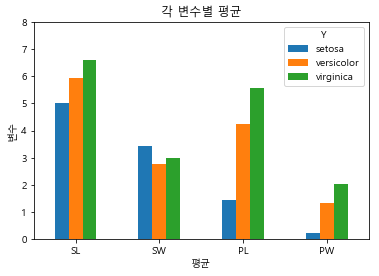

- rot는 x축의 문자의 각도를 말한다.

##### iris boxplot

```python
iris[['SL','Y']].head()
>
	SL	Y
0	5.1	setosa
1	4.9	setosa
2	4.7	setosa
3	4.6	setosa
4	5.0	setosa
```

```python
iris[['SL','Y']].boxplot(by='Y')
plt.title('종에 따른 SL의 boxplot')
plt.xlabel('종')
plt.ylabel('길이')
plt.tight_layout(pad=2)
plt.show()
```

- 기준을 Y로 하겠다.
- pad=2 : 제목의 간격을 2로 주겠다.

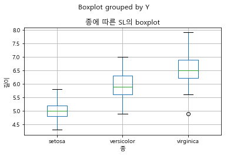

- 이상치를 확인 할 수 있다.

**한 화면에서 비교해보자**

```python
fig, axes = plt.subplots(nrows=2, ncols=2, figsize=(20,10))

ax = axes.flatten() 

iris[['SL','Y']].boxplot(by='Y', ax = ax[0])
plt.title('종에 따른 SL의 boxplot')
plt.xlabel('종')
plt.ylabel('길이')


iris[['SW','Y']].boxplot(by='Y', ax = ax[1])
plt.title('종에 따른 SW의 boxplot')
plt.xlabel('종')
plt.ylabel('길이')


iris[['PL','Y']].boxplot(by='Y', ax = ax[2])
plt.title('종에 따른 PL의 boxplot')
plt.xlabel('종')
plt.ylabel('길이')


iris[['PW','Y']].boxplot(by='Y', ax = ax[3])
plt.title('종에 따른 PW의 boxplot')
plt.xlabel('종')
plt.ylabel('길이')

plt.show()
```

- 행과 열, plot을 그릴 개수를 받는다.
- ax : figure안에 들어가는 plot의 개수. 
- flatten : 그림을 그리겠다.
- ax = ax[0] : 위치를 지정한다.


- 이렇게 하면 한 번에 다 볼 수 있다.

### car_mpg.xls [실습]

```python
xls = pd.ExcelFile('./data/car_mpg.xlsx')
data_df = xls.parse(xls.sheet_names[0])
data_df.head()
>
manufacturer	model	displ	year	cyl	trans		drv	cty	hwy	fl	class
1	audi		a4		1.8		1999	4	auto(l5)	f	18	29	p	compact
2	audi		a4		1.8		1999	4	manual(m5)	f	21	29	p	compact
3	audi		a4		2.0		2008	4	manual(m6)	f	20	31	p	compact
4	audi		a4		2.0		2008	4	auto(av)	f	21	30	p	compact
5	audi		a4		2.8		1999	6	auto(l5)	f	16	26	p	compact
```

- 엑셀은 `ExcelFile` 로 읽어온다.
- 그 다음에 `parse(xls.sheet_names[0])` 로 몇번 시트를 읽어올지 지정해준다.

```python
data_df.info()
>
<class 'pandas.core.frame.DataFrame'>
Int64Index: 234 entries, 1 to 234
Data columns (total 11 columns):
manufacturer    234 non-null object
model           234 non-null object
displ           234 non-null float64
year            234 non-null int64
cyl             234 non-null int64
trans           234 non-null object
drv             234 non-null object
cty             234 non-null int64
hwy             234 non-null int64
fl              234 non-null object
class           234 non-null object
dtypes: float64(1), int64(4), object(6)
memory usage: 21.9+ KB
```

```python
data_df['fl'].head()
>
1    p
2    p
3    p
4    p
5    p
Name: fl, dtype: object
```

```python
row, col = data_df.shape
print(row, col)
>
234 11
```

```python
# 기술통계 값
data_df.describe()
>
		displ		year		cyl			cty			hwy
count	234.000000	234.000000	234.000000	234.000000	234.000000
mean	3.471795	2003.500000	5.888889	16.858974	23.440171
std		1.291959	4.509646	1.611534	4.255946	5.954643
min		1.600000	1999.000000	4.000000	9.000000	12.000000
25%		2.400000	1999.000000	4.000000	14.000000	18.000000
50%		3.300000	2003.500000	6.000000	17.000000	24.000000
75%		4.600000	2008.000000	8.000000	19.000000	27.000000
max		7.000000	2008.000000	8.000000	35.000000	44.000000
```

- 양적자료 : 요약정보에 집계가 되는 컬럼으로 관측된 값이 수치 형태의 속성을 가지는 자료
- 양적자료의 시각화 : boxplot
- 배기량, 생산년도, 실린더 개수, 도시연비, 고속도로 연비


- 질적자료 : 범주형 또는 순서 형태의 속성을 가지는 자료로서 도수 분포표, 히스트그램으로 데이터의 분포를 확인해야하는 값들
- 제조회사, 모델명, 변속기의 종류, 구동방식 ,연료종류, 자동차 종류

####  양적자료 데이터 분포 확인(boxplot)

```python
data_df.boxplot(["displ",'cyl','cty','hwy'])
plt.show()
```

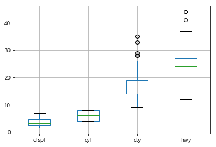

- 먼저 이러한 데이터를 분석해야 한다.

#### 질적 자료의 데이터 분포 확인

```python
data_df['manufacturer'].value_counts()
>
dodge         37
toyota        34
volkswagen    27
ford          25
chevrolet     19
audi          18
hyundai       14
subaru        14
nissan        13
honda          9
jeep           8
pontiac        5
land rover     4
mercury        4
lincoln        3
Name: manufacturer, dtype: int64
```

#### 자동차 배기량(dipal)에 따라 고속도로 연비(hwy)가 다른지를 알아보자

- 배기량이 4 이하인 자동차와 5이상인 자동차 중 어떤 자동차의 고속도로 연비가 평균적으로  높은지를 알아보자

```python
data_4 = data_df[data_df['displ'] <= 4  ]['hwy']
data_5 = data_df[data_df['displ'] >= 5  ]['hwy']
display(data_4.mean())
display(data_5.mean())
>
25.96319018404908
18.07894736842105
```

- 우선 연비가 4 이하인 것과 5이상인 것들의 고속도로 연비 컬럼만 뽑아서 변수에 담는다.
- 평균을 출력해서 비교해본다.
- 4이하인 것들의 평균 고속도로 연비가 더 높다.

#### query() 이용

```python
print(data_df.query('displ <= 4')['hwy'].mean())
print(data_df.query('displ >= 5')['hwy'].mean())
>
25.96319018404908
18.07894736842105
```

#### 자동차 제조 화시에 따라 도시 연비가 다른지 알아보려고 한다.

- audi 와 toyota 중 어느 manufacturer의 cty가 평균적으로 더 높은지 알아보시오.

```python
print(data_df.query('manufacturer == "audi"')['cty'].mean())
print(data_df.query('manufacturer == "toyota"')['cty'].mean())
>
17.61111111111111
18.529411764705884
```

- toyota가 더 높다.

#### 쉐보레, 포드, 혼다 자동차의 고속도로 연비 평균을 알아보려고 한다.

- 이 회사들의 데이터를 추출한 후 hwy 전체 평균을 확인하시오.

```python
print(data_df.query('manufacturer == "chevrolet" | manufacturer == "ford" | manufacturer ==  "honda"')['hwy'].mean())
> 22.50943396226415
```

```python
manufac_car = ["chevrolet", "ford","honda"]
print(data_df.query('manufacturer in @manufac_car')['hwy'].mean()) 
22.50943396226415
```

- @manufac_car : `@` 는 외부 변수를 가져다 쓰겠다라는 의미.

```python
print(data_df[(data_df['manufacturer'] == 'chevrolet') | (data_df['manufacturer'] == 'ford') |  (data_df['manufacturer'] == 'honda') ]['hwy'].mean())
>
22.50943396226415
```

```python
c_idx = data_df['manufacturer'] == 'chevrolet'
f_idx = data_df['manufacturer'] == 'ford'
h_idx = data_df['manufacturer'] == 'honda'

temp_df = data_df.loc[c_idx |f_idx |h_idx,:]
mean_df = temp_df[['manufacturer','hwy']].groupby(temp_df.manufacturer).agg(np.mean)
mean_df.plot.bar()
print('세 자동차 회사의 hwy의 평균 : ', temp_df['hwy'].mean())
```

- df로 만들어서 차트를 그릴 수 있다.

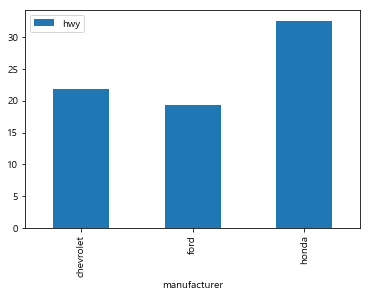