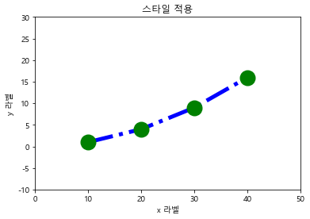

# 시각화_01

### 학습목표
- 시각화 패키지 matplotlib
- 서브 패키지 pyplot
- seaborn
- 분석된 내용을 시각화 
- Pandas 시각화 기능

```python
import pandas as pd
import numpy as np
import matplotlib as mpl
import matplotlib.pyplot as plt
%matplotlib inline
```

- %matplotlib inline : 주피터에서 라인 그릴 때 사용

```python
import matplotlib.pyplot as plt
%matplotlib inline

import platform

from matplotlib import font_manager, rc
# plt.rcParams['axes.unicode_minus'] = False

if platform.system() == 'Darwin':
    rc('font', family='AppleGothic')
elif platform.system() == 'Windows':
    path = "c:/Windows/Fonts/malgun.ttf"
    font_name = font_manager.FontProperties(fname=path).get_name()
    rc('font', family=font_name)
else:
    print('Unknown system... sorry~~~~') 
```

- 한글 깨짐 방지

#### line plot : 데이터가 시간, 순서 등에 따라 어떻게 변화하는지를 보여주는

```python
plt.title('line plot')
plt.plot([10,20,30,40],[1,4,9,16]) #ndarray나 list이여도 상관 없음
plt.xlabel('x 라벨')
plt.ylabel('y 라벨')
plt.show()
```

- [1,4,9,16] :  ndarray나 list이여도 상관 없음
- title : 제목 주는 것

- plt.plot([x축],[y축])


#### option(color, marker, style)

- 약어 -> b(blue), r(red), . o (마커), - or -- or : or -. 등등

```python
plt.title('line plot')
plt.plot([10,20,30,40],[1,4,9,16],'rs--')
plt.xlabel('x 라벨')
plt.ylabel('y 라벨')
plt.show()
```

- 'rs--'
  - 빨간색과 square 마커와 --스타일


#### 라인 플롯에서 자주 사용되는 기타 스타일


```python
plt.title('스타일 적용')
plt.plot([10,20,30,40],[1,4,9,16],c='b',lw=5,ls='--',marker='o',ms=15,mec='g',mew=5,mfc='r')
plt.xlabel('x 라벨')
plt.ylabel('y 라벨')
plt.show()
```


**x,y 구간 지정**

```python
plt.title('스타일 적용')
plt.plot([10,20,30,40],[1,4,9,16],c='b',lw=5,ls='-.',marker='o',ms=15,mec='g',mew=5,mfc='r') 
plt.xlabel('x 라벨')
plt.ylabel('y 라벨')
plt.xlim(0,50)
plt.ylim(-10,30)
plt.show()
```



#### tick : x,y축에 지정되는 한 지점

- xticks, yticks

```python
X = np.linspace(-np.pi, np.pi,256)
Y = np.cos(X)
plt.plot(X,Y)
plt.show()
```

```python
X = np.linspace(-np.pi, np.pi,256)
Y = np.cos(X)
plt.plot(X,Y)
plt.xticks([-np.pi,-np.pi/2,0,np.pi/2,np.pi])
plt.yticks([-1,0,1])
plt.grid(True)
plt.show()
```

- xticks과 yticks을 넣어서 범위를 지정하였다.
- grid를 추가하여 격자를 주었다.