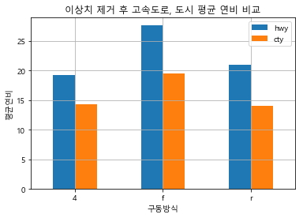

# visualization_02

#### 이상치 정제

##### car_mpg 데이터에서 구동방식별 고속도로 연비 평균과 도시연비 평균을 극단치를 제외하고 확인

##### 각 연비별 이상치 확인 boxplot()

```python
outlier_df = data_df.filter(['hwy','cty'])
outlier_df.boxplot()
```


#### quantile()

#### 3사분위 정보를 얻어본다면?

```python
quantile75 = outlier_df.quantile(q=0.75)
quantile75
>
hwy    27.0
cty    19.0
Name: 0.75, dtype: float64
```

#### 1사분위 정보를 얻어본다면?

```python
quantile25 = outlier_df.quantile(q=0.25)
quantile25
>
hwy    18.0
cty    14.0
Name: 0.25, dtype: float64
```

#### iqr ( 3사분위 수 - 1사분위 수의 차)

```python
iqr = quantile75 - quantile25
iqr
>
hwy    9.0
cty    5.0
dtype: float64
```

#### 최저 한계치 (lower fence)

```python
lower_fence = quantile25 - 1.5 * iqr
print('lower_fence', lower_fence)
>
lower_fence hwy    4.5
cty    6.5
dtype: float64
```

#### 최고 한계치(upper fence)

```python
upper_fence = quantile75 - 1.5 * iqr
print('upper_fence', upper_fence)
>
upper_fence hwy    13.5
cty    11.5
dtype: float64
```

- 이상치 제거하기 위해 만들었다. 

####  극단치 경계 값을 얻어 보자 (아래 수평선)

```python
lower_outlier = outlier_df[outlier_df > lower_fence].min()
lower_outlier
>
hwy    12
cty     9
dtype: int64
```

#### 극단치 경계 값을 얻어 보자 (위 수평선)

```python
upper_outlier = outlier_df[outlier_df < upper_fence].max()
upper_outlier
>
hwy    37.0
cty    26.0
dtype: float64
```

- 위 그래프를 보면 아래는 이상치가 없고 위만 있다.

#### 이상치를 결측값으로 변경

#####  고속도로 연비의 이상치 데이터 추출

```python
hwy_outlier_df = data_df.query('hwy >'+str(upper_outlier['hwy']))
hwy_outlier_df
>
	manufacturer	model	displ	year	cyl	trans	drv	cty	hwy	fl	class
213	volkswagen	jetta	1.9	1999	4	manual(m5)	f	33	44	d	compact
222	volkswagen	new beetle	1.9	1999	4	manual(m5)	f	35	44	d	subcompact
223	volkswagen	new beetle	1.9	1999	4	auto(l4)	f	29	41	d	subcompact
```

- str인 이유는` 'hwy > 숫자' `이런 식이어야 하니깐 결합할 때 `'50'`이렇게 해야 `'hwy > 50'`으로 연결된다.

##### 도시 연비의 이상치 데이터 추출

```python
cty_outlier_df = data_df.query('cty >'+str(upper_outlier['cty']))
cty_outlier_df
>
	manufacturer	model	displ	year	cyl	trans	drv	cty	hwy	fl	class
100	honda	civic	1.6	1999	4	manual(m5)	f	28	33	r	subcompact
197	toyota	corolla	1.8	2008	4	manual(m5)	f	28	37	r	compact
213	volkswagen	jetta	1.9	1999	4	manual(m5)	f	33	44	d	compact
222	volkswagen	new beetle	1.9	1999	4	manual(m5)	f	35	44	d	subcompact
223	volkswagen	new beetle	1.9	1999	4	auto(l4)	f	29	41	d	subcompact
```

#### copy()

```python
outlier_clean_df = data_df.copy()
outlier_clean_df
>
manufacturer	model	displ	year	cyl	trans	drv	cty	hwy	fl	class
1	audi	a4	1.8	1999	4	auto(l5)	f	18	29	p	compact
2	audi	a4	1.8	1999	4	manual(m5)	f	21	29	p	compact
```

#### hwy 연비에 대한 이상치를 결측값으로 변경

```python
for idx in hwy_outlier_df.index:
    print(idx)
    outlier_clean_df.loc[idx,'hwy'] = np.nan
outlier_clean_df
>
213
222
223
```

- hwy_outlier_df의 인덱스를 가져와서 활용한다.

#### cty 연비에 대한 이상치를 결측값으로 변경

```python
for idx in cty_outlier_df.index:
    print(idx)
    outlier_clean_df.loc[idx,'cty'] = np.nan
outlier_clean_df.head()
>
100
197
213
222
223
```

#### 결측치 확인하기

```python
outlier_clean_df.filter(['hwy','cty']).isna().sum()
>
hwy    3
cty    5
dtype: int64
```

#### 결측값 제거한 구동방식별 고속도로, 도시 연비 평균

```python
drv_mean_df = outlier_clean_df.filter(['drv','hwy','cty']).dropna().groupby('drv').mean()
drv_mean_df
>
		hwy			cty
drv		
4	19.174757	14.330097
f	27.584158	19.445545
r	21.000000	14.080000
```

- 결측값일 제거한 후 평균을 구하였다.

#### 시각화

```python
drv_mean_df.plot.bar(rot=0)
plt.grid()
plt.title('이상치 제거 후 고속도로, 도시 평균 연비 비교')
plt.xlabel('구동방식')
plt.ylabel('평균연비')
plt.show()
```



### 이상치 제거 다시 확인하기

```python
outlier_df = outlier_clean_df.filter(['hwy','cty'])
outlier_df.boxplot()
```


- 이상치들이 사라졌다.

- upper 만 이상치가 있어서 upper만 실행한 것이고 lower에도 이상치가 있으면 lower도 진행해야 한다.

#### pie chart()

- 카테코리별 값의 상대적 비교를 해야할 경우
- 차트의 원형을 유지 : plt.axis('equal')

```python
labels = ['낙지볶음밥','냉면','짜장면','짬뽕','탕수육']
sizes  = [15,15,20,25,25]
colors = ['gold','blue','red','yellow','green']


plt.title('Pie chart')
plt.pie(sizes, labels = labels,colors = colors,shadow=True,autopct='%1.1f%%')
plt.axis('equal')
plt.show()
```

- sizes 이건 맨 처음에 들어가야 한다.


#### histogram

- 구간에 대한 데이터 집계를 시각화 할 때

```python
data = np.random.randn(1000)

plt.title('histogram')
plt.hist(data, bins=20)
plt.show()
```

- bins : 막대사이즈 
  - 커질 수록 밀집한다.

