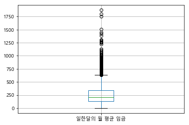
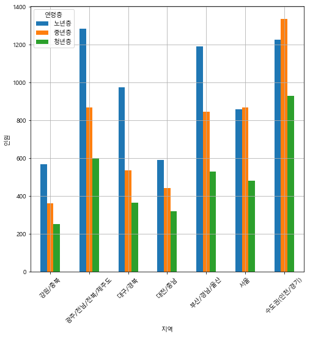

# visualization_02_실습

- 데이터 빈도(히스토그램, 박스)
- 데이터 전처리
- 변수 검토
- 변수간 관계 분석 및 시각화

```python
import pandas as pd
import numpy as np
import matplotlib as mpl
import matplotlib.pyplot as plt
import matplotlib.pylab as plt
import datetime as dt
%matplotlib inline
import matplotlib
matplotlib.rcParams['axes.unicode_minus'] = False
```

```python
import matplotlib.pyplot as plt
%matplotlib inline

import platform

from matplotlib import font_manager, rc
# plt.rcParams['axes.unicode_minus'] = False

if platform.system() == 'Darwin':
    rc('font', family='AppleGothic')
elif platform.system() == 'Windows':
    path = "c:/Windows/Fonts/malgun.ttf"
    font_name = font_manager.FontProperties(fname=path).get_name()
    rc('font', family=font_name)
else:
    print('Unknown system... sorry~~~~') 
```

```python
koweps_df = xls.parse(xls.sheet_names[0])
```

```python
data_df = koweps_df.copy()
data_df.head()
```

- 원본 훼손될 수 있으니 카피해서 사용하자.

#### 해당 데이터 프레임에서 제공해 드린 컬럼들만 추출하여 변수명을 사용하고자 하는 컬럼들만 rename하세요.

```python
data_df.rename(columns={'h12_g3': '성별', 'h12_g4':'태어난 연도','h12_g10':'혼인상태','h12_g11':'종교','h12_eco9':'직종','p1202_8aq1':'일한달의 월 평균 임금','h12_reg7':'7개 권역별 지역구분'},inplace=True)
```

- rename으로 컬럼명을 변경하였다.

```python
data_df_col = data_df[['성별','태어난 연도','혼인상태','종교','직종','일한달의 월 평균 임금','7개 권역별 지역구분']]
data_df_col.head()
>
	성별	태어난 연도	혼인상태	종교	직종	일한달의 월 평균 임금	7개 권역별 지역구분
0	2		1936		2		2	NaN			NaN							1
1	2		1945		2		2	NaN			NaN							1
2	1		1948		2		2	NaN			NaN							1
3	1		1942		3		1	762.0		108.9						1
4	2		1923		2		1	NaN			NaN							1
```

- 사용할 컬럼만 가져온다.

#### 데이터 분석

- 성별의 데이터 분포 확인
-  성별을 비율순으로 정렬
- 데이터 시각화

```python
data_df_col.info()
>
<class 'pandas.core.frame.DataFrame'>
RangeIndex: 15422 entries, 0 to 15421
Data columns (total 7 columns):
성별              15422 non-null int64
태어난 연도          15422 non-null int64
혼인상태            15422 non-null int64
종교              15422 non-null int64
직종              7131 non-null float64
일한달의 월 평균 임금    4507 non-null float64
7개 권역별 지역구분     15422 non-null int64
dtypes: float64(2), int64(5)
memory usage: 843.5 KB
```

- null값 있는지 없는지 확인하기

```python
data_df_gender = data_df_col['성별'].value_counts()
data_df_gender.plot.pie(autopct='%d%%',
                   startangle=45,
                   legend=True,
                   shadow=True,
                   labels=data_df_gender.index)
plt.axis('equal')
plt.show()
```

- 파이차트로 비율 시각화 하기


```python
gender_filter_df = data_df_col.filter(['성별'])
gender_filter_df
>
	성별
0	2
1	2
2	1
3	1
4	2
```

- 이렇게 해서 진행 할 수 있다.

- `대괄호[]` 를 넣어줘여 값과 인덱스를 가져올 수 있다.

#### 성별값을 남, 여로 변경

```python
gender_filter_df['성별2'] = np.where(gender_filter_df['성별'] == 1 , '남', '여자')
```

- `np.where` 로 논리적인 제안을 줄 수 있다.

##### 결측값 확인

```python
gender_filter_df.isna().sum()
>
성별     0
성별2    0
dtype: int64
```

#### 데이터 분포 확인

```python
gender_cnt = gender_filter_df['성별'].value_counts()
gender_cnt
>
2    8440
1    6982
Name: 성별, dtype: int64
```

```python
gender_cnt = gender_filter_df['성별2'].value_counts()
gender_cnt
>
여자    8440
남     6982
Name: 성별2, dtype: int64
```

##### 시리즈를 데이터 프레임으로 변환

```python
gender_cnt_df = pd.DataFrame(gender_cnt)
gender_cnt_df.head()
>
	성별2
여자	8440
남	6982
```

```python
gender_cnt_df.rename(columns={'성별2' : '명'},inplace=True)
gender_cnt_df
>
		명
여자	8440
남	6982
```

##### 비율순으로 정렬

```python
gender_cnt_df.sort_values('명',inplace=True)
gender_cnt_df
>
		명
남	6982
여자	8440
```

##### 성별 분포를 시각화

```python
gender_cnt_df.plot.bar()
plt.title('성별본포')
plt.grid()
plt.xlabel('성별')
plt.ylabel('명')
for idx, value in enumerate(list(gender_cnt_df['명'])):
    txt = '%d명' % value
    plt.text(idx,value,txt,horizontalalignment='center',
            verticalalignment='bottom')
plt.show()
```

- 중간에 그래프에 데이터를 나태내기 위해 추가하였다.
  - bottom은 바닥이 아니라 그래프마지막이 bottom이다.


```python
gender_cnt.plot.pie(autopct='%d%%',
                   startangle=90,
                   legend=True,
                   shadow=True,
                   labels=gender_cnt_df.index)
plt.axis('equal')
```


- 이렇게 파이차트도 가능하다.

#### 성별에 따른 평균 급여 차이를 분석

- 성별과 월급 데이터만 추출
- 성별을 남자와 여자로 변환
- 데이터 정제(결측값 확인, 결측값 제거, 이상치 결측 처리)
- 데이터 분석(성별로 그룹화하여 그룹별 평균)
- 데이터 시각화

```python
data_df_ge_sa = data_df_col[['성별',"일한달의 월 평균 임금"]]
data_df_ge_sa['성별2'] = np.where(data_df_ge_sa['성별'] == 1 , '남', '여자')
```

- 우선 성별을 남자와 여자로 바꾸었다.

```python
data_df_ge_sa.dropna(inplace=True)
data_df_sa = data_df_ge_sa['일한달의 월 평균 임금']
```

- 결측값들을 제거하고 이상치를 확인하기 위해 월 평균 임슴만 따로 변수에 저장한다.

```python
data_df_ge_sa[['일한달의 월 평균 임금']].boxplot()
```

- 이상치 그래프를 그려본다.



```python
quantile25 = data_df_sa.quantile(q=0.25)
quantile25
>
135.0

quantile75 = data_df_sa.quantile(q=0.75)
quantile75
>
336.0

iqr = quantile75 - quantile25
iqr
>
201.0
```

- 1사분위수와 3사분위수를 구하여 iqr을 계산한다.

```python
lower_fence = quantile25 - 1.5 * iqr
upper_fence = quantile75 + 1.5 * iqr
lower_outlier = data_df_sa[data_df_sa > lower_fence].min()
upper_outlier = data_df_sa[data_df_sa < upper_fence].max()
```

- 최저한계치와 최고한계치를 구해서 `data_df_sa` 에서 이 수치들보다 높은 것들을 뽑는다.

```python
outlier_clean_df = data_df_ge_sa.copy()
sa_out = data_df_ge_sa[data_df_ge_sa['일한달의 월 평균 임금'] > upper_outlier]
for idx in sa_out.index:
    outlier_clean_df.loc[idx,'일한달의 월 평균 임금'] = np.nan
outlier_clean_df.isna().sum()
>
성별                0
일한달의 월 평균 임금    207
dtype: int64
```

- `lower_outlier ` 가 boxplot에서 없었기 때문에 upper의 이상치만 nan으로 바꾸었다.

```python
outlier_clean_df.dropna().groupby('성별').mean()
>
		일한달의 월 평균 임금
성별	
남			289.125203
여자			170.066146
```

- 최종으로 그룹지어서 평균을 하면 된다.

---

```python
gender_salary_df = data_df_col.filter(['성별','일한달의 월 평균 임금'])
gender_salary_df.head()
>
	성별	일한달의 월 평균 임금
0	2		NaN
1	2		NaN
2	1		NaN
3	1		108.9
4	2		NaN
```

```python
gender_salary_df['성별'] = np.where(gender_salary_df['성별'] == 1,'남자','여자')
gender_salary_df.head()
>
	성별	일한달의 월 평균 임금
0	여자		NaN
1	여자		NaN
2	남자		NaN
3	남자		108.9
4	여자		NaN
```

```python
print(gender_salary_df.isna().sum())
gender_salary_df.dropna(inplace=True)
print('*'*50)
print(gender_salary_df.isna().sum())
>
성별                  0
일한달의 월 평균 임금    10915
dtype: int64
**************************************************
성별              0
일한달의 월 평균 임금    0
dtype: int64
```

```python
gender_salary_df['일한달의 월 평균 임금'] = np.where(
    ((gender_salary_df['일한달의 월 평균 임금'] < 1)|(gender_salary_df['일한달의 월 평균 임금'] > 9998)),np.nan,gender_salary_df['일한달의 월 평균 임금']
)
gender_salary_df.head()
>
	성별	일한달의 월 평균 임금
3	남자		108.9
10	여자		20.0
16	남자		322.0
17	여자		120.0
24	남자		300.0
```

```python
print(gender_salary_df.isna().sum())
gender_salary_df.dropna(inplace=True)
print('*'*50)
print(gender_salary_df.isna().sum())
>
성별               0
일한달의 월 평균 임금    14
dtype: int64
**************************************************
성별              0
일한달의 월 평균 임금    0
dtype: int64
```

```python
gender_salary_mean = gender_salary_df.groupby('성별').mean()
```

```python
gender_salary_mean.plot.bar()
plt.title('성별에 따른 평균 급여 차이 분석 시각화')
plt.grid()
plt.xlabel('성별')
plt.ylabel('급여')

for idx, value in enumerate(list(gender_salary_mean['일한달의 월 평균 임금'])):
    txt = '%d만원' % value
    plt.text(idx,value,txt, horizontalalignment='center',
            verticalalignment='bottom',fontsize=10, color='red')
plt.show()
```


#### 나이에 따른 평균 급여 변화

- 데이터 전처리 (태어난 년도, 월급에 대한 컬럼 추출, 나이를 계산하여 파생변수 추가)

```python
data_df_age= data_df_col[['태어난 연도','일한달의 월 평균 임금']]
def age(x):
    sec =''
    if 90 <= dt.datetime.now().year - x <= 100:
        sec = '90대'    
    elif 80 <= dt.datetime.now().year - x <= 89:
        sec = '80대'
    elif 70 <= dt.datetime.now().year - x <= 79:
        sec = '70대'
    elif 60 <= dt.datetime.now().year - x <= 69:
        sec = '60대'
    elif 50 <= dt.datetime.now().year - x <= 59:
        sec = '50대'
    elif 40 <= dt.datetime.now().year - x <= 49:
        sec = '40대'
    elif 30 <= dt.datetime.now().year - x <= 39:
        sec = '30대'
    elif 20 <= dt.datetime.now().year - x <= 29:
        sec = '20대'
    elif 10 <= dt.datetime.now().year - x <= 19:
        sec = '10대'
    else:
        sec = '10대 이하'      
    return sec
data_df_age['나이대'] = data_df_age['태어난 연도'].apply(lambda x : age(x))
data_df_age['나이'] = data_df_age['태어난 연도'].apply(lambda x : (dt.datetime.now().year - x) + 1)
```

1. 나이대로 나누기 위하여 lambda를 이용하여 구분하였다.
2. 나이도 구하였다.

- 데이터 정제(결측값 확인, 결측값 제거, 이상치 결측 처리)

```python
print(data_df_age.isna().sum())
data_df_age.dropna(inplace=True)
print('*'*50)
print(data_df_age.isna().sum())
>
태어난 연도              0
일한달의 월 평균 임금    10915
나이대                 0
나이                  0
dtype: int64
**************************************************
태어난 연도          0
일한달의 월 평균 임금    0
나이대             0
나이              0
dtype: int64
```

1. na가 있는지 확인하고 제거하였다.

- 이상치 제거

```python
data_df_age['일한달의 월 평균 임금'] = np.where(
    ((data_df_age['일한달의 월 평균 임금'] < 1)|(data_df_age['일한달의 월 평균 임금'] > 9998)),np.nan,data_df_age['일한달의 월 평균 임금']
)
data_df_age['태어난 연도'] = np.where(
    ((data_df_age['태어난 연도'] < 1900)|(data_df_age['태어난 연도'] > 2014)),np.nan,data_df_age['태어난 연도']
)
data_df_age.head()
>
		
	태어난 연도	일한달의 월 평균 임금		나이대	나이
3		1942.0				108.9		70대		79
10		1940.0				20.0		80대		81
16		1978.0				322.0		40대		43
17		1975.0				120.0		40대		46
24		1975.0				300.0		40대		46
```

```python
print(data_df_age.isna().sum())
data_df_age.dropna(inplace=True)
print('*'*50)
print(data_df_age.isna().sum())
>
태어난 연도           0
일한달의 월 평균 임금    14
나이대              0
나이               0
dtype: int64
**************************************************
태어난 연도          0
일한달의 월 평균 임금    0
나이대             0
나이              0
dtype: int64
```

1. 월 평균 임금의 이상치와 태어난 연도의 이상치를 nan으로 바꾸고 제거하였다.

- 데이터 분석(나이별 따른 급여평균)

```python
data_df_age_mean = data_df_age.groupby(['나이대','나이'])[['일한달의 월 평균 임금']].mean()
data_df_age_mean
>
		
			일한달의 월 평균 임금
나이대		나이	
20대		22		89.333333
		23		136.720000
		24		140.807692
```

1. 나이대와 나이에 따라 평균 임금을 구하였다.

- 데이터 시각화

```python
data_df_age_mean.plot.bar(rot=0)
plt.title('나이대에 따른 평균 급여 차이 분석 시각화')
plt.grid()
plt.xlabel('나이대')
plt.ylabel('급여')

for idx, value in enumerate(list(data_df_age_mean['일한달의 월 평균 임금'])):
    txt = '%d만원' % value
    plt.text(idx,value,txt, horizontalalignment='center',
            verticalalignment='bottom',fontsize=10, color='red')
plt.show()
```


- 최종마무리 바 그래프로 시각화 하였다.

##### 연령대 구하기 다른 방법

```python
data_df_age['나이대2'] = (data_df_age['나이'] // 10 ) * 10
data_df_age.head()
>
	태어난 연도	일한달의 월 평균 임금	나이대	나이	나이대2
3		1942.0				108.9	70대		79		70
10		1940.0				20.0	80대		81		80
16		1978.0				322.0	40대		43		40
17		1975.0				120.0	40대		46		40
24		1975.0				300.0	40대		46		40
```

##### 연령대에 대한 빈도수 확인

```python
age_gen_df = data_df_age.filter(['나이','나이대']).groupby('나이대').count().sort_values(by='나이',ascending=False)
>
	 나이
나이대	
40대	1177
50대	1083
30대	842
60대	677
70대	334
20대	252
80대	137
90대	5
```

```python
year_dd = pd.DataFrame(data_df_age['나이대'].value_counts())
year_dd.sort_index(inplace=True)
year_dd
>
	나이대
20대	252
30대	842
40대	1177
50대	1083
60대	677
70대	334
80대	137
90대	5
```

##### 인덱스가 그냥 10,20 이런식일때

```python
reindex = {}
for idx in list(year_dd.index):
    reindex[idx] = '%d대' % idx
year_dd.rename(index=reindex, inplace=True)
```

```python
year_dd.plot.bar(rot=0)
plt.title('연령대 분석 시각화')
plt.grid()
plt.xlabel('연령대')
plt.ylabel('명')
for idx, value in enumerate(list(year_dd['나이대'])):
    txt = '%d명' % value
    plt.text(idx,value,txt, horizontalalignment='center',
            verticalalignment='bottom',fontsize=10, color='red')
plt.show()
```


#### 성별과 연령대 분포 분석하고 시각화

```python
df_gender_year = data_df_col[['성별','태어난 연도']]
df_gender_year
```

1. 사용할 컬럼만 가져오기

##### 성별 값을 남,여로 

```python
df_gender_year['성별'] = np.where(df_gender_year['성별'] == 1,'남자','여자')
df_gender_year.head()
>
	성별	태어난 연도
0	여자		1936
1	여자		1945
2	남자		1948
3	남자		1942
4	여자		1923
```

##### 연령대 계산하여 파생변수 추가

```python
df_gender_year['연령대'] =  (( dt.datetime.now().year - df_gender_year['태어난 연도']) + 1) // 10  * 10
```

- 나이를 계산해서 연랭대로 추가한다.

#####  데이터정제 : 이상치 확인 및 결측값 확인 후 제거

```python
df_gender_year.isna().sum()
df_gender_year['태어난 연도'] = np.where(((df_gender_year['태어난 연도'] < 1900) | (df_gender_year['태어난 연도'] > 2014)),np.nan,df_gender_year['태어난 연도'])
```

- 태어난 연도의 범위가 1900~2014여서 밖에 해당하는 값들을 nan으로 바꾼다.

```python
df_gender_year.isna().sum()
>
성별          0
태어난 연도    134
연령대         0
dtype: int64
```

##### nan 값 제거하기

```python
print(df_gender_year.isna().sum())
df_gender_year.dropna(inplace=True)
print('*'*50)
print(df_gender_year.isna().sum())
>
성별          0
태어난 연도    134
연령대         0
dtype: int64
**************************************************
성별        0
태어난 연도    0
연령대       0
dtype: int64
```

##### 성별과 연령대별로 빈도수 계산

```python
df_gender_year_gb = df_gender_year.groupby(['성별',"연령대"],as_index=False).agg('count')
df_gender_year_gb = df_gender_year_gb.rename({'태어난 연도' : '명'},axis=1)
df_gender_year_gb
```

- as_index=False : 그룹지은 컬림이 인덱스로 들어가지 않는다.

##### 성별이 컬럼, 연령대가 인덱스로 사용되고 인원수가 데이터 배치되도록 피벗구성

```python
df_gender_year_pivot = df_gender_year_gb.pivot('연령대','성별','명')
df_gender_year_pivot
>
성별	남자		여자
연령대		
0	163.0	173.0
10	732.0	710.0
20	710.0	857.0
30	636.0	679.0
40	981.0	965.0
50	1004.0	990.0
60	888.0	1060.0
70	834.0	1356.0
80	820.0	1328.0
90	132.0	254.0
100	6.0		9.0
110	NaN		1.0
```

- 피벗 테이블을 만든다.

##### 인덱스 이름을 변경

```python
df_gender_year_re = {}
for idx in list(df_gender_year_pivot.index):
    df_gender_year_re[idx] = '%d대' % idx
df_gender_year_pivot.rename(index=df_gender_year_re, inplace=True)
```

- 인덱스에 문자를 추가해서 다시 바꿔주었다.

##### 시각화

```python
df_gender_year_pivot.plot.bar(rot=0)
plt.grid()
```



#### 지역별 연령층에 관련된 분포와 연령층별 지역비율

```python
region_age_df = data_df_col.filter(['태어난 연도','7개 권역별 지역구분'])
region_age_df.head()
>
	태어난 연도	7개 권역별 지역구분
0	1936				1
1	1945				1
2	1948				1
3	1942				1
4	1923				1
```

##### 파생변수 나이를 추가하고 연도에 대한 컬럼을 제거하자.

```python
region_age_df['나이'] = (dt.datetime.now().year - region_age_df['태어난 연도']) + 1
region_age_df.drop('태어난 연도',axis=1,inplace=True)
```

- 나이를 추가하고 태어난 연도 컬럼을 제거하였다.

##### 지역 코드와 매팅되는 데이터 프레임을 만들어서 병합

```python
region_code__df = pd.DataFrame({
    '지역코드' : list(range(1,8)),
    '지역명'   : ['서울','수도권(인천/경기)','부산/경남/울산','대구/경북','대전/충남','강원/충북','광주/전남/전북/제주도']
})
>
	지역코드	지역명
0	1			서울
1	2			수도권(인천/경기)
2	3			부산/경남/울산
3	4			대구/경북
4	5			대전/충남
5	6			강원/충북
6	7			광주/전남/전북/제주도
```

- 지역 코드 테이블을 만든다.

##### 테이블 합치기

```python
merge_df = pd.merge(region_age_df,region_code__df,left_on='7개 권역별 지역구분',right_on='지역코드',how='outer')
merge_df.drop('7개 권역별 지역구분',axis=1,inplace=True)
merge_df.head()
>
	나이	지역코드	지역명
0	85			1	서울
1	76			1	서울
2	73			1	서울
3	79			1	서울
4	98			1	서울
```

- 두 개의 공통된 컬럼이 있기에 하나를 지운다.

#### 데이터 분석

##### 연령층은 나이 구간을 설정 : 나이 < 30 : 청년층, 나이 < 60 : 중년층, 그렇지 않으면 노년층

##### 연령층 파생 변수 추가

```python
def age(x):
    c = ''
    if x < 30 :
        c = '청년층'
    elif x < 60 :
        c = '중년층'
    else:
        c= '노년층'
    return c
merge_df['연령층'] = merge_df['나이'].apply(lambda x : age(x)) 
merge_df.head()
>
	나이	지역코드	지역명	연령층
0	85		1		서울	노년층
1	76		1		서울	노년층
2	73		1		서울	노년층
3	79		1		서울	노년층
4	98		1		서울	노년층
```

- lambda로 적용시켰다. 

####  case 연구 2)

##### np.select(list , list , default) -> 1차원 ,series

```python
condition01 = [(merge_df['나이'] < 30), 
               (merge_df['나이'] < 60),
               (merge_df['나이'] >= 60)] 
condition02 = ['청년층','중년층','노년층']
merge_df['연령층'] = np.select(condition01,condition02)
merge_df.head()
>
	나이	지역코드	지역명	연령층
0	85			1	서울	노년층
1	76			1	서울	노년층
2	73			1	서울	노년층
3	79			1	서울	노년층
4	98			1	서울	노년층
```

##### 지역과 연령층에 대한 빈도분포를 확인하시고

```python
region_age = merge_df.groupby(['지역명','연령층'],as_index=False)['나이'].count()
region_age.rename({'나이' : '인원'},axis=1,inplace=True)
region_age
>
		지역명				연령층			인원
0	강원/충북				노년층			567
1	강원/충북				중년층			361
2	강원/충북				청년층			252
3	광주/전남/전북/제주도	노년층			1283
4	광주/전남/전북/제주도	중년층			867
5	광주/전남/전북/제주도	청년층			599
6	대구/경북				노년층			973
7	대구/경북				중년층			537
8	대구/경북				청년층			364
9	대전/충남				노년층			591
10	대전/충남				중년층			443
11	대전/충남				청년층			321
12	부산/경남/울산			노년층			1189
13	부산/경남/울산			중년층			844
14	부산/경남/울산			청년층			531
15	서울					노년층				858
16	서울					중년층				868
17	서울					청년층				482
18	수도권(인천/경기)			노년층			1227
19	수도권(인천/경기)			중년층			1335
20	수도권(인천/경기)			청년층			930
```

- 그룹으로 묶고 인덱스는 설정하지 않는다.

##### 분석결과를 pivot 구성

##### 지역을 인덱스 연령층을 나이를 값으로 사용

```python
region_age_pivot = region_age.pivot('지역명','연령층','인원')
region_age_pivot
>
연령층					노년층	중년층	청년층
지역명			
강원/충북				567	361	252
광주/전남/전북/제주도	1283	867	599
대구/경북				973	537	364
대전/충남				591	443	321
부산/경남/울산			1189	844	531
서울						858	868	482
수도권(인천/경기)			1227	1335	930
```

##### 시각화

```python
region_age_pivot.plot(kind='bar',rot=45,figsize=(8,8))
plt.grid()
plt.xlabel('지역')
plt.ylabel('인원')
plt.show()
```

