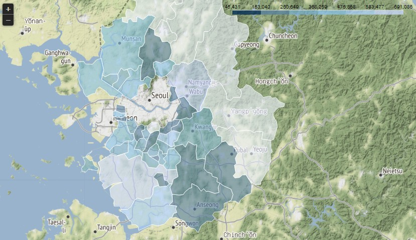

# visualization_03

### 지도 시각화를 위한 folium

```python
import folium as g
```

- 아나콘다 프롬포트에서 conda pip install folium -n conda-forge를 해준다.

```python
g_map = g.Map(location=[37.522208, 126.973734],zoom_start=10)
# option
marker01 = g.Marker([37.522208, 126.973734],
                 popup='국립중앙박물관',
                 icon = g.Icon(color='blue'))
marker01.add_to(g_map)

marker02 = g.CircleMarker([37.522208, 126.973734],
                         radius = 100,
                         color='skyblue',
                         popup='esu',
                         fill_color = 'skyblue')
marker02.add_to(g_map)
g_map
```

- location에 위도,경도를 넣고 zoom_start에 얼만큼 줌을 할 것인지 수치를 부여한다.
- 옵션에 marker를 준다.
  - 마커를 클릭하면 내가 popup에 지정한 위치 이름이 뜬다.
  - 마커를 g_map에 추가한다.
- 써클마커는 주변 위치를 포함하여 효시


```python
g_map.save('./data/now_location.html')
```

- html로 지도를 저장할 수 있다.

```python
g_map = g.Map(location=[37.522208, 126.973734],zoom_start=18,tiles='Stamen Toner')
```

- tiles 로 지도의 모양을 바꿀 수 있다.

**서울 시청 지도**

```python
seoul_map = g.Map(location=[37.55,126.98],
                 tiles = 'Stamen Terrain',
                 zoom_start = 12)
seoul_map
```

#### 서울 지역 대학교 좌표 찍기

```python
xls = pd.ExcelFile('./data/seoul_loc.xlsx')
uni_loc = xls.parse(xls.sheet_names[0])
uni_df = uni_loc.copy()
uni_df.reset_index(inplace=True)
uni_df.rename({'index':'대학명'},axis=1,inplace=True)
uni_df.head()
		대학명					위도			경도
0	KAIST 서울캠퍼스			37.592573	127.046737
1	KC대학교				37.548345	126.854797
2	가톨릭대학교(성신교정)	37.585922	127.004328
3	가톨릭대학교(성의교정)	37.499623	127.006065
4	감리교신학대학교			37.567645	126.961610
```

- 대학교 좌표 정보를 불러온다.

```python
seoul_map = g.Map(location=[37.55,126.98],
                 tiles = 'Stamen Terrain',
                 zoom_start = 12)
# 대학교 위치정보로 Marker를 표시

for i in range(len(uni_df)):
    marker01 = g.Marker([uni_df['위도'][i], uni_df['경도'][i]],
                 popup=uni_df['대학명'][i],
                 icon = g.Icon(color='blue'))
    marker01.add_to(seoul_map)
seoul_map
```

```python
for i in range(len(uni_df)):
    marker01 = g.Marker(uni_df.loc[i, ['위도','경도']],
                 popup=uni_df.loc[i,'대학명'],
                 icon = g.Icon(color='blue'))
    marker01.add_to(seoul_map) 
```

```python
for name, lat, lng in zip(uni_df['대학명'],uni_df['위도'],uni_df['경도']):
    marker01 = g.Marker([lat,lng],
                 popup = name,
                 icon = g.Icon(color='blue'))
    marker01.add_to(seoul_map)
```

- zip함수로 묶어서 각각 가져와서 부여해줘도 된다.

- 이렇게 돌려도 된다.


```python
pip install git+https://github.com/python-visualization/branca.git@master
```

- 아이콘 클릭시 한글이  깨지면 이걸 프롬포트에서 설치하면 된다.

```python
seoul_map = g.Map(location=[37.55,126.98],
                 tiles = 'Stamen Terrain',
                 zoom_start = 12)
# 대학교 위치정보로 Marker를 표시

for name, lat, lng in zip(uni_df['대학명'],uni_df['위도'],uni_df['경도']):
    marker01 = g.CircleMarker([lat,lng],
                 popup = name,
                 icon = g.Icon(color='blue'),
                 radius=10,
                 fill=True,
                 fill_color='coral',
                 fill_opacity=0.3)
    marker01.add_to(seoul_map)
    
seoul_map
```


- 다양한 마커가 있다.

#### 초등학교 표시하기

```python
xls = pd.ExcelFile('./data/elem_school_folium.xlsx')
df = xls.parse(xls.sheet_names[0])
df_1 = df.copy()
df_1.head()
>
학교ID	학교명	학교급구분	설립일자	설립형태	본교분교구분	운영상태	소재지지번주소	소재지도로명주소	시도교육청코드	시도교육청명	교육지원청코드	교육지원청명	생성일자	변경일자	위도	경도	데이터기준일자	제공기관코드	제공기관명
```

#### Feature Selection

##### 학교명, 학교급구분, 소재지도로명, 위도, 경도

```python
sel_df = df_1[['학교명','학교급구분','소재지도로명주소','위도','경도']]
sel_df.head()
>
			학교명		학교급구분	소재지도로명주소					위도	        경도
0	서울휘경초등학교	초등학교	서울특별시 동대문구 망우로6길 		48	37.585736	127.058122
1	서울동답초등학교	초등학교	서울특별시 동대문구 답십리로60길 12	37.571817	127.064205
2	서울답십리초등학교	초등학교	서울특별시 동대문구 전농로3길 23		37.569003	127.055423
3	서울신답초등학교	초등학교	서울특별시 동대문구 천호대로 177		37.573001	127.043399
4	서울용두초등학교	초등학교	서울특별시 동대문구 천호대로13길 		43	37.575743127.028885
```

##### 소재지 도로명 주소가 서울을 포함하고 학교릅구분 초등학교만 추출

```python
sel_subset = sel_df.query('학교급구분 == "초등학교"')
sel_subset = sel_subset[sel_subset['소재지도로명주소'].str.contains('서울',na=False)].reset_index(drop=True)
sel_subset.head()
>
	학교명				학교급구분	소재지도로명주소					위도			경도
0	서울휘경초등학교	초등학교	서울특별시 동대문구 망우로6길 48		37.585736	127.058122
1	서울동답초등학교	초등학교	서울특별시 동대문구 답십리로60길 12	37.571817	127.064205
2	서울답십리초등학교	초등학교	서울특별시 동대문구 전농로3길 23		37.569003	127.055423
3	서울신답초등학교	초등학교	서울특별시 동대문구 천호대로 177		37.573001	127.043399
4	서울용두초등학교	초등학교	서울특별시 동대문구 천호대로13길 43	37.575743	127.028885
```

- 우선 쿼리로 초등학교만 뽑고 그 다음에 서울을 포함하는 조건을 다시 부여한다.

##### 결측값 확인, 제거

```python
sel_df.dropna(inplace=True)
sel_df.isna().sum()
```

- 먼저 결측값을 제거해서 해도 되고, 조건에서 na=False를 줘도 된다.

##### 다르게 하는 방법

```python
sel_subset02 =  sel_df.query('학교급구분 == "초등학교" & 소재지도로명주소.str.contains("서울")',engine='python').reset_index(drop=True)
sel_subset02
>
	학교명				학교급구분	소재지도로명주소					위도			경도
0	서울휘경초등학교	초등학교	서울특별시 동대문구 망우로6길 48		37.585736	127.058122
1	서울동답초등학교	초등학교	서울특별시 동대문구 답십리로60길 12	37.571817	127.064205
2	서울답십리초등학교	초등학교	서울특별시 동대문구 전농로3길 23		37.569003	127.055423
3	서울신답초등학교	초등학교	서울특별시 동대문구 천호대로 177		37.573001	127.043399	
```

- 쿼리로 바로 찾는 방법이다. `engine='python'` 오류가 나면 이거 붙여준다.

##### 인덱스로 찾는 방법

```python
insex_seoul = sel_df['소재지도로명주소'].str.contains('서울')
insex_ele = sel_df['학교급구분'] =='초등학교'

result_df = sel_df.loc[insex_seoul&insex_ele]
result_df.head()
result_df.tail()
>
			학교명			학교급구분	소재지도로명주소					위도		경도
11684	서울위례별초등학교	초등학교	서울특별시 송파구 위례광장로 243	37.479086	127.145042
11702	서울하늘숲초등학교	초등학교	서울특별시 구로구 오리로 1106	37.484688	126.842417
11731	서울언남초등학교	초등학교	서울특별시 서초구 헌릉로8길 42	37.453919	127.061343
11772	서울항동초등학교	초등학교	서울특별시 구로구 연동로 178	37.476731	126.823983
11798	서울숭신초등학교	초등학교	서울특별시 성동구 마장로 161	37.567704	127.027767
```

```python
condition = '학교급구분 == "초등학교" & 소재지도로명주소.str.contains("서울").values'
sel_subset04 = sel_df.query(condition)
sel_subset04.head()
>

			학교명	학교급구분					소재지도로명주소		위도			경도
0	서울휘경초등학교	초등학교	서울특별시 동대문구 망우로6길 48		37.585736	127.058122
1	서울동답초등학교	초등학교	서울특별시 동대문구 답십리로60길 12	37.571817	127.064205
2	서울답십리초등학교	초등학교	서울특별시 동대문구 전농로3길 23		37.569003	127.055423
3	서울신답초등학교	초등학교	서울특별시 동대문구 천호대로 177		37.573001	127.043399
4	서울용두초등학교	초등학교	서울특별시 동대문구 천호대로13길 43	37.575743	127.028885
```

#### 지도 시각화

```python
seoul_map = g.Map(location=[37.55,126.98],
                 tiles = 'Stamen Terrain',
                 zoom_start = 12)

for name, lat, lng in zip(sel_subset['학교명'],sel_subset['위도'],sel_subset['경도']):
    marker01 = g.CircleMarker([lat,lng],
                 popup = name,
                 icon = g.Icon(color='pink'),
                 radius=10,
                 fill=True,
                 color = 'pink',
                 fill_color='coral',
                 fill_opacity=0.3)
    marker01.add_to(seoul_map)
    
seoul_map
```


#### 경기도 인구

```python
xls = pd.ExcelFile('./data/g_pop.xlsx')
df_2 = xls.parse(xls.sheet_names[0])
df_2c = df_2.copy()
df_2c.head()
>
구분	2007	2008	2009	2010	2011	2012	2013	2014	2015	2016	2017
0	수원시장안구	287474	285803	290798	293692	290999	291757	300908	301196	299016	296479	293828
1	수원시권선구	310553	308177	304097	306783	321176	332633	331773	339835	351053	358393	365653
2	수원시팔달구	216945	213235	219833	216503	209772	206794	204805	203479	199180	198515	193311
3	수원시영통구	252730	260210	258421	260557	266542	289074	310671	329718	335375	340654	349836
4	성남시수정구	256744	248452	242161	241070	236123	233997	228167	223539	219531	232841	236932
```

```python
pop_df = pd.read_excel('./data/g_pop.xlsx',index_col='구분')
pop_df.head()
>
2007	2008	2009	2010	2011	2012	2013	2014	2015	2016	2017
구분											
수원시장안구	287474	285803	290798	293692	290999	291757	300908	301196	299016	296479	293828
수원시권선구	310553	308177	304097	306783	321176	332633	331773	339835	351053	358393	365653
수원시팔달구	216945	213235	219833	216503	209772	206794	204805	203479	199180	198515	193311
수원시영통구	252730	260210	258421	260557	266542	289074	310671	329718	335375	340654	349836
성남시수정구	256744	248452	242161	241070	236123	233997	228167	223539	219531	232841	236932
```

#### 경제 정보를 가지고 있는 json 파일 불러오기

```python
geo_data = json.load(open('./data/경기도행정구역경계.json',encoding='utf-8'))
geo_data
```

```python
pop_df.columns = pop_df.columns.map(str)
# 지도 생성
year = '2017'
gyeonggi_map = g.Map(location=[37.55,126.98],
                 tiles = 'Stamen Terrain',
                 zoom_start = 12)
# 구분된 경계를 표사할 때 사용하는 객체
g.Choropleth(geo_data = geo_data,
            data=pop_df[year],
            columns = [pop_df.index, pop_df[year]],
            key_on = 'feature.properties.name').add_to(gyeonggi_map)
gyeonggi_mapgyeonggi_map = g.Map(location=[37.55,126.98],
                 tiles = 'Stamen Terrain',
                 zoom_start = 12)
gyeonggi_map
```

- 우선 컬럼이 int64라 str로 바꿔준다.
- 그 다음에 구역별 경계를 나누기 위하여 `Choropleth` 을 지정한다.



- 다음과 같이 구역별로 경계가 나눠지고 인구별로 채워지는 색이 다르다.