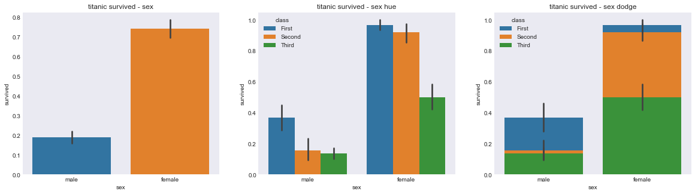
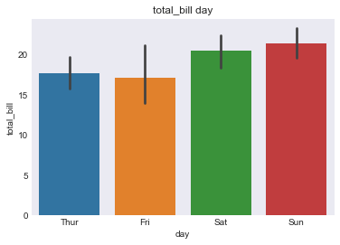
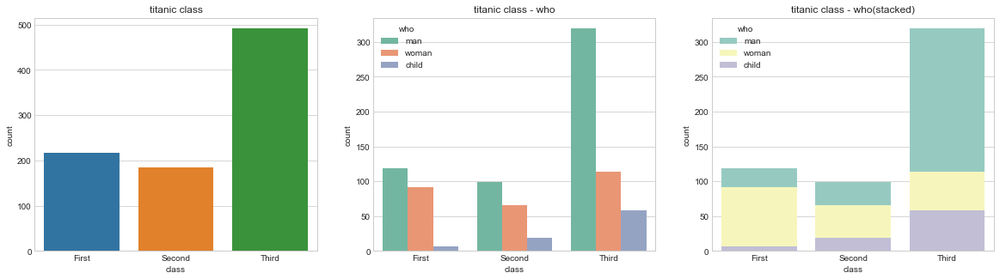
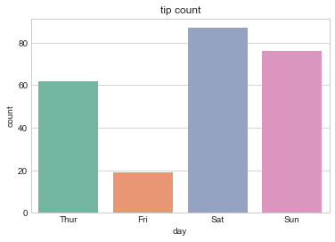
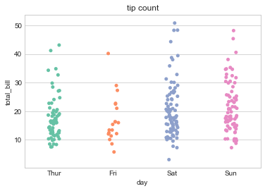
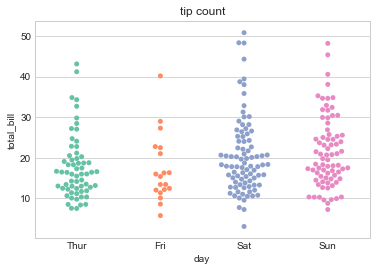

# visualization_04

#### barplot() : 카테고리 값에 따른 실수 값의 평균과 편차를 표시하는 차트

- 평균은 막대의 높이, 편차 에러바

```python
iris = sns.load_dataset('iris')
titanic = sns.load_dataset('titanic')
tips = sns.load_dataset('tips')
flights = sns.load_dataset('flights')
```

```python
# bat plot : 카테고리
# 스타일 테마를 설정 5가지 (darkgrid, whitegrid, dark, white, ticks)

sns.set_style('whitegrid')

# 그래프 객체를 생성하기 위한 피겨객체 얻어오기
fig = plt.figure(figsize=(15,5))

area01 = fig.add_subplot(1,3,1)
area01.set_title('titanic survived - sex')
area02 = fig.add_subplot(1,3,2)
area02.set_title('titanic survived - sex hue')
area03 = fig.add_subplot(1,3,3)
area03.set_title('titanic survived - sex dodge')

# 성별에 따른 생존률 시각화
sns.barplot(x='sex',y='survived',data=titanic,ax=area01)
# hue =  그룹을 지어준다.
sns.barplot(x='sex',y='survived',hue='class',data=titanic,ax=area02)
# dodge  = True : 멀티바, False : 누적막대바
sns.barplot(x='sex',y='survived',hue='class',dodge=False,data=titanic,ax=area03)


plt.show()
```



#### tips barplot()
##### 요일별 전체 팁을 시각화

```python
sns.barplot(x='day',y='total_bill',data=tips)
plt.title('요일별 전체 팁')
plt.show()
```



#### countplot() : 카테고리 값별로 데이터 빈도를 표시하는 차트

```python
# bat plot : 카테고리
# 스타일 테마를 설정 5가지 (darkgrid, whitegrid, dark, white, ticks)

sns.set_style('whitegrid')

# 그래프 객체를 생성하기 위한 피겨객체 얻어오기
fig = plt.figure(figsize=(20,5))

area01 = fig.add_subplot(1,3,1)
area01.set_title('titanic class')
area02 = fig.add_subplot(1,3,2)
area02.set_title('titanic class - who')
area03 = fig.add_subplot(1,3,3)
area03.set_title('titanic class - who(stacked)')


# 성별에 따른 생존률 시각화
sns.countplot(x='class',data=titanic,ax=area01)


# hue =  그룹을 지어준다.
sns.countplot(x='class',hue='who',palette='Set2',data=titanic,ax=area02)
# dodge 
sns.countplot(x='class',hue='who',dodge=False,palette='Set3',data=titanic,ax=area03)


plt.show()
```



- palette = 을 주면 색이 바뀐다.

#### tips를 이용한 countplot 만들기

##### 요일별로 팁을 준 빈도를 시각화 한다면?

```python
sns.countplot(x='day',palette='Set2',data=tips)
plt.title('tip count')
plt.show()
```



#### stripplot() : 스카터플롯처럼 모든 데이터를 점으로 시각화

- hitter=True 설정하면 위치를 무작위로 바꿔서 겹치지 않게 해 준다.

```python
sns.stripplot(x='day',y='total_bill',jitter=True, palette='Set2',data=tips)
plt.title('tip count')
plt.show()
```



#### swarmplot()

```python
sns.swarmplot(x='day',y='total_bill', palette='Set2',data=tips)
plt.title('tip count')
plt.show()
```



- 점이 겹치면 좌우로 펼쳐준다.