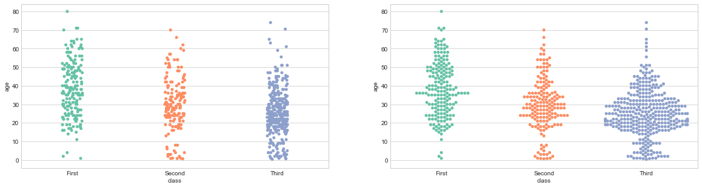
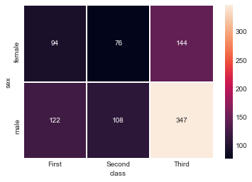

# visualization_04

#### barplot() : 카테고리 값에 따른 실수 값의 평균과 편차를 표시하는 차트

- 평균은 막대의 높이, 편차 에러바

```python
iris = sns.load_dataset('iris')
titanic = sns.load_dataset('titanic')
tips = sns.load_dataset('tips')
flights = sns.load_dataset('flights')
```

```python
# bat plot : 카테고리
# 스타일 테마를 설정 5가지 (darkgrid, whitegrid, dark, white, ticks)

sns.set_style('whitegrid')

# 그래프 객체를 생성하기 위한 피겨객체 얻어오기
fig = plt.figure(figsize=(15,5))

area01 = fig.add_subplot(1,3,1)
area01.set_title('titanic survived - sex')
area02 = fig.add_subplot(1,3,2)
area02.set_title('titanic survived - sex hue')
area03 = fig.add_subplot(1,3,3)
area03.set_title('titanic survived - sex dodge')

# 성별에 따른 생존률 시각화
sns.barplot(x='sex',y='survived',data=titanic,ax=area01)
# hue =  그룹을 지어준다.
sns.barplot(x='sex',y='survived',hue='class',data=titanic,ax=area02)
# dodge  = True : 멀티바, False : 누적막대바
sns.barplot(x='sex',y='survived',hue='class',dodge=False,data=titanic,ax=area03)


plt.show()
```


#### tips barplot()
##### 요일별 전체 팁을 시각화

```python
sns.barplot(x='day',y='total_bill',data=tips)
plt.title('요일별 전체 팁')
plt.show()
```


#### countplot() : 카테고리 값별로 데이터 빈도를 표시하는 차트

```python
# bat plot : 카테고리
# 스타일 테마를 설정 5가지 (darkgrid, whitegrid, dark, white, ticks)

sns.set_style('whitegrid')

# 그래프 객체를 생성하기 위한 피겨객체 얻어오기
fig = plt.figure(figsize=(20,5))

area01 = fig.add_subplot(1,3,1)
area01.set_title('titanic class')
area02 = fig.add_subplot(1,3,2)
area02.set_title('titanic class - who')
area03 = fig.add_subplot(1,3,3)
area03.set_title('titanic class - who(stacked)')


# 성별에 따른 생존률 시각화
sns.countplot(x='class',data=titanic,ax=area01)


# hue =  그룹을 지어준다.
sns.countplot(x='class',hue='who',palette='Set2',data=titanic,ax=area02)
# dodge 
sns.countplot(x='class',hue='who',dodge=False,palette='Set3',data=titanic,ax=area03)


plt.show()
```


- palette = 을 주면 색이 바뀐다.

#### tips를 이용한 countplot 만들기

##### 요일별로 팁을 준 빈도를 시각화 한다면?

```python
sns.countplot(x='day',palette='Set2',data=tips)
plt.title('tip count')
plt.show()
```


#### stripplot() : 스카터플롯처럼 모든 데이터를 점으로 시각화

- hitter=True 설정하면 위치를 무작위로 바꿔서 겹치지 않게 해 준다.

```python
sns.stripplot(x='day',y='total_bill',jitter=True, palette='Set2',data=tips)
plt.title('tip count')
plt.show()
```


#### swarmplot()

```python
sns.swarmplot(x='day',y='total_bill', palette='Set2',data=tips)
plt.title('tip count')
plt.show()
```


- 점이 겹치면 좌우로 펼쳐준다.

#### 타이타닉 데이터를 이용하여 서브플롯을 2개 영역으로 만들고   class  별 나이의 분포를 확인하라 (stripplot(),swarmplot())

```python
​```
fig = plt.figure(figsize=(20,5))

aera01 = fig.add_subplot(1,2,1)
aera02 = fig.add_subplot(1,2,2)

sns.stripplot(x='class',y='age',data=titanic,palette='Set2',ax=aera01,jitter=True)
sns.swarmplot(x='class',y='age',data=titanic,palette='Set2',ax=aera02)

plt.show()
```

- 우선 구역을 만들어서 구역을 만든다. 그 다음에 그래프를 만들고 지정한 위치에 표시한다.



#### boxplot(), violinplot()

```python
fig = plt.figure(figsize=(20,5))

aera01 = fig.add_subplot(2,2,1)
aera01.set_title('box')
aera02 = fig.add_subplot(2,2,2)
aera02.set_title('box')
aera03 = fig.add_subplot(2,2,3)
aera03.set_title('vilion')
aera04 = fig.add_subplot(2,2,4)
aera04.set_title('vilion')

sns.boxplot(x='alive',y='age',data=titanic,ax=aera01)
sns.boxplot(x='alive',y='age',data=titanic,hue='sex',ax=aera02)

sns.violinplot(x='alive',y='age',data=titanic,ax=aera03)
sns.violinplot(x='alive',y='age',data=titanic,hue='sex',ax=aera04)

plt.show()
```


- 바이올린 : 카테고리 값의 따른 분포 형상

#### 만약에 tips에서 요일에 따른 성별 전체 팁 stripplot() 시각화

```python
sns.stripplot(x='day',y='total_bill',hue='sex',jitter=True, palette='Set2',data=tips)
plt.title('tip count')
plt.legend(loc='best')
plt.show()
```


- hue로 그룹지어주면 된다.

#### heatmap : 하나 이상의 카테고리 값의 변화를 색깔 변화로 시각화 하는 차트

```python
# titanic 
# 피벗테이블로 범주형 변수를 각각 행, 열로 재구분하여 정리
# 인덱스 : 성별, 열 : pclass, 
table = titanic.pivot_table(index=['sex'],columns=['class'],aggfunc='size')
# table.head()
sns.heatmap(table,annot=True, fmt='d',linewidth=1)
plt.show()
```



- cbar=False를 주면 옆에 선 바가 없어진다.
- 색이 옅을 수록 높은 수치다.

- cmap=을 하면 rgb코드값으로 색상 지정 가능

- linewidth로 구분해줄 수 있다.

- annot로 값 표현 가능

#### flights 연도, 월 별 승객수에 대한 heatmap 

- x  연도, y 월

```python
heat_tabel = flights.pivot('month','year','passengers')
heat_tabel
```

```python
sns.heatmap(heat_tabel,annot=True, fmt='d',linewidth=1)
plt.show()
```


- 7,8월에 승객 이용수가 많은 것을 확인 할 수 있다.

