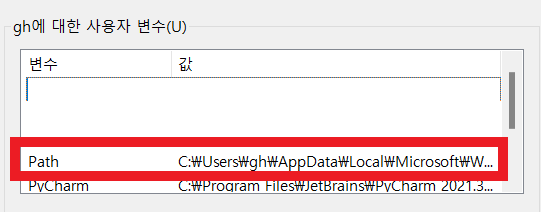

# 윈도우 poetry 설치하기

### 1. python 설치하기

https://www.python.org/downloads/windows/

- 위 링크에서 3.7 이상 버전을 다운받아 설치한다.

### 2. poetry 설치하기

- powershell에서 아래 명령문을 입력하여 설치한다.

```python
(Invoke-WebRequest -Uri https://install.python-poetry.org -UseBasicParsing).Content | py -
```

- poetry 홈페이지에서도 복사가능하다.
  - https://python-poetry.org/docs/

### 3. 환경변수 추가하기

1. 환경변수에서 Path를 편집한다.



2. 새로만들기로 아래의 문구를 추가한다.

   ```
   C:\Users\gh\AppData\Roaming\Python\Scripts
   ```

   

   

### 3-1. 환경변수 추가하지 않을 경우 에러 발생

- 환경변수를 추가하지 않으면 아래와 같은 오류가 발생하므로 설정한다.

```shell
poetry : 'poetry' 용어가 cmdlet, 함수, 스크립트 파일 또는 실행할 수 있는 프로그램 이름으로 인식되지 않습니다. 이름이 정
확한지 확인하고 경로가 포함된 경우 경로가 올바른지 검증한 다음 다시 시도하십시오.
위치 줄:1 문자:1
+ poetry --version
+ ~~~~~~
    + CategoryInfo          : ObjectNotFound: (poetry:String) [], CommandNotFoundException
    + FullyQualifiedErrorId : CommandNotFoundException
```

### 4. 설정 완료 확인

- 환경 변수 추가후 적용되었는지 확인한다.
- 만약 설치 후 파워셀을 끄지 않았다면 껐다가 다시 시도해보면 된다.

```shell
PS C:\Users\gh> poetry --version
Poetry (version 1.2.2)
```


