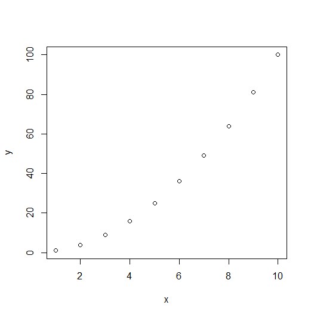

# R_시작 

#### letters

```R
> print(letters)
 [1] "a" "b" "c" "d" "e" "f" "g" "h" "i" "j" "k" "l" "m" "n" "o" "p" "q" "r" "s"
[20] "t" "u" "v" "w" "x" "y" "z"
```

- 알파벳 순서대로 출력할 수 있다.

#### month.abb

```R
> month.abb
 [1] "Jan" "Feb" "Mar" "Apr" "May" "Jun" "Jul" "Aug" "Sep" "Oct" "Nov" "Dec"
```

- 영문으로 1월 ~ 12월까지 앞 3자리만 출력해준다.

#### month.name

```R
> month.name
 [1] "January"   "February"  "March"     "April"     "May"       "June"     
 [7] "July"      "August"    "September" "October"   "November"  "December"
```

- 영문으로 1월 ~ 12월 문자 전체를 출력해준다. 

### Package란?

- 함수(Function) + 데이터셋(Dataset)

#### install.packages()

```R
> install.packages("stringr")
Installing package into ‘C:/Users/gh/Documents/R/win-library/4.0’
(as ‘lib’ is unspecified)
URL 'https://cran.rstudio.com/bin/windows/contrib/4.0/stringr_1.4.0.zip'을 시도합니다
Content type 'application/zip' length 216879 bytes (211 KB)
downloaded 211 KB

package ‘stringr’ successfully unpacked and MD5 sums checked

The downloaded binary packages are in
	C:\Users\Public\Documents\ESTsoft\CreatorTemp\Rtmp0OL8Ri\downloaded_packages
```

- 설치할 패키지를 먼저 인스톨한다

#### library()

```R
> library(stringr)
경고메시지(들): 
패키지 ‘stringr’는 R 버전 4.0.2에서 작성되었습니다
```

- 그 다음에 `library` 로 설치한 패키지를 올린다.

#### .libPaths()

```R
> .libPaths()
[1] "C:/Users/gh/Documents/R/win-library/4.0"
[2] "C:/Program Files/R/R-4.0.1/library"   
```

- 현재 사용하고 있는 라이브러리 경로들이 나온다.

#### library()

- 현재 사용하고 있는 라이브러리가 나온다.

### 디버깅(debugging)

> **디버깅**(영어: debugging) 또는 디버그(영어: debug)는 컴퓨터 프로그램 개발 단계 중에 발생하는 시스템의 논리적인 오류나 비정상적 연산(버그)을 찾아내고 그 원인을 밝히고 수정하는 작업 과정을 뜻한다.

- `print()` , `paste()`, `sprintf()`, `cat()`

#### print()

```R
> print('실버를 넘어 골드를 지나 펭티비로 다이아 갈꺼야')
[1] "실버를 넘어 골드를 지나 펭티비로 다이아 갈꺼야"
```

#### sprintf(문자열, 값)

- `%d : 정수` , `%f : 실수`, `%s : 문자` 

```R
> sprintf("%d",123)
[1] "123"
```

```R
> sprintf("Number : %d", 100)
[1] "Number : 100"
```

```R
> sprintf("Number : %d, string : %s", 0808,'pengso')
[1] "Number : 808, string : pengso"
```

-  `"" or ''`  안에 위에 나와있는 정수, 실수, 문자에 따라 형식을 지정한다. `콤마(,)` 뒤에 출력할 값을 적어준다. 

```R
> sprintf("%.2f",123.456)
[1] "123.46"
```

- 2자리에서 반올림한다.

```R
> sprintf("%5d",123)
[1] "  123"
```

- 5자리라고 지정해 주었기 때문에 `123` 앞에 공백 2개가 있다.

```R
> sprintf("%5d",12345)
[1] "12345"
```

- 5자리에 숫자가 5개 있으니 공백이 없다.

```R
> sprintf("%5d",123456) 
[1] "123456"
```

- 자리수를 지정해줘도 자리수가 부족이라도 그냥 출력한다. 

#### cat()

- `print()` 는 기본적으로 행이 바뀐다.

- `cat()` 은 행이 바뀌지 않고, 옆으로 값이 출력된다. 

```R
> myfunc <- function() {
+             total <- 0
+             print('append ...')
+             for(i in 1:10){
+                     total <- total + i
+                     print(i)}
+             print('end')
+           return(total)
+ }
```

- `print()` 로 먼저 출력해본다. 

```R
> myfunc()
[1] "append ..."
[1] 1
[1] 2
[1] 3
[1] 4
[1] 5
[1] 6
[1] 7
[1] 8
[1] 9
[1] 10
[1] "end"
[1] 55
```

- 행이 바뀌어서 출력된다.

```R
> myfunc2 <- function() {
+             total <- 0
+             cat('append ...')
+             for(i in 1:10){
+                     total <- total + i
+                     cat(i,"...")}
+             cat('end','\n')
+           return(total)
+ }
```

- `cat() ` 으로 출력해본다.

```R
> myfunc2()
append ...1 ...2 ...3 ...4 ...5 ...6 ...7 ...8 ...9 ...10 ...end 
[1] 55
```

- 행이 바뀌지 않고 옆으로 출력된다. 

### 변수

- `알파벳`, `숫자`, `_`, `.(도트)`로  구성된다(단, 첫글자는 반드시 문자 또는 .)

- **단일형** (단일값들을 담는 타입, 섞이지 않은 값) : vector, matrix, array

- **복수형** (섞여있는 값들(문자+논리+수치등)) : list, data.frame

#### vector

> python에서는 vector 를 list 타입으로 취급한다.

- `c()` , `1:10`

```R
> sample_vec <- c(1,2,3,4,5)
```

```R
> sample_vec
[1] 1 2 3 4 5
```

- `vector` 형식으로 값이 저장되었다.

```R
> sum(sample_vec)
[1] 15
```

- 내가 저장한 `vector` 값들의 합계

```R
> length(sample_vec)
[1] 5
```

- 저장한 `vector` 의 길이
  - 1,2,3,4,5 : 5개여서 5를 반환

```R
> sum(sample_vec) / length(sample_vec)
[1] 3
```

- 15 / 5 = 3 이다.

```R
> mean(sample_vec)
[1] 3
```

- `vector` 의 값 평균이다.

```R
> class(sample_vec)
[1] "numeric"
```

- 숫자형인지 논리형인지 문자형인지 등을 알려주는 함수이다.

```R
> typeof(sample_vec) 
[1] "double"
```

- `double` 은 배정밀도(double precision)수이다. 컴퓨터는 1.000000 정도로 인식하고 있다.
  - 정수인지 실수인지 자세하게 알려준다.
  - 문자형인지 논리형인지도 알려준다.

```R
> mode(sample_vec)
[1] "numeric"
```

- 메모리에 어떻게 저장되는지 알려주는 함수이다. 숫자형(numeric), 문자형(character), 리스트(list), 함수(function) 등이 있다.

#### start : end

```R
sample_vec02 <- 1:10
```

```R
> sample_vec02
 [1]  1  2  3  4  5  6  7  8  9 10
```

- `c()` 형식 이외에도 다음과 같이 `start:end`  형식으로 지정할 수 있다. 

```R
x <- 1:10
y <- x^2
```

#### 산점도

```
plot(x,y)
```



### 논리형( Ture, False)

- R에서는 TRUE를 T로 FALSE를 F로 표현할 수 있다. 또한  True는 1, False는 0으로 텀퓨터는 인지한다.

```R
boolean_vec02 <- c(T, F, T, F)
```

```R
> str(boolean_vec02) 
 logi [1:4] TRUE FALSE TRUE FALSE
```

-  R은 인덱스가 1부터 시작한다.

```R
> class(boolean_vec02)
[1] "logical"
```

```R
> typeof(boolean_vec02)
[1] "logical"
```

```R
> mode(boolean_vec02)
[1] "logical"
```

- 타입을 확인하면 모두 논리형이다.

### NA와 NULL

#### is.na()

- 결측치를 확인하는 함수이다.

- **NA** 는 결측치, 즉 값이 빠져있는 경우를 뜻한다.

```R
string_vec <- c('펭하','펭수',NA,'펭빠')
```

```R
> is.na(string_vec)
[1] FALSE FALSE  TRUE FALSE
```

- 결측치가 있는 인덱스에 TRUE를 반환한다.

#### is.null()

- `null` 값을 확인하는 함수이다.

- **NULL** 은 값이 없다는 뜻이다. 

```R
string_vec <- c('펭하','펭수',NULL,'펭빠')
```

```R
> string_vec
[1] "펭하" "펭수" "펭빠"
```

- `null` 값을 넣으면 공백도 아니고 아예 데이터에 없는 존재가 된다.

```R
string_vec <- c('펭하','펭수','','펭빠')
```

```R
> string_vec
[1] "펭하" "펭수" ""     "펭빠"
```

- 공백을 넣으면 공백이 저장되는데 `null` 은 없는 값이된다. 

```R
sample_null <- c(1,2,3,4)
```

```R
> sample_null
[1] 1 2 3 4
```

```R
sample_null <- NULL
```

```R
> sample_null
NULL
```

```R
> is.null(sample_null)
[1] TRUE
```

- `null` 을 지정해주고 값을 초기화 할 수 있다.

### 반복

#### rep(값, 횟수)

- 값을 지정한 횟수만큼 반복한다.

```R
> rep(1:10, 5)
 [1]  1  2  3  4  5  6  7  8  9 10  1  2  3  4  5  6  7  8  9 10  1  2  3  4  5  6
[27]  7  8  9 10  1  2  3  4  5  6  7  8  9 10  1  2  3  4  5  6  7  8  9 10
```

- 1부터 10까지 나열하고 그것을 5번 반복한다.

```R
> rep(1:10, each=5)
 [1]  1  1  1  1  1  2  2  2  2  2  3  3  3  3  3  4  4  4  4  4  5  5  5  5  5  6
[27]  6  6  6  6  7  7  7  7  7  8  8  8  8  8  9  9  9  9  9 10 10 10 10 10
```

- 이번에는 순서대로가 아니라 1부터 5개씩 반복하고 다음 숫자로 넘어간다.

#### seq(from, to, by)

```R
> seq(2,10,2)
[1]  2  4  6  8 10
```

- 2에서 10까지 2간격으로 만든다.

```R
> seq(1,10,length.out = 5)
[1]  1.00  3.25  5.50  7.75 10.00
```

#### indexing [원하는 식 or 인덱스]

```R
seq_vec02 <- seq(1,100,by=3)
```

```R
> seq_vec02
 [1]   1   4   7  10  13  16  19  22  25  28  31  34  37  40  43  46  49  52  55
[20]  58  61  64  67  70  73  76  79  82  85  88  91  94  97 100
```

```R
> length(seq_vec02)
[1] 34
```

```R
> seq_vec02[length(seq_vec02)-4]
[1] 88
```

- 홀수만 저장하고 출력해본다. `seq_vec02` 의 길이가34이니 -4를 하면 30이다. 30번째 값을 찾아준다.

#### 인덱싱에서 조건식을 활용할 수 있다.

##### AND = &, OR = |

##### 데이터가 30이하인 데이터만 출력하려면? 

```R
> seq_vec02[seq_vec02<=30]
 [1]  1  4  7 10 13 16 19 22 25 28
```

- 데이터가 30이하인 값들만 출력가능하다.

##### 데이터가 10이상 30이하인 데이터만 출력하려면?

```R
> seq_vec02[seq_vec02>=10 & seq_vec02 <=30] 
[1] 10 13 16 19 22 25 28
```

##### 데이터가 10이상 이거나 30이하인 데이터만 출력하려면? 

```R
> seq_vec02[seq_vec02>=10 | seq_vec02 <=30]
 [1]   1   4   7  10  13  16  19  22  25  28  31  34  37  40  43  46  49  52  55
[20]  58  61  64  67  70  73  76  79  82  85  88  91  94  97 100
```

- or 조건이기 때문에 모든 데이터가 선택된다.

##### 인덱스가 홀수인 데이터만 출력하려면?

```R
seq_vec02_odd <- seq_vec02[seq(1,length(seq_vec02),2)]
```

```R
> seq_vec02_odd
 [1]  1  7 13 19 25 31 37 43 49 55 61 67 73 79 85 91 97
```

- seq를 사용하여 데이터길이까지 2씩 간격을 줘서 인덱싱한다.

#### 반올림_round()

```R
> round(round_vc <- c(10.234, 11.3467),2)
[1] 10.23 11.35
```

- 소수 둘째자리에서 반올림한다.

```R
> round(round_vc02 <- 123.234,-1)
[1] 120
```

- 일의 자리에서 반올림한다.

#### 컬럼이름 부여_names()

```R
data_x <-c(1,2,3)
cols<-c('peng','soo','park')
names(data_x) <- cols
```

```R
> data_x
peng  soo park 
   1    2    3 
```

- 데이터에 이름으 부여되었다.

```R
> names(data_x)[2]
[1] "soo"
```

```R
> data_x[c('peng')]
peng 
   1
```

```R
> data_x[c('peng', 'park')] 
peng park 
   1    3
```

- 셀의 이름으로 인덱싱하고 싶으면 vector로 만들어서 검색해야 한다.

#### 벡터내의 데이터 접근 방법

```R
index_vec <- c(1,3,5,7,9)
```

```R
> index_vec[2]
[1] 3
```

- 단순 인덱싱

```R
> index_vec[1:3]
[1] 1 3 5
```

- 인덱스 번호가 1~3인 데이터 출력

```R
> index_vec[length(index_vec):3] 
[1] 9 7 5
```

- 인덱싱은 리버스가 가능하다. 인덱스 번호가 5~3인 데이터 출력

```R
> index_vec[c(1,3)]
[1] 1 5
```

- vector로 원하는 인덱스 번호부여 가능하다.

```R
> index_vec[c(-1,-5)]
[1] 3 5 7
```

- 특정 데이터만 제외하고 출력하고 싶으면 인덱스 번호 앞에 `-` 를 붙이면 된다.

#### 데이터 길이

```R
> length(index_vec)
[1] 5
```

```R
> nrow(index_vec) 
NULL
```

- 프레임 형식에서 행의 개수를 리턴한다.
  - 현재 `index_vec` 는 1차원이기 때문에 값이 출력되지 않는다.

```R
> NROW(index_vec)
[1] 5
```

- 1차원을 2차원으로 만들어서 행의 개수를 리턴한다. 

#### %in%

```R
bool <- 'A' %in% c('A','b','c')
```

```R
> bool
[1] TRUE
```

- 내가 입력한 값이 있는지 없는지 확인해준다. `A` 가 있는지 없는지 확인하고 `TRUE` 와 `FALSE` 를 리턴한다.

#### setdiff(), union(), intersect()

> 벡터를 집합으로 취급할 수 있다.

##### 차집합_setdiff()

```R
> setdiff(c('a','b','c'),c('a','b')) 
[1] "c"
```

- `c` 가 오른쪽 집합에 포함되지 않기 때문에 `c` 를 리턴한다.

##### 합집합_union()

```R
> union(c('a','b','c'),c('a','b')) 
[1] "a" "b" "c"
```

- 두 집합 모두를 출력한다.

##### 교집합_intersect()

```R
> intersect(c('a','b','c'),c('a','b'))
[1] "a" "b"
```

- 두 집합에서 공통적으로 있는 문자만 출력한다.

#### 집합간의 비교_setequal()

```R
> setequal(c('a','b','c'),c('a','b'))
[1] FALSE
```

- 두 집합이 같지 않기 때문에 `FALSE` 를 출력한다.

````R
> setequal(c('a','b','c'),c('a','b','c'))
[1] TRUE
````

- 두 집합이 같기때문에 `TRUE` 를 출력한다.

### 문제_1

#### - 100에서 200으로 구성된 벡터 samplevec를 생성한 다음 각 문제를 수행하는 코드를 작성하고 답을 구하시오.

```R
samplevec <- c(100:200)
```

##### 문1) 10번째 값을 출력하세요.

```R
> samplevec[10]
[1] 109
```

##### 문2) 끝에서 10개의 값을 잘라내어 출력하세요.

```R
> tail(samplevec,10)
 [1] 191 192 193 194 195 196 197 198 199 200
```

- `tail` 은 끝에서 부터 출력해주는 함수

##### 문3) 홀수만 출력하세요.

```R
> samplevec[samplevec %% 2 == 1] 
 [1] 101 103 105 107 109 111 113 115 117 119 121 123 125 127 129 131 133 135 137
[20] 139 141 143 145 147 149 151 153 155 157 159 161 163 165 167 169 171 173 175
[39] 177 179 181 183 185 187 189 191 193 195 197 199
```

- `%%` 를 하면 나머지를 출력 , `==` 는 같다의 의미다.

##### 문4) 3의 배수만 출력하세요.

```R
> samplevec[samplevec %% 3 == 0]
 [1] 102 105 108 111 114 117 120 123 126 129 132 135 138 141 144 147 150 153 156
[20] 159 162 165 168 171 174 177 180 183 186 189 192 195 198
```

##### 문5) 앞에서 20개의 값을 잘라내고 samplevec.head 변수에 저장하고 출력하세요.

```R
sample.head <- head(samplevec,20)
```

```R
> sample.head
 [1] 100 101 102 103 104 105 106 107 108 109 110 111 112 113 114 115 116 117 118
[20] 119
```

- `head` 는 앞에서 부터 출력해주는 함수

##### 문6) samplevec.head 변수에서 5번째 값을 제외하고 출력

```R
> sample.head[-5]
 [1] 100 101 102 103 105 106 107 108 109 110 111 112 113 114 115 116 117 118 119
```

##### 문7) samplevec.head 변수에서 5,7,9번째 값을 제외하고 출력

```R
> sample.head[c(-5,-7,-9)]
 [1] 100 101 102 103 105 107 109 110 111 112 113 114 115 116 117 118 119
```


### 문제_2

#### 월별 결석생 수 통계가 다음과 같을 때 이 자료를 absect 벡터에 저장하시오. (결석생 수를 값으로 하고, 월 이름을 값의 이름으로 한다.)

```R
?month.name
absent <- c(10,8,14,15,9,10,15,12,9,7,8,7)
names(absent) <- month.name
```

```R
> absent
  January  February     March     April       May      June      July    August 
       10         8        14        15         9        10        15        12 
September   October  November  December 
        9         7         8         7 
```

##### 문1) 5월(MAY)의 결석생 수를 출력하시오.

```R
> absent['May']
May 
  9 
```

##### 문2) 7월(JUL), 9월(SEP)의 결석생 수를 출력하시오.

```R
> absent[c('July','September')]
     July September 
       15         9 
```

##### 문3) 상반기(1~6월)의 결석생 수의 합계를 출력하시오.

```R
> sum(absent[1:6])
[1] 66
```

##### 문4) 하반기(7~12월)의 결석생 수의 평균을 출력하시오.

```R
> round(mean(absent[7:12]),1)
[1] 9.7
```

#### 논리형벡터, 문자형벡터

```R
> c(T,F, TRUE, FALSE)
[1]  TRUE FALSE  TRUE FALSE
```

- `R` 에서는 `T` 와 `TRUE` , `F` 와 `FALSE` 를 같다고 본다.

 ```R
> c(T,F,F) | c(TRUE,TRUE, FALSE) 
[1]  TRUE  TRUE FALSE
 ```

- 연산이 가능하다. `TRUE` 가 더 힘이 좋기 때문에 `TRUE` 가 출력되었다.

```
> !c(T,F,T)
[1] FALSE  TRUE FALSE
```

- 반대로 말해준다. `T` 는 `F` 로, `F` 는 `T` 로.

```R
> xor(c(T,F,T), c(TRUE, TRUE, FALSE)) 
[1] FALSE  TRUE  TRUE
```

- 둘다 같으면 `F` 를 다르면 `T` 를 출력한다.

#### 난수발생_runif()

```R
> (randomNum <- runif(3)) 
[1] 0.6556153 0.1424165 0.1425345
```

```R
> (0.25 <= randomNum) & (randomNum <= 0.75)
[1]  TRUE FALSE FALSE
```

- `0.25` 이상 `0.75` 이하면 `TRUE` 를 아니면 `FALSE` 를 출력한다.

```R
> any(randomNum > 0.8) 
[1] FALSE
```

- 해당하는 값이 하나라도 있으면 `TRUE` 를 출력한다.

```R
> all(randomNum < 0.8) 
[1] TRUE
```

- 모든 데이터가 만족해야 `TRUE` 를 출력한다.

```R
c('a','b','c','d','e')
strvec <- c('H','S','T','N','O')
```

```R
> strvec[3] > strvec[5]
[1] TRUE
```

- `T` 가 `O` 보다 크기 때문에 `TRUE` 를 출력한다.

#### paste()

```R
> paste('May I','help you ?')
[1] "May I help you ?"
```

- 여러개의 문자를 조합해서 하나로 리턴해서 출력한다.

```R
> paste(month.abb, 1:12)
 [1] "Jan 1"  "Feb 2"  "Mar 3"  "Apr 4"  "May 5"  "Jun 6"  "Jul 7"  "Aug 8" 
 [9] "Sep 9"  "Oct 10" "Nov 11" "Dec 12"
```

- `month.abb` 는 영어 월 이름이고 `1:12` 는 1~12여서 하나씩 부여해준다.

```R
> paste(month.abb, 1:12, c('st','nd','rd',rep('th',9)))
 [1] "Jan 1 st"  "Feb 2 nd"  "Mar 3 rd"  "Apr 4 th"  "May 5 th"  "Jun 6 th" 
 [7] "Jul 7 th"  "Aug 8 th"  "Sep 9 th"  "Oct 10 th" "Nov 11 th" "Dec 12 th"
```

- 위랑 똑같이 하나 더 추가해서 출력한다.

```R
> paste('/usr','local','bin',sep='') 
[1] "/usrlocalbin"
```

- `sep` 로 구분해서 출력, 공백을 없애서 출력한다.

```R
> (seqVec <- paste(1:4))
[1] "1" "2" "3" "4"
```

- 문자열로 하나하나 출력한다.

```R
> class(seqVec)
[1] "character"
```

- 타입을 찍어보면 문자열이다.

```R
> paste(seqVec, collapse = 'peng')
[1] "1peng2peng3peng4"
```

- 옵션을 `peng` 으로 이어붙여서 출력한다.

```R
> paste(seqVec, collapse = '')
[1] "1234"
```

- 공백을 없애서 이어붙여서 출력한다.


### 문제_3

### 정규표현식 함수()

#### grep(pattern, data, ignore.case,value)

```R
> (grepValue <- c('gender','name','age','hEIght','wEIght','tall','EIght'))
[1] "gender" "name"   "age"    "hEIght" "wEIght" "tall"   "EIght" 
```

##### 문1) 'ei'로 시작되는 요소가 있는지

```
> grep('^ei',grepValue, ignore.case = T, value = T ) 
[1] "EIght"
```

- `value=F` 이면 인덱스가 반환되고 `value=T` 면 값이 반환된다. `ignore.case = T` 는 대소문자 구별하지 않겠다는뜻이다. 

##### 문2) 'ei'문자열을 포함하는 요소가 있는지

```R
> grep('ei',grepValue,value=TRUE)
character(0)
```

- 대소문자를 구별하기 때문에 값이 없다.

```R
grepTxt <- c('Bigdata','Bigdata','bigdata','Data','dataMining','textMining','campus6','campus5')
```

##### 문3) b로 시작하는 하나 이상의 문자 패턴을 확인하고 싶다면?

```R
> grep('^b+',grepTxt, value = T, ignore.case = T)
[1] "Bigdata" "Bigdata" "bigdata"
```

- 대소문자 구별이 없으니 `b` 로 시작하는 단어가 출력된다.

#### gsub(pattern, replacement, data, ignore.case), sub() 

> 문자열에서 문자를 바꾸는 기능

```R
> grepTxt
[1] "Bigdata"    "Bigdata"    "bigdata"    "Data"       "dataMining" "textMining"
[7] "campus6"    "campus5" 
```

##### 문1) big 이라는 단어를 bigger 라는 단어로 바꾸고자한다면?

```R
> gsub('big','bigger',grepTxt)
[1] "Bigdata"    "Bigdata"    "biggerdata" "Data"       "dataMining" "textMining"
[7] "campus6"    "campus5"  
```

- 대소문자를 구별하기 때문에 `big` 만 `bigger` 로 바뀐다.

```R
> gsub('big','bigger',grepTxt,ignore.case = T)
[1] "biggerdata" "biggerdata" "biggerdata" "Data"       "dataMining" "textMining"
[7] "campus6"    "campus5"  
```

- 대소문자를 구별하지 않기 때문에 `big, Big` 가 `bigger` 로 바뀐다.

##### 문2) grepTxt에서 숫자를 제거하고자 한다면?

```R
> gsub('[0-9]','',grepTxt)
[1] "Bigdata"    "Bigdata"    "bigdata"    "Data"       "dataMining" "textMining"
[7] "campus"     "campus"    
```

- 숫자를 삭제해버린다.

```R
> gsub('[[:digit:]]','',grepTxt) 
[1] "Bigdata"    "Bigdata"    "bigdata"    "Data"       "dataMining" "textMining"
[7] "campus"     "campus"  
```

- `[:digit:]` 가 하나의 패턴이라 대괄호로 감싸주어야함. 숫자를 제거한다.

```R
> sub('[0-9]','',grepTxt)
[1] "Bigdata"    "Bigdata"    "bigdata"    "Data"       "dataMining" "textMining"
[7] "campus"     "campus"    
```

```R
> sub('[[:digit:]]','',grepTxt)
[1] "Bigdata"    "Bigdata"    "bigdata"    "Data"       "dataMining" "textMining"
[7] "campus"     "campus"  
```

- `gsub()` 이랑 같은 원리다.

#### nchar()

```R
> nchar(grepTxt) 
[1]  7  7  7  4 10 10  7  7
```

- 문자 각각의 길이를 출력한다.

#### str_length()

```R
> str_length(grepTxt)
[1]  7  7  7  4 10 10  7  7
```

- 문자 각각ㄱ의 길이를 출력한다.

#### str_extract()

```R
> str_extract('abc123de456','[0-9]{3}') 
[1] "123"
```

- [0-9]{자리수/시작,끝}
  - 숫자로 시작하는 문자에서 3개를 출력한다.

```R
> str_extract_all('abc123de456','[0-9]{3}')
[[1]]
[1] "123" "456"
```

- 앞에 있는 숫자뿐만 아니라 숫자로 시작하는 3글자를 출력한다.

```R
> str_extract('abc123de456','[a-z]{3}')
[1] "abc"
```

- 영어로 시작하는 3글자를 출력한다.

```r
> str_extract_all('abc123de456','[a-zA-z]{3}')
[[1]]
[1] "abc"
```

- 뒤에 `de` 가 있지만 3글자가 아니기 때문에 출력이 안 된다.

```r
stringDumy <- '펭수pengsoo뚝딱이03344유관순임꺽정홍길동30'
```

```R
> str_extract_all(stringDumy,'[a-z]{3}')
[[1]]
[1] "pen" "gso"
```

- 3글자씩 끊어서 출력한다.

```R
> str_extract_all(stringDumy,'[a-z]{3,}')
[[1]]
[1] "pengsoo"
```

- 영어로 시작하는 3글자 이상인건 끊지 않고 그대로 출력한다.

```r
> str_extract_all(stringDumy,'[a-z]{3,4}')
[[1]]
[1] "peng" "soo" 
```

- 3글자에서4글자로 끊는다.


### 문제_4

##### 문1) 연속된 한글 3자 이상 추출

```R
> str_extract_all(stringDumy,'[가-힣]{3,}')
[[1]]
[1] "뚝딱이"             "유관순임꺽정홍길동"
```

- 한글로 시작하는 3글자와 3글자이상인 것들을 출력한다.

```r
> class(str_extract_all(stringDumy,'[가-힣]{3,}'))
[1] "list"
```

- 형식은 `list` 이다.

##### 문2) 나이추출

```R
> str_extract_all(stringDumy,'[0-9]{2,3}')
[[1]]
[1] "033" "44"  "30" 
```

- 숫자이면서 2글자로 3글자까지 출력한다.

```R
> class(str_extract_all(stringDumy,'[0-9]{2,3}'))
[1] "list"
```

##### 문3) 숫자를제외

```R
escapeNum <- str_extract_all(stringDumy,'[^0-9]{3,}')
```

```r
> escapeNum
[[1]]
[1] "펭수pengsoo뚝딱이"  "유관순임꺽정홍길동"
```

- 숫자 아닌것들을 출력한다.

##### 문4) 한글이름 추출(영문자제외)

```R
names <- str_extract_all(escapeNum[[1]],'[^a-z]{3,}')
```

```R
> names
[[1]]
[1] "뚝딱이"

[[2]]
[1] "유관순임꺽정홍길동"
```

### 단어와 숫자에 관련된 메타문자

#### 단어(word) : \\w : 전부다 표현/

#### 숫자(digit) :\\d

#### 엔터키, 탭키 : \n, \t

```R
ssn <- '123456-1234567'
```

```R
> ssn
[1] "123456-1234567"
```

```R
> str_extract_all(ssn, '[0-9]{6}-[1-4][0-9]{6}')
[[1]]
[1] "123456-1234567"
```

- 숫자로 시작하는 6글자와 숫자가 1~4사이이고 숫자로 시작하는 6글자를 출력한다.

```R
> str_extract_all(ssn, '\\d{6}-[1-4]\\d{6}')
[[1]]
[1] "123456-1234567"
```

- 숫자로 시작하는 6글자와 숫자가 1~4사이이고 숫자로 시작하는 6글자를 출력한다.

```R
email <- 'pengsoo@naver.com'
```

```R
> email
[1] "pengsoo@naver.com"
```

```R
> str_extract_all(email,'\\w{4,}@[a-z]\\w{3,}.[a-z]{2,}')
[[1]]
[1] "pengsoo@naver.com"
```

- 단어로 시작하면서 4개 이상이고 영어로 시작하고 문자가 3개이상이며 영어로 시작하고 2개이상인것들

```R
stringLength <- '실버를 넘어 골드를 지나 펭티비로 다이아 갈꺼야'
```

```R
> length(stringLength)
[1] 1
```

- 지정된 문자열이 1개여서 1을 반환한다.

```r
> str_length(stringLength) 
[1] 26
```

- 문자 개수 하나하나를 세려면 `str_length` 를 써야한다.

#### 문자열 위치_ str_locate_all()

```r
> str_locate_all(stringLength, '펭티비')
[[1]]
     start end
[1,]    15  17
```

- 인덱스를 알려준다.

```r
> class(str_locate_all(stringLength, '펭티비'))
[1] "list"
```

- 리스트형식이다.

#### 특수문자 제외

```R
num <- '$123,466'
```

```R
tmp <- str_replace_all(num, '\\$|\\,','')
```

```R
> tmp
[1] "123466"
```

- 달러와 쉼표를 지워버린다.

#### 형변환

```R
data <- as.numeric(tmp)
```

```R
> data
[1] 123466
```

```R
> class(data)
[1] "numeric"
```

- 숫자형으로 바뀐 것을 알 수 있다.

```R
> data * 2
[1] 246932
```

- 숫자이기 때문에 연산이 가능하다.