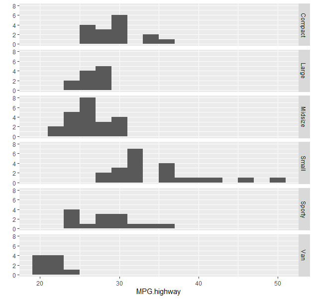

# R_03

### lapply(), sapply()

```r
> class(lapply(iris[,1:4],mean))
[1] "list"
> class(sapply(iris[,1:4],mean))
[1] "numeric"
```

- `sapply()` 는 데이터 형식을 행렬, 벡터 등의 데이터 타입으로 반환한다.

### split(feature,분류기준)

```r
irisSlMedian <- sapply(split(iris$Sepal.Length,iris$Species),median, na.rm =T) 
> irisSlMedian
    setosa versicolor  virginica 
       5.0        5.9        6.5 
```

- na.rm =T 결측치를 제외하고 중위값을 구하겠다.

- 종을 기준으로 `Sepal.Length` 의 값을 구한다.

```r
> class(irisSlMedian)
[1] "numeric"
```

```r
> iris[1,1] = NA
> head(iris)
  Sepal.Length Sepal.Width Petal.Length Petal.Width Species
1           NA         3.5          1.4         0.2  setosa
2          4.9         3.0          1.4         0.2  setosa
3          4.7         3.2          1.3         0.2  setosa
4          4.6         3.1          1.5         0.2  setosa
5          5.0         3.6          1.4         0.2  setosa
6          5.4         3.9          1.7         0.4  setosa
```

- 1행과 1열의 값을 `NA` 로 바꾼다.

```r
> iris <- within(
+   iris, {
+     Sepal.Length <- ifelse(is.na(Sepal.Length), irisSlMedian[iris$Species], Sepal.Length)
+   }
+ )
> head(iris)
  Sepal.Length Sepal.Width Petal.Length Petal.Width Species
1          5.0         3.5          1.4         0.2  setosa
2          4.9         3.0          1.4         0.2  setosa
3          4.7         3.2          1.3         0.2  setosa
4          4.6         3.1          1.5         0.2  setosa
5          5.0         3.6          1.4         0.2  setosa
6          5.4         3.9          1.7         0.4  setosa
```

- 위의 `NA` 의 값을 평균으로 바꾼다. 

### subset(data, 조건)

> 부분집합을 만들겠다. 필요한 데이터만 추출해서 가져오겠다.

```r
x <- 1:5
y <- 6:10
z <- letters[1:5]
exampleDF <- data.frame(x,y,z)
> exampleDF
  x  y z
1 1  6 a
2 2  7 b
3 3  8 c
4 4  9 d
5 5 10 e
```

```r
> str(exampleDF)
'data.frame':	5 obs. of  3 variables:
 $ x: int  1 2 3 4 5
 $ y: int  6 7 8 9 10
 $ z: chr  "a" "b" "c" "d" ...
```

#### x의 값이 3이상인 결과를 새로운 데이터 프레임으로 만들어보자.

```r
subDF01 <- subset(exampleDF, x >=3)
> subDF01
  x  y z
3 3  8 c
4 4  9 d
5 5 10 e
```

#### y의 값이 8이하인 결과를 새로운 데이터 프레임으로 만들어보자.

```r
subDF02 <- subset(exampleDF, y <= 8)
> subDF02
  x y z
1 1 6 a
2 2 7 b
3 3 8 c
```

#### z의 값이 2이상이고  y의 값이 8이하인 새로운 데이터 프레임으로 만들어보자.

```r
subDF03 <- subset(exampleDF, z >=2 & y <= 8)
> subDF03
  x y z
1 1 6 a
2 2 7 b
3 3 8 c
```

#### 컬럼선택도 가능하다.

```r
subDF2 <- subset(exampleDF, select=c(x,y))
> subDF2
  x  y
1 1  6
2 2  7
3 3  8
4 4  9
5 5 10
```

```r
subDF2 <- subset(exampleDF,x >=3 ,select=c(x,y))
> subDF2
  x  y
3 3  8
4 4  9
5 5 10
```

### petal.length 평균구하라.

```r
> mean(iris$Petal.Length)
[1] 3.758
```

```r
irisSPS <- subset(iris, Petal.Length >= mean(iris$Petal.Length), select = c(Sepal.Length, Petal.Length, Species) )
> head(irisSPS)
   Sepal.Length Petal.Length    Species
51          7.0          4.7 versicolor
52          6.4          4.5 versicolor
53          6.9          4.9 versicolor
54          5.5          4.0 versicolor
55          6.5          4.6 versicolor
56          5.7          4.5 versicolor
```

- `iris` 에서 `Petal.Length` 의 값이 평균 이상인 것들 중에서 `Sepal.Length` ,`Petal.Length` , `Species` 컬럼만 추출한다.

```r
> str(irisSPS)
'data.frame':	93 obs. of  3 variables:
 $ Sepal.Length: num  7 6.4 6.9 5.5 6.5 5.7 6.3 6.6 5.2 5.9 ...
 $ Petal.Length: num  4.7 4.5 4.9 4 4.6 4.5 4.7 4.6 3.9 4.2 ...
 $ Species     : Factor w/ 3 levels "setosa","versicolor",..: 2 2 2 2 2 2 2 2 2 2 ..
```

### 범주형 변수

```r
gender <- factor('m',c('m','f')) # LEvels을 주면 Levels안에 없는 값은 입력되지 않는다.
> gender
[1] m
Levels: m f
```

- LEvels을 주면 Levels안에 없는 값은 입력되지 않는다.

#### 레벨의 개수

```r
> nlevels(gender)
[1] 2
```

```r
> levels(gender)[1]  
[1] "m"
> levels(gender)[2]
[1] "f"
```

- 레벨의 값, 값이 벡터이다.

```r
blood.type <- factor(c('A','A','AB','O','B'))  
> blood.type
[1] A  A  AB O  B 
Levels: A AB B O
```

- 레벨 지정하지 않으면 범주로 만들어 버린다.

####  factor인지 아닌지 확인하기.

```r
> is.factor(blood.type) 
[1] TRUE
```

```r
> lettersVec <- c('a','b','b','c','a','c','a','c','b')
> lettersVec
[1] "a" "b" "b" "c" "a" "c" "a" "c" "b"
> class(lettersVec)
[1] "character"
```

#### 집단(Levels)은 오름차순으로 정리된다.

```r
lettersVec.fac <- as.factor(lettersVec)
```

```r
> class(lettersVec.fac)
[1] "factor"
> lettersVec.fac
[1] a b b c a c a c b
Levels: a b c
```

```r
> lettersVec.fac <- factor(lettersVec,
+                             levels = c('a','b','c'),
+                             labels = c('best','middle','low'))
> lettersVec.fac
[1] best   middle middle low    best   low    best   low    middle
Levels: best middle low
> levels(lettersVec.fac)
[1] "best"   "middle" "low"
```

- levels -> labels로 바꾸겠다. 

```r
> id      <- c(1,2,3,4,5)
> gender  <- c('F','M','F','M','F')
> data <- data.frame(idx = id, gender = gender)
> data
  idx gender
1   1      F
2   2      M
3   3      F
4   4      M
5   5      F
```

```r
> str(data)
'data.frame':	5 obs. of  2 variables:
 $ idx   : num  1 2 3 4 5
 $ gender: chr  "F" "M" "F" "M" ...
> data$gender <- as.factor(data$gender)
> levels(data$gender) <- c('female','male')
> data
  idx gender
1   1 female
2   2   male
3   3 female
4   4   male
5   5 female
```

- `F` 랑`M` 을 `factor	` 로 바꾸고 `female` 과 `male` 로 바꾼다.

### group by 를 통해서 산술평균을 구하기

```r
> x <- c(15,18,2,36,12,15,30,34,35,11,23)
> mean(x)
[1] 21
```

```r
height <- c(180,165,172,156,182,175,183,154,165)
gender <- c('M','F','F','F','M','M','M','F','F')
height_gender_frm <- data.frame(height,gender)
> height_gender_frm
  height gender
1    180      M
2    165      F
3    172      F
4    156      F
5    182      M
6    175      M
7    183      M
8    154      F
9    165      F
```

### aggregate(가져올거,데이터,함수)

#### 성별로 키의 평균을 구한다면?

```r
> aggregate(height_gender_frm$height,list(height_gender_frm$gender),mean) 
  Group.1     x
1       F 162.4
2       M 180.0
```

- 벡터는 by의 기준이 불가

#### 예제데이터 mtcars

##### cyl 컬럼을 기준으로 나머지 컬럼의 평균값 구하기

```r
> mtMean
  Group.1      mpg cyl     disp        hp     drat       wt     qsec        vs
1       4 26.66364   4 105.1364  82.63636 4.070909 2.285727 19.13727 0.9090909
2       6 19.74286   6 183.3143 122.28571 3.585714 3.117143 17.97714 0.5714286
3       8 15.10000   8 353.1000 209.21429 3.229286 3.999214 16.77214 0.0000000
         am     gear     carb type
1 0.7272727 4.090909 1.545455   NA
2 0.4285714 3.857143 3.428571   NA
3 0.1428571 3.285714 3.500000   NA
```

##### disp 컬럼이 120 이상인 조건 추가

```r
mtMean02 <- subset(mtcars,mtcars$disp >= 120)
> head(mtMean02)
                   mpg cyl disp  hp drat    wt  qsec vs am gear carb
Mazda RX4         21.0   6  160 110 3.90 2.620 16.46  0  1    4    4
Mazda RX4 Wag     21.0   6  160 110 3.90 2.875 17.02  0  1    4    4
Hornet 4 Drive    21.4   6  258 110 3.08 3.215 19.44  1  0    3    1
Hornet Sportabout 18.7   8  360 175 3.15 3.440 17.02  0  0    3    2
Valiant           18.1   6  225 105 2.76 3.460 20.22  1  0    3    1
Duster 360        14.3   8  360 245 3.21 3.570 15.84  0  0    3    4
                               type
Mazda RX4                 Mazda RX4
Mazda RX4 Wag         Mazda RX4 Wag
Hornet 4 Drive       Hornet 4 Drive
Hornet Sportabout Hornet Sportabout
Valiant                     Valiant
Duster 360               Duster 360
```

```r
> mtMean02 <- aggregate(mtcars,
+                       list(cylStandard = mtcars$cyl,
+                            dispHigh = mtcars[,'disp']>=120),mean)
> mtMean02
  cylStandard dispHigh      mpg cyl     disp        hp     drat       wt     qsec
1           4    FALSE 29.53333   4  84.6000  75.83333 4.155000 1.903000 18.71667
2           4     TRUE 23.22000   4 129.7800  90.80000 3.970000 2.745000 19.64200
3           6     TRUE 19.74286   6 183.3143 122.28571 3.585714 3.117143 17.97714
4           8     TRUE 15.10000   8 353.1000 209.21429 3.229286 3.999214 16.77214
         vs        am     gear     carb type
1 1.0000000 1.0000000 4.166667 1.333333   NA
2 0.8000000 0.4000000 4.000000 1.800000   NA
3 0.5714286 0.4285714 3.857143 3.428571   NA
4 0.0000000 0.1428571 3.285714 3.500000   NA
```

##### cyl 컬럼을 기준으로 wt 컬럼의 평균만 구하기

```r
mtMean03 <- aggregate(mtcars$wt,list(mtcars$cyl),mean)
> mtMean03
  Group.1        x
1       4 2.285727
2       6 3.117143
3       8 3.999214
```

- 직접 컬럼명으로 찾기.

```r
mtMean03 <- aggregate(mtcars[,6],list(mtcars$cyl),mean)
> mtMean03
  Group.1        x
1       4 2.285727
2       6 3.117143
3       8 3.999214
```

- 컬럼의 인덱스로 찾기.

```r
mtMean03 <- aggregate(wt ~ cyl,data = mtcars,mean)
> mtMean03
  cyl       wt
1   4 2.285727
2   6 3.117143
3   8 3.999214
```

- aggregate(구하는 값 or `도트.` (모든값) ~ 기준값/ 여러개면` +`로 묶는다,data,mean)

##### carb, gear 컬럼 두가지를 기준으로 wt구하기

```r
mtMean04 <- aggregate(wt ~ carb+gear, data = mtcars,mean)
> mtMean04
   carb gear       wt
1     1    3 3.046667
2     2    3 3.560000
3     3    3 3.860000
4     4    3 4.685800
5     1    4 2.072500
6     2    4 2.683750
7     4    4 3.093750
8     2    5 1.826500
9     4    5 3.170000
10    6    5 2.770000
11    8    5 3.570000
```

- 위에서 말했듯 컬럼이 2개여서 `+` 로 묶어주었다.

##### gear 기준으로 disp, wt 평균 구하기

```r
mtMean04 <- aggregate(cbind(mtcars$wt+mtcars$disp) ~ gear, data = mtcars,mean)
> mtMean04
  gear       V1
1    3 330.1926
2    4 125.6333
3    5 205.1126
```

- 구하려는 값이 2개여서 `cbind` 로 컬럼 두개를 묶었다. 

##### carb, gear 컬럼 기준으로 disp, wt 평균

```r
 mtMean04 <- aggregate(cbind(wt+disp) ~ gear+carb, data = mtcars,mean)
> mtMean04
   gear carb       V1
1     3    1 204.0800
2     4    1  86.2725
3     3    2 349.0600
4     4    2 123.7338
5     5    2 109.5265
6     3    3 279.6600
7     3    4 421.0858
8     4    4 166.8938
9     5    4 354.1700
10    5    6 147.7700
11    5    8 304.5700
```

- 서로 묶어주면 원하는 값을 얻을 수 있다.

##### cyl 제외한 다른 모든 컬럼을 기준으로 cyl의 평균을 구하기

```r
mtMean04 <- aggregate(cyl ~ ., data = mtcars,mean)
> head(mtMean04)
   mpg disp  hp drat    wt  qsec vs am gear carb               type cyl
1 15.2  304 150 3.15 3.435 17.30  0  0    3    2        AMC Javelin   8
2 10.4  472 205 2.93 5.250 17.98  0  0    3    4 Cadillac Fleetwood   8
3 13.3  350 245 3.73 3.840 15.41  0  0    3    4         Camaro Z28   8
4 14.7  440 230 3.23 5.345 17.42  0  0    3    4  Chrysler Imperial   8
5 22.8  108  93 3.85 2.320 18.61  1  1    4    1         Datsun 710   4
6 15.5  318 150 2.76 3.520 16.87  0  0    3    2   Dodge Challenger   8
```

- `.` 면 모든 값이니깐 현재 구하려는 값에 `cyl` 이 있기 때문에 `cyl` 을 제외하고 값을 구할 수 있다.

### tapply(데이터, 색인, 함수)

#### 색인 : 범주형(factor)

```r
tapply(1:10, rep(1,10), sum) 
 1 
55
```

- 1이라는 그룹으로 합을 구하겠다.

```r
tapply(1:10, 1:10 %% 2 == 0, sum) 
FALSE  TRUE 
   25    30 
class(tapply(1:10, 1:10 %% 2 == 0, sum))
[1] "array"
```

- 짝수와 홀수의 범주가 되어서 그룹별로 데이터가 리턴된다.
  - 조건이 짝수여서 2,4,6,8,10 을 더한 값이 `TRUE` 
  - 1,3,5,7,9를 더한 값이 `FALSE` 

#### iris 에서 종별로 Sepal.Length 평균

```r
head(iris)
  Sepal.Length Sepal.Width Petal.Length Petal.Width Species
1          5.0         3.5          1.4         0.2  setosa
2          4.9         3.0          1.4         0.2  setosa
3          4.7         3.2          1.3         0.2  setosa
4          4.6         3.1          1.5         0.2  setosa
5          5.0         3.6          1.4         0.2  setosa
6          5.4         3.9          1.7         0.4  setosa
```

- 여기서 `Species` 별로 평균을 구할 것이다.

```r
tapply(iris$Sepal.Length,iris[5],mean)
Species
    setosa versicolor  virginica 
     5.004      5.936      6.588 
```

- `Species` 가 범주가 되어서 각 종류별로 평균값이 구해졌다.

```r
m <- matrix(1:8,ncol = 2, 
+             dimnames = list(c('spring','summer','fall','winter'),c('male','female')))
> m
       male female
spring    1      5
summer    2      6
fall      3      7
winter    4      8
> class(m)
[1] "matrix" "array" 
```

- `m` 이라는 매트릭스를 하나 만들었다.

#### 반기별 남성 셀의 값의 합과 여성 셀의 합을 구해보자.

```r
 tapply(m,list(c(1,1,2,2,1,1,2,2),
+               c(1,1,1,1,2,2,2,2)),sum)
  1  2
1 3 11
2 7 15
```

- 설명하면 우선 반기별로 나누어야 하기 때문에 1,1,2,2,1,1,2,2를 부여한다.\
- 그 다음에 여성과 남성의 기준을 부여한다.

```
       male 반기 남성구분 female 반기 여성구분
spring    1   1       1      5   1       2
summer    2   1       1      6   1		 2
fall      3   2       1      7   2		 2
winter    4   2       1      8   2		 2
```

- 결과적으로 이렇게 되어있어서 `(1,1)`, `(2,1)` , `(1,2)`, `(2,2)` 이렇게 묶여서 계산되는 것이다.

#### Cars93 데이터

```r
levels(Cars93$Type)
[1] "Compact" "Large"   "Midsize" "Small"   "Sporty"  "Van"  
```

##### tapply 사용하여 타입별 고속도로연비 평균을 구하여라.

```r
Cars93$MPG.highway <-as.integer(Cars93$MPG.highway)
> tapply(Cars93$MPG.highway,Cars93$Type,mean)
 Compact    Large  Midsize    Small   Sporty      Van 
29.87500 26.72727 26.72727 35.47619 28.78571 21.88889 
```

- 우선 `Cars93$MPG.highway` 의 형식을 숫자로 바꿔준다.
- 그 다음에 `type` 를 기준으로 `MPG.highway` 의 평균을 구한다.

```r
with(Cars93, tapply(MPG.highway,Type,mean))
 Compact    Large  Midsize    Small   Sporty      Van 
29.87500 26.72727 26.72727 35.47619 28.78571 21.88889 
```

- 똑같은 결과지만 `with` 함수를 쓰면 `data` 를 맨 앞에 쓰고 `$` 로 컬럼을 찾지 않아도 된다. 바로 컬럼이름 쓰면 된다.

### ggplot2 

- 그래프를 그리는 `packages` 이면서 `library`  다.

```r
library(ggplot2)
install.packages("ggplot2")

qplot(MPG.highway,
      data = Cars93,
      facets = Type ~ .,
      binwidth =2 )
```



- 지금은 간단히 그래프만 그려봤다. `ggplot2` 는 다음에 더 중점으로 다룰 예정이다.

#### 프로그램의 흐름을 제어하는 제어문, 연산자, 함수

- +, -, *,/
- %% 나머지
- ^ 제곱

##### 관계연산자

- =,!=,<=,>=,<,>

##### 논리연산자

- &(AND), | (OR)
- TRUE, FALSE | T,F

##### 제어문

- if, switch

```r
> if(F) {
+   print('true')
+ } else {
+   print('else')
+ }
[1] "else"
```

- `F` 는 `False` 라 `else` 를 반환한다.

```R
score <- 55
if(score >= 60){
  print('pass')
} else {
  print('fail')
}
> [1] "pass"
```

- `score` 의 값을 비교해서 값을 출력한다.

#### if에 논리값을 만들어주면 된다. 

### scan() : 콘솔로 데이터를 입력받는 함수

```R
score <- scan() 
> 1: 50
```

- 이러한 식으로 콘솔에 값을 직접 입력할 수 있다.

### scan() 함수를 이용하여 키보드로부터 점수를 입력받고, 점수에 따른 학점등급을 출력하라. 

#### cat() 함수를 이용하여 한줄로 출력.

```R
score <- scan()
> 1: 95
> score
[1] 95

grade <- ''
if(score >= 90){
  grade <- 'A'
} else if(score >= 80){
  grade <- 'B'
} else if(score >= 70){
  grade <- 'C'
} else if(score >= 60){
  grade <- 'D'
} else {
  grade <- 'F'
}
cat('당신의 점수는', score ,'점이고, 당신의 학점은',grade)
>
당신의 점수는 95 점이고, 당신의 학점은 A
```

- score에 점수를 입력받고 비교해보면 값을 출력한다.

### 주민번호 14자리를 scan() 통해 입력받아 남자/여자를 구분하는  if ~ else를 구현하라.

```R
nunber <- scan()
> 1: 9777772111111

library(stringr)
jumin <- substr(number,7,7)
gender <- ''
if(jumin == 1 | jumin == 3){
  print('남자')
} else if (jumin == 2 | jumin == 4){
  print('여자')
} else {
  print('주민번호 형식 틀림')
}
> [1] "여자"
```

- 7번째의 앞자리를 비교해서 여자,남자를 분별한다.

### if ~ else 한번에 적용, ifelse(조건식, true, false ) 벡터로 입력받고 벡터로 리턴

```R
x <- c(1,2,3,4,5,6,7,8,9)
ifelse(x %% 2 == 0, 'even', 'odd')
>
[1] "odd"  "even" "odd"  "even" "odd"  "even" "odd"  "even" "odd" 
```

```R
x <- c(80,65,90,95)
ifelse(x >= 70 , 'pass', 'fail')
> 
[1] "pass" "fail" "pass" "pass"
```

- 여러번 입력하지 않고 한 번에 확인할 수 있다.

```R
naVec <- c(80,65,90,95,NA,80,NA,90,NA,100)
mean(naVec,na.rm = T)
> [1] 85.71429
is.na(naVec)
> [1] FALSE FALSE FALSE FALSE  TRUE FALSE  TRUE FALSE  TRUE FALSE
ifelse(is.na(naVec)==T,mean(naVec,na.rm = T),naVec)
>
[1]  80.00000  65.00000  90.00000  95.00000  85.71429  80.00000  85.71429
 [8]  90.00000  85.71429 100.00000
```

- 평균을 확인해보고, na가 있으면 그 값을 평균으로 , na가 아니면 본래 값으로 출력한다.

### read.csv(file.choose())

- 파일 선택하기

```R
testCsv <- read.csv(file.choose())
str(testCsv)
is.na(testCsv)
num5 <- testCsv$q5
num6 <- ifelse(num5 >= 3,'bigger', 'smaller')
testCsv$q6 <- num6
head(testCsv)
```

- testCsv에 na가 있는지 확인하고 q5가 3보다 크면 bigger, 작으면 smaller로 입력한다.
- 이 값을 다시 새로운 컬럼 q6에 담는다.

### table() : 본포표가 나온다.

```R
table(testCsv$q6 <- num6)
str(testCsv)
```

### q6를 범주형 변수로 변환하라.

#### as.factor()

```R
testCsv$q6 <- as.factor(testCsv$q6)
str(testCsv)
levels(testCsv$q6)
```

- 범주로 변경해서 관리한다.

### q6 별 q5의 합은?

```R
TestCsvSum <- tapply(testCsv$q5,testCsv$q6,sum)
str(TestCsvSum)
with(testCsv,tapply(q5,q6,sum))
```

- tapply(계산하고 싶은 값, 나누고 싶은 범주, 계산 함수)로 해서 값을 구한다.
- with로도 구할 수 있다.

### 새로운 파일 열기

```R
html <- read.csv(file.choose())
```

### Hwawaii주에 대한 행만 출력

```R
html$State
html[which(html$State=='Hawaii'),]
```

- `$` 로 열에 접근해서 which로 인덱스를 뽑아서 인덱셍 할 수 있다.

### which() : 조건에 만족하는 index를 반환

```R
x <- c(2,3,4,5,6,7)
which(x==6)
x[5]
```

- x의 값이 6인 인덱스를 반환해준다.

### for, if

#### for(루핑을 위한 값){

####  		if(){

#### 	}

#### }

```R
i <- 1:10
length(i)
> [1] 10
for(idx in 1:10){
  cat('idx ->', idx, '\n')
  print(idx * 2)
}
>
idx -> 1 
[1] 2
idx -> 2 
[1] 4
idx -> 3 
[1] 6
idx -> 4 
[1] 8
idx -> 5 
[1] 10
idx -> 6 
[1] 12
idx -> 7 
[1] 14
idx -> 8 
[1] 16
idx -> 9 
[1] 18
idx -> 10 
[1] 20
```

- 10번 반복한다.

```R
for(idx in 1:10){
  if(idx %% 2 != 0){
  cat('idx ->', idx, '\n')}
}
>
idx -> 1 
idx -> 3 
idx -> 5 
idx -> 7 
idx -> 9
```

- 2로 나누었을 때 나머지가 0이 아니라면 출력한다.

### 문) 1 ~ 100까지 홀수/짝수의 합을 출력하라!!

```R
even <- 0
odd <- 0

for (x in 1:100){
  if(x %% 2 == 0){
    even <- even + x
  } else {
    odd <- odd + x
  }
}
print(even)
> 
[1] 2550

print(odd)
>
[1] 2500

cat('짝수의 합=',even,'홀수의 합',odd)
>
짝수의 합= 2550 홀수의 합 2500
```

- 2노 나누었을 때 나머지가 0이면 even에 아니면 odd로 저장한다.

### 다음 데이터를 이용하여 프레임을 만들어  serviceStu에 저장

```R
subject.kor <- c(81,95,70)
subject.eng <- c(75,88,78)
subject.mat <- c(78,99,66)
name <- c('펭수','펭펭','펭하')
serviceStu <- data.frame(name,subject.kor,subject.eng,subject.mat)
str(serviceStu)
>
'data.frame':	3 obs. of  4 variables:
 $ name       : chr  "펭수" "펭펭" "펭하"
 $ subject.kor: num  81 95 70
 $ subject.eng: num  75 88 78
 $ subject.mat: num  78 99 66

t(serviceStu)
>
		  [,1]   [,2]   [,3]  
name        "펭수" "펭펭" "펭하"
subject.kor "81"   "95"   "70"  
subject.eng "75"   "88"   "78"  
subject.mat "78"   "99"   "66"  
```

- 데이터가 열로 결합된다.

### 총점과 평균을 구해서 subject.sum, subject.avg에 저장

```R
subject.sum <- apply(serviceStu[2:4],1,sum)
> 
[1] 234 282 214
```

- kor ~ mat 까지 행으로 계산된다.

```R
subject.avg <- apply(serviceStu[2:4],1,mean)
>
[1] 78.00000 94.00000 71.33333
```

- kor ~ mat 까지 행으로 계산된다.

```R
serviceStuSum <- cbind(serviceStu,subject.sum <- apply(serviceStu[2:4],1,sum))
serviceStuAvg <- cbind(serviceStuSum,subject.avg <- round(apply(serviceStu[2:4],1,mean)),2)
>
'data.frame':	3 obs. of  6 variables:
 $ name       : chr  "펭수" "펭펭" "펭하"
 $ subject.kor: num  81 95 70
 $ subject.eng: num  75 88 78
 $ subject.mat: num  78 99 66
 $ subject.sum: num  234 282 214
 $ subject.avg: num  78 94 71.3
```

- 열로 결합해서 추가한다.

### subject.grade 컬럼 추가

```R
subject.grade <- ''
size <- length(name)
size2 <- nrow(serviceStu)
for(idx in 1:size){
  print(idx)
  if(serviceStu$subject.avg[idx] >= 90){
    print(subject.grade[idx] <- 'A')
  } else if(serviceStu$subject.avg[idx] >= 80){
    print(subject.grade[idx] <- 'B')
  } else if(serviceStu$subject.avg[idx] >= 70){
    print(subject.grade[idx] <- 'C')
  } else if(serviceStu$subject.avg[idx] >= 60){
    print(subject.grade[idx] <- 'D')
  } else{
    print(subject.grade[idx] <- 'F')
  }
}
>
[1] 1
[1] "C"
[1] 2
[1] "A"
[1] 3
[1] "C"
    
serviceStu$subject.grade <- subject.grade
serviceStu$subject.avg[1]
>
[1] 78
```

- 각 점수에 해당하는 등급을 부여한다.