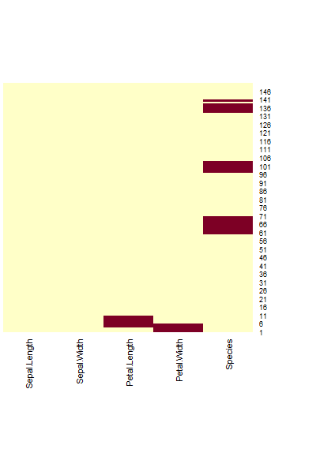
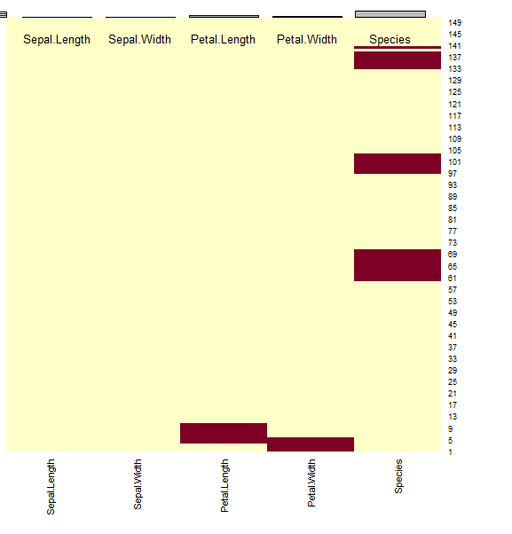

# R_04

### 파생변수 : 기본변수를 이용하여 새로운 변수를 추가하는 것

#### service_data_stock.csv

```R
stock <- read.csv(file.choose())
str(stock)
> 'data.frame':	247 obs. of  6 variables:
head(stock)
> 
  Date    Open    High     Low   Close Volume
1 30-Oct-15 1345000 1390000 1341000 1372000 498776
2 29-Oct-15 1330000 1392000 1324000 1325000 622336
3 28-Oct-15 1294000 1308000 1291000 1308000 257374
4 27-Oct-15 1282000 1299000 1281000 1298000 131144
5 26-Oct-15 1298000 1298000 1272000 1292000 151996
6 23-Oct-15 1300000 1300000 1278000 1289000 252105
```

```R
stock$diff <- stock$High - stock$Low
>
[1] 49000 68000 17000 18000 26000 22000 26000 23000 17000 16000 10000 39000
mean(stock$diff)
> [1] 27028.34
```

### diff 변수를 이용해서 diff_result 파생변수 생성

#### for ~ 

#### diff_result에 stock$diff이 stock$diff의 평균보다 크면 'mean over' 작으면 'mean under'

```R
stock$diff_result <- ''
size <- nrow(stock)
for (idx in 1:size){
  if(stock$diff[idx] > mean(stock$diff)){
    stock$diff_result[idx] <- 'mean over'
  }else {
    stock$diff_result[idx] <- 'mean under'
  }
}
head(stock)
>
	 Date    Open    High     Low   Close Volume  diff 	diff_result
1 30-Oct-15 1345000 1390000 1341000 1372000 498776 49000   mean over
3 28-Oct-15 1294000 1308000 1291000 1308000 257374 17000  mean under
table(stock$diff_result)
> 
mean over 	mean under 
       104        143 
str(stock)
> 
'data.frame':	247 obs. of  8 variables:
```

- for구문으로 반복하고 if절로 조건을 준다.

- `diff_result` 가 추가되었다.

- `table` 로 범주 요약 정보를 확인 할 수 있다.

###  while(논리값) {

### 조건을 이용해서 탈출

### }

```R
while(idx <= 10){
  print(idx)
  idx <- idx + 1
}
>
[1] 1
[1] 2
[1] 3
[1] 4
[1] 5
[1] 6
[1] 7
[1] 8
[1] 9
[1] 10
```

- 10이하일때만 출력한다.

### 1~100 사이의 5의 배수만 출력하고 싶다면? 

#### if에서 else는 없어도 된다.

```R
while(five <= 100){
  if(five %% 5 ==0){
    cat(five,',')
  }
  five <- five + 1
}
>
5 ,10 ,15 ,20 ,25 ,30 ,35 ,40 ,45 ,50 ,55 ,60 ,65 ,70 ,75 ,80 ,85 ,90 ,95 ,100 ,
```

- if 조건에 맞는 것만 출력한다.

### next(continus), break()

```R
idx <- 0
while(idx <= 10){
  idx <- idx + 1
  if(idx %% 2 != 0){
    next
  }
  print(idx)
}
>
[1] 2
[1] 4
[1] 6
[1] 8
[1] 10
```

- 홀수면 출력하지 않고 다음단계로 지나간다.

- 조건에 만족했을 때 그 이후의 행을 실행하지 않고 바로 올라가버린다. 즉 조건에 해당되면 프린트 안 해준다. 

```R
dx <- 0
while(idx <= 10){
  idx <- idx + 1
  if(idx %% 2 != 0){
    break
  }
   print(idx)
}
>
```

- 2로 나눈 값이 0이 아닌 것, 1로 나누면 0이 아니기 때문에 바로 탈출한다.

- 가장 가까운 루핑을 빠져나간다. 

### NA확인 : is.na()

```R
is.na(c(1,2,3,4,NA))
> [1] FALSE FALSE FALSE FALSE  TRUE
```

- na값이면 `TRUE` 를 반환한다.

### NA 개수를 확인 : sum(is.na(data))

```R
naDF <- data.frame(x=c(NA,2,3),
                   y = c(NA,4,5))
>
 x  y
1 NA NA
2  2  4
3  3  5
sum(is.na(naDF))
> [1] 2
```

- `TRUE` 의 갯수를 반환해준다.

### NA 처리 : na.rm = T

```R
sum(c(1,2,3,NA),na.rm = T)
> [1] 6
mean(c(1,2,3,NA),na.rm = T)
> [1] 2
```

- 결측치를 제외하고 계산한다.

### package::caret

### na.omit(), na.pass(), na.fail()

```R
na.omit(c(1,2,3,NA))
> 
[1] 1 2 3
attr(,"na.action")
[1] 4
attr(,"class")
[1] "omit"
```

- na값은 빼버린다.

```R
na.pass(c(1,2,3,NA))
> [1]  1  2  3 NA
```

```R
na.fail(c(1,2,3,NA))
> 
Error in na.fail.default(c(1, 2, 3, NA)) : 객체안에 결측값들이 있습니다
```

### iris에 임의로 결측값을 넣어보자.

```R
irisDF <- iris
irisDF[4:10,3] <- NA
irisDF[1:5,4] <- NA
irisDF[60:70,5] <- NA
irisDF[97:103,5] <- NA
irisDF[133:138,5] <- NA
irisDF[140,5] <- NA
```

```R
heatmap(1 * is.na(irisDF),
        Rowv = NA,
        Colv = NA,
        scale = 'none',
        cexCol = .8)
```



- heatmap으로 결측값을 확인해보았다.

### 함수 정의

```R
newSumFunc <- function(x,y){
  result <- x + y
  return (result)
}
```

- x,y를 받으면 result에 x와 y를 더하고 그 값을 return한다.

- return은 마지막에 ()로 감싸주어야함

```R
newSumFunc()
```

- 함수호출이기 때문에 소괄호가 들어가야 한다. 
- 강제적으로 리턴해줘야한다.
- 안하면 마지막 문장이 넘어온다.

```R
resultSum <- newSumFunc(5,4)
resultSum
> [1] 9
```

```R
resultSum <- newSumFunc(y = 5,x = 4)
```

- 직접 인자 다시 할당해도 된다.

### 가변함수

```R
varFunc <- function(...){
  args <- list(...)
  result <- 0
  for(idx in args){
    result <- result + idx 
  }
  return(result)
}
varFunc(1)
> [1] 1
varFunc(1,2)
> [1] 3
varFunc(1,2,3,4)
> [1] 10
```

- 함수가 받는 인자를 지정하지 않고 때마다 다르게 받을 수 있다.

### 결측치 비율을 계산하는 함수를 만들어 보자.

####  행 및 열별로 비율 계산하기.

```R
naMissFunc <- function(x){
  sum(is.na(x)) / length(x) * 100
}
```

#### 행별 결측치 비율을 계산해보자.

```R
row <- apply(irisDF,1,naMissFunc)
```

- 행의 값이 인자로 들어가서 계산된다.

```R
col <- apply(irisDF,2,naMissFunc)
> 
Sepal.Length  Sepal.Width Petal.Length  Petal.Width      Species 
    0.000000     0.000000     4.666667     3.333333    16.666667
```

- 열의 값이 인자로 들어가서 계산된다.

```R
barplot(col)
```



### 조작함수

### merge() : join

### rbind(), cbind() : 조건없이 합쳐버린다. 

```R
x <- data.frame(name = c('펭수','펭펭','펭하'),
                math = c(100, 60, 95))
y <- data.frame(name = c('펭하','펭펭','펭수'),
                english = c(100, 70, 95))
cbind(x,y)
>
	name math	 name english
1 	펭수  100 	펭하     100
2 	펭펭   60 	펭펭      70
3 	펭하   95 	펭수      95
```

- 열로 그냥 합친다.

```R
merge(x,y)
>
name math english
1 펭수  100      95
2 펭펭   60      70
3 펭하   95     100
```

- name이 같은 것만 합친다.

### doBy package

#### summaryBy(), orderBy(), splitBy(), sampleBy()

#### quantile() : 자료의 분포

```R
quantile(iris$Sepal.Length)
>
 0%  25%  50%  75% 100% 
 4.3  5.1  5.8  6.4  7.9 
```

```R
quantile(iris$Sepal.Length, seq(0,1, by= 0.1))
>
0%  10%  20%  30%  40%  50%  60%  70%  80%  90% 100% 
4.30 4.80 5.00 5.27 5.60 5.80 6.10 6.30 6.52 6.90 7.90 
```

- 0~1까지 10%씩 나눈다.

```R
install.packages('doBy')
library(doBy)
```

#### summaryBy(구하는값 ~ 기준,데이터 ) : 기준에 대한 요약 

- 원하는 컬럼의 값을 특정 조건에 따라 요약하는 목적

```R
summaryBy(. ~ Species, iris)
>
 	Species 	Sepal.Length.mean Sepal.Width.mean Petal.Length.mean Petal.Width.mean
1     setosa             5.004            3.428             1.462            0.246
2 versicolor             5.936            2.770             4.260            1.326
3  virginica             6.588            2.974             5.552            2.026
```

- 모든데이터를 종별로 요약해준다.

#### orderBy() : 정렬을 위한 목적

- 모든 데이터를 볼 때 도트(.) 찍으면 오류난다. 그냥 비워둔다.

```R
orderBy(  ~ Species , iris)
>
	Sepal.Length Sepal.Width Petal.Length Petal.Width    Species
1            5.0         3.5          1.4         0.2     setosa
```

- 종별로 정렬이 된다.

```R
orderBy(  ~ Species + Sepal.Width , iris)
>
	Sepal.Length Sepal.Width Petal.Length Petal.Width    Species
42           4.5         2.3          1.3         0.3     setosa
9            4.4         2.9          1.4         0.2     setosa
```

- 종 다음에 `Sepal.Width` 순으로 정렬한다.

### package::dase

#### order() : 주어진 값을 정렬했을 때의 색인 순서대로 반환

- 기본은 오름차순으로 정렬된다.

```R
install.packages('base')
library(base)
iris[order(iris$Sepal.Width),]
>
	Sepal.Length Sepal.Width Petal.Length Petal.Width    Species
61           5.0         2.0          3.5         1.0 versicolor
63           6.0         2.2          4.0         1.0 versicolor
```

- Sepal.Width 의 인덱스 순으로 정렬된다.

#### sample(데이터, 뽑고자 하는 개수) : 모집단으로부터 특정 표본을 추출

- 무작위로 데이터를 섞을 때도 사용한다.

**복원 추출**

```R
sample(1:10,5,replace = T) 
> 
[1] 7 4 7 9 1
```

- replace = T 중복 허용

**비복원 추출**

```R
sample(1:10,10)
>
 [1] 10  8  7  9  1  4  2  3  6  5
```

#### iris에 sample()적용

```R
iris[sample(1:nrow(iris),nrow(iris)),]
>
 	Sepal.Length Sepal.Width Petal.Length Petal.Width    Species
94           5.0         2.3          3.3         1.0 versicolor
13           4.8         3.0          1.4         0.1     setosa
```

- iris의 길이까지, iris의 개수만큼 뽑는다.

#### sampleBy(원하는거 ~ 기준,비율,기존데이터변경여부)

```R
examSampleBy <- sampleBy( ~ Species ,frac = 0.2,data = iris)
examSampleBysampleBy(원하는거 ~ 기준,비율,기존데이터변경여부)
>
				Sepal.Length Sepal.Width Petal.Length Petal.Width    Species
setosa.2               4.9         3.0          1.4         0.2     setosa
setosa.12              4.8         3.4          1.6         0.2     setosa
versicolor.52          6.4         3.2          4.5         1.5 versicolor
versicolor.53          6.9         3.1          4.9         1.5 versicolor
virginica.142          6.9         3.1          5.1         2.3  virginica
virginica.149          6.2         3.4          5.4         2.3  virginica
```

- 종별로 20%씩 추출된다.

**트레이닝 데이터**

```R
train <- sampleBy( ~ Species ,frac = 0.8 ,data = iris) 
train
>
				Sepal.Length Sepal.Width Petal.Length Petal.Width    Species
setosa.1                5.0         3.5          1.4         0.2     setosa
setosa.2                4.9         3.0          1.4         0.2     setosa
versicolor.51           7.0         3.2          4.7         1.4 versicolor
versicolor.52           6.4         3.2          4.5         1.5 versicolor
virginica.149           6.2         3.4          5.4         2.3  virginica
virginica.150           5.9         3.0          5.1         1.8  virginica
```

- 종별로 80% 뽑아서 학습데이터를 만든다.

**테스트 데이터**

```R
test <- sampleBy( ~ Species ,frac = 0.2 ,data = iris) # 테스트 데이터
test
>
				Sepal.Length Sepal.Width Petal.Length Petal.Width    Species
setosa.7               4.6         3.4          1.4         0.3     setosa
setosa.18              5.1         3.5          1.4         0.3     setosa
versicolor.53          6.9         3.1          4.9         1.5 versicolor
versicolor.56          5.7         2.8          4.5         1.3 versicolor
virginica.147          6.3         2.5          5.0         1.9  virginica
virginica.150          5.9         3.0          5.1         1.8  virginica
```

- 종별로 20% 뽑아서 비교 데이터를 만든다.

#### split() : 반환값 list

```R
split(iris, iris$Species)
>
$setosa
   Sepal.Length Sepal.Width Petal.Length Petal.Width Species
1           5.0         3.5          1.4         0.2  setosa
$versicolor
    Sepal.Length Sepal.Width Petal.Length Petal.Width    Species
51           7.0         3.2          4.7         1.4 versicolor
$virginica
    Sepal.Length Sepal.Width Petal.Length Petal.Width   Species
101          6.3         3.3          6.0         2.5 virginica
```

- 종별로 나누었다.

### iris종별 Sepal.Length 평균

#### lapply()

```R
lapply(split(iris$Sepal.Length, iris$Species),mean)
>
$setosa
[1] 5.004

$versicolor
[1] 5.936

$virginica
[1] 6.588
```

- 종별로 나눠진 것들의 평균을 구한다.

##### 데이터 프레임 만들기

```R
irisDF <- lapply(split(iris$Sepal.Length, iris$Species),mean)
irisDF <- unlist(irisDF)
irisDF <- matrix(irisDF,ncol = 3,byrow = T)
irisDF <- as.data.frame(irisDF)
names(irisDF) <- c('s_mean','colo_mean','nice_mean')
irisDF
>
 s_mean colo_mean nice_mean
1  5.004     5.936     6.588
```

1. unlist로 벡터를 만든다.
2. 매트릭스를 만든다.
3. 그 다음에 데이터 프레임으로 변환한다.
4. 열 이름을 부여한다.

**데이터 프레임 만들기 02**

```R
irisDF <- lapply(split(iris$Sepal.Length, iris$Species),mean)
irisDF <- as.data.frame(irisDF)
irisDF
>
	setosa versicolor virginica
1 	 5.004      5.936     6.588
```

- 바로 변환을 해도 된다.

