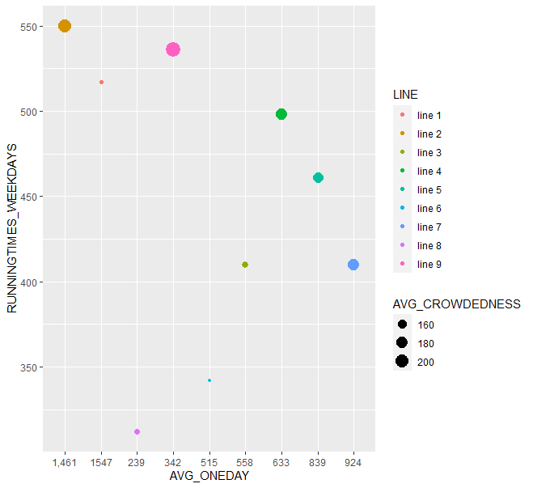
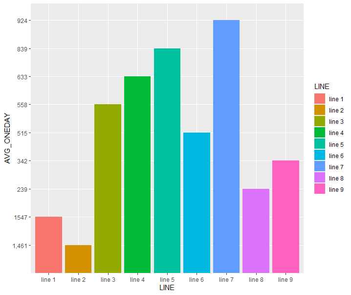
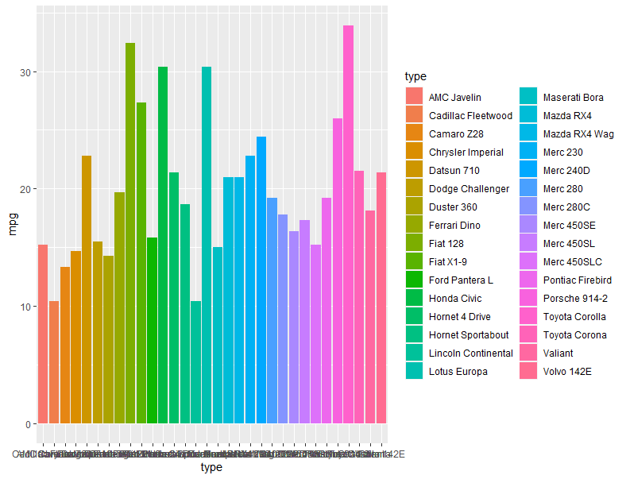
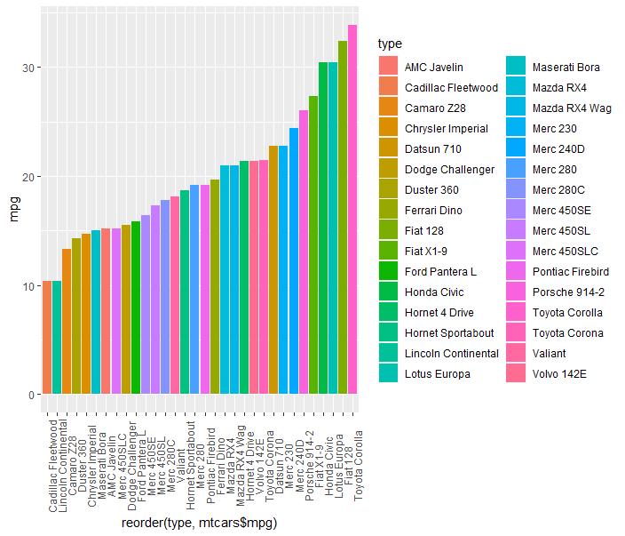
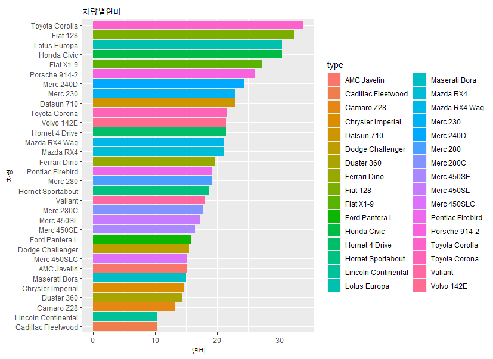

# R_06

### 시각화 마무리 & EDA

```R
seoul_subway <- read.csv(file.choose())
```

##### x 축을 평균일(AVG_ONEDAY) 승차인원으로 설정하고  y 축을 각 노선의 운행횟수(RUNNINGTIMES_WEEKDAYS)로 설정해서 평균 혼잡도(AVG_CROWDEDNESS)로 산점도를 그려보자.

```R
ggplot(seoul_subway,
       aes(x = AVG_ONEDAY,
           y = RUNNINGTIMES_WEEKDAYS)) + 
  geom_point(aes(col = LINE, size = AVG_CROWDEDNESS))
```

- `aes` :  축 설정



#####  x축을 각 노선으로(LINE)으로 일평균 막대그래프를 만들어보자.

```R
ggplot(seoul_subway,
       aes(x = LINE,
           y = AVG_ONEDAY)) +
  geom_bar(stat = 'identity',aes(fill = LINE))
```

- `stat = 'identity'` 를 해줘야 온전히 그래프가 나온다.



##### 차량별 연비(mpg)를 이용해서 막대그래프

```R
ggplot(mtcars,
       aes(x = type,
           y = mpg)) + 
  geom_bar(stat = 'identity',aes(fill = type)) 
```



#### reorder(type, mtcars$mpg) :  오름차순 정렬

#### reorder(type, -mtcars$mpg) : 내림차순 정렬

#### theme(axis.text.x = element_text(angle=90)) : 글씨를90도로 바꿔준다.

```R
ggplot(mtcars,
       aes(reorder(type, mtcars$mpg),
           y = mpg)) + 
  geom_bar(stat = 'identity',aes(fill = type)) +
  theme(axis.text.x = element_text(angle=90))
```



```R
carMpg <- ggplot(mtcars,
       aes(reorder(type, mtcars$mpg),
           y = mpg)) + 
  geom_bar(stat = 'identity',aes(fill = type)) +
  coord_flip() 
carMpg + labs(title = '차량별연비',
               x = '차량',
               y = '연비') 
```

- `coord_flip()` : 세로 막대로 바꿔준다.



### EDA(Exploratory Data Analysis)

1. 데이터 탐색 
2. 결측치(NA) 처리
3. 이상치(outlier) 발견 처리
4. 리코딩(코딩 변경)
5. 파생변수 , 가변수 
6. 시각화
7. 의사결정

##### dim(데이터) : 행과 열을 반환

```R
dataset <- read.csv(file.choose())
```

```R
dim(dataset)
>
[1] 300   7
```

```R
nrow(dataset)
> [1] 300
ncol(dataset)
> [1] 7
```

- 결측치 개수 확인

```R
table(is.na(dataset$price))
>
FALSE  TRUE 
  270    30 
```

#### 결측치를 처리하는 방법

- `caret` : na.omit() 전체 데이터 테이블에서 적용된다.

```R
dataset <- na.omit(dataset)
table(is.na(dataset_new))
>
FALSE  TRUE 
 2555   118 
```

##### 평균으로 대체하거나 0으로 대체하기

```R
price <- dataset$price

# 0으로 대체
ifelse(is.na(price),0,price)

# 평균으로 대체
ifelse(is.na(price),round(mean(price,na.rm = T),1),price)
```

##### 통계적 방법 활용을 위해서 분석가의 기준으로 가변수 만들어서 이걸로 대체하는 방법도 있다.

```R
priceAvg <- mean(dataset$price, na.rm = T)
dataset$type <- rep(1:3,100)
```


