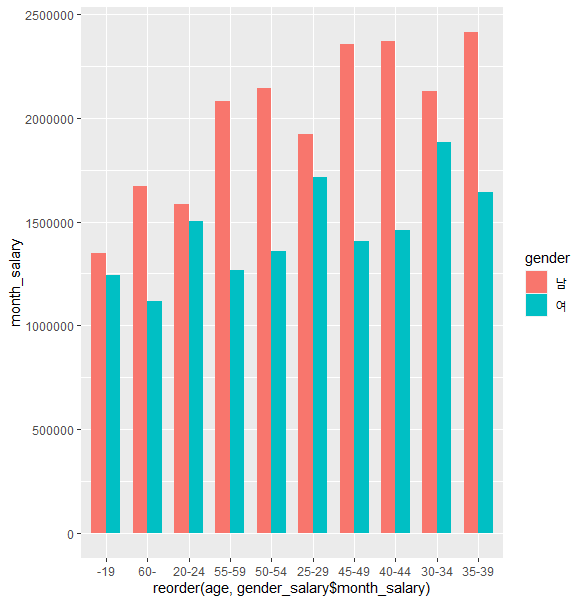
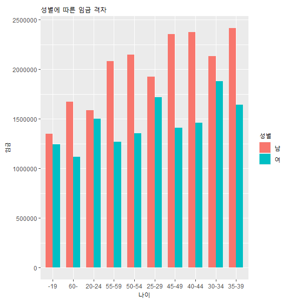
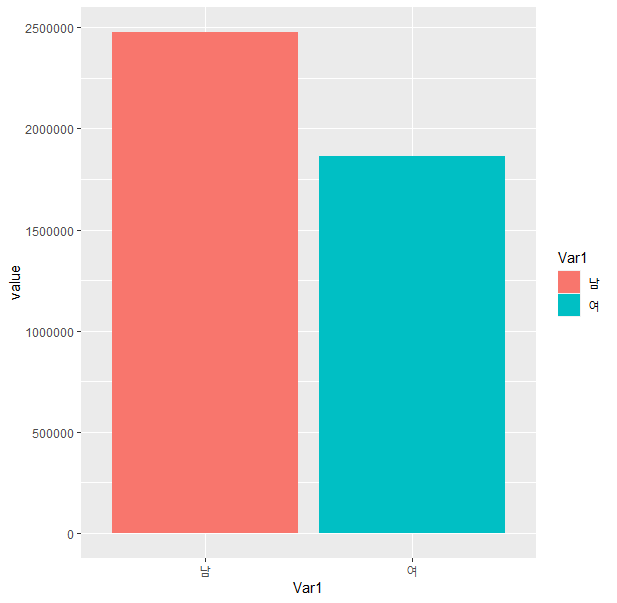
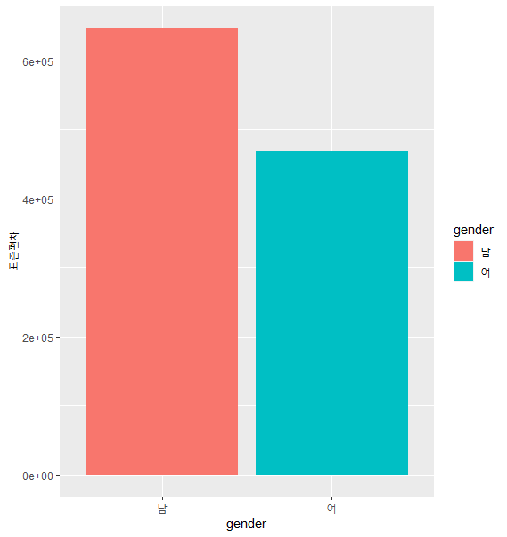
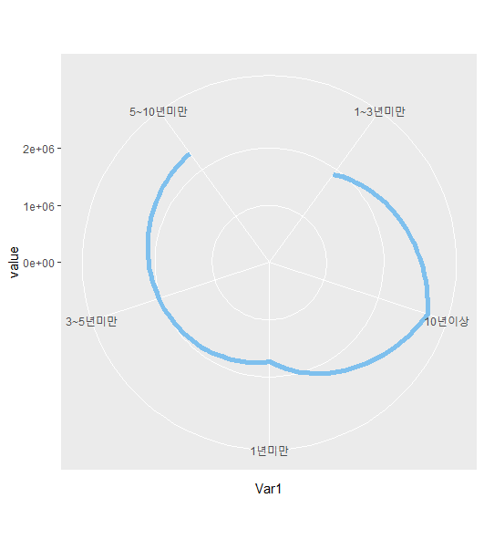
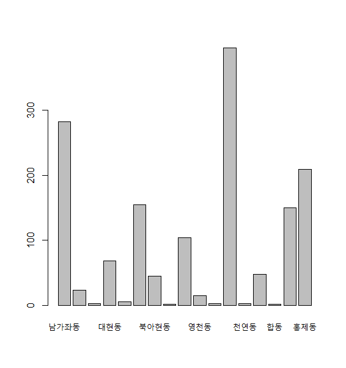
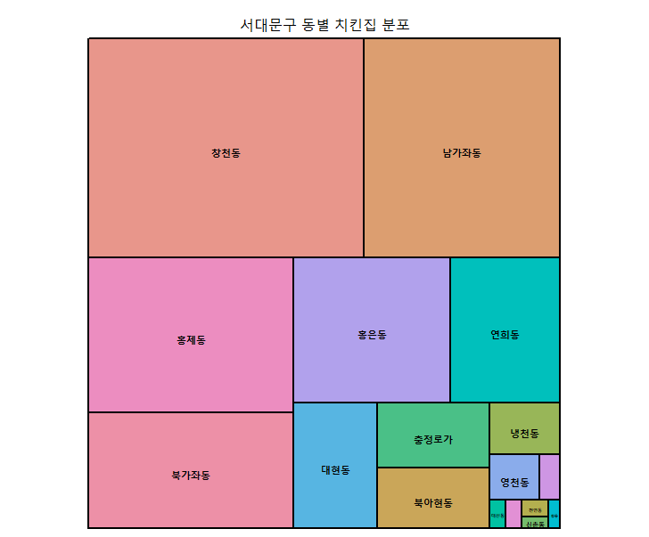

# R_06

### 시각화 마무리 & EDA

```R
seoul_subway <- read.csv(file.choose())
```

##### x 축을 평균일(AVG_ONEDAY) 승차인원으로 설정하고  y 축을 각 노선의 운행횟수(RUNNINGTIMES_WEEKDAYS)로 설정해서 평균 혼잡도(AVG_CROWDEDNESS)로 산점도를 그려보자.

```R
ggplot(seoul_subway,
       aes(x = AVG_ONEDAY,
           y = RUNNINGTIMES_WEEKDAYS)) + 
  geom_point(aes(col = LINE, size = AVG_CROWDEDNESS))
```

- `aes` :  축 설정


#####  x축을 각 노선으로(LINE)으로 일평균 막대그래프를 만들어보자.

```R
ggplot(seoul_subway,
       aes(x = LINE,
           y = AVG_ONEDAY)) +
  geom_bar(stat = 'identity',aes(fill = LINE))
```

- `stat = 'identity'` 를 해줘야 온전히 그래프가 나온다.


##### 차량별 연비(mpg)를 이용해서 막대그래프

```R
ggplot(mtcars,
       aes(x = type,
           y = mpg)) + 
  geom_bar(stat = 'identity',aes(fill = type)) 
```


#### reorder(type, mtcars$mpg) :  오름차순 정렬

#### reorder(type, -mtcars$mpg) : 내림차순 정렬

#### theme(axis.text.x = element_text(angle=90)) : 글씨를90도로 바꿔준다.

```R
ggplot(mtcars,
       aes(reorder(type, mtcars$mpg),
           y = mpg)) + 
  geom_bar(stat = 'identity',aes(fill = type)) +
  theme(axis.text.x = element_text(angle=90))
```


```R
carMpg <- ggplot(mtcars,
       aes(reorder(type, mtcars$mpg),
           y = mpg)) + 
  geom_bar(stat = 'identity',aes(fill = type)) +
  coord_flip() 
carMpg + labs(title = '차량별연비',
               x = '차량',
               y = '연비') 
```

- `coord_flip()` : 세로 막대로 바꿔준다.


### EDA(Exploratory Data Analysis)

1. 데이터 탐색 
2. 결측치(NA) 처리
3. 이상치(outlier) 발견 처리
4. 리코딩(코딩 변경)
5. 파생변수 , 가변수 
6. 시각화
7. 의사결정

##### dim(데이터) : 행과 열을 반환

```R
dataset <- read.csv(file.choose())
```

```R
dim(dataset)
>
[1] 300   7
```

```R
nrow(dataset)
> [1] 300
ncol(dataset)
> [1] 7
```

- 결측치 개수 확인

```R
table(is.na(dataset$price))
>
FALSE  TRUE 
  270    30 
```

#### 결측치를 처리하는 방법

- `caret` : na.omit() 전체 데이터 테이블에서 적용된다.

```R
dataset <- na.omit(dataset)
table(is.na(dataset_new))
>
FALSE  TRUE 
 2555   118 
```

##### 평균으로 대체하거나 0으로 대체하기

```R
price <- dataset$price

# 0으로 대체
ifelse(is.na(price),0,price)

# 평균으로 대체
ifelse(is.na(price),round(mean(price,na.rm = T),1),price)
```

##### 통계적 방법 활용을 위해서 분석가의 기준으로 가변수 만들어서 이걸로 대체하는 방법도 있다.

```R
priceAvg <- mean(dataset$price, na.rm = T)
dataset$type <- rep(1:3,100)
```

##### type : 1, 2, 3  / 우수, 보통, 저조 / 평균에다 *1.15, *1.1/ *1.05 300명 고객유형을 판단하여 새로운 가변수 priceSta 만들어 처리된 값을 넣어보자. 

```R
dataset$priceSta <- ifelse(dataset$type == 1,dataset$priceSta <- priceAvg * 1.5,
                           ifelse(dataset$type == 2,dataset$priceSta <- priceAvg * 1,priceAvg * 0.5))
temp = 0
for(i in 1:nrow(dataset)){
  if(dataset$type[i] == 1){
    temp[i] = priceAvg * 1.5
  }else if(dataset$type[i] == 2){
    temp[i] = priceAvg * 1.0
  }else{
    temp[i] = priceAvg * 0.5
  }
}
```

```R
dataset$priceSta <- temp
dataset$gender
gender <- dataset$gender
```

##### subset을 활용하여 이상치를 제거한 후 gender를 범주형으로 변환해보자.

```R
dataset <- subset(dataset,dataset$gender == 1 | dataset$gender == 2)
dataset_new$gender <- as.factor(dataset_new$gender)
```

#### 변수의 유형이 연속변수라면 어떻게 이상치를 제거할까요?

```R
seqPrice <- dataset_new$price
```

##### IQR (Q3-Q1) 6.3-4.4 = 1.9

```R
outliner <- boxplot(seqPrice)
```

##### 2.1~7.9 사이만 정상적인 데이터

```r
dataset <- subset(dataset,seqPrice >= 2.1 & seqPrice <= 7.9)
```

```R
boxplot(dataset$price)
```


##### 결측지 제거 

```R
dataset3 <- subset(dataset$age,is.na(dataset$age) != TRUE)
```

```R
boxplot(dataset3, horizontal = T)
```


#### 리코딩 - 데이터의 가독성을 위해서 

- 연속형 -> 변주형

#### 형식 ) dataset$컬럼[조건식] <- 추가할 값 

- 1 : 서울, 2 : 부산, 3 : 광주, 4 : 대전, 5 : 대구

```R
dataset$resident_new[dataset$resident == 1] <- '서울'
dataset$resident_new[dataset$resident == 2] <- '부산'
dataset$resident_new[dataset$resident == 3] <- '광주'
dataset$resident_new[dataset$resident == 4] <- '대전'
dataset$resident_new[dataset$resident == 5] <- '대구'
```

##### 주거지의 NA 값을 행정수도인 대전으로 대체

```r
dataset$resident_new[is.na(dataset$resident) == T ] <- '대전'
dataset$resident_new <- as.factor(dataset$resident_new)
```

#### job

- 1 : 분석가, 2 : 데이터과학자, 3 : 개발자

```R
dataset$job_new[dataset$job == 1] <- '분석가'
dataset$job_new[dataset$job == 2] <- '데이터과학자'
dataset$job_new[dataset$job == 3] <- '개발자'
dataset$job_new <- as.factor(dataset$job_new)
dataset$job_new[is.na(dataset$job) == T] <- '취업준비생'
```

- 간단 분석/ stringsAsFactors = F 스트링을 팩터로 T, 아니면  F, na = '-' -가 na다.

```R
salary_data_eda <- read.csv(url, stringsAsFactors = F, na = '-')
```

##### 1. 컬럼명을 영문으로 변경

```r
names(salary_data_eda) <- c('age','month_salary','year_bonus','hour','pop','expert','gender')
```

##### 2. 각 피쳐별 결측값 확인

```R
str(salary_data_eda)
summary(salary_data_eda)
table(is.na(salary_data_eda))
>
FALSE  TRUE 
  691     9 
```

##### 3. 임금 평균 확인

```R
str(salary_data_eda)
mean(salary_data_eda$month_salary,na.rm = T)
>
'data.frame':	100 obs. of  7 variables:
 $ age         : chr  "-19" "20-24" "25-29" "30-34" ...
 $ month_salary: num  1346534 1584214 1922043 2130988 2414345 ...
 $ year_bonus  : num  151840 115375 268058 335710 352816 ...
 $ hour        : num  170 180 178 181 181 ...
 $ pop         : num  15042 74251 143338 103585 65385 ...
 $ expert      : chr  "1년미만" "1년미만" "1년미만" "1년미만" ...
 $ gender      : chr  "남" "남" "남" "남" ...
>
[1] 2171578
```

#####  4. 임금 중앙값 확인

```r
median(salary_data_eda$month_salary,na.rm = T)
>
[1] 2120345
```

##### 5. 임금 범위 구해보기 (최저, 최고)

```R
max(salary_data_eda$month_salary,na.rm = T)
>
[1] 4064286

min(salary_data_eda$month_salary,na.rm = T)
>
[1] 1117605
```

```R
boxplot(salary_data_eda$month_salary)
```


```R
range(salary_data_eda$month_salary,na.rm = T)
>
[1] 1117605 4064286
```

##### 6. 임금에 대한 사분위수(quantile()) 구하기

```R
quantile(salary_data_eda$month_salary,na.rm = T)
>
	0%     25%     50%     75%    100% 
1117605 1689658 2120345 2519221 4064286
```

##### 7. 성별에 따른 임금 격차 확인해보기

```R
install.packages('sqldf')
library(sqldf)
```

```R
gender_salary <- sqldf('select gender,month_salary,age
      from salary_data_eda
      group by gender,age')
```

```R
gender_salary2 <- sqldf('select gender,month_salary
      from salary_data_eda
      group by gender')
```

```R
male <- subset(salary_data_eda,salary_data_eda$gender == '남')
female <- subset(salary_data_eda,salary_data_eda$gender == '여')
maleSalary <- male$month_salary
femaleSalary <- female$month_salary
genderSalary <- data.frame(male = maleSalary, female = femaleSalary)
```

```R
ddply(salary_data_eda,
      .(gender),
      summarise,
      mean = mean(month_salary,na.rm =T))
>
 gender    mean
1     남 2477332
2     여 1865823
```

```r
colnames(salary_data_eda) <- c("Age","Salary","SpecialSalary","WorkingTime","Numberofworker","Career","Gender")
```

```r
salary.gender_sal <- tapply(salary_data_eda$Salary, 
                            salary_data_eda$Gender, 
                            mean, 
                            na.rm = T)
>
    남      여 
2477332 1865823 
```

##### 8. 분석된 데이터를 가지고 원하는 시각화 진행

```r
genSa_bar <- ggplot(gender_salary,
       aes(reorder(age, gender_salary$month_salary),
           y = month_salary)) +
  geom_bar(stat = 'identity', aes(fill = gender),
           width = .7, position = position_dodge(width = .7))
```



```r
genSa_bar + labs(title = '성별에 따른 임금 격차',
                 fill = '성별',
                 x = '나이',
                 y = '임금')
```

- 제목을 붙여주었다.



```r
salary.melt <-  melt(salary.gender_sal)
>
  Var1   value
1   남 2477332
2   여 1865823
```

```r
ggplot(salary.melt, aes(x = Var1 , y = value , fill = Var1))+
  geom_bar(stat = "identity")
```



#####  9. 성별에 따른 표준편차구하기

```r
genSd <- aggregate(month_salary ~ gender, salary_data_eda,sd,na.rm = T)
```

```r
salary_data_eda %>%
  group_by(gender) %>%
   summarise(sd = sd(month_salary,na.rm = T))
```

```R
genSd <- ddply(salary_data_eda,
      .(gender),
      summarise,
      '표준편차' = sd(month_salary,na.rm = T))
>
gender 표준편차
1     남 646470.7
2     여 468270.6
```

- 3가지의 방법이 있다.



```r
salary.gender_sal_sd <- tapply(salary_data_eda$Salary, 
                               salary_data_eda$Gender, 
                               sd, 
                               na.rm = T)
>
      남       여 
646470.7 468270.6 
```

##### 10. 경력별 임금 평균치

```r
expertMean <- ddply(salary_data_eda,
      .(expert),
      summarise,
      mean(month_salary,na.rm = T))
```

```r
salary.career <- tapply(salary_data_eda$Salary, 
                        salary_data_eda$Career, 
                        mean, 
                        na.rm = T)
>
1~3년미만   10년이상    1년미만  3~5년미만 5~10년미만 
   1905012    2907119    1730835    2028015    2360463 
```

#####  11. 경력별 임금 평균치 시각화

```r
names(expertMean) <- c('expert','mean')
expertmean <- ggplot(expertMean,
       aes(reorder( expert, expertMean$mean),
           y = mean)) +
  geom_bar(stat = 'identity',aes(fill = expert))
```

```R
expertmean + labs(title = '경력별 임금 평균치',
  fill = '경력기간',
                  x = '경력기간',
                  y = '임금 평균')
```


```R
career.melt <- melt(salary.career)
>
 	Var1   value
1  1~3년미만 1905012
2   10년이상 2907119
3    1년미만 1730835
4  3~5년미만 2028015
5 5~10년미만 2360463
```

```r
ggplot(career.melt, aes(x = Var1, y = value, group = 1)) + 
  geom_line(color = "skyblue2",
            size = 2) +
  coord_polar() +
  ylim(0 , max(career.melt$value))
```



#### 통닭집이 가장 많은 지역 찾기

##### 서대문구에 통닭집이 많은 동을 시각화 해보자

```r
ck <- read_xlsx(file.choose())
head(ck)
>
# A tibble: 6 x 2
  소재지전체주소                                               사업장명            
  <chr>                                                        <chr>               
1 서울특별시 서대문구 창천동 52-20번지 2층                     쪼리375             
2 서울특별시 서대문구 창천동 53-83번지 (지상1층)               고향   
```

##### substr() 함수를 이용하여 소재지전체주소에 동만 가져오기

```r
regexpr('[[:alpha:]]{1,} (1글자 이상)동(동으로끝나는)',ck$소재지전체주소(데이터))
```

```r
address <- substr(ck$소재지전체주소,11,16)
```

```r
pattern <- regexpr('[[:alpha:]]{1,}동',ck$소재지전체주소)
```

```R
dong <- regmatches(ck$소재지전체주소, pattern)
```

- 4개의 방법이 있다.

##### 실행결과 동 이름이 3글자인 경우와 4글자인 경우가 있으므로 지정한 자리만큼 글자를 추출하면 3글자인 동은 숫자가 포함된다. 공백과 숫자를 제거하자

```r
address <- gsub('[[:digit:]]','',address)
address <- gsub(' ','',address)
```

- 대체함수를 이용해서 바꿔준다.

##### 동별 도수분포표 만들어보기

- table() 함수를 이용해서 숫자 세기, 변수가 한개일때 도수분표표를 만들어줌

```r
library(descr)
```

```r
add2 <- table(address)
class(add2)
>
[1] "table"
```

```r
add2 <- as.data.frame(add2)
hist(add2$Freq,ylim = range(0,20))
freq <- freq(address)
```



- 도수분포표란 항목별 개수를 나타낸 것이다.

```r
install.packages("treemap")
library(treemap)
```

- 트리맵은 옵션으로 데이터 프레임을 입력받는다.

##### treemap(데이터, index=구분 열 , vSize=분포 열 , vColor=컬러, title=제목)

```r
treemap(add2,index = 'address', vSize = 'Freq',vColor = rainbow(),title = '서대문구 동별 치킨집 분포')
```

