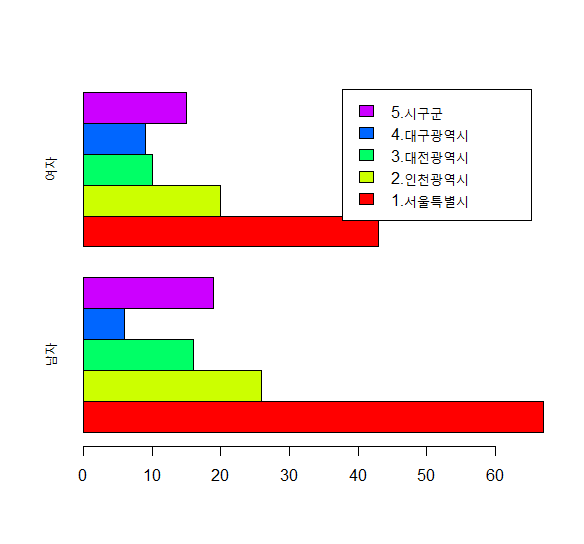
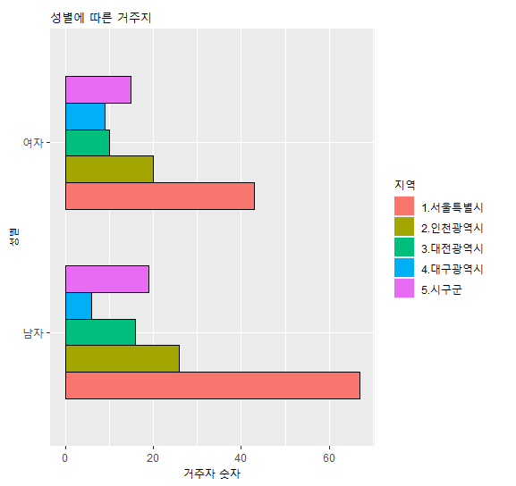
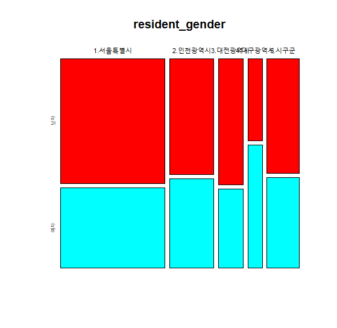
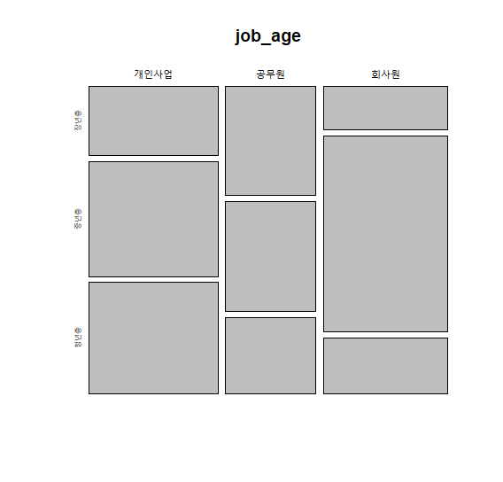
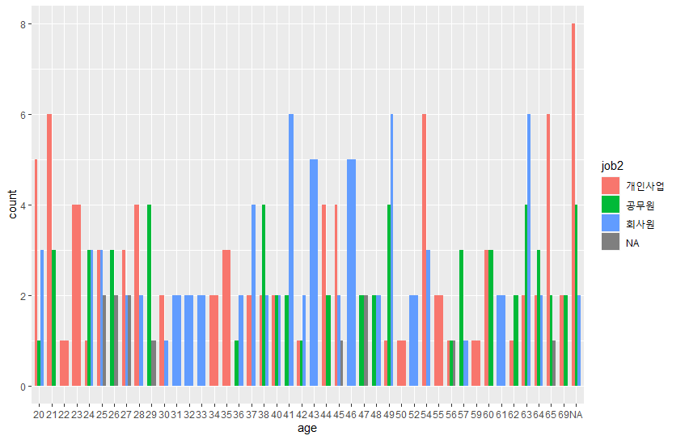
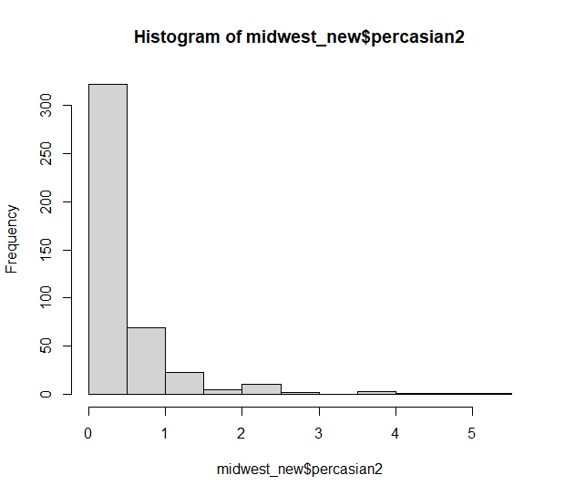
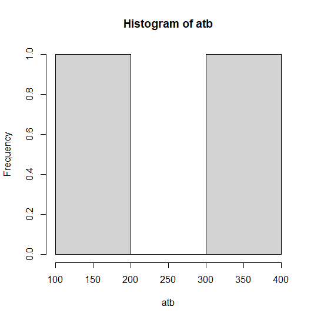
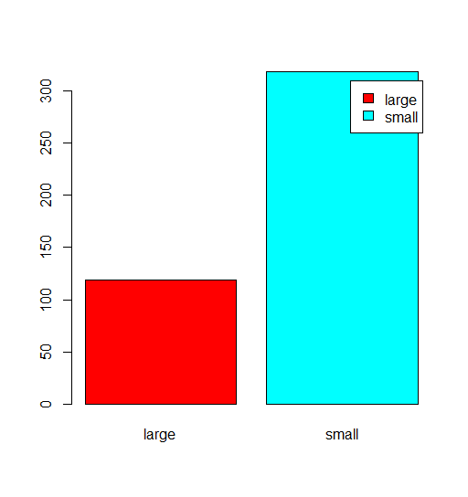
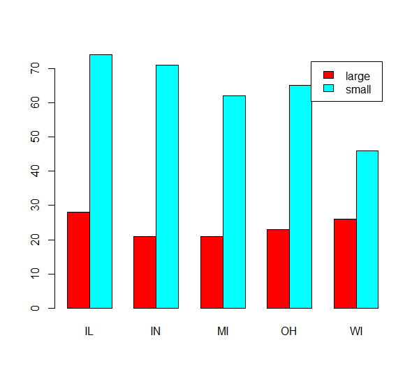

# R_07

### 범주형 vs 범주형을 가지고 데이터의 분포를 확인한다면?

#### 범주형 vs 범주형을 가지고 데이터의 분포를 확인한다면?

##### 1. resident2, age2 를 범주형으로 변환

```r
new_data$resident2 <- as.factor(new_data$resident2)
new_data$age <- as.factor(new_data$age)
levels(new_data$resident2)
levels(new_data$gender2)
>
[1] "1.서울특별시" "2.인천광역시" "3.대전광역시" "4.대구광역시" "5.시구군"
[1] "남자" "여자"
```

#####  2. 두 변수를 table()함수를 이용하여 분포를 확인해보자.

```r
table(new_data$gender2)
>
남자 여자 
 134   97 

table(new_data$resident2)
>
1.서울특별시    2.인천광역시 3.대전광역시      4.대구광역시     5.시구군 
         110           46           26           15           34 

table(new_data$age2)
>
장년층 	중년층 청년층 
    51    102     64 
```

```r
resident_gender <- table(new_data$resident2,new_data$gender2)
barplot(resident_gender,
        horiz = T,
        beside = T,
        legend = row.names(resident_gender),
        col = rainbow(5))
```

- beside = T 누적을 멀티바 형식으로 바꾸어준다.
- row.names(resident_gender) : 범례를 거주지역으로 지정한다.



```r
resident_gender_df <- as.data.frame(resident_gender)
names(resident_gender_df) <- c('resdent2','gender2','Freq')
gg <- ggplot(resident_gender_df,
       aes(x = gender2,
          y = Freq))+
  geom_bar(stat = 'identity', aes(fill = resdent2),
           width = .7,
           position = position_dodge(width = .7),
           col = c('black','black','black','black','black')[resident_gender_df$resdent2])+
  coord_flip()
gg + labs(x = '성별',
          y = '거주자 숫자',
          fill = '지역',
          title = '성별에 따른 거주지')
```



- position='dodge'로 멀티바 만들어도 된다. 
-  group을 줘서 그룹에 해당하는 boxplot가 생성된다. 

```r
mosaicplot(resident_gender, col = rainbow(2))
```



##### 직업의 유형(job2) vs 나이(age2)

```r
new_data$job2 <- as.factor(new_data$job2)
new_data$age2 <- as.factor(new_data$age2)
table(new_data$job2, new_data$age2)
>
 			장년층 중년층 청년층
  개인사업     18     30     29
  공무원       20     20     14
  회사원       11     49     14
```

```r
job_age <-table(new_data$job2, new_data$age2)
str(job_age)
>
'table' int [1:3, 1:3] 18 20 11 30 20 49 29 14 14
 - attr(*, "dimnames")=List of 2
  ..$ : chr [1:3] "개인사업" "공무원" "회사원"
  ..$ : chr [1:3] "장년층" "중년층" "청년층"
```

```r
barplot(job_age,
        horiz = F,
        beside = T,
        legend = row.names(job_age),
        col = rainbow(3))
```


```r
job_age_df <- as.data.frame(job_age)
names(job_age_df) <- c('job2','age2','Freq')

job_age_bar <-ggplot(job_age_df,
       aes(x = age2,
           y = Freq, fill = job2))+
  geom_bar(stat = 'identity', position = 'dodge',
           col = c('black','black','black','black','black')[job_age_df$job2])+
  coord_flip()
job_age_bar + labs(title = '직업의 유형(job2) vs 나이(age2)',
                   x = '나이',
                   y = '수',
                   fill = '직업')  
```


```r
mosaicplot(job_age) 
```



### 숫자형 vs 범주형 

#### mosaicplot,densityplot

#### 직업 유형에 따른 나이 비율?

---

##### 카테고리 유형별 시각화

```R
densityplot(new_data$age,new_data,group = new_data$job2,auto.key = T)
```

-  group = new_data$job2 그룹으로 밀도를 확인하겠다. 
- auto.key = T 범례를 주겠다. 

```r
ggplot(new_data,
       aes(x = age,
            fill = job2)) +
  geom_bar(width = .7,position = position_dodge(width = .7)
           ) 
```



####  데이터 프레임의 복사본 생성하기

```r
midwest_raw <- as.data.frame(midwest)
midwest_new<-midwest_raw
```

### [문제]

#### poptotal(전체인구) 변수를 total로, popasian(아시안 인구) 변수를 asian으로 수정하기

```r
midwest_new <- rename(midwest_new, 'total' = 'poptotal','asian' = 'popasian')
```

#### total, asian 변수를 이용해 '전체 인구 대비 아시아 인구 백분율' percasian 파생변수를 만들고, 히스토그램을 만들어 도시들이 어떻게 분포하는지 살펴보기

```r
midwest_new$percasian2 <- midwest_new$asian / midwest_new$total * 100
hist(midwest_new$percasian2)
```



#### 아시아 인구 백분율 전체 평균을 구하고, 평균을 초과하면 "large",  그 외에는 "small"을 부여하는 mean 파생변수를 만들어  보기

```r
mean <- mean(midwest_new$percasian2,na.rm = T)
midwest_new$mean <- ''
midwest_new$mean <- ifelse(midwest_new$percasian2 > mean, midwest_new$mean <- 'large','small')
```

#### "large"와 "small"에 해당하는 지역이 얼마나 되는지 빈도표와 빈도 막대 그래프를 만들어 확인해 보기

```r
atb <- table(midwest_new$mean)
hist(atb)
```



```r
barplot(atb,
        col = rainbow(2),
        legend = row.names(atb))
```



```r
table(midwest_new$state)
>
IL  IN  MI  OH  WI 
102  92  83  88  72
```

```r
midwest_new_tb <- table(midwest_new$mean,midwest_new$state)
barplot(midwest_new_tb,
        beside = T,
        legend = row.names(midwest_new_tb),
        col = rainbow(2))
```

