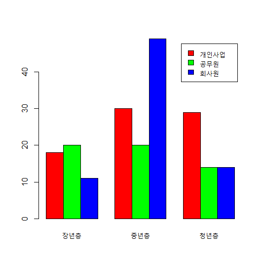
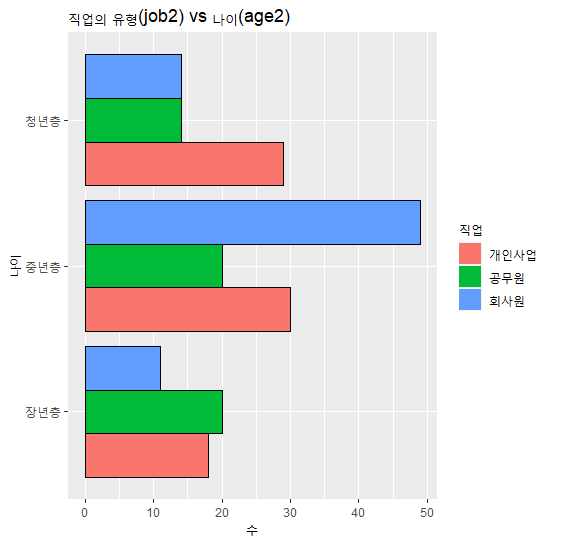
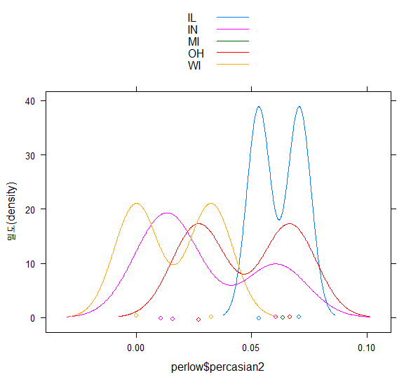
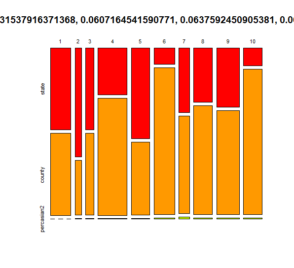

# R_07

### 범주형 vs 범주형을 가지고 데이터의 분포를 확인한다면?

#### 범주형 vs 범주형을 가지고 데이터의 분포를 확인한다면?

##### 1. resident2, age2 를 범주형으로 변환

```r
new_data$resident2 <- as.factor(new_data$resident2)
new_data$age <- as.factor(new_data$age)
levels(new_data$resident2)
levels(new_data$gender2)
>
[1] "1.서울특별시" "2.인천광역시" "3.대전광역시" "4.대구광역시" "5.시구군"
[1] "남자" "여자"
```

#####  2. 두 변수를 table()함수를 이용하여 분포를 확인해보자.

```r
table(new_data$gender2)
>
남자 여자 
 134   97 

table(new_data$resident2)
>
1.서울특별시    2.인천광역시 3.대전광역시      4.대구광역시     5.시구군 
         110           46           26           15           34 

table(new_data$age2)
>
장년층 	중년층 청년층 
    51    102     64 
```

```r
resident_gender <- table(new_data$resident2,new_data$gender2)
barplot(resident_gender,
        horiz = T,
        beside = T,
        legend = row.names(resident_gender),
        col = rainbow(5))
```

- beside = T 누적을 멀티바 형식으로 바꾸어준다.
- row.names(resident_gender) : 범례를 거주지역으로 지정한다.


```r
resident_gender_df <- as.data.frame(resident_gender)
names(resident_gender_df) <- c('resdent2','gender2','Freq')
gg <- ggplot(resident_gender_df,
       aes(x = gender2,
          y = Freq))+
  geom_bar(stat = 'identity', aes(fill = resdent2),
           width = .7,
           position = position_dodge(width = .7),
           col = c('black','black','black','black','black')[resident_gender_df$resdent2])+
  coord_flip()
gg + labs(x = '성별',
          y = '거주자 숫자',
          fill = '지역',
          title = '성별에 따른 거주지')
```


- position='dodge'로 멀티바 만들어도 된다. 
-  group을 줘서 그룹에 해당하는 boxplot가 생성된다. 

```r
mosaicplot(resident_gender, col = rainbow(2))
```


##### 직업의 유형(job2) vs 나이(age2)

```r
new_data$job2 <- as.factor(new_data$job2)
new_data$age2 <- as.factor(new_data$age2)
table(new_data$job2, new_data$age2)
>
 			장년층 중년층 청년층
  개인사업     18     30     29
  공무원       20     20     14
  회사원       11     49     14
```

```r
job_age <-table(new_data$job2, new_data$age2)
str(job_age)
>
'table' int [1:3, 1:3] 18 20 11 30 20 49 29 14 14
 - attr(*, "dimnames")=List of 2
  ..$ : chr [1:3] "개인사업" "공무원" "회사원"
  ..$ : chr [1:3] "장년층" "중년층" "청년층"
```

```r
barplot(job_age,
        horiz = F,
        beside = T,
        legend = row.names(job_age),
        col = rainbow(3))
```



```r
job_age_df <- as.data.frame(job_age)
names(job_age_df) <- c('job2','age2','Freq')

job_age_bar <-ggplot(job_age_df,
       aes(x = age2,
           y = Freq, fill = job2))+
  geom_bar(stat = 'identity', position = 'dodge',
           col = c('black','black','black','black','black')[job_age_df$job2])+
  coord_flip()
job_age_bar + labs(title = '직업의 유형(job2) vs 나이(age2)',
                   x = '나이',
                   y = '수',
                   fill = '직업')  
```



```r
mosaicplot(job_age) 
```


### 숫자형 vs 범주형 

#### mosaicplot,densityplot

#### 직업 유형에 따른 나이 비율?

---

##### 카테고리 유형별 시각화

```R
densityplot(new_data$age,new_data,group = new_data$job2,auto.key = T)
```

-  group = new_data$job2 그룹으로 밀도를 확인하겠다. 
- auto.key = T 범례를 주겠다. 

```r
ggplot(new_data,
       aes(x = age,
            fill = job2)) +
  geom_bar(width = .7,position = position_dodge(width = .7)
           ) 
```


####  데이터 프레임의 복사본 생성하기

```r
midwest_raw <- as.data.frame(midwest)
midwest_new<-midwest_raw
```

### [문제]

#### poptotal(전체인구) 변수를 total로, popasian(아시안 인구) 변수를 asian으로 수정하기

```r
midwest_new <- rename(midwest_new, 'total' = 'poptotal','asian' = 'popasian')
```

#### total, asian 변수를 이용해 '전체 인구 대비 아시아 인구 백분율' percasian 파생변수를 만들고, 히스토그램을 만들어 도시들이 어떻게 분포하는지 살펴보기

```r
midwest_new$percasian2 <- midwest_new$asian / midwest_new$total * 100
hist(midwest_new$percasian2)
```


#### 아시아 인구 백분율 전체 평균을 구하고, 평균을 초과하면 "large",  그 외에는 "small"을 부여하는 mean 파생변수를 만들어  보기

```r
mean <- mean(midwest_new$percasian2,na.rm = T)
midwest_new$mean <- ''
midwest_new$mean <- ifelse(midwest_new$percasian2 > mean, midwest_new$mean <- 'large','small')
```

#### "large"와 "small"에 해당하는 지역이 얼마나 되는지 빈도표와 빈도 막대 그래프를 만들어 확인해 보기

```r
atb <- table(midwest_new$mean)
hist(atb)
```


```r
barplot(atb,
        col = rainbow(2),
        legend = row.names(atb))
```


```r
table(midwest_new$state)
>
IL  IN  MI  OH  WI 
102  92  83  88  72
```

```r
midwest_new_tb <- table(midwest_new$mean,midwest_new$state)
barplot(midwest_new_tb,
        beside = T,
        legend = row.names(midwest_new_tb),
        col = rainbow(2))
```


### ggplot2의 midwest 데이터를 사용하여 데이터 분석을 실습

- popadults는 해당 지역의 성인 인구, poptotal은 전체 인구를 나타낸다.

##### 1번 문제

- midwest 데이터에 '전체 인구 대비 미성년 인구 백분율' 변수를 추가하라.

```r
midwest_new$underper <- (midwest_new$total - midwest_new$popadults) / midwest_new$total * 100
midwest_new$underper
>
[1] 34.48631 36.72125 35.50130 37.44076 31.81974 34.30845 32.67569 32.62124
```

##### 2번 문제

- 미성년 인구 백분율이 가장 높은 상위 5개 county(지역)의 미성년 인구 백분율을 출력하라.

```R
library(doBy)
midar <- arrange(midwest_new,desc(underper))
a <- head(midar,5)
underfive<- select(a,county,underper)
barplot(underfive$underper)
ggplot(underfive,
       aes(x= county,
           y = underper, fill = county))+
  geom_bar(stat = 'identity')
```

- arrange로 순서대로 정렬하고 head로 상위 5개를 뽑고 a에서 원하는 컬럼만 뽑아서 시각화하였다.


##### 3번 문제

- 다음과 같은 분류표의 기준에 따라 미성년 비율 등급 변수를 추가하고, 각 등급에 몇 개의 지역이 있는지 알아보라.

|  분류  |    기준     |
| :----: | :---------: |
| large  |   40%이상   |
| middle | 30 ~ 40미만 |
| small  |   30미만    |

```r
midwest_new$upGrade <- ''
midwest_new$upGrade <- ifelse(midwest_new$underper >= 40,midwest_new$upGrade <- 'large',
                              ifelse(midwest_new$underper >= 30,midwest_new$upGrade <- 'middle','small'))   
upTb <- table(midwest_new$upGrade)
upTb
> upTb
 large middle  small 
    32    396      9 

barplot(upTb,
        legend = row.names(upTb),
        col = rainbow(3))
```

- 새로운 컬럼을 만들고 그 컬럼에 ifelse조건절을 추가하여 한 번에 값이 들어가도록 설정한다.
- 그 다음에 table로 값을 한번에 보도록 요약하고 그 결과값을 시각화 하였다.


##### 4번 문제

- popasian은 해당 지역의 아시아인 인구를 나타낸다. '전체 인구 대비 아시아인 인구 백분율' 변수를 추가하고 하위 10개 지역의 state(주), county(지역), 아시아인 인구 백분율을 출력하라.

```r
perarr <- arrange(midwest_new,percasian2)
perlow <- head(perarr,10)
perlow <- select(perlow,state,county,percasian2)
barplot(perlow$percasian2,
        legend = row.names(perlow),
        col = rainbow(10))
popasian_low_bar <- ggplot(perlow,
       aes(x = county,
           y = percasian2, fill = state)) +
  geom_bar(stat = 'identity')+
  geom_point(color = 'black',
             pch   = '★',
             size  = 2)+
  coord_flip()
popasian_low_bar + labs(fill = '주',
                        title = '하위 10개',
                        x = '지역',
                        y = '아시아인 인구 백분율')
```

- 오름차순으로 정렬해서 10개만 가져온다. 그런후 원하는 컬럼만 다시 선택하여 시각화 하였다.


```R
densityplot(perlow$percasian2,perlow,group = perlow$state,auto.key = T)
```



- 다양한 시각화를 진행해 보았다.

```r
mosaicplot(perlow,col = rainbow(10))
```



### 시계열(time series) - 변수간의 상관성 

#### iris 시계열 데이터 만들기 

```R
data(iris)
seq = as.integer(rownames(iris))
irisDF <- cbind(seq,iris)
str(irisDF)
head(irisDF)
>
 seq Sepal.Length Sepal.Width Petal.Length Petal.Width Species
1   1          5.1         3.5          1.4         0.2  setosa
```

- 우선  iris데이터를 불러와서 iris의 데이터의 행번호를 따로 저장하여 iris와 열끼리 결합하여 새로운 컬럼으로 추가한다.

##### x축은 seq,  y축은 -Species, topo.colors(색 개수,alpha(투명도) = .4)

```r
colsColor <- topo.colors(4,alpha = .4)
names(colsColor) <- names(irisDF)[2:5]
names(colsColor)
>
[1] "Sepal.Length" "Sepal.Width"  "Petal.Length" "Petal.Width" 
```

- 색상을 나타내기 위해 미리 컬럼의 이름을 지정한다.

##### melt함수를 이용해서 기준 seq,Species, 나머지 컬럼을 variabel해서 wide -> long 형식으로 만든다.

```r
iris_melt <- melt(irisDF,id=c('seq','Species'))
>
	seq    Species     variable value
1     1     setosa  Sepal.Length   5.1
```

- 다음과 같이 seq,Species을 기준으로 데이터가 아래로 정렬되었다.

```R
g <- ggplot(iris_melt,
       aes(x=seq,
           y=value, col = variable))+
  geom_line(cex = 0.8,
            show.legend = T)
# 추가적으로 선의 색상과 범례 라벨링
g <- g + scale_color_manual(
  name = 'iris',
  values =colsColor[iris_melt$variable],
  labels = c("꽃받침 길이","꽃받침 너비","꽃잎 길이","꽃잎 너비")
)
g
```

- 색상은 아까 위에서 지정해주었던 것을 기준으로 부여되고 데이터는 위에어 만든 melt 데이터로 아리리스의 시계열을 시각화 하였다.


### 날짜

### R의 날짜 데이터 타입 'POSIXct'

### as.POSIXct()

- 문자변수를 날짜변수 변환 

- y는 연도 2자리, Y 연도4자리

```r
str_date <- '200730 13:40'
as.POSIXct(str_date, format = '%y%m%d %H:%M')
>
[1] "2020-07-30 13:40:00 KST"
```

```r
str_date <- '2020-07-30 13:40:01 PM'
as.POSIXct(str_date, format = '%Y-%m-%d %H:%M:%S')
>
[1] "2020-07-30 13:40:01 KST"
```

```R
str_date <- '07/30/20 13:40:01'
as.POSIXct(str_date, format = '%m/%d/%y %H:%M:%S')
>
[1] "2020-07-30 13:40:01 KST"
```

#### 코스피 데이터 시계열

```r
head(cospi)
str(cospi)
>
 		Date    Open    High     Low   Close Volume
1 2016-02-26 1180000 1187000 1172000 1172000 176906
>
'data.frame':	247 obs. of  6 variables:
 $ Date  : chr  "2016-02-26" "2016-02-25" "2016-02-24" "2016-02-23" ...
 $ Open  : int  1180000 1172000 1178000 1179000 1190000 1187000 1203000 1179000 1158
```

```R
color <- topo.colors(4,alpha = .4)
names(color) <- names(cospi)[2:5] 
```

- 위에서 진행한 것과 같이 색상을 주기 위해 미리 컬럼을 지정한다.

```R
cospi_melt <- melt(cospi,id=c('Date','Volume'))
cospi_melt
>
 		Date 	Volume variable   value
1   2016-02-26 176906     Open 1180000
2   2016-02-25 128321     Open 1172000
```

- 또한 데이터를 아래로 나열한다.

```R
cospi$Date <- as.POSIXct(cospi$Date, format = '%Y-%m-%d')
```

- 날짜 데이터가 4자리 연도여서 Y를 쓰고 형식에 맞춰서 날짜로 바꿔준다.

```r
cospi_ggplot <- ggplot(cospi_melt,
       aes(x=Date,
           y=value, col=variable,group = variable))+
  geom_line(cex = 0.8,
            show.legend = T)
cospi_ggplot + scale_color_manual(
  name = 'cospi',
  values =color[cospi_melt$variable],
  labels = c("Open","High","Low","Close"))
```

- 위에서 만든 데이터를 가지고 시각화를 진행하였다.

