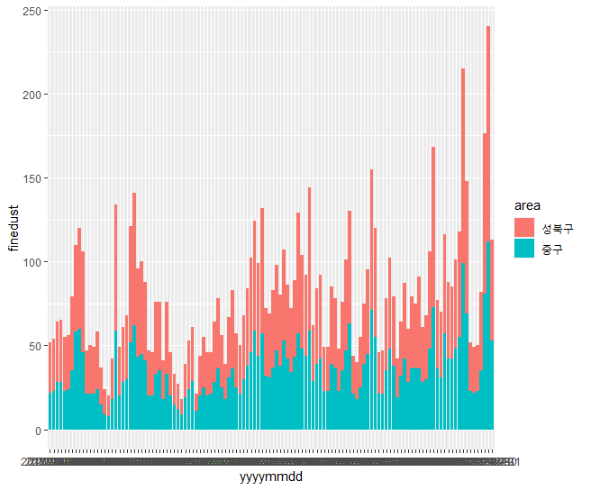
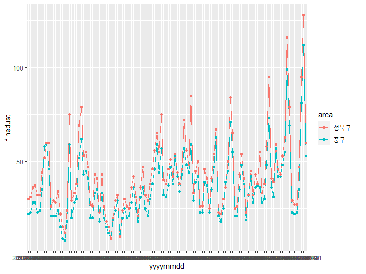
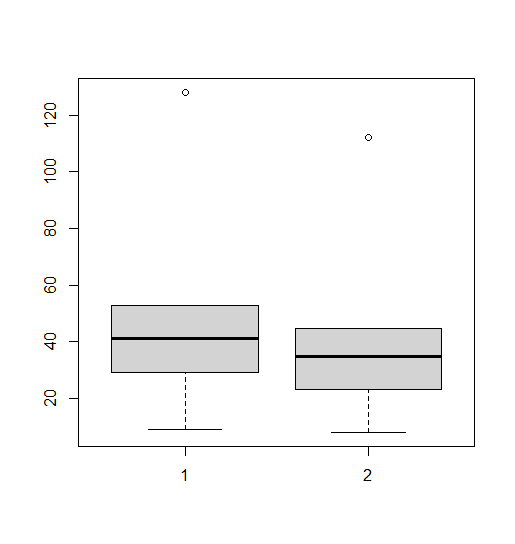
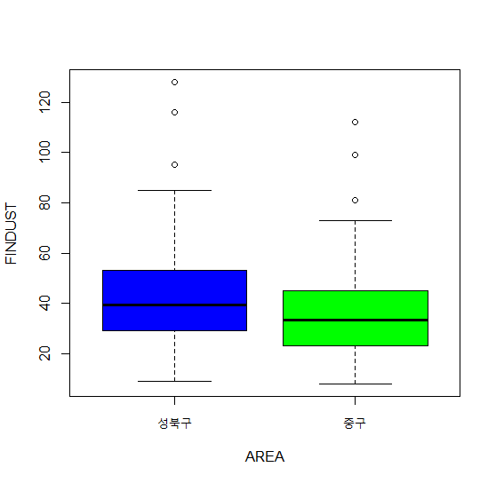

# R_08

### 데이터 전처리 및 탐색적 분석

#### 1. 데이터 로드 및 라이브러리 로드

```R
row_data <- read_excel(file.choose())
str(row_data)
>
tibble [3,173 x 3] (S3: tbl_df/tbl/data.frame)
 $ yyyymmdd: chr [1:3173] "전체" "2017-12-31" "2017-12-31" "2017-12-31" ...
 $ area    : chr [1:3173] "평균" "평균" "종로구" "중구" ...
 $ finedust: num [1:3173] 38 63 54 53 60 62 63 69 67 60 ...

head(row_data)
>
# A tibble: 6 x 3
  yyyymmdd   area   finedust
  <chr>      <chr>     <dbl>
1 전체       평균         38
2 2017-12-31 평균         63
3 2017-12-31 종로구       54
4 2017-12-31 중구         53
5 2017-12-31 용산구       60
6 2017-12-31 성동구       62

dim(row_data)
>
[1] 3173    3
```

- 데이터를 불러와서 기본적인 정보들을 확인하였다.

#### 로드한 데이터로부터 성북구와 중구의 미세먼지를 비교하고 시각화 해보자.

#### 2. 비교할 지역 데이터만 추출하여 미세먼지 농도차이가 있는지 확인해보자.

```R
row_data2 <- row_data %>%
  filter(area =='성북구' |  area =='중구')

str(row_data2)
>
tibble [244 x 3] (S3: tbl_df/tbl/data.frame)
 $ yyyymmdd: chr [1:244] "2017-12-31" "2017-12-31" "2017-12-30" "2017-12-30" ...
 $ area    : chr [1:244] "중구" "성북구" "중구" "성북구" ...
 $ finedust: num [1:244] 53 60 112 128 81 95 35 47 23 27 ...

head(row_data2)
>
# A tibble: 6 x 3
  yyyymmdd   area   finedust
  <chr>      <chr>     <dbl>
1 2017-12-31 중구         53
2 2017-12-31 성북구       60
3 2017-12-30 중구        112
4 2017-12-30 성북구      128
5 2017-12-29 중구         81
6 2017-12-29 성북구       95
```

- 체인함수로 데이터를 선택하고 filter 행에 조건을 줘서 데이터를 저장하였다.

```R
row_data2$yyyymmdd <- ymd(row_data2$yyyymmdd)
ggplot(row_data2,
       aes(x=yyyymmdd,
           y=finedust, fill=area ))+
  geom_bar(stat='identity')

ggplot(row_data2,
       aes(x=yyyymmdd,
           y=finedust,group=area,col=area))+
  geom_line()+
  geom_point()
```

- ymd로 날짜를 다시 바꿔주었다. 그 다음에 ggplot으로 그래프를 그려서 파악하였다.



!

#### 3. 현황 파악하기

- yyyymmdd에 따른 데이터 수 파악하기 (내림차순 정렬)
- count(data, 컬럼이름) 함수 이용

```r
count(row_data2,yyyymmdd) 
>
# A tibble: 122 x 2
   yyyymmdd       n
   <chr>      <int>
 1 2017-09-01     2
 2 2017-09-02     2
 3 2017-09-03     2
 4 2017-09-04     2
 5 2017-09-05     2
 6 2017-09-06     2
 7 2017-09-07     2
 8 2017-09-08     2
 9 2017-09-09     2
10 2017-09-10     2
# ... with 112 more rows
```

- 날짜마다 데이터가  몇 개 있는지 보았다.

```r
row_data2 %>%
  group_by(yyyymmdd)%>%
  summarise(n=n())
>
`summarise()` ungrouping output (override with `.groups` argument)
# A tibble: 122 x 2
   yyyymmdd       n
   <chr>      <int>
 1 2017-09-01     2
 2 2017-09-02     2
 3 2017-09-03     2
 4 2017-09-04     2
 5 2017-09-05     2
 6 2017-09-06     2
 7 2017-09-07     2
 8 2017-09-08     2
 9 2017-09-09     2
10 2017-09-10     2
# ... with 112 more rows
```

- 이렇게 해서 볼 수 도 있다.
- area에 따른 데이터수 파익 (내림차순 정렬)

```r
count(row_data2,area) 
>
# A tibble: 2 x 2
  area       n
  <chr>  <int>
1 성북구   122
2 중구     122
```

- 구역별로 데이터 수를 보았다.

#### 4. 지역(성북구, 중구)에 따른 데이터를 변수에 각각 할당해보자.

```R
dust_s <- row_data2 %>%
  filter(area=='성북구')

str(dust_s)
>
tibble [122 x 3] (S3: tbl_df/tbl/data.frame)
 $ yyyymmdd: chr [1:122] "2017-12-31" "2017-12-30" "2017-12-29" "2017-12-28" ...
 $ area    : chr [1:122] "성북구" "성북구" "성북구" "성북구" ...
 $ finedust: num [1:122] 60 128 95 47 27 27 29 79 116 63 ...

head(dust_s)
>
# A tibble: 6 x 3
  yyyymmdd   area   finedust
  <chr>      <chr>     <dbl>
1 2017-12-31 성북구       60
2 2017-12-30 성북구      128
3 2017-12-29 성북구       95
4 2017-12-28 성북구       47
5 2017-12-27 성북구       27
6 2017-12-26 성북구       27
```

- 체인함수로 성북구만 뽑아서 저장하였다.

```R
dust_j <- row_data2 %>%
  filter(area=='중구')

str(dust_j)
>
tibble [122 x 3] (S3: tbl_df/tbl/data.frame)
 $ yyyymmdd: chr [1:122] "2017-12-31" "2017-12-30" "2017-12-29" "2017-12-28" ...
 $ area    : chr [1:122] "중구" "중구" "중구" "중구" ...
 $ finedust: num [1:122] 53 112 81 35 23 22 23 69 99 55 ...

head(dust_j)
>
# A tibble: 6 x 3
  yyyymmdd   area  finedust
  <chr>      <chr>    <dbl>
1 2017-12-31 중구        53
2 2017-12-30 중구       112
3 2017-12-29 중구        81
4 2017-12-28 중구        35
5 2017-12-27 중구        23
6 2017-12-26 중구        22
```

- 체인함수로 중구만 뽑아서 저장하였다.

```R
s <- summary(dust_s$finedust)
s
>
   Min. 1st Qu.  Median    Mean 3rd Qu.    Max. 
   9.00   29.00   39.50   42.75   52.75  128.00 
```

- 성북구 미세먼지의 요약정보를 보았다.

```r
j <- summary(dust_j$finedust)
j
>
   Min. 1st Qu.  Median    Mean 3rd Qu.    Max. 
   8.00   23.00   33.50   35.91   44.75  112.00 
```

- 중구의 미세먼지 요약 정보를 보았다.

#### 5. boxplot를 이용하여 시각화 해보자.

- 지역에 따른 미세먼지 농도에 대한 차이가 있는지 확인

```R
boxplot(s,j)
```



- 성북구에 미세먼지가 더 많다.

```R
boxplot(dust_s$finedust,
        dust_j$finedust,
        maim = 'finedust_compare',
        xlab = 'AREA',
        names = c('성북구','중구'),
        ylab = 'FINDUST',
        col = c('blue','green'))
```



- 중간 값들도 들어있다.

### 만약 가설에 대한 검정을 한다면?

```
# t.test(data,
#        검증하고싶은값 ~ 기준,
#        트루)
```

```r
t.test(data=row_data2,
       finedust ~ area,
       var.equal = T)
```

```R
	Two Sample t-test

data:  finedust by area
t = 2.8347, df = 242, p-value = 0.004975
alternative hypothesis: true difference in means is not equal to 0
95 percent confidence interval:
  2.085657 11.586474
sample estimates:
mean in group 성북구   mean in group 중구 
            42.74590             35.90984 
```

- 귀무가설 : 성북구와 중구의 평균은 같다
- 대립가설 : 성북구와 중구의 평균은 다르다.
- p-value값이 0.05이하여서 귀무가설을 기각하고 대립가설을 채택한다.
  - 성북구와 중구의 평균은 다르다.

### R과 DBMS 연동을 통한 정형 데이터 처리방법

- Rtools와 자바가 연결되어있음

#### r과 java연동

```R
install.packages('rJava')
```

#### 인더페이스 역할

```r
install.packages('DBI')
```

#### jdbc 함수 제공

```R
install.packages('RJDBC')
```

#### r과 java를 쓰기위한 기초작업 

```r
Sys.setenv(JAVA_HOME='C:\\Program Files\\Java\\jdk1.8.0_121')
```

- 자바가 깔려있는 폴더에서 jdk를 연결시켜준다.

```r
library(rJava)
library(DBI)
library(RJDBC)
```

- 라이브러리를 올려준다.

#### DB 연동 순서

- Driver loading, Eonnection(hr,hr), Query 수행, 결과 집합 확인하는 과정으로 내가 쓰는 프로그램의 드라이버를 올려야 한다.

#### Driver

```r
driver <- JDBC(driverClass = 'oracle.jdbc.driver.OracleDriver',
               classPath = 'C:\\oraclexe\\app\\oracle\\product\\11.2.0\\server\\jdbc\\lib\\ojdbc6.jar')
```

- 내가 쓰는 드라이버를 올리기
- 폴더 경로 복사 후  '\\'다시 줘야 경로를 인식해준다. 

```r
conn <- dbConnect(driver ,
                  'jdbc:oracle:thin:@localhost:1521:xe',
                  'hr',
                  'hr')
```

- db랑 연결한다.

```r
selectEmpQuery <- 'select * from employee'
```

- employee의 모든 정보를 가져온다.

#### dbGetQuery() : select 

```

```

