# R 정리_02

### 데이터 정제

- 빠진 데이터(결측치), 이상한 데이터(이상치) 제거하기

- 결측치(Missing Value) : 누락된 값, 비어있는 값
  - 함수 적용 불가, 분석 결과 왜곡
    -  제거 후 분석 실시
  - 결측치 표기 - 대문자 **NA**

```R
df <- data.frame(sex = c("M", "F", NA, "M", "F"), score = c(5, 4, 3, 4, NA))
```

#### 결측치 확인하기

```R
is.na(df) # 결측치 확인
table(is.na(df)) # 결측치 빈도 출력
```

```R
# 변수별로 결측치 확인하기
table(is.na(df$sex)) # sex 결측치 빈도 출력
table(is.na(df$score)) # score 결측치 빈도 출력
```

```R
# 결측치 포함된 상태로 분석
mean(df$score) # 평균 산출
sum(df$score) # 합계 산출
```

```R
# 결측치 있는 행 제거하기
library(dplyr) # dplyr 패키지 로드 
df %>% 
	filter(is.na(score)) # score가 NA인 데이터만 출력
df %>% 
	filter(!is.na(score)) # score 결측치 제거
```

```R
# 결측치 제외한 데이터로 분석하기
df_nomiss <- df %>% 
				filter(!is.na(score)) # score 결측치 제거 
mean(df_nomiss$score) # score 평균 산출
sum(df_nomiss$score) # score 합계 산출
```

```R
# 여러 변수 동시에 결측치 없는 데이터 추출하기
# score, sex 결측치 제외 
df_nomiss <- df %>% 
				filter(!is.na(score) & !is.na(sex))
```

```R
# 결측치가 하나라도 있으면 제거하기
df_nomiss2 <- na.omit(df) # 모든 변수에 결측치 없는 데이터 추출
```

#### 분석에 필요한 데이터까지 손실 될 가능성 유의

> ex) 성별-소득 관계 분석하는데 지역 결측치까지 제거

##### 함수의 결측치 제외 기능 이용하기 - na.rm = T

```R
mean(df$score, na.rm = T) # 결측치 제외하고 평균 산출
sum(df$score, na.rm = T) # 결측치 제외하고 합계 산출
summarise()에서 na.rm = T사용하기
```

```R
# 결측치 생성
exam <- read.csv("csv_exam.csv") # 데이터 불러오기 
exam[c(3, 8, 15), "math"] <- NA # 3, 8, 15행의 math에 NA 할당
```

```R
#평균 구하기
exam %>% summarise(mean_math = mean(math)) # 평균 산출
exam %>% summarise(mean_math = mean(math, na.rm = T)) # 결측치 제외하고 평균 산출
```

```R
# 다른 함수들에 적용
exam %>% 
	summarise(mean_math = mean(math, na.rm = T), # 평균 산출 
              sum_math = sum(math, na.rm = T), # 합계 산출 
              median_math = median(math, na.rm = T)) # 중앙값 산출
```

- 결측치 대체하기 : 결측치 많을 경우 모두 제외하면 데이터 손실 큼
- 대안: 다른 값 채워넣기

#### 결측치 대체법(Imputation)

- 대표값(평균, 최빈값 등)으로 일괄 대체

- 통계분석 기법 적용, 예측값 추정해서 대체

- 평균값으로 결측치 대체하기

```R
# 평균 구하기
mean(exam$math, na.rm = T) # 결측치 제외하고 math 평균 산출
```

```R
# 평균으로 대체하기
exam$math <- ifelse(is.na(exam$math), 55, exam$math) # math가 NA면 55로 대체 
table(is.na(exam$math)) # 결측치 빈도표 생성
mean(exam$math) # math 평균 산출
```

#### 문제 해결을 위한 데이터 구성

- mpg 데이터 원본 : 결측치 x
- mpg 데이터를 불러와 몇 개의 값을 결측치로 만든다.

```R
mpg <- as.data.frame(ggplot2::mpg) # mpg 데이터 불러오기 
mpg[c(65, 124, 131, 153, 212), "hwy"] <- NA # NA 할당하기
```

### 이상치(Outlier) - 정상범주에서 크게 벗어난 값

- 이상치 포함시 분석 결과 왜곡

- 결측 처리 후 제외하고 분석

| 이상치 종류       | 예                | 해결 방법                      |
| ----------------- | ----------------- | ------------------------------ |
| 존재할 수 없는 값 | 성별 변수에 3     | 결측 처리                      |
| 극단적인 값       | 몸무게 변수에 200 | 정상범위 기준 정해서 결측 처리 |

#### 이상치 제거하기 - 1. 존재할 수 없는 값

- 논리적으로 존재할 수 없으므로 바로 결측 처리 후 분석시 제외

```R
# 이상치 포함된 데이터 생성 - sex 3, score 6
outlier <- data.frame(sex = c(1, 2, 1, 3, 2, 1), score = c(5, 4, 3, 4, 2, 6))
```

```R
# 이상치 확인하기
table(outlier$sex)
>
## 1 2 3
## 3 2 1
```

```R
table(outlier$score)
>
## 2 3 4 5 6 
## 1 1 2 1 1
```

```R
# 결측 처리하기 - sex
# sex가 3이면 NA 할당 
outlier$sex <- ifelse(outlier$sex == 3, NA, outlier$sex)
```

```R
#결측 처리하기 - score
# sex가 1~5 아니면 NA 할당 
outlier$score <- ifelse(outlier$score > 5, NA, outlier$score)
```

```R
# 결측치 제외하고 분석
outlier %>% 
	filter(!is.na(sex) & !is.na(score)) %>% 
		group_by(sex) %>% 
			summarise(mean_score = mean(score))
```

#### 이상치 제거하기 - 2. 극단적인 값

- 정상범위 기준 정해서 벗어나면 결측 처리

| 판단 기준   | 예                                                       |
| ----------- | -------------------------------------------------------- |
| 논리적 판단 | 성인 몸무게 40kg~150kg 벗어나면 극단치                   |
| 통계적 판단 | 상하위 0.3% 극단치 또는 상자그림 1.5 IQR 벗어나면 극단치 |

##### 상자그림으로 극단치 기준 정해서 제거하기

```R
mpg <- as.data.frame(ggplot2::mpg)
```

```R
boxplot(mpg$hwy)
```

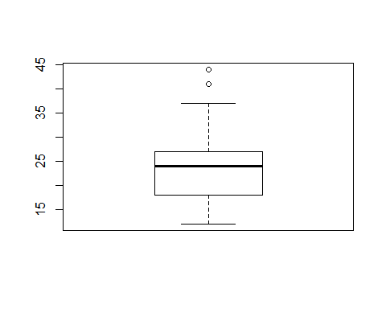

| 상자그림            | 값            | 설명                          |
| ------------------- | ------------- | ----------------------------- |
| 상자 아래 세로 점선 | 아래수염      | 하위 0~25% 내에 해당하는 값   |
| 상자 밑면           | 1사분위수(Q1) | 하위 25% 위치 값              |
| 상자 내 굵은 선     | 2사분위수(Q2) | 하위 50% 위치 값(중앙값)      |
| 상자 윗면           | 3사분위수(Q3) | 하위 75% 위치 값              |
| 상자 위 세로 점선   | 윗수염        | 하위 75~100% 내에 해당하는 값 |
| 상자 밖 가로선      | 극단치 경계   | Q1, Q3 밖 1.5 IQR 내 최대값   |
| 상자 밖 점 표식     | 극단치        | Q1, Q3 밖 1.5 IQR을 벗어난 값 |

##### 상자그림 통계치 출력

```R
boxplot(mpg$hwy)$stats # 상자그림 통계치 출력
```

```R
# 결측 처리하기
# 12~37 벗어나면 NA 할당 
mpg$hwy <- ifelse(mpg$hwy < 12 | mpg$hwy > 37, NA, mpg$hwy) 
table(is.na(mpg$hwy))
```

```R
# 결측치 제외하고 분석하기
mpg %>% 
	group_by(drv) %>% 
		summarise(mean_hwy = mean(hwy, na.rm = T))
```

### R 시각화 : 기본 패키지(graphics)

- plot(), boxplot(), hist(), pie(), barplot()
- title(), lines(), axis(), legend()

#### graphics 패키지에서 제공되는 R의 차트 API 들

##### 그래픽 API 

- 산포도(x-y 플로팅) 그리기

```R
국어<- c(4,7,6,8,5,5,9,10,4,10)
```

- 기본으로 제공되는 plot() 함수를 이용해서 그래프 그리기

```R
plot(국어)
```

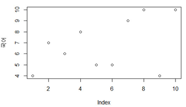

- 타이틀과 라인, 색상을 추가해서 그리기

```R
plot(국어, type="o", col="blue")
title(main="성적그래프", col.main="red", font.main=4) # 제목을 설정하고, 제목의 색상, 폰트크기 설정
```

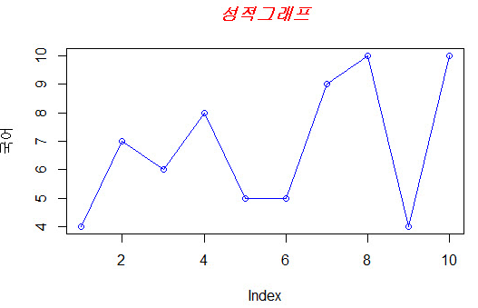

- 두 개의 벡터로 하나의 그래프에 나타내기

```R
국어 <- c(4,7,6,8,5,5,9,10,4,10)
수학 <- c(7,4,7,3,8,10,4,10,5,7)
```

```R
plot(국어, type="o", col="blue")
lines(수학, type="o", pch=16, lty=2, col="red")
title(main="성적그래프", col.main="red", font.main=4)
```

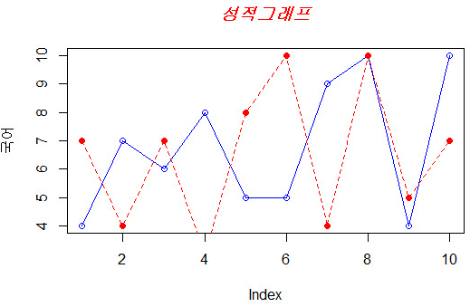

#### Type

| 기호 | 설명                                              |
| ---- | ------------------------------------------------- |
| p    | 점으로된 포인트, 기본값                           |
| l    | 선그래프                                          |
| b    | 선으로 연결된 포인트 (p + l)                      |
| c    | 점이 나타나는 부분이 삭제된 선 그래프             |
| o    | 선과 점을 함께 표시(선을 그리고 그위에 점을 그림) |
| h    | 히스토그램모양의 선그래프                         |
| s    | 계단형식의 그래프                                 |
| S    | 계단형식의 다른 모양 그래프                       |
| n    | 그래프를 그리지 않음                              |

```R
국어 <- c(4,7,6,8,5,5,9,10,4,10)
par(mar=c(1,1,1,1), mfrow=c(4,2))
plot(국어, type="p", col="blue", main="type = p", xaxt="n", yaxt="n")
plot(국어, type="l", col="blue", main="type = l", xaxt="n", yaxt="n")
plot(국어, type="b", col="blue", main="type = b", xaxt="n", yaxt="n")
plot(국어, type="c", col="blue", main="type = c", xaxt="n", yaxt="n")
plot(국어, type="o", col="blue", main="type = o", xaxt="n", yaxt="n")
plot(국어, type="h", col="blue", main="type = h", xaxt="n", yaxt="n")
plot(국어, type="s", col="blue", main="type = s", xaxt="n", yaxt="n")
plot(국어, type="S", col="blue", main="type = S", xaxt="n", yaxt="n")
```

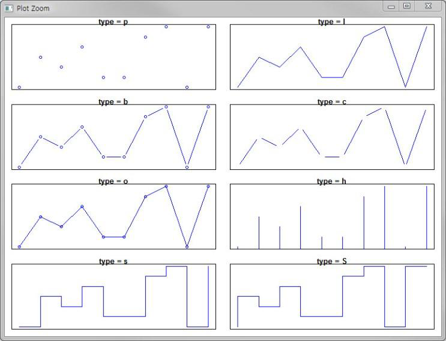

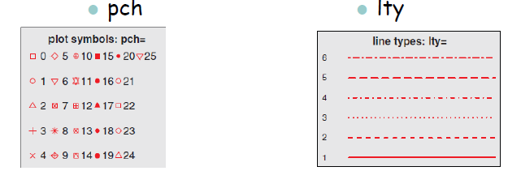

- 축과 레이블이 없이 그래프 그리기

```R
국어 <- c(4,7,6,8,5,5,9,10,4,10); 수학 <- c(7,4,7,3,8,10,4,10,5,7)
```

```R
plot(국어, type="o", col="blue", ylim=c(0,10), axes=FALSE, ann=FALSE) #축과 제목이 없이 그래프 생성
```

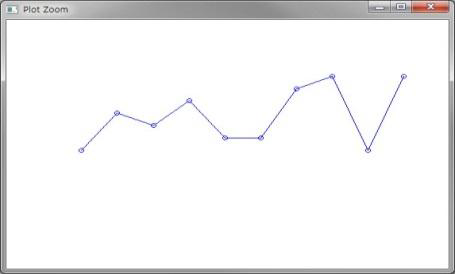

- x, y 축 추가하기

```R
axis(1, at=1:10, lab=c("01","02","03","04","05","06","07","08","09","10")) # x축 추가
axis(2, at=c(0,2,4,6,8,10)) # y축 추가
```

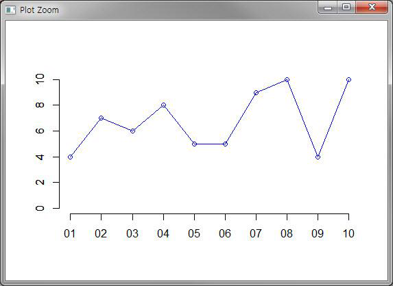

- 그래프 추가하고, 그래프에 박스 그리기

```R
lines(수학, type="o", pch=16, lty=2, col="red")
box() # 박스 그리기
```

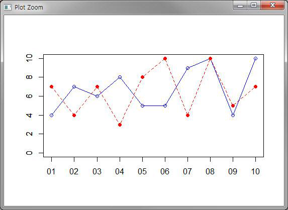

- 그래프 제목, 축의 제목, 범례 나타내기

```R
title(main="성적그래프", col.main="red", font.main=4)
title(xlab="학번", col.lab=rgb(0,1,0)) 
title(ylab="점수", col.lab=rgb(1,0,0))
legend(1, 10, c("국어","수학"), cex=0.8, col=c("blue","red"), pch=c(16,21), lty=c(1,2))
```

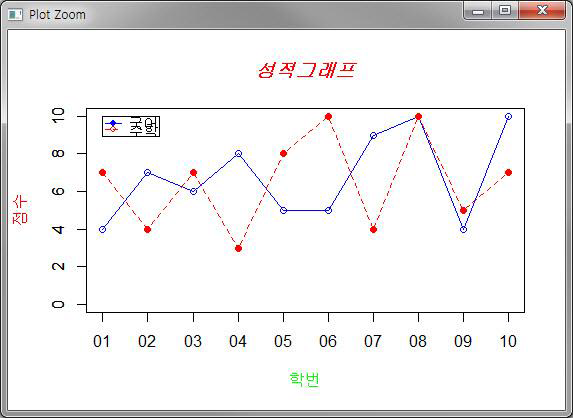

#### 막대그래프 그리기

```R
barplot(국어)
```

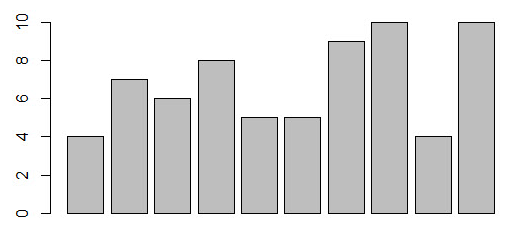

```R
coldens <- seq(from=10, to=100, by=10) # 막대그래프의 색밀도 설정을 위한 벡터
xname <- 성적$학번 # X 축 값 설정위한 벡터
barplot(성적$국어, main="성적그래프", xlab="학번", ylab="점수", border="red", col="green", density=coldens, names.arg=xname)
```


