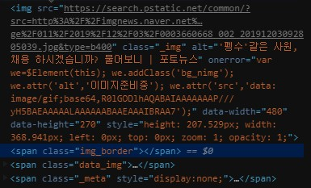
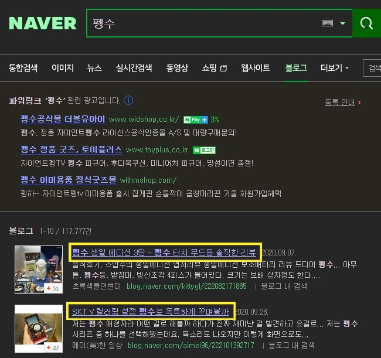
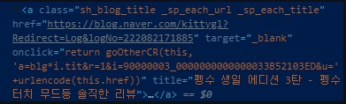
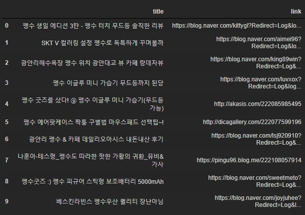

# 왜 크롤링이 필요한지, 크롤링 준비 & 이미지 스크래핑 & 자연어처리

### 사진을 크롤링해서 가져오자

```python
from urllib.request import urlopen
from bs4 import BeautifulSoup
from urllib.request import urlopen
from urllib.error   import HTTPError
from urllib.error   import URLError
```

```python
base_url='https://search.naver.com/search.naver?where=image&sm=tab_jum&query='
keyword = input('검색어 입력 : ')
imgCnt  = int(input('스크랩 할 이미지 개수 : '))

try:
    url = base_url + quote_plus(keyword)
    html = urlopen(url)
except HTTPError as he:
    print('http error')
except URLError as ue:
    print('url error')
else:
    soup = BeautifulSoup(html.read(), 'html.parser', from_encoding='utf-8')
```

- 검색어를 입력해서 그거에 해당하는 사진을 뽑아오자.
- 그 다음에 사진 개수를 지정하자.

```
https://search.naver.com/search.naver?where=image&sm=tab_jum&query=펭수
```

- 펭수를 검색하면 url이 다음과 같다. 우리가 원하는건 `펭수` 를 다른 검색어로 바꿔도 알아서 주소가 변경되도록 하기 위해서 `keyword` 를 `base_url` 에 더해준다. 
  - 다만 한글을 그대로 입력하면 인식을 하지 못한다. 그래서 `quote_plus` 로 변환해서 인식할 수 있게 한다. 

```
검색어 입력 : 펭수
스크랩 할 이미지 개수 : 50
```

- 다음과 같이 입력해준다. 

#### soup 출력해보자.

```python
soup
```

```
<!DOCTYPE doctype html>
 <html lang="ko"> <head> <meta charset="utf-8"/> <meta content="always" name="referrer"/> <meta content="telephone=no,address=no,email=no" name="format-detection"/> <meta content="width=device-width,initial-scale=1.0,maximum-scale=2.0" name="viewport"/> <meta content="펭수 : 네이버 이미지검색" property="og:title"> ...  nx_usain_beacon.send(); }).attach(window, "load") ; } </script></body> </html>
```



- 이미지의 태크를 살펴보면 `` 를 가져와야  한다. 

#### img 찾기

```python
img = soup.find_all('img','_img')
```

- `` 에 `class="_img"`  가 있어서 이걸로 찾아들어간다. 

```
img
```

```
[,
```

- 여기서 `data-source` 를 가져와야 이미지를 저장 할 수 있다.

#### 이미지 다운로드

```python
cnt = 1
for i in img:
    imgUrl = i['data-source']
    # 바이너리 모드로해야 이미지 다운 가능
    # write 바이너리로 저장
    with urlopen(imgUrl) as file:
        with open('./images/'+str(cnt)+'.jpg','wb') as imgFile:
            img = file.read()
            imgFile.write(img)
    cnt += 1
    if cnt > imgCnt:
        break
print('image download success')
```

- `cnt` 는 이미지 개수를 제한하기 위해 카운트 한다. 

- `i` 는 리스트로 저장되어 있으니 거기서 하나씩 값이 담겨있다. 

- `urlopen` : 데이터를 얻고 싶은 웹 페이지의 주소를 주면 된다. 웹에서 얻은 데이터에 대한 객체를 반환해준다.

- `read()` : 파일 전체의 내용을 하나의 문자열로 읽어온다. 
  - 지금 이미지의 주소가 file로 저장되어 있고 이걸 `images` 의 폴더에 숫자순으로 저장한다. 
- 그 다음에 `cnt` 가 우리가 저장하고자 하는 숫자보다 커지면 빠져나간다. 


- 다음과 같이 이미지가 저장된다. 

### 검색키워드를 이용하여 원하는 제목과 링크만 가져오는 [실습]

### csv 파일로 판다스의 DaraFrame을 활용해서 저장해 보자



- 제목과 링크를 가져올 것이다. 

```python
# base url을 해놓으면 나중에 sub만 바꾸면 편하다.
base_url='https://search.naver.com/search.naver?where=post&sm=tab_jum&query='
keyword = input('검색어 입력 : ')


try:
    url = base_url + quote_plus(keyword)
    html = urlopen(url)
except HTTPError as he:
    print('http error')
except URLError as ue:
    print('url error')
else:
    soup = BeautifulSoup(html.read(), 'html.parser', from_encoding='utf-8')
```

```
검색어 입력 : 펭수
```



- 자세히 살펴보면 `class` 가 있고 이걸로 찾아들어간다. 

```python
titles = soup.find_all('a',"sh_blog_title")
titles
```

```
[<a class="sh_blog_title _sp_each_url _sp_each_title" href="https://blog.naver.com/kittygl?Redirect=Log&amp;logNo=222082171885" onclick="return goOtherCR(this, 'a=blg*i.tit&amp;r=1&amp;i=90000003_0000000000000033B52103ED&amp;u='+urlencode(this.href))" target="_blank" title="펭수 생일 에디션 3탄 - 펭수 터치 무드등 솔직한 리뷰"><strong class="hl">펭수</strong> 생일 에디션 3탄 - <strong class="hl">펭수</strong> 터치 무드등 솔직한 리뷰</a>,... </a>]
```

- 여기서 `href` 와 `title` 을 가져오면 된다. 

#### 제목과 링크를 가져오자

- csv 파일을 만들어 보자(DataFrame)
- csv 파일 읽어보는 것 까지

```python
title_list = []
link_list = []
for i in titles:
    link = i['href']
    tit = i['title']
    link_list.append(link)
    title_list.append(tit)
```

- `i` 에 `<a>` 가 들어있고 거기서 `href` 와 `title` 를 찾아서 리스트에 저장한다. 

```python
import pandas as pd
```

```python
title_df = pd.DataFrame({
    'title' : title_list,
    'link'  : link_list
})
title_df
```

- 리스트를 `df` 로 저장한다. 



- 이렇게 저장된다. 

```python
title_df.to_csv('./data/title_df.csv',mode='w',encoding='utf-8',index=False)
```

- `index=False` 를 해야 앞에 있는 인덱스가 같이 저장이  안 된다. 

```python
title_read_df = pd.read_csv('./data/title_df.csv',encoding='utf-8')
title_read_df
```

