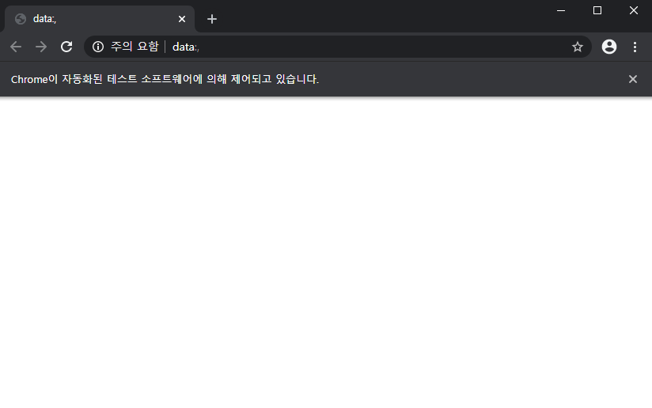
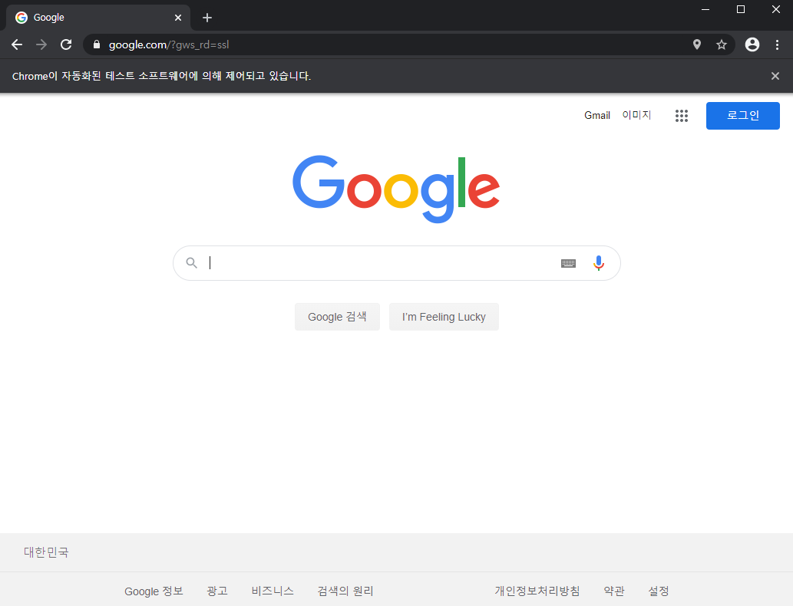

# Selenium 시작하기

> 동적 크롤링을 위한 필수 라이브러리

- 브라우저 동작을 자동화 해주는 프로그램
- 브라우저 동작 시킨다는 의미는 javascript가 동작하면서 비동기적으로 서버로부터 콘텐츠를 가져오는 의미
- 비동기적 : ajax
  - json형식

```python
from selenium import webdriver
```

- `selenium` 을 시작한다. 

```python
path = './driver/chromedriver.exe'
driver = webdriver.Chrome(path)
driver
```

```
<selenium.webdriver.chrome.webdriver.WebDriver(session="d73eb4426d6968f8b998b2cf0ac89daf")>
```

- 미리 크롬의 버전을 확인해서 버전이랑 맞는 드라이버를 다운 받아서 넣어놓자.



- 이렇게 크롬 창이 뜬다. 

```python
driver.get('http://www.google.com')
```



- 이렇게 하면 구글이 들어가진다. 

```
driver.close()
```

- 현재 켜져있는 브라우저가 닫힌다. 

### Json형식의 파일 크롤링

```python
import json, re
from urllib.request import urlopen
from html import unescape
```

- re : 정규표현식

```python
request = urlopen('http://www.hanbit.co.kr/store/books/full_book_list.html')
encoding = request.info().get_content_charset('utf-8')
html = request.read().decode(encoding)
html
```

- `utf-8`  을 줘서 글자가 깨지는 걸 방지한다.
- 디코딩이 없으면 한글이 다 깨진다. 

```
'<!DOCTYPE html>\r\n<html lang="ko">\r\n<head>\r\n<!--[if lte IE 8]>\r\n<script>\r\n  location.replace(\'/support/explorer_upgrade.html\');\r\n</script>\r\n<![endif]-->\r\n<meta charset="utf-8"/>\r\n<title>
```

---

- json.dumps() : 데이터를 json형태로 인고딩(문자열)
- json.dump() : 데이터를 json형태로 인코딩하여 파일에 출력(파일)
- ensure_ascii = False : \xxxxx 형태로 이스케이프 하지 않고 출력
- [{key : value},{key : value}] indent = size 들여쓰기를 몇 칸할 것인지 사이즈를 줄 수 있다.

---

- 정규표현식
- . 모든문자
- \* 0번이상 반복
- ? 있어도 되고 없어도 된다.
- `<a href='(.*?)'>` 모든 문자이거나 반복되거나 링크가 없어도 된다.
- `<td class='left'><a.*?</td>` a태그로 시작해서 모든 문자 반복,없어도되고 td태그로 끝나는 모든것

#### json 파일 생성


