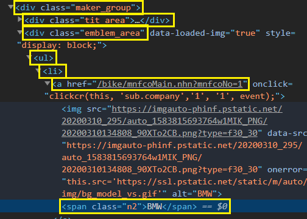

# 바이크 제조사 전체 페이지 클릭 구현 [실습]

- 전체 제조사 엘리먼트를 찾아서 마우스 클릭하고 그 결과물을 반환받는다.
- 바이크 제조사 정보를 크롤링
- 다음 페이지 버튼이 활성화 되어 있으면 클릭하고 추가적으로 제조사 정보를 반환받는다.
- 다음 페이지 버튼이 비 활성화 되어 있으면 크롤링을 중단한다.

```python
from selenium import webdriver
import time

path = './driver/chromedriver.exe'
driver = webdriver.Chrome(path)
driver.get('https://auto.naver.com/bike/mainList.nhn')
```

- 크롤링 하기 위한 준비작업


- 전체 제조사를 자동으로 클릭하게 구성한다.


- 제조사를 다 가져왔으면 자동으로 다음 탭으로 넘어가게 한다.


- 최종으로 2페이지까지 제조사 목록을 가져오자.


- `a` 태그를 클릭하면 전체 제조사를 클릭하게 된다. 자동으로 클릭하게 하자.

```python
click_page = driver.find_elements_by_css_selector('#container .tit a')
click_page
```

- `id` 가 `container` 인 것을 찾고 `class`  이름이 `tit` 인 것을 찾고 `a` 태그를 찾는다.

**find 정리**

- find_element_*() : find

- find_elements_*() : find_All

- find_element_by_id() : id로 찾기

- find_element_by_name() : 태그이름으로 찾기

- find_element_by_css_selector() : class로 찾기

- find_element_by_tag_name() : 태그찾기

```python
click_page_menu = None
for menu in click_page:
    if menu.text == '전체 제조사':
        click_page_menu = menu

click_page_menu.click()
```

- `a` 태그의 `text` 가 `전체 제조사` 인 것을 찾아서 변수에 저장한다.
- 그 후에 `click()` 를 해서 클릭한다. 

이 방법은 뭔가 과정이 많다. `div` 를 찾아서 들어가보자.

```python
bikeBtn = driver.find_element_by_css_selector('#container > div.spot_main > div.spot_aside > div.tit > a')
bikeBtn.click()
```

- `div` 로 `a` 태그를 트리형식으로 찾아들어가면 바로 클릭 할 수 있다. 

#### 바이크 제조사 1페이지 바이크 리스트 추출



```python
brand_neme = driver.find_elements_by_css_selector('#_vendor_select_layer > div > div.maker_group > div.emblem_area > ul > li')
print(brand_neme)
```

- 순서대로 찾아들어가서 값을 가져온다. 

```python
for bike_li in brand_neme:
    companyName = bike_li.find_element_by_tag_name('span').text
    # 이미지
    if (companyName != ''):
        print(companyName)
        image =  bike_li.find_element_by_tag_name('img').get_attribute('src')
        print(image)
    #링크
        link = bike_li.find_element_by_tag_name('a').get_attribute('href')
        print(link)
    
time.sleep(3)
```

```
BMW
https://imgauto-phinf.pstatic.net/20200310_295/auto_1583815693764w1MIK_PNG/20200310134808_90XTo2CB.png?type=f30_30
https://auto.naver.com/bike/mnfcoMain.nhn?mnfcoNo=1
```

- 이렇게 브랜드 이름이랑 이미지랑 링크를 가져올 수 있다. 

#### 다음으로 넘어가는 버튼을 클릭하자.

```python
nextBtn = driver.find_element_by_css_selector('#_vendor_select_layer > div> div.maker_group > div.rolling_btn > button.next')
isFlag  = nextBtn.is_enabled() 
print(isFlag)
```

```
True
```


- 다음으로 넘어가는 태그를 찾아서 가져온다. 보면 다음버튼을 눌렀으면 `disabled` 로 바뀐다. 만약에 버튼이 `enabled` 면 다음 버튼을 클릭하게 한다. 

```python
if (isFlag == True):
    print('next page is exist ~~~ ')
    nextBtn.click()
    brand_neme = driver.find_elements_by_css_selector('#_vendor_select_layer > div > div.maker_group > div.emblem_area > ul > li')
    for bike_li in brand_neme:
        companyName = bike_li.find_element_by_tag_name('span').text
    # 이미지
        if (companyName != ''):
            print(companyName)
            image =  bike_li.find_element_by_tag_name('img').get_attribute('src')
            print(image)
    #링크
            link = bike_li.find_element_by_tag_name('a').get_attribute('href')
            print(link)
```

- `True` 면 클릭한다. 다시 브랜드의 정보들을 가져온다. 정보를 출력해보면 제조사가 아닌것들도 출력된다. 그래서 `if` 를 줘서 브랜드 이름이 공백이 아니면 가져온다. 