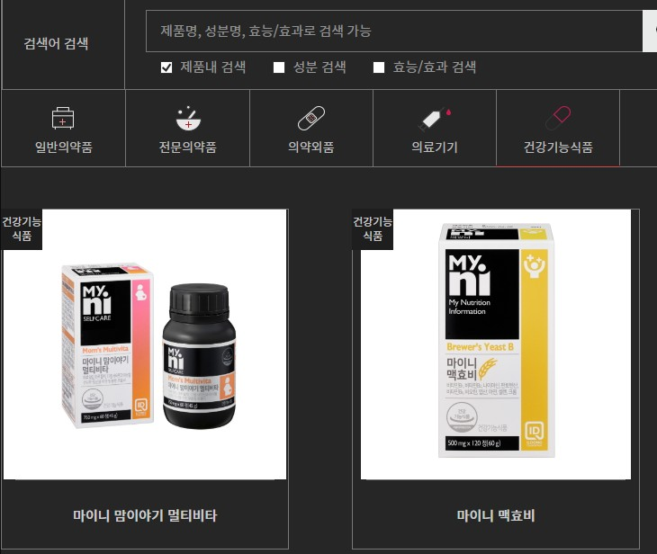
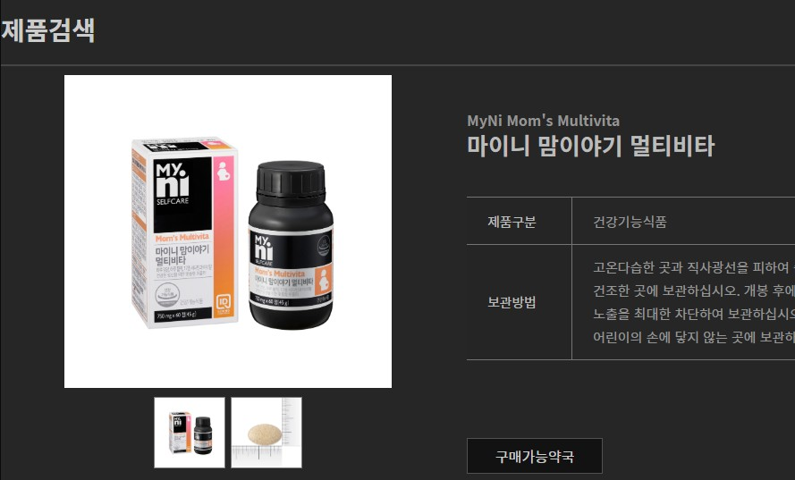
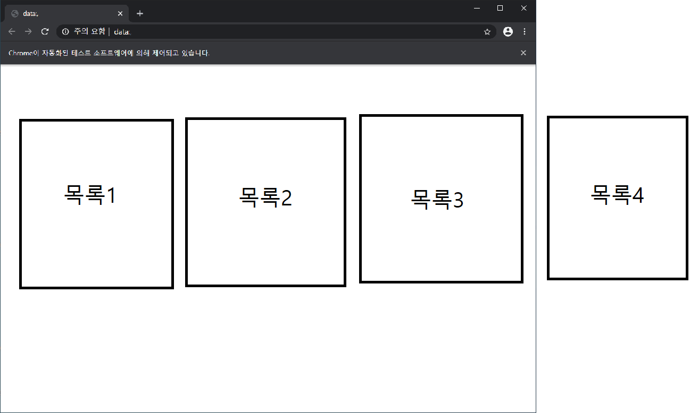
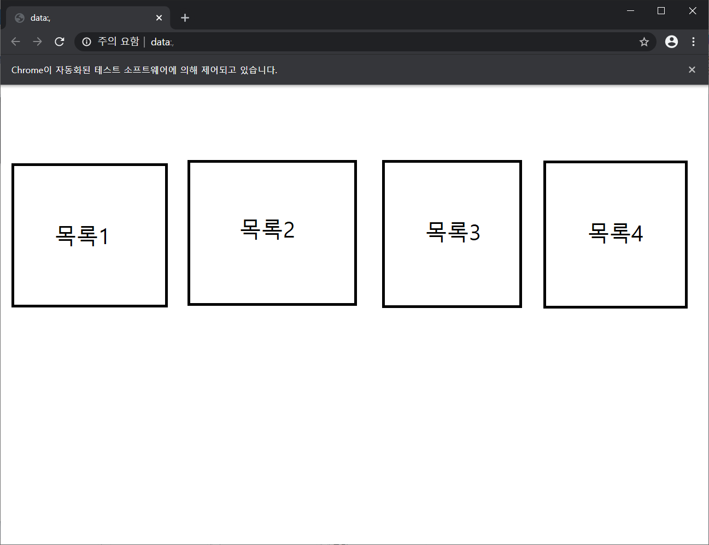

# 크롤링으로 데이터 가져오기

```python
from selenium import webdriver
import time
path = './driver/chromedriver.exe'
driver = webdriver.Chrome(path)
driver
```

- 크롤링을 하기위해 크롬 드라이버를 가동시켰다.



- 여기서 마이니 맘이야기 멀티비타를 클릭해서 그 안에 있는 정보를 가져와보자.



- 이렇게 자동으로 클릭해서 제품상세페이지에 들어가서 제품 설명을 출력해보자.
- 페이지를 자동으로 넘겨서 제품을 가져와보자.

```python
details_list = []
for page in range(1,9):
    url = 'https://www.ildong.com/kor/product/list.id?page='+str(page)+'&halt=&prdDisease=&prdCategory=5&searchVal=&searchOption=0'
    driver.get(url)
    prList = driver.find_element_by_class_name('prList')
    a_tag = prList.find_elements_by_tag_name('a')
    for idx in range(0,9):
            a_tag[idx].click()
            detail = driver.find_element_by_class_name('detailCnt2')
            details_list.append(detail.text)
            driver.back()
            prList = driver.find_element_by_class_name('prList')
            a_tag = prList.find_elements_by_tag_name('a')
            time.sleep(5)
print(len(details_list))
```

- 우선 페이지가 총 8페이지여서 8의 범위를 지정한다.
- 그 다음에 `url` 가운데에 페이지를 넘길 수 있게 `page` 를 연결한다. 
- 그 `url` 을 연다. 
- 거기서 제품을 클릭할 때 제품 상세페이지로 연결되는 링크가 있는 태그를 분석한다.
- 해당되는 태그에 `class` 를 찾아서 `element` 로 가져온다. 
- 하위에 있는 `a` 를 모두 가져온다. `a` 태그에 링크가 걸려있기 때문에 `a` 태그를 가져온다. 
- 한 페이지당 9개의 목록이 있어서 그 만큼 루프를 돈다.
  - 우선 우리가 가져온 `a` 태그를 클릭한다. 그러면 제품 상세페이지로 넘어간다. 
  - 거기서 또 해당 상세정보에 해당하는 태그를 분석한다.
  - `class` 로 해당 정보를 가져온다. 리스트에 추가시킨다.
  - 제품 상세페이지에서 정보를 다 가져왔으면 다시 제품목록이 있는 페이지로 돌아가야 한다.
  - `driver.back()` 로 나간다. 이렇게 하면 우리가 찾았던 상위태그들이 사라진다. 
  - 다시 태그를 찾을 수 있드록 변수를 붙여넣기 한다.
- 최종으로 모든 리스트가 잘 저장되었는지 길이를 확인한다. 

```
72
```

### 에러 발생

코드에 이상이 없었고 드라이버도 잘 구동되고 있었다. 문제가 뭐인지 살펴보았다. 



- 목록 3까지는 잘 받아왔다. 그러나 목록 3이 지나면  다음과 같은 오류가 뜨면서 크롤링이 중단되었다.

#### element not interactable: element has zero size

- 현재 내가 받아오는 목록을 보면 목록4까지 있다. 그러나 창은 목록3까지 보여준다. 여기서 에러나 난 것이다.
- 홈페이지마다 다르지만 혹시라도 같은 에러가 발생하면 화면을 최대화 하자.



- 이렇게 목록이 전부 들어오게 하면 에러가 사라진다. 

- 아니면 처음 크롬창을 킬 때부터 `driver.maximize_window()` 를 입력해서 최대화로 열자.