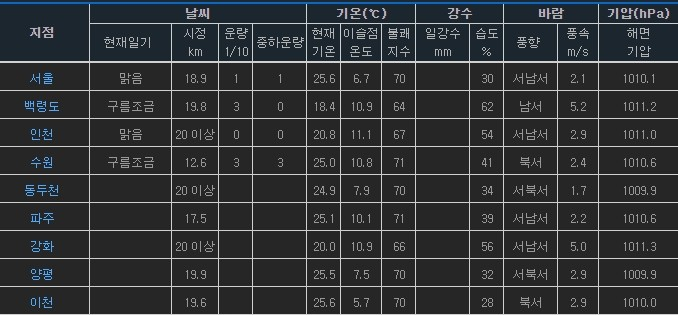
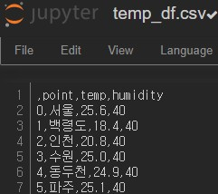
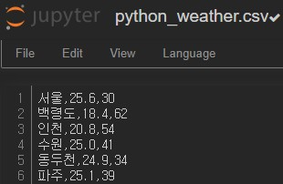

# 연습1

### 표에 있는 데이터를 추출하자




```python
from bs4 import BeautifulSoup
from urllib.request import urlopen
from urllib.error   import HTTPError
from urllib.error   import URLError
```

```python
try:
    html = urlopen('https://pythondojang.bitbucket.io/weather/observation/currentweather.html')
except HTTPError as he:
    print('http error')
except URLError as ue:
    print('url error')
else:
    soup = BeautifulSoup(html.read(), 'html.parser')
```

#### 테이블에 해당하는 class 찾기

```python
table = soup.find('table', {'class' : 'table_develop3'})
table
```

```
<tr>
<td><a href="/weather/observation/currentweather.jsp?tm=2017.5.17.14:00&amp;type=t99&amp;mode=0&amp;auto_man=m&amp;stn=108">서울</a></td>
<td>맑음</td>
<td>18.9</td>
<td>1</td>
<td>1</td>
<td>25.6</td>
<td>6.7</td>
<td>70</td>
<td> </td>
<td>30</td>
<td>서남서</td>
<td>2.1</td>
<td>1010.1</td>
</tr>
```

#### `<tr>`  에서 `<td>` 찾기

```python
point_list = []
temp_list = []
humidity_list = []
for tr in  table.find_all('tr'):
                tds= list(tr.find_all('td'))
                print(tds)
```

```
[<td><a href="/weather/observation/currentweather.jsp?tm=2017.5.17.14:00&amp;type=t99&amp;mode=0&amp;auto_man=m&amp;stn=108">서울</a></td>, <td>맑음</td>, <td>18.9</td>, <td>1</td>, <td>1</td>, <td>25.6</td>, <td>6.7</td>, <td>70</td>, <td> </td>, <td>30</td>, <td>서남서</td>, <td>2.1</td>, <td>1010.1</td>]
[<td><a href="/weather/observation/currentweather.jsp?tm=2017.5.17.14:00&amp;type=t99&amp;mode=0&amp;auto_man=m&amp;stn=102">백령도</a></td>, <td>구름조금</td>, <td>19.8</td>, <td>3</td>, <td>0</td>, <td>18.4</td>, <td>10.9</td>, <td>64</td>, <td> </td>, <td>62</td>, <td>남서</td>, <td>5.2</td>, <td>1011.2</td>]
```

- 리스트로 감싸주는 이유는 `list` 없어도 리스트로 반영되는데 `type` 로 찍어보면 `list` 가 아니다. 그래서 `list` 로 다시 변환한다.

```python
point_list = []
temp_list = []
humidity_list = []
for tr in  table.find_all('tr'):
                tds= list(tr.find_all('td'))
                for td in tds:
                    if td.find('a'):
                        point = td.find('a').text
                        point_list.append(point)
                        temp = tds[5].text
                        temp_list.append(temp)
                        humidity = tds[9].text
                        humidity_list.append(humidity)
```

- `<a>` 태그가 있으면 그거에 있는 텍스트를 리스트에 담고, 뽑기를 원하는 값의 인덱스를 찾아서 리스트에 저장한다.

```python
print(point_list)
print(temp_list)
print(temp_list)
```

```
['서울', '백령도', '인천', '수원', '동두천', '파주', '강화', '양평', '이천']
['25.6', '18.4', '20.8', '25.0', '24.9', '25.1', '20.0', '25.5', '25.6']
['30', '62', '54', '41', '34', '39', '56', '32', '28', '36', '56', '77']
```

- 이렇게 리스트에 저장된다.

```python
print(len(point_list))
print(len(temp_list))
print(len(humidity_list))
```

```
95
95
95
```

- `df` 를 만들기 위해서 길이가 같은지 확인한다.

```python
import pandas as pd
```

```python
temp_df = pd.DataFrame({
    'point' : point_list,
    'temp'  : temp_list,
    'humidity' : humidity
})
```

```python
temp_df.to_csv('temp_df.csv', mode='w', encoding='utf-8')
```



- 정상적으로 저장되었다.

### pandas 안 쓰고 데이터프레임 만들기

```python
data =[]
for tr in  table.find_all('tr'):
                tds= list(tr.find_all('td'))
                for td in tds:
                    if td.find('a'):
                        point = td.find('a').text
                        temp = tds[5].text
                        humidity = tds[9].text
                        data.append([point, temp, humidity])
data
```

- 위랑 방식은 같지만 리스트에 저장하는 점이 다르다.

```
[['서울', '25.6', '30'],
 ['백령도', '18.4', '62'],
```

- 위에서는 리스트를 3개만들어서 합쳐주었다면 이 방법은 미리 데이터를 맞춰서 넣는다.

```python
with open('python_weather.csv','w',encoding='utf-8') as file:
    for d in data:
        file.write('{},{},{}\n'.format(d[0],d[1],d[2]))
```

- 이렇게 하면 파일이 저장된다.



- pandas로 만든 df는 컬럼제목과 인덱스가 있지만 지금 만든 방법은 없다.