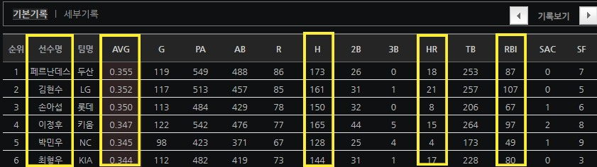
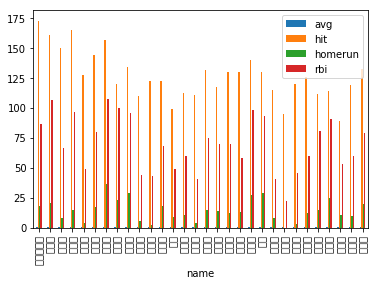
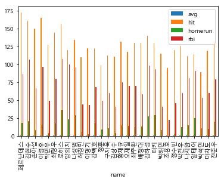

# 연습1

### 표에 있는 데이터를 추출하자_1


```python
from bs4 import BeautifulSoup
from urllib.request import urlopen
from urllib.error   import HTTPError
from urllib.error   import URLError
```

```python
try:
    html = urlopen('https://pythondojang.bitbucket.io/weather/observation/currentweather.html')
except HTTPError as he:
    print('http error')
except URLError as ue:
    print('url error')
else:
    soup = BeautifulSoup(html.read(), 'html.parser')
```

#### 테이블에 해당하는 class 찾기

```python
table = soup.find('table', {'class' : 'table_develop3'})
table
```

```
<tr>
<td><a href="/weather/observation/currentweather.jsp?tm=2017.5.17.14:00&amp;type=t99&amp;mode=0&amp;auto_man=m&amp;stn=108">서울</a></td>
<td>맑음</td>
<td>18.9</td>
<td>1</td>
<td>1</td>
<td>25.6</td>
<td>6.7</td>
<td>70</td>
<td> </td>
<td>30</td>
<td>서남서</td>
<td>2.1</td>
<td>1010.1</td>
</tr>
```

#### `<tr>`  에서 `<td>` 찾기

```python
point_list = []
temp_list = []
humidity_list = []
for tr in  table.find_all('tr'):
                tds= list(tr.find_all('td'))
                print(tds)
```

```
[<td><a href="/weather/observation/currentweather.jsp?tm=2017.5.17.14:00&amp;type=t99&amp;mode=0&amp;auto_man=m&amp;stn=108">서울</a></td>, <td>맑음</td>, <td>18.9</td>, <td>1</td>, <td>1</td>, <td>25.6</td>, <td>6.7</td>, <td>70</td>, <td> </td>, <td>30</td>, <td>서남서</td>, <td>2.1</td>, <td>1010.1</td>]
[<td><a href="/weather/observation/currentweather.jsp?tm=2017.5.17.14:00&amp;type=t99&amp;mode=0&amp;auto_man=m&amp;stn=102">백령도</a></td>, <td>구름조금</td>, <td>19.8</td>, <td>3</td>, <td>0</td>, <td>18.4</td>, <td>10.9</td>, <td>64</td>, <td> </td>, <td>62</td>, <td>남서</td>, <td>5.2</td>, <td>1011.2</td>]
```

- 리스트로 감싸주는 이유는 `list` 없어도 리스트로 반영되는데 `type` 로 찍어보면 `list` 가 아니다. 그래서 `list` 로 다시 변환한다.

```python
point_list = []
temp_list = []
humidity_list = []
for tr in  table.find_all('tr'):
                tds= list(tr.find_all('td'))
                for td in tds:
                    if td.find('a'):
                        point = td.find('a').text
                        point_list.append(point)
                        temp = tds[5].text
                        temp_list.append(temp)
                        humidity = tds[9].text
                        humidity_list.append(humidity)
```

- `<a>` 태그가 있으면 그거에 있는 텍스트를 리스트에 담고, 뽑기를 원하는 값의 인덱스를 찾아서 리스트에 저장한다.

```python
print(point_list)
print(temp_list)
print(temp_list)
```

```
['서울', '백령도', '인천', '수원', '동두천', '파주', '강화', '양평', '이천']
['25.6', '18.4', '20.8', '25.0', '24.9', '25.1', '20.0', '25.5', '25.6']
['30', '62', '54', '41', '34', '39', '56', '32', '28', '36', '56', '77']
```

- 이렇게 리스트에 저장된다.

```python
print(len(point_list))
print(len(temp_list))
print(len(humidity_list))
```

```
95
95
95
```

- `df` 를 만들기 위해서 길이가 같은지 확인한다.

```python
import pandas as pd
```

```python
temp_df = pd.DataFrame({
    'point' : point_list,
    'temp'  : temp_list,
    'humidity' : humidity
})
```

```python
temp_df.to_csv('temp_df.csv', mode='w', encoding='utf-8')
```


- 정상적으로 저장되었다.

### pandas 안 쓰고 데이터프레임 만들기

```python
data =[]
for tr in  table.find_all('tr'):
                tds= list(tr.find_all('td'))
                for td in tds:
                    if td.find('a'):
                        point = td.find('a').text
                        temp = tds[5].text
                        humidity = tds[9].text
                        data.append([point, temp, humidity])
data
```

- 위랑 방식은 같지만 리스트에 저장하는 점이 다르다.

```
[['서울', '25.6', '30'],
 ['백령도', '18.4', '62'],
```

- 위에서는 리스트를 3개만들어서 합쳐주었다면 이 방법은 미리 데이터를 맞춰서 넣는다.

```python
with open('python_weather.csv','w',encoding='utf-8') as file:
    for d in data:
        file.write('{},{},{}\n'.format(d[0],d[1],d[2]))
```

- 이렇게 하면 파일이 저장된다.


- pandas로 만든 df는 컬럼제목과 인덱스가 있지만 지금 만든 방법은 없다.

### 표에 있는 데이터 가져오기_2



- 노란색 칸에 있는 데이터만 가져오자.

```python
from bs4 import BeautifulSoup
from urllib.request import urlopen
from urllib.error   import HTTPError
from urllib.error   import URLError
```

```python
try:
    html = urlopen('https://www.koreabaseball.com/Record/Player/HitterBasic/Basic1.aspx')
except HTTPError as he:
    print('http error')
except URLError as ue:
    print('url error')
else:
    soup = BeautifulSoup(html.read(), 'html.parser')
```

|        | 선수명 | AVG  | 안타(H) | 홈런(HR) | 타점(RBI) |
| :----: | :----: | :--: | :-----: | :------: | :-------: |
| 인덱스 |   1    |  3   |    8    |    11    |    13     |

```python
table = soup.find('table', {'class' : 'tData01 tt'})
table
```

```
<table cellpadding="0" cellspacing="0" class="tData01 tt" summary="선수 기본기록으로 경기,타석,타수,득점,안타,2루타, 3루타 등을 표시합니다"> ... </tbody></table>
```

```python
name_list = []
avg_list =[]
hit_list = []
homerun_list =[]
rbi_list =[]
for tr in  table.find_all('tr'):
                tds= list(tr.find_all('td'))
                for td in tds:
                    if td.find('a'):
                        name = td.find('a').text
                        name_list.append(name)
                        avg = tds[3].text
                        avg_list.append(avg)
                        hit = tds[8].text
                        hit_list.append(hit)
                        homerun = tds[11].text
                        homerun_list.append(homerun)
                        rbi = tds[13].text
                        rbi_list.append(rbi)
```

- `DataFrame` 을 만들기 위해 각각 변수 리스트를 만들어거 값을 저장한다.

```python
print(len(name_list))
print(len(avg_list))
print(len(hit_list))
print(len(homerun_list))
print(len(rbi_list))
```

```
30
30
30
30
30
```

- 데이터의 개수가 같은지 확인한다.

#### 판다스로 DataFrame 만들기

```python
import pandas as pd
```

```python
base_df = pd.DataFrame({
    'name' : name_list,
    'avg'  : avg_list,
    'hit'  : hit_list,
    'homerun' : homerun_list,
    'rbi'     : rbi_list
})
```

```python
base_df.to_csv('base_df.csv', mode='w', encoding='utf-8')
```

|      |    name    |  avg  | hit  | homerun | rbi  |
| :--: | :--------: | :---: | :--: | :-----: | :--: |
|  0   | 페르난데스 | 0.355 | 173  |   18    |  87  |
|  1   |   김현수   | 0.352 | 161  |   21    | 107  |
|  2   |   손아섭   | 0.350 | 150  |    8    |  67  |

#### 판다스없이 DataFrame 만들기

```python
data = []
for tr in  table.find_all('tr'):
                tds= list(tr.find_all('td'))
                for td in tds:
                    if td.find('a'):
                        name = td.find('a').text
                        avg = tds[3].text
                        hit = tds[8].text
                        homerun = tds[11].text
                        rbi = tds[13].text
                        data.append([name, avg, hit,homerun,rbi])
```

- 변수별로 합칠 일요가 없기 때문에 `data` 리스트에 한 번에 저장한다.

```python
with open('base_02.csv','w',encoding='utf-8') as file:
    file.write('name, avg, hit, homerun, rbi\n')
    
    for d in data:
        file.write('{},{},{},{},{} \n'.format(d[0],d[1],d[2],d[3],d[4]))
```

|      |    name    |  avg  | hit  | homerun | rbi  |
| :--: | :--------: | :---: | :--: | :-----: | :--: |
|  0   | 페르난데스 | 0.355 | 173  |   18    |  87  |
|  1   |   김현수   | 0.352 | 161  |   21    | 107  |
|  2   |   손아섭   | 0.350 | 150  |    8    |  67  |

- 1번이랑 다르게 미리 file에 컬럼이름을 `write` 를 하니 컬럼이름이 생성되었다.

### 시각화하기

```python
%matplotlib inline
import pandas as pd
import matplotlib as mpl
import matplotlib.pyplot as plt
```

```python
df = pd.read_csv('./base_df.csv', index_col='name',encoding='utf-8')
df = df.iloc[:,[1,2,3,4]]
df
```

- 선수이름을 인덱스로 설정한다.

|    name    |  avg  | hit  | homerun | rbi  |
| :--------: | :---: | :--: | :-----: | :--: |
| 페르난데스 | 0.355 | 173  |   18    |  87  |
|   김현수   | 0.352 | 161  |   21    | 107  |
|   손아섭   | 0.350 | 150  |    8    |  67  |

```python
df.plot.bar()
```



- 글자가 한글이라서 깨진다. 

```python
import platform

from matplotlib import font_manager, rc
# plt.rcParams['axes.unicode_minus'] = False

if platform.system() == 'Darwin':
    rc('font', family='AppleGothic')
elif platform.system() == 'Windows':
    path = "c:/Windows/Fonts/malgun.ttf"
    font_name = font_manager.FontProperties(fname=path).get_name()
    rc('font', family=font_name)
else:
    print('Unknown system... sorry~~~~') 
```

- 한글이 안 깨지도록 설정한다.



- 한글이 정상적으로 나온다.