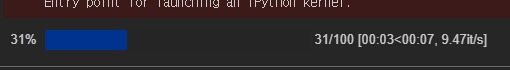
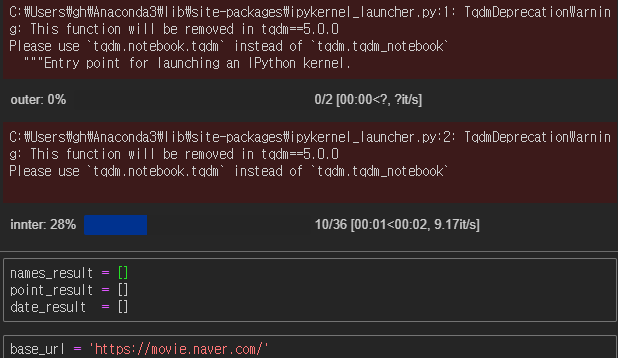

# 영화평점에 대한 평점 변화(시각화)[실습]

```python
from urllib.request import urlopen
from bs4 import BeautifulSoup
from urllib.request import urlopen
from urllib.error   import HTTPError
from urllib.error   import URLError
```

```python
base_url = 'https://movie.naver.com/'
sub_url = '/movie/sdb/rank/rmovie.nhn?sel=cur&date=20170501'

try:
    html = urlopen(base_url+sub_url)
except HTTPError as he:
    print('http error')
except URLError as ue:
    print('url error')
else:
    soup = BeautifulSoup(html.read(), 'html.parser')
```

- `base url` 을 해놓으면 나중에 `sub_url` 만 바꾸면 편하다.

### 영화 제목 찾기


- 영화 랭킹에서 영화 제목과 평점을 가져올 것이다.
  - 영화 평점 변화를 살펴보자.


- 월-E를 담고있는 `div` 에 `class` 가 있다. `class` 를 찾아서 들어가자.

```python
soup.find_all('div', 'tit5')
```

```
[<div class="tit5">
 <a href="/movie/bi/mi/basic.nhn?code=147092" title="히든 피겨스">히든 피겨스</a>
 </div>, <div class="tit5">
 <a href="/movie/bi/mi/basic.nhn?code=10102" title="사운드 오브 뮤직">사운드 오브 뮤직</a> ...
 <a href="/movie/bi/mi/basic.nhn?code=17875" title="로미오와 줄리엣">로미오와 줄리엣</a>
 </div>]
```

- 제목이 다른 이유는 현재 날짜가 아니라 링크에 과거 날짜를 입력하였기 때문이다.

```python
soup.find_all('div', 'tit5')[0].a.text 
```

```
'히든 피겨스'
```

- `string` ,` get_text()` 을 써도 문자를 가져올 수 있다.
- 리스트로 값이 넘어오기 때문에 인덱스를 써서 텍스트를 가져온다.

### 평점찾기


- 평점을 담고있는 `td` 에 `class` 가 있다. `class` 를 타고 들어가자.

```python
soup.find_all('td', 'point')[0].text
```

```
'9.38'
```

### DataFrame을 만들자

> 데이터 프레임을 만들기 위해서는 셀의 길이가 동일해야하므로 확인절차가 필요하다.

```python
print(len(soup.find_all('div', 'tit5')))
print(len(soup.find_all('td', 'point')))
```

```
50
50
```

- 셀의 길이가 동일하다.

#### 영화 제목 저장

```python
movie_names = [soup.find_all('div', 'tit5')[i].a.text for i in range(50) ]
print(len(movie_names))
print(movie_names)
```

- 굳이 `for` 구문을 돌리지 않아서 리스트 안에서 실행하면 값이 리스트 안에 저장된다. 

```
50
['히든 피겨스', '사운드 오브 뮤직', '시네마 천국', '미스 슬로운', '잉여들의 히치하이킹', '나, 다니엘 블레이크', '바람과 함께 사라지다', '오즈의 마법사', '벤허', '흑집사 : 북 오브 더 아틀란틱', '우리들', '일 포스티노', '댄서', '라이언', '코알라', '로건', '더 플랜', '분노의 질주: 더 익스트림', '시카고', '10분', '해리가 샐리를 만났을 때', '미녀와 야수', '너의 이름은.', '그랑블루', '한공주', '연애담', '포켓몬 더 무비 XY&Z; 「볼케니온 : 기계왕국의 비밀」', '리틀 프린세스 소피아: 엘레나와 비밀의 아발로 왕국', '분노', '맨체스터 바이 더 씨', '행복 목욕탕', '스머프: 비밀의 숲', '부당거래', '파닥파닥', '아비정전', '패션 오브 크라이스트', '라라랜드', '뽀로로 극장판 슈퍼썰매 대모험', '족구왕', '가디언즈 오브 갤럭시', '자전거 탄 소년', '오두막', '성실한 나라의 앨리스', '원라인', '존 윅 - 리로드', '사일런스', '클로저', '임금님의 사건수첩', '문라이트', '로미오와 줄리엣']
```

#### 영화 평점 저장

```python
movie_num =  [soup.find_all('td', 'point')[i].text for i in range(50) ]
print(len(movie_num))
print(movie_num)
```

```
50
['9.38', '9.36', '9.29', '9.26', '9.25', '9.25', '9.24', '9.23', '9.22', '9.20', '9.18', '9.17', '9.14', '9.07', '9.07', '9.06', '9.04', '9.02', '8.92', '8.89', '8.89', '8.85', '8.81', '8.78', '8.78', '8.76', '8.75', '8.73', '8.73', '8.72', '8.70', '8.67', '8.66', '8.65', '8.59', '8.59', '8.59', '8.56', '8.56', '8.56', '8.54', '8.48', '8.39', '8.29', '8.28', '8.26', '8.20', '8.17', '8.12', '8.10']
```

#### pandas 불러오기

```python
import pandas as pd
```

#### 날짜 불러오기

```python
date = pd.date_range('2017-5-1',periods=100,freq='D')
date
```

```
DatetimeIndex(['2017-05-01', '2017-05-02', '2017-05-03', '2017-05-04',
               '2017-05-05', '2017-05-06', '2017-05-07', '2017-05-08',
               '2017-05-09', '2017-05-10', '2017-05-11', '2017-05-12',
               '2017-05-13', '2017-05-14', '2017-05-15', '2017-05-16',
               '2017-05-17', '2017-05-18', '2017-05-19', '2017-05-20',
               '2017-05-21', '2017-05-22', '2017-05-23', '2017-05-24',
               '2017-05-25', '2017-05-26', '2017-05-27', '2017-05-28',
               '2017-05-29', '2017-05-30', '2017-05-31', '2017-06-01',
               '2017-06-02', '2017-06-03', '2017-06-04', '2017-06-05',
               '2017-06-06', '2017-06-07', '2017-06-08', '2017-06-09',
               '2017-06-10', '2017-06-11', '2017-06-12', '2017-06-13',
               '2017-06-14', '2017-06-15', '2017-06-16', '2017-06-17',
               '2017-06-18', '2017-06-19', '2017-06-20', '2017-06-21',
               '2017-06-22', '2017-06-23', '2017-06-24', '2017-06-25',
               '2017-06-26', '2017-06-27', '2017-06-28', '2017-06-29',
               '2017-06-30', '2017-07-01', '2017-07-02', '2017-07-03',
               '2017-07-04', '2017-07-05', '2017-07-06', '2017-07-07',
               '2017-07-08', '2017-07-09', '2017-07-10', '2017-07-11',
               '2017-07-12', '2017-07-13', '2017-07-14', '2017-07-15',
               '2017-07-16', '2017-07-17', '2017-07-18', '2017-07-19',
               '2017-07-20', '2017-07-21', '2017-07-22', '2017-07-23',
               '2017-07-24', '2017-07-25', '2017-07-26', '2017-07-27',
               '2017-07-28', '2017-07-29', '2017-07-30', '2017-07-31',
               '2017-08-01', '2017-08-02', '2017-08-03', '2017-08-04',
               '2017-08-05', '2017-08-06', '2017-08-07', '2017-08-08'],
              dtype='datetime64[ns]', freq='D')
```

- `date_range` 를 하면 원하는 날짜의 길이를 가져올 수 있다.

#### for 루프 시간 확인하기

```python
import urllib
from tqdm import tqdm_notebook
import time
```

```python
for n in tqdm_notebook(range(100)):
    time.sleep(0.1)
```



- 다음과 같이 `for` 루프가 얼마나 남았는지 알 수 있다.

- `sleep` 는 일정시간동안 프로세스를 일시정지 할 수 있다. 

```python
for n in tqdm_notebook(range(2), desc='outer'):
    for y in tqdm_notebook(range(36), desc='innter'):
        time.sleep(0.1)
```



- 안에 있는 `for` 가 끝나야 다음 `for` 가 실행되고 최종 마무리 되는 것을 볼 수 있다.
- `desc` 는 본인이 원하는 구별 텍스트를 기입하면 된다.