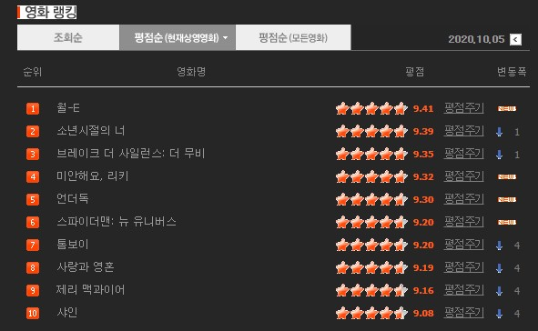
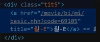

# 영화평점에 대한 평점 변화(시각화)[실습]

```python
from urllib.request import urlopen
from bs4 import BeautifulSoup
from urllib.request import urlopen
from urllib.error   import HTTPError
from urllib.error   import URLError
```

```python
base_url = 'https://movie.naver.com/'
sub_url = '/movie/sdb/rank/rmovie.nhn?sel=cur&date=20170501'

try:
    html = urlopen(base_url+sub_url)
except HTTPError as he:
    print('http error')
except URLError as ue:
    print('url error')
else:
    soup = BeautifulSoup(html.read(), 'html.parser')
```

- `base url` 을 해놓으면 나중에 `sub_url` 만 바꾸면 편하다.

### 영화 제목 찾기



- 영화 랭킹에서 영화 제목과 평점을 가져올 것이다.
  - 영화 평점 변화를 살펴보자.



- 월-E를 담고있는 `div` 에 `class` 가 있다. `class` 를 찾아서 들어가자.

```python
soup.find_all('div', 'tit5')
```

```
[<div class="tit5">
 <a href="/movie/bi/mi/basic.nhn?code=147092" title="히든 피겨스">히든 피겨스</a>
 </div>, <div class="tit5">
 <a href="/movie/bi/mi/basic.nhn?code=10102" title="사운드 오브 뮤직">사운드 오브 뮤직</a> ...
 <a href="/movie/bi/mi/basic.nhn?code=17875" title="로미오와 줄리엣">로미오와 줄리엣</a>
 </div>]
```

- 제목이 다른 이유는 현재 날짜가 아니라 링크에 과거 날짜를 입력하였기 때문이다.

```python
soup.find_all('div', 'tit5')[0].a.text 
```

```
'히든 피겨스'
```

- `string` ,` get_text()` 을 써도 문자를 가져올 수 있다.
- 리스트로 값이 넘어오기 때문에 인덱스를 써서 텍스트를 가져온다.

### 평점찾기

