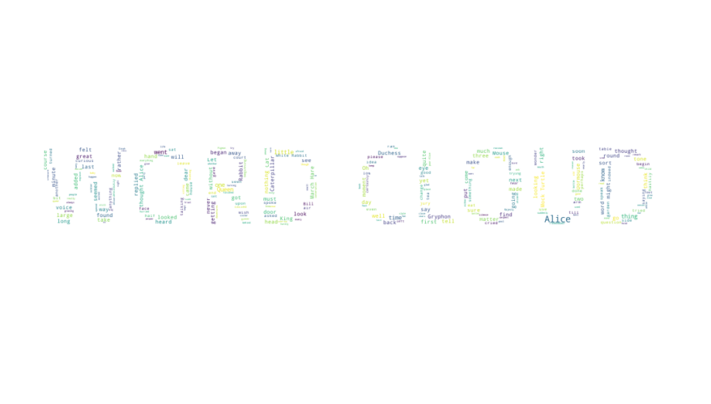

# 웹 스크랩핑 및 csv 파일 작성과 이미지 스크랩핑

```python
from urllib.request import urlopen
from bs4 import BeautifulSoup
from urllib.request import urlopen
from urllib.error   import HTTPError
from urllib.error   import URLError
```

```python
url = 'https://www.imdb.com/title/tt4154756/reviews?ref_=tt_ql_3'

try:
    html = urlopen(url)
except HTTPError as he:
    print('http error')
except URLError as ue:
    print('url error')
else:
    soup = BeautifulSoup(html.read(), 'html.parser', from_encoding='utf-8')
```


### 별점, 리뷰제목, 작성자 닉네임, 작성날짜, 리뷰내용을 가져오자.

- 내용을 포함하고 있는 태그를 살펴보았다.


- 다음과 같이 `div` 에 담겨있으며 `class` 도 가지고 있다. `class` 에서 반복되는 `imdb-user-review` 를  사용하자.

```python
review_list = soup.find_all('div','imdb-user-review')
review_list
```

```
[<div class="lister-item mode-detail imdb-user-review collapsable" data-review-id="rw5504583" data-vote-url="/title/tt4154756/review/rw5504583/vote/interesting">
 <div class="review-container">
 <div class="lister-item-content">
 <div class="ipl-ratings-bar"> ... 
  </svg>
 </div>
 </div>
 </div>
 </div>
 </div>
 </div>]
```

- 모든 `div` 중 `class` 가 `imdb-user-review`  인 것들을 찾아서 가져오자.

### wordcloud

- 리뷰내용들을 wordcloud로 만들것이기 때문에 wordcloud를 먼저 한다.

#### 자연어 처리 기초

- 꼬고마
- 한나눔
- 트위터

#### konlpy

- 이 파일을 설치해야 분리할 수 있다.

```python
from konlpy.tag import Kkma
```

```python
kkoma = Kkma()
```

```python
kkoma.nouns('오늘은 무엇을 먹을까? 짜장면? 냉면?')
```

```
['오늘', '무엇', '짜장면', '냉면']
```

- 이렇게 단어들을 분리해준다.

```python
kkoma.sentences('오늘은 무엇을 먹을까? 짜장면? 냉면?~')
```

```
['오늘은 무엇을 먹을까?', '짜장면? 냉면?~']
```

- 알아서 문장을 나누어 준다.

```python
kkoma.pos('오늘은 무엇을 먹을까? 짜장면? 냉면?~')
```

```
[('오늘', 'NNG'),
 ('은', 'JX'),
 ('무엇', 'NNG'),
 ('을', 'JKO'),
 ('먹', 'VV'),
 ('을까', 'EFQ'),
 ('?', 'SF'),
 ('짜장면', 'NNG'),
 ('?', 'SF'),
 ('냉면', 'NNG'),
 ('?', 'SF'),
 ('~', 'SO')]
```

- 단어들의 형태를 보여준다.

#### wordcloud 그리기

```python
from wordcloud import WordCloud, STOPWORDS
```

```python
import numpy as np
from PIL import Image
```

- wordcloud에 필요한 파일을 설치한다.
- 이미지를 그리기 위한 파일도 같이 설치한다. 

1. 텍스트 파일을 연다. 

```python
text = open('./data/07. alice.txt',encoding='utf-8').read()
```

2. 이미지 파일도 불러온다.

```python
mask = np.array(Image.open('./images/word.png'))
mask 
```

```
array([[255, 255, 255, ..., 255, 255, 255],
       [255, 255, 255, ..., 255, 255, 255],
       [255, 255, 255, ..., 255, 255, 255],
       ...,
       [255, 255, 255, ..., 255, 255, 255],
       [255, 255, 255, ..., 255, 255, 255],
       [255, 255, 255, ..., 255, 255, 255]], dtype=uint8)
```

- 이미지는 다음과 같은 배열의 형태로 저장된다. 

```python
import matplotlib.pyplot as plt
%matplotlib inline

import platform

from matplotlib import font_manager, rc
# plt.rcParams['axes.unicode_minus'] = False

if platform.system() == 'Darwin':
    rc('font', family='AppleGothic')
elif platform.system() == 'Windows':
    path = "c:/Windows/Fonts/malgun.ttf"
    font_name = font_manager.FontProperties(fname=path).get_name()
    rc('font', family=font_name)
else:
    print('Unknown system... sorry~~~~') 
```

- 한글이 깨지는 것을 방지하기 위해 같이 설치한다. 그림 그리기 위한 `plt` 도 같이 `import` 한다.

#### 그림 그리기

```python
plt.figure(figsize=(8,8))
plt.imshow(mask ,cmap=plt.cm.gray)
plt.show()
```

- 위에서 만들었던 `mask` 로 그림을 그린다.


#### 불용어 만들기

```python
sw = set(STOPWORDS) 
sw.add('said')
wc = WordCloud(background_color='white', max_words=2000, mask=mask, stopwords = sw)
```

- `sw` 로 불용어를 저장한다. 
  - 거기에 `said` 를 추가한다. 

- `wc` 에 워드클라우드를 저장한다.  최대 2000개 나오도록 하고, mask는 위의 그림에 표시되게 한다. 

```python
wc = wc.generate(text)
wc.words_
```

- generate는 공백으로 분리된 문자열을 받는다. 
  - 가장 첫 번째 단어를 가장 크게, 가장 마지막 단어를 가장 작게 표현한다. 

```
{'Alice': 1.0,
 'little': 0.29508196721311475,
 'one': 0.27595628415300544,
 'know': 0.2459016393442623,
 'went': 0.226775956284153,
 'thing': 0.2185792349726776,
 'time': 0.2103825136612022,
```

- 가장 많이 나온 단어가 첫번째로 나타난다.

```python
plt.figure(figsize=(15,15))
plt.imshow(wc ,interpolation='bilinear') 
plt.axis('off') #x축 없애기
plt.show()
```

- interpolation을 하면 좀 더 부드럽다.
- plt.axis('off')  : x축 없애기



- 알아서 글자안에 단어들이 들어간다. 