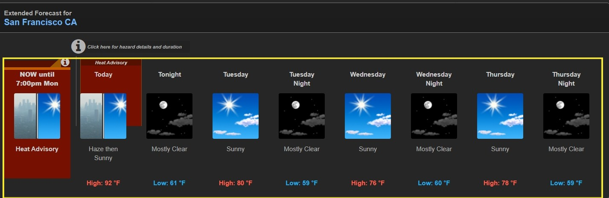
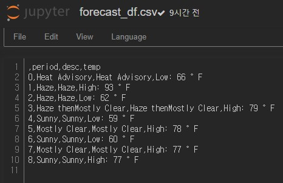

# 비정형 데이터 활용하기

## 스크래핑(scraping)

- 컴퓨터 프로그램이 다른 프로그램으로부터 들어오는 인간이 읽을 수 있는 출력으로부터 데이터를 추출하는 기법이다.

```python
import requests
from bs4 import BeautifulSoup
```

- `html` 을 불러오려면 사용자의 `request` 를 받아야 하니 패키지를 불러온다.

```python
webpage = requests.get('https://www.daangn.com/hot_articles')
webpage.text
```

```
'<!DOCTYPE html>\n<html lang="ko">\n<head>\n  <meta charset="utf-8">\n  <meta http-equiv="X-UA-Compatible" content="IE=edge">\n  <meta name="viewport" content="width=device-width,initial-scale=1,maximum-scale=1,user-scalable=no">\n      <link rel="canonical" href="https://www.daangn.com/hot_articles" />\n\n  <title>당근마켓 중고거래 | 당신 근처의 당근마켓</title>\n<meta name="description" content="당근마켓에서 거래되는 인기 중고 매물을 소개합니다. 지금 당근마켓에서 거래되고 있는 다양한 매물을 구경해보세요.">\n<meta property="og:url" content="https://www.daangn.com/hot_articles">
```

- 그냥 `request` 로만 받아오면 분리되지도 않고 텍스트형대로 받아온다. 

- html로 파싱할 수 있게 받아야 한다.

###  BeautifulSoup

```python
webpage = requests.get('https://www.daangn.com/hot_articles')
soup = BeautifulSoup(webpage.content, 'html.parser')
soup
```

- `BeautifulSoup` 을 활용하여 파싱하여 가져온다.

```
<!DOCTYPE html>

<html lang="ko">
<head>
<meta charset="utf-8"/>
<meta content="IE=edge" http-equiv="X-UA-Compatible"/>
<meta content="width=device-width,initial-scale=1,maximum-scale=1,user-scalable=no" name="viewport"/>
<link href="https://www.daangn.com/hot_articles" rel="canonical"/>
<title>당근마켓 중고거래 | 당신 근처의 당근마켓</title>
<meta content="당근마켓에서 거래되는 인기 중고 매물을 소개합니다. 지금 당근마켓에서 거래되고 있는 다양한 매물을 구경해보세요." name="description"/>
```

- 그냥 `request` 만 받았을 때랑 다르다. 파싱할수 있도록 변형되어 받아온다.
- 이렇게 가져와야 탐색할 수 있다.

```python
soup.p
```

```
<p>당근마켓 앱에서 따뜻한 거래를 직접 경험해보세요!</p>
```

- 전체페이지에서 가장 첫 번째 `<p>` 태그를 찾아서 보여준다.

```python
print(soup.p.string)
```

```
당근마켓 앱에서 따뜻한 거래를 직접 경험해보세요!
```

- `string` 을 사용하면 태그안에 있는 텍스트만 추출할 수 있다.

```python
soup.h
```

```
<h1 id="fixed-bar-logo-title">
<a href="https://www.daangn.com/">
<span class="sr-only">당근마켓</span>

</a> </h1>
```

- 처음 만나는 `<h1>` 을 가져온다. 하위요소들도 가져와버린다. 하위태그 접근이 필요하다면?

```python
for child in soup.h1.children :
    print(child)
```

```
<a href="https://www.daangn.com/">
<span class="sr-only">당근마켓</span>

</a>
```

- for루프를 돌려서 하위태그들을 가져오게 하였다.

```python
for d in soup.div.children:
    print(d)
```

```
<h1 id="fixed-bar-logo-title">
<a href="https://www.daangn.com/">
               .
               .
               .
<div class="fixed-download-text">Google Play</div>
</a> </section>
```

- 처음 만나는  `<div>` 에는 다음과 같은 하위요소들이 있다.

### find_all()

- 원하는 부분을 모두 가져올 때 사용하는 함수

```python
soup.find_all('h2')
```

```
[<h2 class="card-title">버팔로 캠핑의자</h2>, <h2 class="card-title">스팸 선물세트 새것</h2>, ...  <h2 class="card-title">24인치 자전거</h2>]
```

- 태그를 입력하면 태그에 해당하는 모든 정보들을 가져온다.
  - 여기서는 `<h2>`  에 해당하는 값들을 모두 가져왔다.
- 또한 리스트로 구성되어 있다.

```python
type(soup.find_all('h2')
```

```
<class 'bs4.element.ResultSet'>
```

### 정규식을 활용하자

- `<ol> <ul>` 포함하는 값을 리스트로 읽어오고 싶다면?

```python
import re
```

- 필요한 패키지를 불러오자.

```python
soup.find_all(re.compile('[ou]l'))
```

```
[<ul class="nav navbar-nav">
 <li><a href="http://www.weather.gov">HOME</a></li>
 <li class="dropdown"><a class="dropdown-toggle" data-toggle="dropdown" href="http://www.weather.gov/forecastmaps">FORECAST <span class="caret"></span></a><ul class="dropdown-menu" role="menu"> ... <li><a href="https://www.weather.gov/careers">Career Opportunities</a></li>
 </ul>]
```

- `<ol>` , `<ul>` 에 해당하는 태그들만 불러온다.

```python
soup.find_all(re.compile('h[1-9]'))
```

```
[<h1 id="fixed-bar-logo-title">
 <a href="https://www.daangn.com/">
 <span class="sr-only">당근마켓</span>... <p>당근마켓 앱에서 따뜻한 거래를 직접 경험해보세요!</p>]
```

- `<h1>` ~ `<h9>` 에 해당하는 값들을 모두 불러온다.

**하나 이상의 태그들을 가져올 때 리스트로 만들면 원하는 태그들의 정보를 가져올 수 있다.**

#### attrs = {}

- 딕셔너리 형식으로 접근하면 해당 값들을 가져올 수 있다. 

```python
soup.find_all(attrs={'class':'card-title'})
```

```
[<h2 class="card-title">버팔로 캠핑의자</h2>,
 <h2 class="card-title">스팸 선물세트 새것</h2>,
 <h2 class="card-title">다이슨에어랩</h2>,...<h2 class="card-title">이케아 3단 트롤리</h2>,
 <h2 class="card-title">24인치 자전거</h2>]
```

- `class` 이름이 `card-title` 인 값들을 가져온다.
- 태그보다 `id` 나 `class` 로 접근하는게 더 편리한다.

#### '.class이름' & '#id이름'

```python
soup.select('.card-title')
```

```
[<h2 class="card-title">버팔로 캠핑의자</h2>,
 <h2 class="card-title">스팸 선물세트 새것</h2>,
 <h2 class="card-title">다이슨에어랩</h2>, ... <h2 class="card-title">이케아 3단 트롤리</h2>,
 <h2 class="card-title">24인치 자전거</h2>]
```

- `.(도트)` 로 클래스 접근, `#` 은 id접근이다. 
- 태그탐색이 아닐때는 `select` 가 더 좋다. 문법적으로 더 쉽다.

```python
soup.select('#hot-articles-navigation')
```

```
[<nav id="hot-articles-navigation">
 <select class="hot-articles-nav-select" id="region1" name="region1" onchange="changeRegion('r1', this.value)"><option value="">지역을 선택하세요</option><option value="서울특별시">서울특별시</option> ... <option value="제주특별자치도">제주특별자치도</option></select>
 </nav>]
```

### 텍스트 가져오기

#### string(), get_text()

```python
for idx in range(10):
    print(soup.select('.card-title')[idx].string)
```

```
버팔로 캠핑의자
스팸 선물세트 새것
다이슨에어랩
콜맨 캠핑 침낭 급처
통돌이 세탁기 거의새거 팝니다
스팸세트팔아요
삼성 갤럭시 탭4
삼성 드럼세탁기 건조기
제습기
스팸세트
```

- 리스트로 값을 반환해주기 때문에 인덱싱으로 텍스트를 뽑을 수 있다.

#### urlopen()

```python
from urllib.request import urlopen
from bs4 import BeautifulSoup
```

#### html.read()

```python
html = urlopen('https://www.daangn.com/hot_articles')
soup = BeautifulSoup(html.read(), 'html.parser')
print(soup)
```

```
<!DOCTYPE html>

<html lang="ko">
<head>
<meta charset="utf-8"/>
<meta content="IE=edge" http-equiv="X-UA-Compatible"/> ... </div>
</div>
</div>
</footer>
</body>
</html>
```

```python
print(soup.h1)
```

```
<h1 id="fixed-bar-logo-title">
<a href="https://www.daangn.com/">
<span class="sr-only">당근마켓</span>

</a> </h1>
```

### 오류 확인하기(예외처리)

#### try, except

- 오류가 발생하면 except로 확인해서 제대로 데이터를 뽑을 수 있는지 확인하기

```python
from bs4 import BeautifulSoup
from urllib.request import urlopen
from urllib.error   import HTTPError
from urllib.error   import URLError
```

```python
try:
    html = urlopen('https://www.daangn.com/hot_articles')
except HTTPError as he:
    print('http error')
except URLError as ue:
    print('url error')
else:
    soup = BeautifulSoup(html.read(), 'html.parser')
    print(soup)
```

```
<!DOCTYPE html>

<html lang="ko">
<head>
<meta charset="utf-8"/> ... 
</footer>
</body>
</html>
```

- 오류가 없으면 값이 제대로 출력된다.

#### 하위값 찾기

```python
for child in soup.find('table',{'id' : 'giftList'}).tr:
    print(child)
```

```
<th>
Item Title
</th>
<th>
Description
</th>
<th>
Cost
</th>
<th>
Image
</th>
```

- 첫 번째 tr에서 하위값을 찾았다.

#### 형제 노드찾기

```python
for child in soup.find('table',{'id' : 'giftList'}).tr.next_siblings:
    print(child)
```

```
<tr class="gift" id="gift1"><td>
Vegetable Basket
</td><td>
This vegetable basket is the perfect gift for your health conscious (or overweight) friends! 
.
.
.

</td></tr>
```

- 나 말고 다른 `tr` 들을 찾는다.

### 데이터를 가져오는 방법

```python
from bs4 import BeautifulSoup
from urllib.request import urlopen
from urllib.error   import HTTPError
from urllib.error   import URLError
```

```python
try:
    html = urlopen('https://forecast.weather.gov/MapClick.php?lat=37.7772&lon=-122.4168#.X21Im2gzaUm')
except HTTPError as he:
    print('http error')
except URLError as ue:
    print('url error')
else:
    soup = BeautifulSoup(html.read(), 'html.parser')
```

```python
sevenDays =soup.find(id='seven-day-forecast')
```

```
<div class="panel panel-default" id="seven-day-forecast">
<div class="panel-heading">
```

- 태그로 값이 넘어온다.

```python
sevenDays = soup.select('#seven-day-forecast')
```

```
[<div class="panel panel-default" id="seven-day-forecast">
 <div class="panel-heading">]
```

- 리스트로 데이터가 넘어온다.

```python
forecast = sevenDays.find_all(class_ = 'tombstone-container')
forecast
```

```
[<div class="tombstone-container">
 <p class="period-name">NOW until<br/>7:00pm Mon</p>]
```

- `class` 로 찾으려면 `class_` 로 찾아야 한다.
- 리스트로 값을 넘겨준다.

```python
forecast[0]
```

```
<div class="tombstone-container">
<p class="period-name">NOW until<br/>7:00pm Mon</p>
<p></p><p class="short-desc">Heat Advisory</p></div>
```

- 리스트이기 때문에 인덱싱이 가능하다.



- 노란색 칸에 있는 정보들을 가져올것이다.

```python
period = forecast[0].find(class_='period-name').get_text()
period
```

```
'NOW until7:00pm Mon'
```

- `<p class="period-name">NOW until<br/>7:00pm Mon</p>` 에서 텍스트만 가져왔다.

```python
short_desc = forecast[0].find(class_='short-desc').get_text()
short_desc
```

```
'Heat Advisory'
```

- `<p class="short-desc">Heat Advisory</p>` 에서 텍스트만 가져왔다.

#### img태그에서 src만 가져오기

##### img['src']

```python
img = forecast[0].find('img')
img_src = img['src'] 
img_src
```

```
'newimages/medium/hz.png'
```

- `` 여기서` src` 값만 가져왔다.

### 필요한 기상정보 전체를 가져오기

```python
sevenDays =soup.find(id='seven-day-forecast')
sevenDays
```

```
<div class="panel panel-default" id="seven-day-forecast">
<div class="panel-heading">
<b>Extended Forecast for</b>
             .
             .
             .
</script> </div>
</div>           
```

- 내가 찾는 태그는 다른곳에서 있을 수 있으니 영역을 좁히고 거기서 다시 찾는다.

```python
periods = sevenDays.select('.tombstone-container .period-name')
periods
```

```
[<p class="period-name">NOW until<br/>7:00pm Mon</p>,
 <p class="period-name">Tonight<br/><br/></p>,
 <p class="period-name">Monday<br/><br/></p>,
 <p class="period-name">Monday<br/>Night</p>,
 <p class="period-name">Tuesday<br/><br/></p>,
 <p class="period-name">Tuesday<br/>Night</p>,
 <p class="period-name">Wednesday<br/><br/></p>,
 <p class="period-name">Wednesday<br/>Night</p>,
 <p class="period-name">Thursday<br/><br/></p>]
```

- 내가 원하는 값이 있는 태그의 `class` 를 찾고 그 안에 또 다른 태그 `class` 를 계속 쓰면 된다.

```python
periods_test = [text.get_text() for text in periods ]
periods_test
```

```
['NOW until7:00pm Mon',
 'Tonight',
 'Monday',
 'MondayNight',
 'Tuesday',
 'TuesdayNight',
 'Wednesday',
 'WednesdayNight',
 'Thursday']
```

- 리스트 안에서 for구문을 돌려 값을 리스트로 저장한다. 

```python
descs = sevenDays.select('.tombstone-container .short-desc')
descs
```

```
[<p class="short-desc">Heat Advisory</p>,
 <p class="short-desc">Haze</p>,
 <p class="short-desc">Haze</p>,
 <p class="short-desc">Haze then<br/>Mostly Clear</p>,
 <p class="short-desc">Sunny</p>,
 <p class="short-desc">Mostly Clear</p>,
 <p class="short-desc">Sunny</p>,
 <p class="short-desc">Mostly Clear</p>,
 <p class="short-desc">Sunny</p>]
```

- 내가 원하는 값이 있는 태그의 `class` 를 찾고 그 안에 또 다른 태그 `class` 를 계속 쓰면 된다.

```python
desc_text = [text.get_text() for text in descs ]
desc_text
```

```
['Heat Advisory',
 'Haze',
 'Haze',
 'Haze thenMostly Clear',
 'Sunny',
 'Mostly Clear',
 'Sunny',
 'Mostly Clear',
 'Sunny']
```

```python
temps = sevenDays.select('.tombstone-container .temp')
temps
```

```
[<p class="temp temp-low">Low: 66 °F</p>,
 <p class="temp temp-high">High: 93 °F</p>,
 <p class="temp temp-low">Low: 62 °F</p>,
 <p class="temp temp-high">High: 79 °F</p>,
 <p class="temp temp-low">Low: 59 °F</p>,
 <p class="temp temp-high">High: 78 °F</p>,
 <p class="temp temp-low">Low: 60 °F</p>,
 <p class="temp temp-high">High: 77 °F</p>]
```

```python
temp_text = [text.get_text() for text in sevenDays.select('.tombstone-container .temp')]
temp_text
```

```
['Low: 66 °F',
 'High: 93 °F',
 'Low: 62 °F',
 'High: 79 °F',
 'Low: 59 °F',
 'High: 78 °F',
 'Low: 60 °F',
 'High: 77 °F']
```

- 나누지 않고 리스트안에서 한번에 해결할 수 있다.

```python
print(len(periods_test))
print(len(desc_text))
print(len(temp_text))
```

```
9
9
8
```

- df로 만들기 전에 길이가 같은지 확인한다.

```python
temp_text.append('High: 77 °F')
```

-  개수가 안 맞아서 하나 넣어준다.

### DataFrame 만들기

```python
import pandas as pd
```

- 판다스를 이용한다.

```python
forcast_df = pd.DataFrame({
    'period' : periods_test,
    'desc'   : desc_text,
    'temp'   : temp_text
})
forcast_df
```

```
	period	desc	temp
0	Heat Advisory	Heat Advisory	Low: 66 °F
1	Haze	Haze	High: 93 °F
2	Haze	Haze	Low: 62 °F
3	Haze thenMostly Clear	Haze thenMostly Clear	High: 79 °F
4	Sunny	Sunny	Low: 59 °F
5	Mostly Clear	Mostly Clear	High: 78 °F
6	Sunny	Sunny	Low: 60 °F
7	Mostly Clear	Mostly Clear	High: 77 °F
8	Sunny	Sunny	High: 77 °F
```

- 데이터 프레임이 만들어졌다.

### .CSV로 저장하기

```python
forcast_df.to_csv('forecast_df.csv', mode='w', encoding='utf-8')
```

- `utf-8` 을 주지 않으면 한글이 깨진다.



- 문제없이 저장되었다.